3D Vision

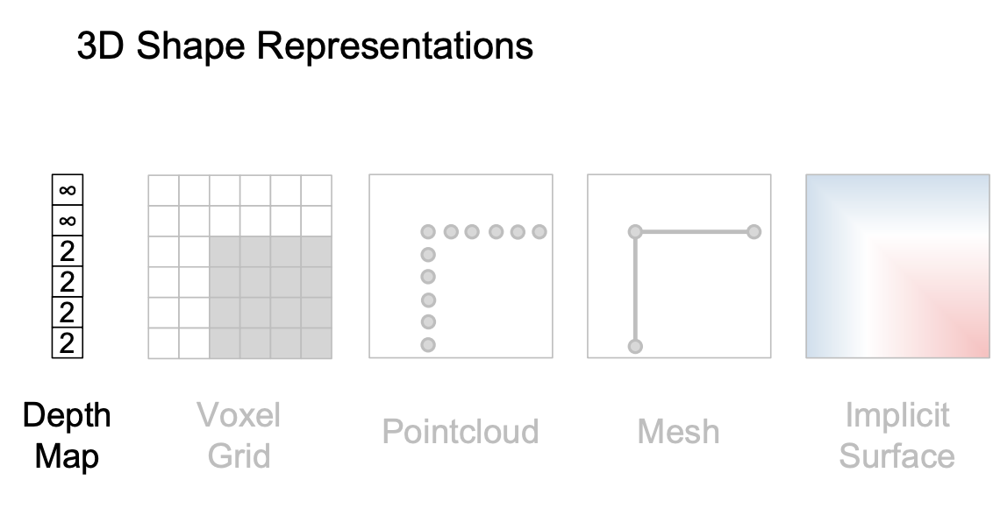

**Depth Map**

返回每个像素到“相机”的距离

RGB image+Depth image=RGB-D Image(2.5D)

通常不能视作3D，因为对于被遮挡住的部分的信息是没有的

为了得到Depth image，我们不能像往常一样那么train，因为有着 近大远小的问题——近的大物体和远的小物体可能一样大

此时引入**Scale-Invariant Loss**来train

主要为了忽略输入数据或目标的绝对尺度，从而关注它们的相对关系或比例。

**Surface Normals**

对于每个像素，surface normal都会给定一个向量，表示其局部的方向

在给定depth map后可以计算出法向量

但它也无法表示遮挡住的物体

**Voxel Grid**
(Voxel:三维像素)

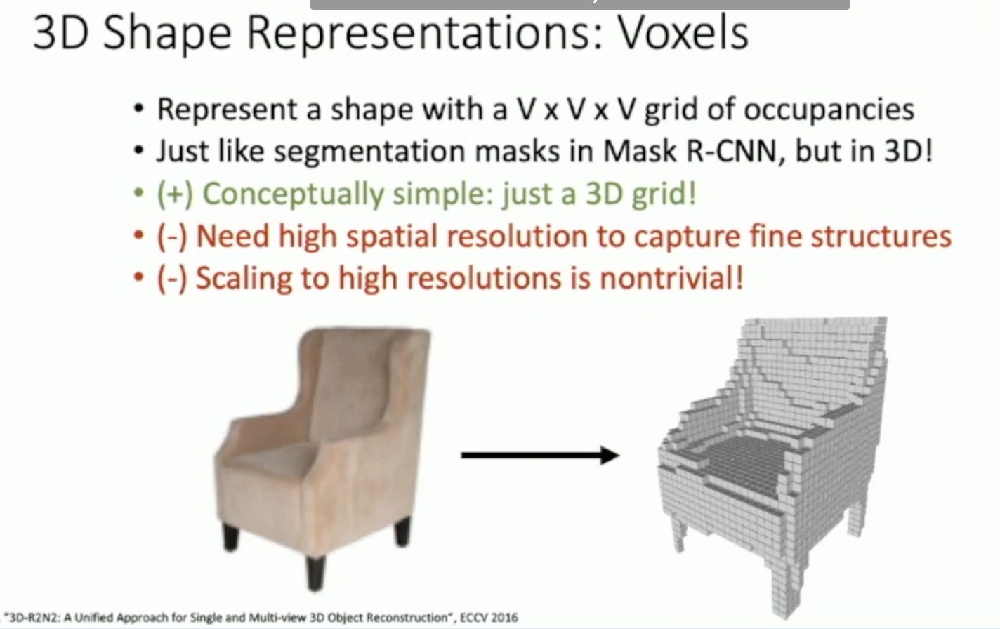

相当于转换成我的世界(minecraft)

用3D卷积处理这些voxel输入，但是计算量太大。

THEN：

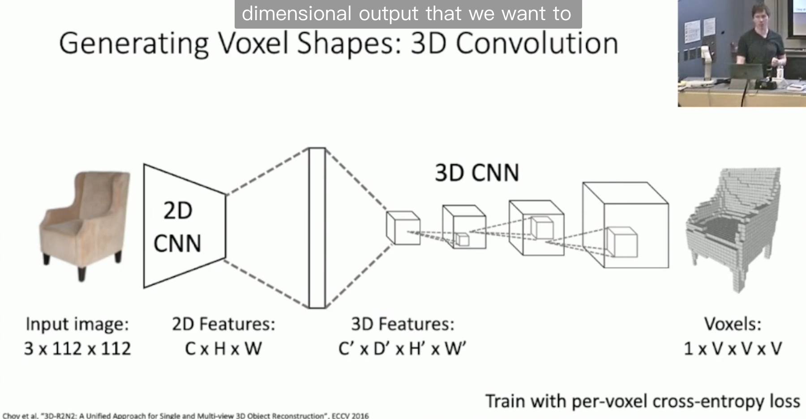

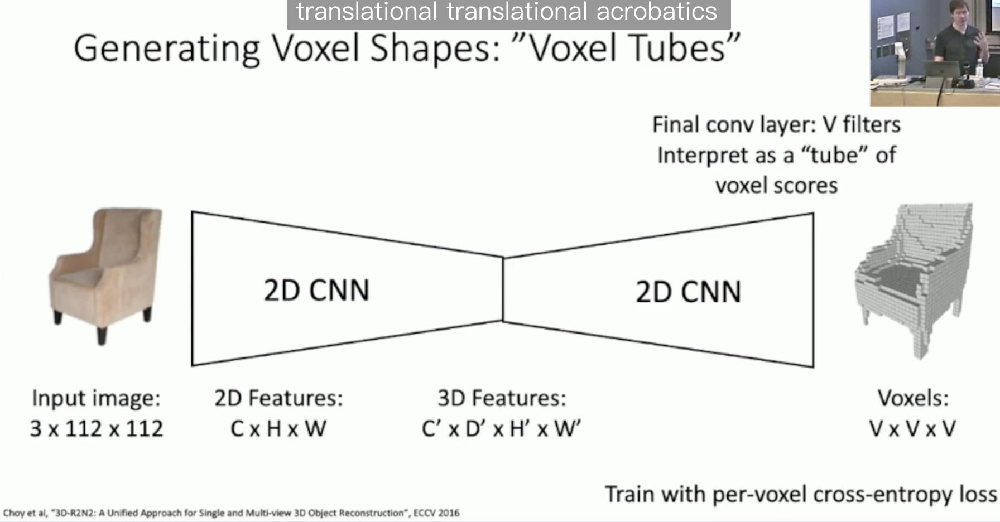

最后一层卷积网络的滤波器数量 VVV 被解释为一个“体素管道”，预测三维空间中每个体素的占用概率。以此映射到三维

但是voxel presentation太占用内存了，同时表示得不精细，不平滑

**Implicit Surface**

用一个function来表示曲面

$$f(x,y,z)=x^{2}+y^{2}+z^{2}-r^{2}=0$$

就是隐式曲面

**Pointcloud**

用一系列的(集合)点来表示3D空间中物体

好处是不需要太多点，但是需要对应处理点云的模型，loss function

PointNet

Sam Altman的讲解:

- 使用共享的 MLP（多层感知机）对每个点进行特征提取。
- 通过对所有点进行全局池化（如 max pooling），生成点云的全局特征。

优点：

- 对点的排列顺序不敏感。
- 结构简单且高效。

局限性：

- 对局部几何结构的学习能力较弱。

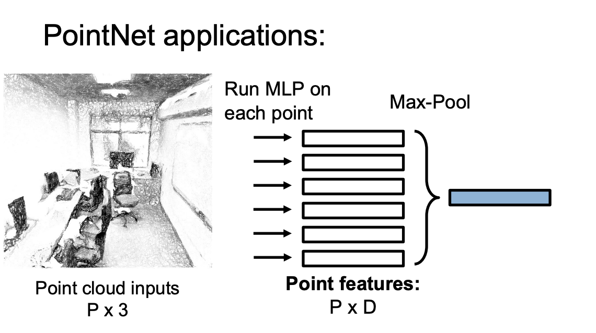

chamfer distance

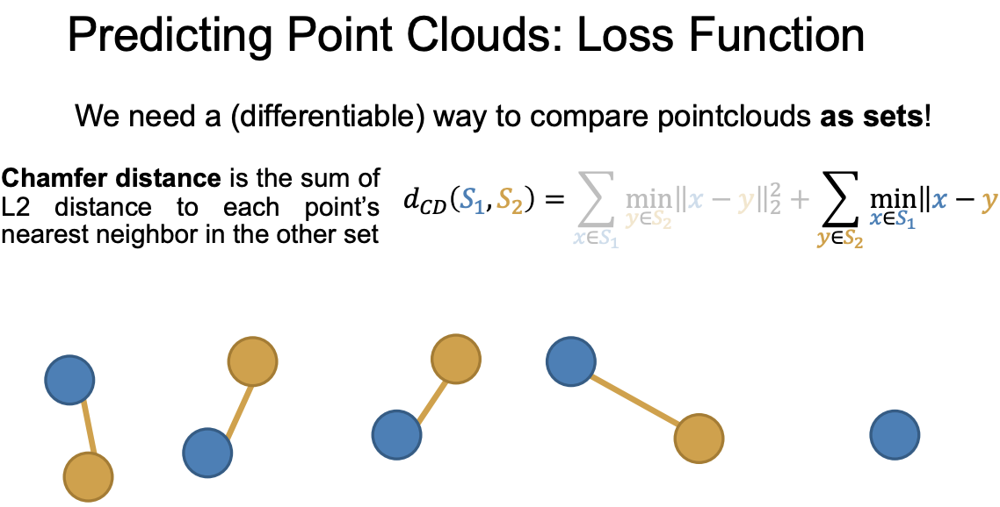

用来优化生成点云和ground truth之间的loss

**Mesh**

（mesh:网格）

**Triangle Mesh**

用一堆三角形来表示

**1.iterative mesh refinement**

（refinement:提炼）

给定一个原始的mesh开始，然后与图形比对，然后移动端点，使得面更加接近，反复步骤(mesh deformation)，达到refinement的效果

(Deformation:变形)

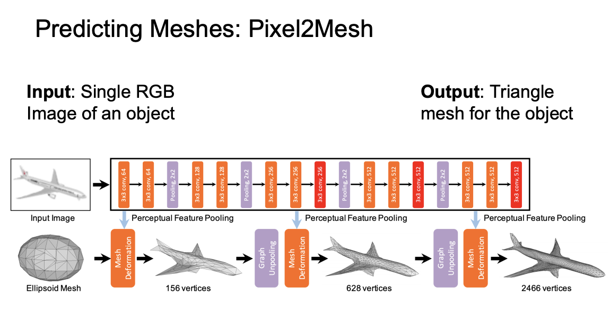

(示意图中net交替使用卷积和池化)

来自Sam Altman的补充：

GNN

图神经网络的核心思想是：通过 **消息传递（Message Passing）** 的方式，在图中传播信息，更新节点表示。

#### **消息传递机制**

对于每个节点 v：

1. **聚合（Aggregate）**：
   - 从邻居节点中收集信息。
   - 例如，节点 $$v_{i}$$的邻居节点为$$N(v_{i})$$将邻居节点的特征 $$x_{j},j∈N(v_{i})$$ 聚合。
2. **更新（Update）**：
   - 将聚合的信息与节点自己的特征进行结合，更新节点表示。
   - 更新规则可以用一个神经网络来实现

通过多层传播，GNN 能够捕获节点更远的邻居信息，从而更好地学习全局图的表示。

它的变体：

**GCN**(CNN)

**GAT**(attention)

**GraphSAGE**(聚合函数可以是均值（mean）、池化（pooling）或 LSTM)

我们滑动function在节点之间，聚合周围的点，然后更新，所以有点卷积的味儿，故称其Graph Convolution

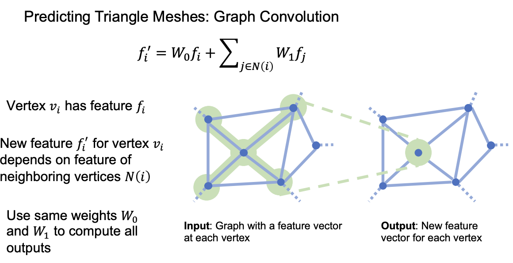

问题来了，我们此时处理的是mesh，但是提取的RGB features如何与之协调呢

**2.Alighed vertex features for each vertex of the mesh**

每个顶点都和其位置相关的特征绑定。这些特征中就包括了诸如坐标，颜色......

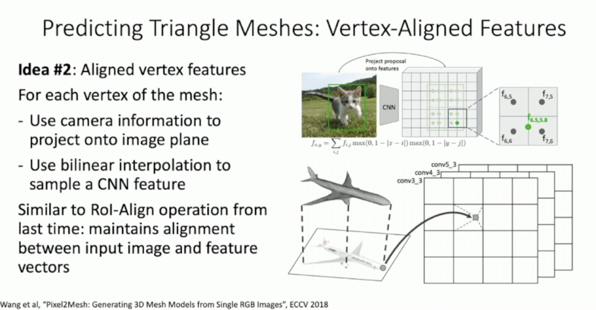

loss function:

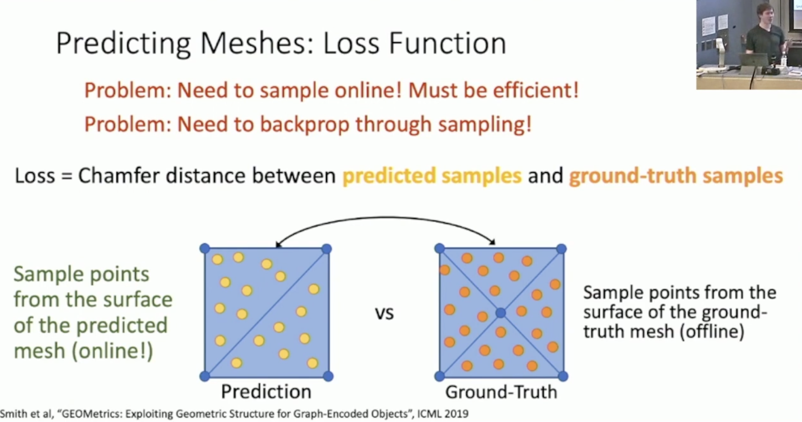

然鹅值得注意的一点是：chamfer distance对于极端值很敏感

来看看F1 Score

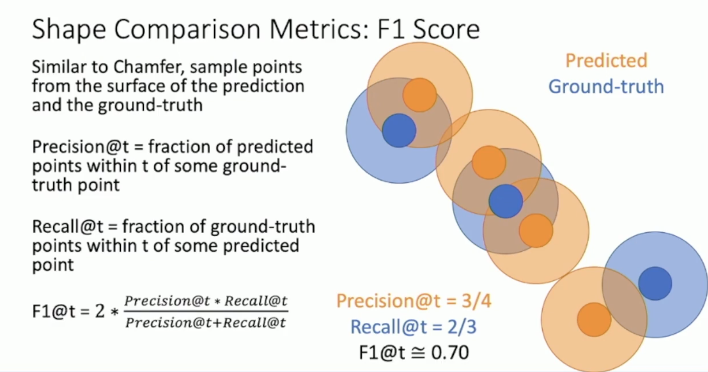

recall是以ground trurh为圆心，看在它设定的阀值半径范围内的所有预测点数。

precision则一个道理，只不过是以predicted为主

Canonical view：将三维数据对齐到一个共同的参考视图之下，这样无论输入的视角是如何，它都是一致的。缺点是它和输入图像不一致（更容易overfitting)

View Coordinates：基于camera的坐标系统，原点就是camera中心，泛化能力更好

**Mesh R-CNN**

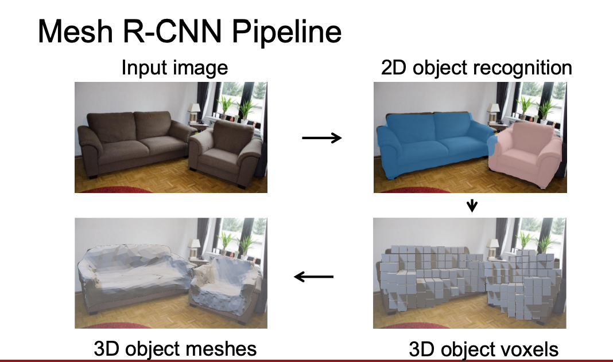

同时还需要L2正则化每条边