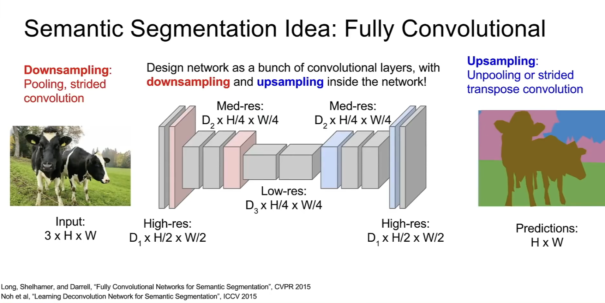

<font size=8>Detection and Segmentation</font>


<font color=blue>**Semantic Segmentation**</font>


是个对计算量要求很大的活。无论是对每个像素及其周边做一个classify，还是创建一个很大的net，每个通道负责一个类别，都计算量巨大。


由此提出策略：

先将输入图片降采样，通过一堆卷积后再进行过采样


**如何过采样：**


<font color=red>Unpooling</font>


两种方法，一种周围补一样的数，另一种右下角全补0（也不一定是0，但是是让图像更平滑）


<font color=red>Transpose Convolution</font>

**learnable upsampling**

也可以成为反卷积，恢复大小，不恢复数值


```
import torch
import torch.nn as nn
input = torch.tensor([[[[1, 2, 3],
                        [4, 5, 6],
                        [7, 8, 9]]]], dtype=torch.float32)
conv_transpose = nn.ConvTranspose2d(in_channels=1, out_channels=1, kernel_size=3, stride=2, padding=1)
with torch.no_grad():
    conv_transpose.weight[:] = 1.0  
    conv_transpose.bias[:] = 0.0   
output = conv_transpose(input)
print(output)
```

输出：

```
tensor([[[[ 1.,  3.,  2.,  5.,  3.],
          [ 5., 12.,  7., 16.,  9.],
          [ 4.,  9.,  5., 11.,  6.],
          [11., 24., 13., 28., 15.],
          [ 7., 15.,  8., 17.,  9.]]]], grad_fn=<ConvolutionBackward0>)
```


stride=2,那么输出比原来放大2倍

将input的feature map进行扩展，加入0

<font color=red>扩展规则</font>

假设输入特征图是一个二维矩阵，步幅 sss 决定扩展后的矩阵的间距：

- **原始特征图中的像素值保留原位**。
- **在每个像素之间插入 s−1 个零**。
- **在行之间插入 s−1 行零**。

如果 s=1则没有插入零，输入保持不变。


所以：

$$H_{out}=(H_{in}-1)*(s-1)+H_{in}$$​

$$=(H_{in}-1)*s+1$$


还要注意,kernel是中心的点对齐，然后滑动


回到问题：




<font color=blue>**Classification+Localization**</font>


除了类别label，我们还要关注的多了一个ground truth bounding box（边框）

我们此时就需要两个loss function

多的一个就是loss实际边界框与预测边界框


<font color=green>为什么不分别作这两个，而是一起train？</font>

并非所有情况都是一起train，但是很多情况在作transfer learning时，一起fine-tune效果要更好。

还可以姿势定位，原理一样


Tips:

如果我们预测的东西是连续的，loss function此时通常选用诸如L2,L1


<font color=blue>**Object Detection**</font>


不同与上个问题，它是先将图片中的object作分类，然后画框，框住主体部分


而object detection并不知道输出的数量，它是先探测，如果有object，那么给它裱上框然后classify


**Region Proposals**

如果使用滑动窗口，计算量太大。考虑引入区域建议来使object detection更可落实。

Anyway，来看看sam altman怎么说：

“这个算法从图像中生成的一组可能包含目标的矩形区域。通过这些候选区域，可以大幅缩小检测的搜索范围，避免对整张图像的每个位置和每种可能的尺寸进行密集计算。”


<font color=red>**R-CNN**</font>


通过regional proposal获取一些ROI(regions of interest)

不过此时获得ROI可能大小不同吗，此时需要对这些crops进行**归一化**处理，能够输入进神经网络中

然后神经网络**特征提取**

然后通过SVM**分类**，并进行边界框回归(**Bounding Box Regression**)


<font color=green>Bounding Box Regression</font>:优化候选区域的位置和大小，让预测的边框更接近ground truth

（损失函数：Smooth L1）


<font color=red>**Fast R-CNN**</font>

不先进行regional proposals，而是直接一个卷积网络干。将regional proposals或者selective search加入到layer中，输出又映射到feature map上，同时引入ROI layer来应付候选区域大小不一致，这样来接上fc


Loss function:


$$
L=\frac{1}{N}\sum_{i=1}^{N}[L_{cls}(p_{i},p_{i}^{*})+\lambda L_{box}(t_{i},t_{i}^{*})]
$$
Tips:multi-task loss需要对多个loss进行加权平均，同时所对应的hyperparameter的设置非常重要


<font color=red>**Faster R-CNN**</font>


相较于Fast R-CNN,它改变了原来的regional proposals,直接用CNN来实现，不需要依赖外部算法，而且在任务中共享features


来自<font color=purple>Sam Altman</font>的具体介绍**RPN**：

#### (1) **锚框（Anchors）**

锚框是 RPN 中最重要的组件之一。每个锚框都代表着一个可能的候选区域。锚框的设计通常包括：

- **尺度**（尺寸）：锚框有多个尺度，能够覆盖不同大小的目标。
- **纵横比**（aspect ratio）：锚框通常有不同的纵横比（例如 1:1、1:2、2:1 等），能够适应不同形状的目标。

在每个位置上，RPN 会生成多个锚框，通过回归和分类来对它们进行调整和筛选。

#### (2) **前景/背景分类**

RPN 使用一个二分类器判断锚框是前景（包含目标物体）还是背景（不包含目标物体）。前景框将用于目标检测中的目标分类，而背景框则被丢弃。

#### (3) **边界框回归**

对于每个前景锚框，RPN 会进一步进行边界框回归，细化锚框的位置和大小。这一步骤通过回归输出预测的位移和缩放系数，使得锚框能够更精确地框住物体。

#### (4) **NMS（非极大值抑制）**

虽然 RPN 可以生成大量的候选框，但并非所有的候选框都是有效的。因此，RPN 通常会在生成候选区域后使用 **非极大值抑制（Non-Maximum Suppression，NMS）** 技术来去除重复的框，保留最有代表性的候选区域。

### 


<font color=blue>**Instance Segmentation**</font>

(实例分割)


<font color=red>**Mask R-CNN**</font>

在Faster R-CNN基础上多了一个分支，无论这个框内的内容是否为一个object，都对它进行进行semantic segmentation


(它还可以做pose estimation)


<font size=5>**总结回顾**</font>


