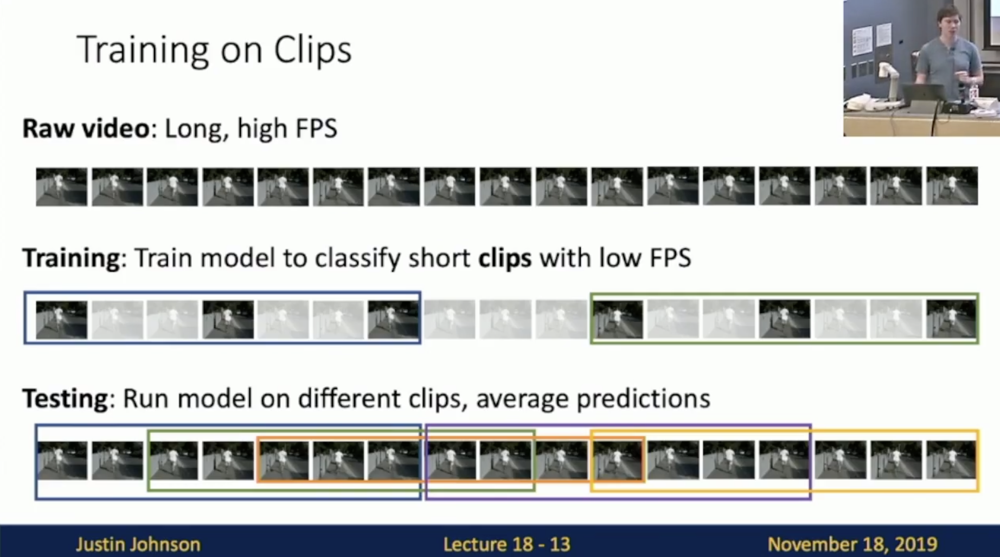
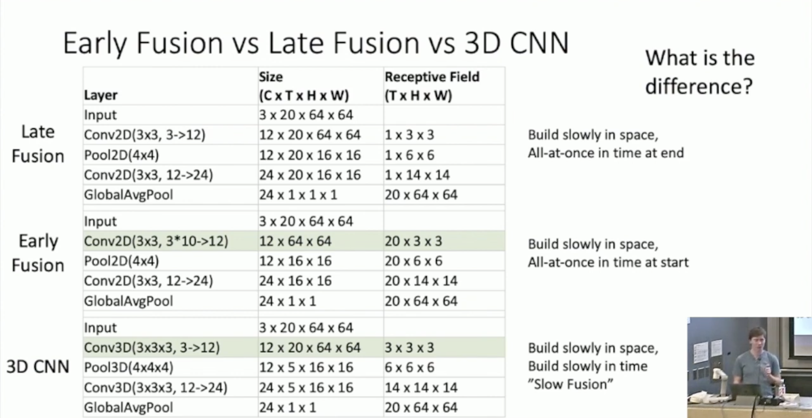
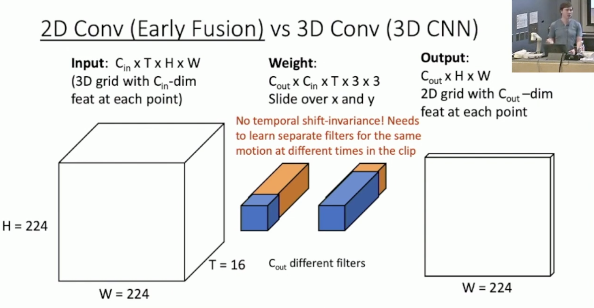
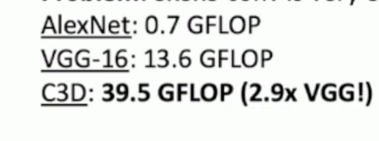
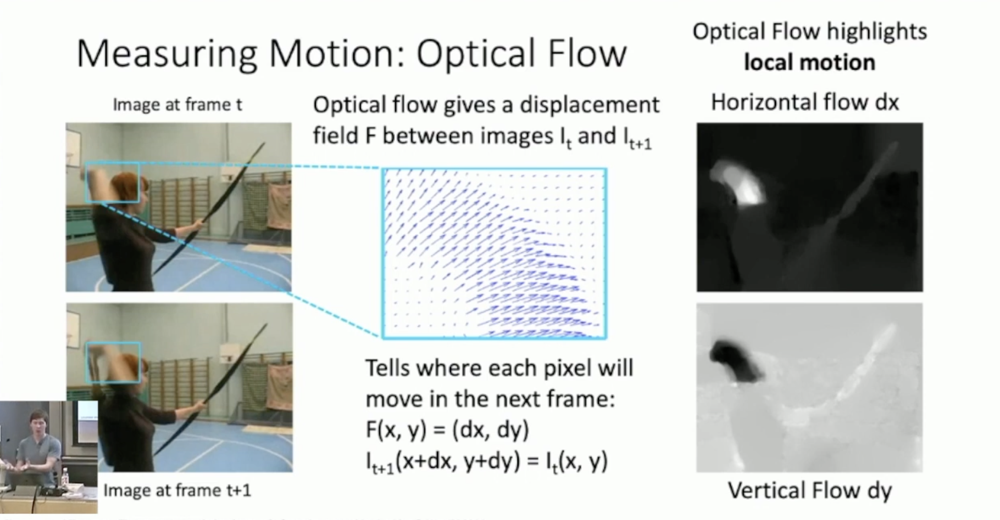
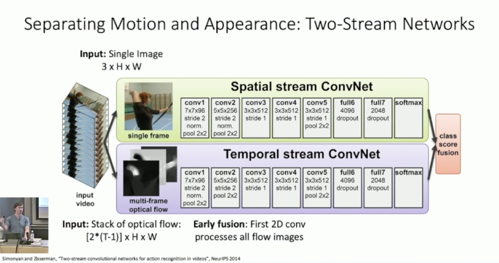
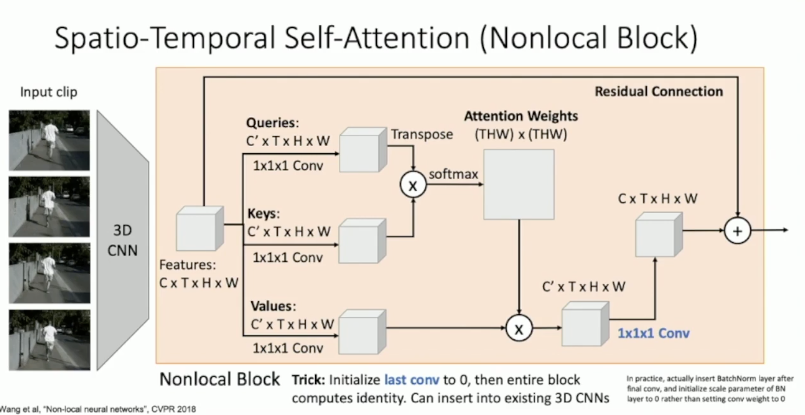
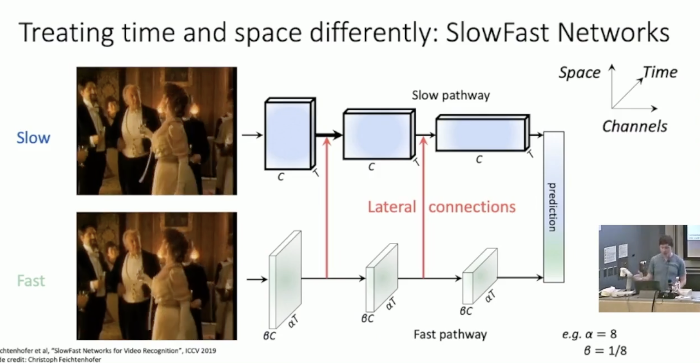

Videos

video=2D+Time

4D tensor:T\*3*H\*W

视屏的太大，所以很多视频不能拿来直接用，而是降低每秒的帧数，并且降低分辨率，并只截取视频中的clip(可能几秒长)来使用

**Compare几种做法**

Late fusion指在每一帧单独采取cnn，然后在每一帧的特征提取完后再对时间采取聚合（MLP,Pooling)

early fusion指的是一开始就用一个大的2DCNN对clip进行处理，但是面临一个问题则是：用一层来处理时间的信息不够

3DCNN则是用将时间融合进去，相比于early fusion对时间相关信息的提取更充分

但是early fusion对于时间上的信息学到的很不到位。忽略模态之间潜在的空间或时序相关性。

Dataset:Sports-1M(来自油管的大量体育视屏)

GFLOP:(Giga Floating-point Operations)衡量计算性能和复杂度的常见指

$$1GFLOP=10^{9}$$ 次浮点运算

对于一个**卷积层**，计算量可以表示为：

$$FLOPs=2×C_{in}×H_{out}×W_{out}×K_{H}×K_{W}×C_{out}$$

**全连接层**

$$FLOPs=2×N_{in}×N_{out}$$

**池化层**和**激活函数**

通常计算量较低，可以忽略或根据操作数估算。

C3D：魔改VGG，换成3D的操作，但是GFLOP很大

在我们现在的处理中是将时间和空间的特征视为interchangeable，现在考虑将他们能够分开表示

**Measuring Motion:Optical Flow**

(Optical:视觉的)

返回像素中在帧与帧之间向量的移动量

并且可以将这种信息给cnn处理

**Two-Stream Networks**

在temoral stream中使用early fusion来处理所有时间上的图片，去捕捉motion.

train时两个net单独,在test阶段对两个net的输出取平均

为了使得处理的时间更长，考虑引入RNN，在CNN提取完每帧图片后，RNN来处理这些latent vector，同时在反向传播时只反向传播RNN

我们还可以将RNN中的隐藏层换成CNN，整multi-layer 

(总之基于这一点，可以魔改很多原来的处理序列输入的net)

Dance!可行性不大，RNN并行度为1，计算起来太慢了

再来self-attention加CNN

**Nonlocal Block**

我们还可以将nonlocal block插入3DCNN

像C3D一样，将原来2D的模型扩展到3D，甚至我们还可以将pre-trained model参数复制多次扩展给3D的net

2019的SOTA

一个主要对外观，一个主要对时间信息

