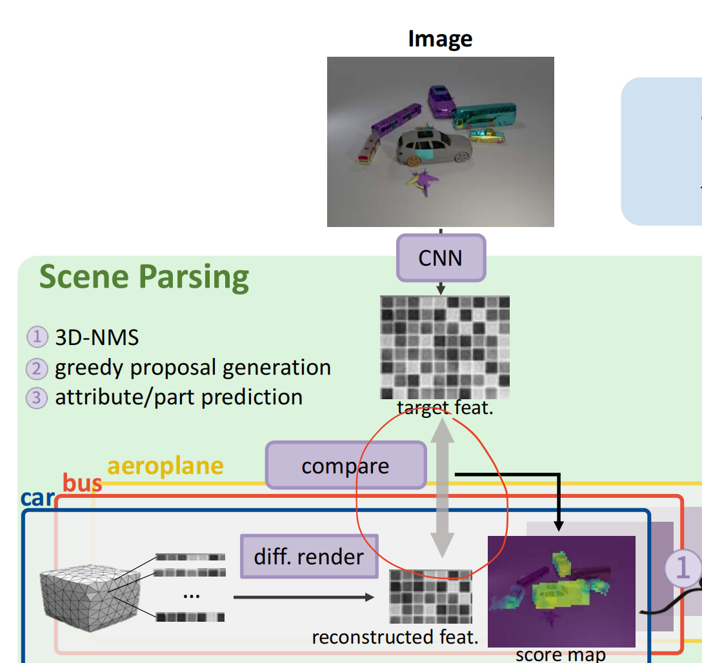

<font size=8>3D-Aware-VQA代码笔记</font>


<h1><font color=blue>calculate_point_direction.py</font></h1>

<font size=5, color=red>**main**</font>

```
box_ = bbt.Bbox2D([(np.min(pixels[:, 0]), np.max(pixels[:, 0])), (np.min(pixels[:, 1]), np.max(pixels[:, 1]))])
    box_obj = bbt.from_numpy(annos['box_obj'])

    foo_proj = bbt.projection_function_by_boxes(box_, box_obj)
    pixels = foo_proj(pixels)
```

`box_` 是根据 `pixels`（二维坐标点）的最小/最大值生成的 **2D边界框**（例如，检测到的物体在某个中间坐标系下的区域）。

`box_obj` 是从标注数据 `annos['box_obj']` 生成的 **目标2D边界框**（例如，图像的实际像素范围或标准化后的显示区域）

`pixels = foo_proj(pixels)` 将 pixels转化为实际像素范围


```
for p, w, v in zip(pixels, weight, visibile):
        if not v:
            continue
        # value = (w + 1) / 2
        value = np.abs(w)
        imd.ellipse(bbt.box_by_shape((5, 5), p).pillow_bbox(), fill=(255, int(255 - value * 255), int(255 - value * 255)))
```

如果不可见visible false，那么跳过

对于可见的内容，先转化为Pillow 库所需的格式，调用`pillow_bbox()` 方法，然后根据不同的权重值大小，给框画上不同颜色的椭圆（`imd.ellipse`）


<font color=blue size=5>_point_weight</font>

```
def cal_point_weight(direct_dict, vert, anno):
    cam_3d = CameraeTransformer(anno).get_camera_position()
    vec_ = cam_3d.reshape((1, -1)) - vert
    vec_ = vec_ / (np.sum(vec_ ** 2, axis=1, keepdims=True) ** .5)
    matrix_dict = np.array([direct_dict[k] for k in direct_dict.keys()])
    return np.sum(vec_ * matrix_dict, axis=1)
```

第一行获得相机的3D位置

第二行计算各个顶点的向量（从顶点到相机的向量）

将向量归一化，得到方向向量

`matrix_dict` 是存储各个顶点的方向向量 `direct_dict` 是各个顶点对应的键值对

最后返回是：将各个顶点自身的方向向量与到相机的方向向量相乘的，该顶点的权重结果（点积运算可以用来衡量两个向量之间的相似度或对齐程度。）


<font color=blue size=5>direction_calculator</font>

```
def direction_calculator(verts, faces):
    out_dict = {i: set([]) for i in range(verts.shape[0])}

    for t in faces:
        for k in t:
            out_dict[k] = out_dict[k].union(set(t) - {k})

    direct_dict = {}


    for k in out_dict.keys():

        # print('array: ', np.array(list(out_dict[k])))
        if len(list(out_dict[k])) <= 2:
            direct_dict[k] = np.array([1, 0, 0])
            continue
        # direct_dict[k] = l2norm(np.mean(l2norm(verts[np.array(list(out_dict[k]))] - np.expand_dims(verts[k], axis=0)), axis=0), axis=0)
        direct_dict[k] = ransac_one(verts[k], verts[np.array(list(out_dict[k]))])

    return direct_dict
```

对于第一个双重for循环：

遍历每一个面，然后对于每一个面的所有点，构成键值对：{点:同一面上的其他点} 

`union(set(t)-{k})` 是将集合t的所有面去除点k后得到的集合


对于后面单for循环：

其中的`ransac_one` 是一种算法：接受一个顶点，然后一组点，计算前者的方向向量

if判断是在该点周围的点只有2个及以下时，默认为[1,0,0]方向向量的操作

这样就处理，返回了方向向量


<h1><font color=blue>calculate_occ.py</font></h1>

<font color=blue size=5>cal_occ_one_image</font>

```
def cal_occ_one_image(points_2d, distance, triangles, image_size, inf_=1e10, eps=1e-3):
    out_depth = np.ones(image_size, dtype=np.float32) * inf_

    # handle the case that points are out of boundary of the image
    points_2d = np.max([np.zeros_like(points_2d), points_2d], axis=0)
    points_2d = np.min([np.ones_like(points_2d) * (np.array([image_size]) - 1), points_2d], axis=0)

    for tri_ in triangles:
        points = points_2d[tri_]
        depths = distance[tri_]

        get_map, get_box = generate_depth_map_one_triangle(points, depths)
        if not get_box:
            continue

        get_box.set_boundary(out_depth.shape)

        # assert tem_box.size == get_box.size, str(get_box) + '   ' + str(tem_box) + '  ' + str(points.tolist())
        get_box.assign(out_depth, np.min([get_map, get_box.apply(out_depth)], axis=0), auto_fit=False)

    invalid_parts = out_depth > inf_ * 0.9

    out_depth[invalid_parts] = 0

    visible_distance = out_depth[tuple(points_2d.T.tolist())]
    if_visible = np.abs(distance - visible_distance) < eps
    return if_visible
```

这个函数计算每个点的可见性

`points_2d = np.max([np.zeros_like(points_2d), points_2d], axis=0)`

将所有超出图像（x或者y为负数）下边界的点归为0

`points_2d = np.min([np.ones_like(points_2d) * (np.array([image_size]) - 1), points_2d], axis=0)`

`np.array[image_size]` 是将`image_size` 这个元组转化为列表  ，然后对里面的数值都-1

也就是得到一个和`points_2d`形状一样，且所有的点都在image_size-1范围内的矩阵，然后和原`points_2d` 比，取小的

将所有超出上边界（x或y超出image_size)的点全部归为边界上的点

两行代码将所有点约束在图像内


对于循环：遍历所有的三角形，获取它的顶点和深度，然后生成深度图和边界框，如果边界框不存在则跳过，存在就将深度图分配给`out_depth`

其中：`np.min([get_map, get_box.apply(out_depth)], axis=0)` 是将`out_depth` 裁剪为`get_box`的形状，然后和`get_map`逐元素取min

（其中的`auto_fit` 参数是指定如果`value` 的形状与边界框的形状不匹配时，是否对 `value` 进行插值调整。）


最后三行分别：得到深度图各个点计算的距离（转置将x和y拆开，然后转列表，再转元组，构成([x1,x2...],[y1,y2,...]),这样子深度图才能提取到每个点

如果实际距离和深度图计算出来的距离误差不大，小于eps，那么这个点可见。


<h1><font color=red>NearestMemorySelective类</font></h1>


在将这个类之前值得补充的是（知识的查漏补缺）：

one-hot编码是针对每个样本只对应一个类别的情况。one_hot函数是生成one-hot编码

multi-hot编码是针对每个样本可能有多个对应类别的情况。to_mask函数是生成multi-hot编码

例子：

对于one-hot:

若 `y = [2, 0, 3]` 且 `max_size=4`，输出为：

[[0, 0, 1, 0],
 [1, 0, 0, 0],
 [0, 0, 0, 1]]

对于to_mask:

若 `y = [[1, 3], [0]]` 且 `max_size=4`，输出为：

[[0, 1, 0, 1],
 [1, 0, 0, 0]]


<h2>空降到正文：</h2>

```
class NearestMemorySelective(nn.Module):
    def forward(self, x, y, visible, n_pos, n_neg, lru, memory, params, eps=1e-8):
        group_size = int(params[0].item())
        T = params[1].item()
        Z = params[2].item()
        momentum = params[3].item()

        similarity = torch.sum(torch.unsqueeze(x[0:n_pos], 1) * torch.unsqueeze(memory, 0), dim=2)

        n_class = n_pos // group_size
        y_onehot = one_hot(y, n_class)

        if not group_size == 1:
            y_onehot = y_onehot.unsqueeze(2).expand(-1, -1, group_size).contiguous().view(y.shape[0], -1)

        y_idx = torch.argmax(similarity[:, 0:n_pos] + y_onehot * 2, dim=1).type(torch.long)
        visible = to_mask(visible, n_pos)

        with torch.no_grad():
            # update memory keypoints
            # [n, k]
            idx_onehot = one_hot(y_idx, n_pos)

            # [k, d]
            get = torch.mm(torch.t(idx_onehot), x[0:n_pos, :])
            counts = torch.t(torch.sum(idx_onehot, dim=0, keepdim=True))
            valid_mask = (counts > 0.1).type(counts.dtype) * visible.view(-1, 1)
            get /= counts + eps

            memory[0:n_pos, :].copy_(F.normalize(
                memory[0:n_pos, :] * (valid_mask * momentum + 1 - valid_mask) + get * (1 - momentum) * valid_mask,
            dim=1, p=2))

            # Update trash bin
            memory[n_pos + lru * n_neg: n_pos + (lru + 1) * n_neg, :].copy_(x[n_pos::, :])

        return similarity, y_idx
```

首先看形参：

x是输入特征

y是标签类别

n_pos是正样本的数量

momentum动量系数（通常取值如 0.9），控制历史特征与新特征的融合比例。

` similarity = torch.sum(torch.unsqueeze(x[0:n_pos], 1) * torch.unsqueeze(memory, 0), dim=2)`

将输入进来的特征和记忆库里面的所有特征作点击，来以此计算相似度。`[0:n_pos]` 则是所有的正样本

`n_class = n_pos // group_size`

重点来了：n_pos是正样本的数量，单并不意味着每个正样本都对应一个类别，可能两个车都是正样本，但是是同一个类别：车

而group_size则是类别所包含的样本数量，这样一除，就得到了总共的类别数目，而非一个类别一个样本——一个类别多个样本！

```
if not group_size == 1:
            y_onehot = y_onehot.unsqueeze(2).expand(-1, -1, group_size).contiguous().view(y.shape[0], -1)
```

只要group_size不是1，那么操作是：

先将独热编码扩展unsqueeze第二维(batch_size,n_class,1)，然后expand第二维至(batch_size,n_class,group_size)，然后使用contiguous方法，可以使得张量在内存上分布连续，然后再view方法调整形状成(batch_size,n_class*group_size)


` y_idx = torch.argmax(similarity[:, 0:n_pos] + y_onehot * 2, dim=1).type(torch.long)`

确定输入数据与内存中最相似的样本的索引

y_onehot乘以 2 并与相似度矩阵相加，可以增强相似度计算中类别信息的权重，以此确定最相似的样本，argmax操作计算相似度矩阵中每行的最大值索引


` visible = to_mask(visible, n_pos)`

生成multi-hot编码


` get = torch.mm(torch.t(idx_onehot), x[0:n_pos, :])`

矩阵相乘，提取特征

`counts = torch.t(torch.sum(idx_onehot, dim=0, keepdim=True))`

`valid_mask = (counts > 0.1).type(counts.dtype) * visible.view(-1, 1)`

`visible`变量在变换前的shape是：(len(visible), n_pos),变换后则是：(batch_size,1)

`valid_mask` 是在大于0.1（为什么选0.1?数值稳定性，避免更新噪音）的前提下同时visible为真时候的元素

`get /= counts + eps` 对get进行归一化，加个eps防止处以0

```
memory[0:n_pos, :].copy_(F.normalize(
                memory[0:n_pos, :] * (valid_mask * momentum + 1 - valid_mask) + get * (1 - momentum) * valid_mask,
            dim=1, p=2))
```

### 更新逻辑

- **对于有效位置（`valid_mask=1`）**

  - 新特征 = 历史特征 * `momentum` + 当前特征 * `(1 - momentum)`

  - 公式：

    `new_feature=memory⋅momentum+get⋅(1−momentum)new_feature=memory⋅momentum+get⋅(1−momentum)`

- **对于无效位置（`valid_mask=0`）**

  - 保持历史特征不变：

    `new_feature=memory⋅1+get⋅0new_feature=memory⋅1+get⋅0`

- **归一化**
  `F.normalize(..., dim=1, p=2)` 对特征进行 L2 归一化，确保特征向量为单位长度，避免幅值影响相似度计算（常见于对比学习）。


最后：

 ` memory[n_pos + lru * n_neg: n_pos + (lru + 1) * n_neg, :].copy_(x[n_pos::, :])`

memory的索引是指定的memory某一连续块为垃圾站。将x的正样本之后的所有特征全倒进去


<h1><font color=red>NearestMemoryManager</font></h1>

在初始话方法中：

`self.register_buffer('params', torch.tensor([K, T, -1, momentum]))`

`self.register_buffer` 申请一个名为params的缓冲区，缓冲区中的参数在模型中存储和管理不需要梯度计算的状态信息，而且和模型的生命周期保持一致，不会被视作可训练参数

芝士补充：

**LRU:**常见的缓存淘汰算法，用于在有限的内存或存储空间中管理数据。其核心思想是：**当需要淘汰数据时，优先移除最长时间未被访问的数据**

所以：**max_lru**：定义了内存中可以保留的负样本批次（batch）的**最大轮数**。当超过该轮数时，旧的负样本会被新的替换。

`nLem` 是用户指定的内存最大量


<font size=5 color=blue>forward方法</font>

对于max_lru的计算：

```
if self.max_lru == -1 and n_neg > 0 and x.shape[0] <= (self.nLem - n_pos) / n_neg:
            self.max_lru = (self.memory.shape[0] - n_pos) // (n_neg * x.shape[0])
```

如果max_lru未被设置，存在负样本，且保证下面的那个狮子大于等于1

那么则是：（内存在除去正样本的大小）/（批次数*负样本数量）

（self.nLem是静态的，而后self.memory.shape[0]是实时的）、


更新记忆后（方法和上面的NMS差不多）


然后是老生常谈的计算相似度：

```
 if n_neg == 0:
            similarity = torch.matmul(x, torch.transpose(self.memory, 0, 1))

            noise_similarity = torch.zeros(1)
        else:
            t_ = x[:, 0:n_pos, :]
            similarity = torch.matmul(t_, torch.transpose(self.memory, 0, 1))
            noise_similarity = torch.matmul(x[:, n_pos:, :], torch.transpose(self.memory[0:n_pos, :], 0, 1))
```


```
self.accumulate_num += torch.sum((visible > 0).type(self.accumulate_num.dtype).to(self.accumulate_num.dtype), dim=0)
            self.lru += 1
            self.lru = self.lru % self.max_lru
```

`self.accumulate_num` 是一个计数器：记录每个正样本位置被有效更新的次数。

最后返回相似度，类别标签，以及负样本（噪音）相似度


后文中的`forward_local` 方法在处理上和`forward` 大差不差，区别在于，前者是处理全局的对比学习，后者是处理局部的对比学习

结合paper中的：

$p(F|O_y,\alpha_y,B)=\prod_{i\in FG}p(f_i|O_y,\alpha_y)\prod_{i\in BG}p(f_i^{'}|B)$

`forward` 方法则是计算后者，`forward_local`方法计算前者


<h2><font color=blue>MeshInterpolateModule</font></h2>

这一过程隐含了“渲染生成特征”与“输入图像特征”的比对（通过最大化似然)

通过调包实现3D网格的渲染与特征插值。核心通过比对（`render-and-compare`）渲染结果与输入图像，联合优化6D姿态和场景解析，为后续的视觉问答提供的3D场景表示


<h1><font color=red>MeshCeonverter</font></h1>

```
class MeshConverter(object):
    def __init__(self, path):
        self.loader = MeshLoader(path=path)

    def get_one(self, annos, return_distance=False):
        cate = annos['cate']
        subcate = annos['subcate']
        
        points_3d, triangles = self.loader.get(cate, subcate)

        points_2d = Projector3Dto2D(annos)(points_3d).astype(np.int32)
        points_2d = np.flip(points_2d, axis=1)
        cam_3d = CameraTransformer(annos).get_camera_position() #  @ np.array([[-1, 0, 0], [0, 0, 1], [0, -1, 0]])

        distance = np.sum((-points_3d - cam_3d.reshape(1, -1)) ** 2, axis=1) ** .5
        distance_ = normalization(distance)
        h, w = get_anno(annos, 'height', 'width')
        map_size = (h, w)

        if_visible = cal_occ_one_image(points_2d=points_2d, distance=distance_, triangles=triangles, image_size=map_size)
        box_ori = bbt.from_numpy(get_anno(annos, 'box_ori'))
        box_cropped = bbt.from_numpy(get_anno(annos, 'box_obj').astype(np.int))
        box_cropped.set_boundary(get_anno(annos, 'box_obj').astype(np.int)[4::].tolist())

        if_visible = np.logical_and(if_visible, box_include_2d(box_ori, points_2d))
        
        projection_foo = bbt.projection_function_by_boxes(box_ori, box_cropped)

        pixels_2d = projection_foo(points_2d)

        # handle the case that points are out of boundary of the image
        pixels_2d = np.max([np.zeros_like(pixels_2d), pixels_2d], axis=0)
        # print(pixels_2d.shape, box_cropped.boundary, get_anno(annos, 'box_ori'), get_anno(annos, 'box_obj'))
        pixels_2d = np.min([np.ones_like(pixels_2d) * (np.array([box_cropped.boundary]) - 1), pixels_2d], axis=0)

        if return_distance:
            return pixels_2d, if_visible, distance_

        return pixels_2d, if_visible
```

值得注意一点：

`points_2d = Projector3Dto2D(annos)(points_3d).astype(np.int32)
points_2d = np.flip(points_2d, axis=1)`

这里它对坐标进行了反转，是因为在3D中，坐标系是(x,y,z)，但是在2D的图片中，他是(row,col)，所以要翻转适应3D坐标系


`campos` 变量是位置：(x,y,z)

总结`get_one`方法做了什么：

加载3D的数据，然后将3D数据转化为2D的数据，计算3D的点到相机的距离，计算每个点是否可见

再生成边界框之后，再将生成的点投影到边界框，在处理完边界后，返回点对应的可见情况,以及如果需要的话返回归一化后的各点到相机的距离


<h4><font color=red>get_camera_polygon</font></h4>

```
def get_camera_polygon(height, width, theta, focal, principal, viewport):
    x0 = np.array([0, 0, 0], dtype=np.float64)

    # project the 3D points
    x = np.array([
        [0, 0],
        [width, 0],
        [width, height],
        [0, height],
    ], dtype=np.float64)
    x = project_points_2d_to_3d(x, theta, focal, principal, viewport)

    x = np.vstack((x0, x))

    return x
```

`theta` 旋转角 `focal` 焦距

`viewport` 视口大小 `principal` 主点

x0一开始是相机的位置

然后生成2D图像的四个角的位置，然后利用2D转3D的函数，将之投影到三维图像，在将相机视角和之相接

返回的就是有图片私交3D位置以及相机位置的x


<font size=8 color=green>整合</font>


<h1><font color=green>solve_pose_multi_obj</font></h1>

先来看在`inference.py` 的调用以及参数：

```
 pred = solve_pose_multi_obj(
                feature_map, inter_module, kp_features, clutter_bank, poses, kp_coords, kp_vis,
                epochs=args.epochs,
                lr=args.lr,
                adam_beta_0=args.adam_beta_0,
                adam_beta_1=args.adam_beta_1,
                mode=args.mode,
                loss_type=args.loss_type,
                device=args.device,
                px_samples=px_samples,
                py_samples=py_samples,
                clutter_img_path=None,
                object_img_path=None,
                blur_radius=args.blur_radius,
                verbose=True,
                down_sample_rate=args.down_sample_rate,
                hierarchical=0,
                xv=xv,
                yv=yv
            )
```

Feature_map由img经过CNN操作得来

```
feature_map = net.module.forward_test(img_tensor)
net = NetE2E(net_type=args.backbone, local_size=[args.local_size, args.local_size], output_dimension=args.d_feature,
                 reduce_function=None, n_noise_points=args.num_noise, pretrain=True, noise_on_mask=True)
    print(f'num params {sum(p.numel() for p in net.net.parameters())}')
    net = nn.DataParallel(net).cuda().train()
```

3D插值渲染函数：

`inter_module = MeshInterpolateModule(xvert, xface, feature_bank, rasterizer,post_process=center_crop_fun(map_shape, (render_image_size, ) * 2)) `


`kp_features` memory_bank中预训练的checkpoint

`clutter_bank` paper中的B,背景

`kp_coords` 通过工具中预渲染得到的关键点二维坐标


生成B：

```
clutter_score = None
    for cb in clutter_bank:
        cs = torch.nn.functional.conv2d(feature_map, cb.unsqueeze(2).unsqueeze(3)).squeeze(0).squeeze(0)
        if clutter_score is None:
            clutter_score = cs
        else:
            clutter_score = torch.max(clutter_score, cs)
```

将特征图与每个背景（杂波）进行卷积，计算相似度，然后取相似度最大的作为最终杂波分数（背景）


```
for epoch in range(epochs):
            projected_map = inter_module(C, theta, mode=mode, blur_radius=blur_radius).squeeze()
            flow_map = flow.view(1, 2, 1, 1).repeat(1, 1, hm_h, hm_w)
            projected_map = flow_warp(projected_map.unsqueeze(0), flow_map * 10.0)[0]
            object_score = torch.sum(projected_map * feature_map.squeeze(), dim=0)

            if use_z:
                loss = loss_func(object_score, clutter_score, z, device=device)
            else:
                loss = loss_func(object_score, clutter_score, device=device)

            loss.backward()
            optim.step()
            optim.zero_grad()

            if (epoch + 1) % 100 == 0:
                scheduler.step(None)
            
            if epoch == 500:
                for g in optim.param_groups:
                    g['lr'] = lr / 5.0
```

这就是paper中的`compare-and-render` 

`flow` 是2D平移

C是相机坐标

` scheduler = torch.optim.lr_scheduler.ExponentialLR(optim, gamma=0.2)`

学习率调度器（scheduler），优化过程动态调整学习率：

ExponentialLR指数衰减的学习率调度器

gamma=0.2每次调整时学习率会乘以0.2

也就是这一部分：




<font color=green>3D不大会，太难了，先到此为止</font>


