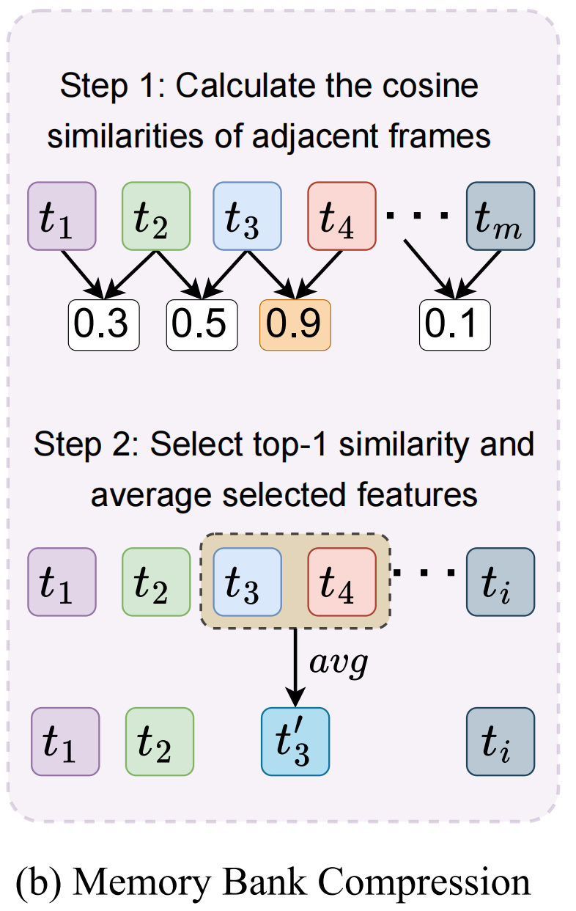
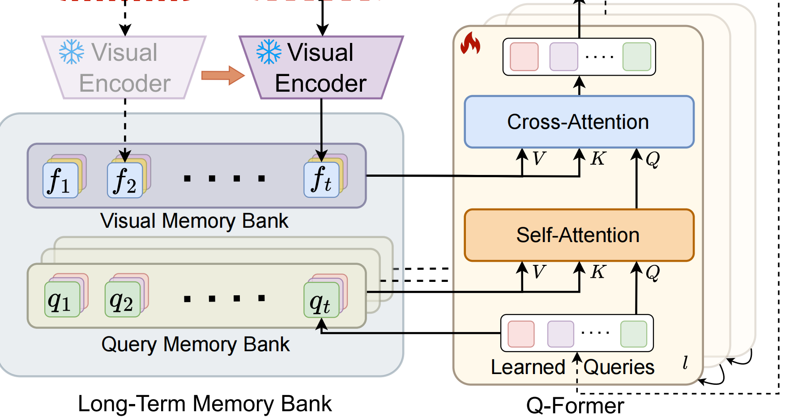

<font size=8>MA-LMM代码笔记</font>


<h1><font color=red>Memory</font></h1>

先看最重要的部分：

<font size=5 color=green>memory_bank_compress</font>

```
def memory_bank_compress(memory_bank: torch.Tensor, compression_size: torch.Tensor) -> tuple:
    """
    Compresses the memory bank if the current memory bank length is greater than the threshold.
    Compression_size is the number of frames that are compressed into each position.
    
    Args:
        memory_bank (torch.Tensor): The input memory bank to compress. Shape: (B, T, N, C)
        compression_size (torch.Tensor): The number of frames to compress into each position. Shape: (B, T, N)
    
    Returns:
        compressed_memory_bank (torch.Tensor): The compressed memory bank. Shape: (B, T-1, N, C)
        compressed_size (torch.Tensor): The number of frames compressed into each position. Shape: (B, T-1, N)
    """
    B, T, N, C = memory_bank.shape
    # Calculate the cosine similarity between adjacent frames
    similarity_matrix = F.cosine_similarity(memory_bank[:, :-1, :], memory_bank[:, 1:, :], dim=-1)
    # Select the frame indices with the top-1 similarity 
    _, max_similarity_indices = torch.max(similarity_matrix, dim=1, keepdim=True)

    # Calculate source and dst indices for compression
    src_indices = max_similarity_indices + 1
    dst_indices = torch.arange(T - 1).to(memory_bank.device)[None, :, None].repeat(B, 1, N)
    dst_indices[dst_indices > max_similarity_indices] += 1

    # Gather source and dst memory banks and sizes
    src_memory_bank = memory_bank.gather(dim=1, index=src_indices.unsqueeze(-1).expand(-1, -1, -1, C))
    dst_memory_bank = memory_bank.gather(dim=1, index=dst_indices.unsqueeze(-1).expand(-1, -1, -1, C))
    src_size = compression_size.gather(dim=1, index=src_indices)
    dst_size = compression_size.gather(dim=1, index=dst_indices)

    # Multiply the memory banks by their corresponding sizes
    src_memory_bank *= src_size.unsqueeze(-1)
    dst_memory_bank *= dst_size.unsqueeze(-1)

    # Compress the memory bank by adding the source memory bank to the dst memory bank
    dst_memory_bank.scatter_add_(dim=1, index=max_similarity_indices.unsqueeze(-1).expand(-1, -1, -1, C), src=src_memory_bank)
    dst_size.scatter_add_(dim=1, index=max_similarity_indices, src=src_size)

    # Normalize the dst memory bank by its size
    compressed_memory_bank = dst_memory_bank / dst_size.unsqueeze(-1)
    return compressed_memory_bank, dst_size
```

`similarity_matrix` 计算相邻帧之间的cos相似度，然后取每个批次的max

`src_indices` 如果k帧与k+1帧相似度在这个批次中最高，那么以k+1为需要提出的帧，所以取其+1

`dst_indices` 是 生成去重后的索引，先生成0到T-1，对于小于被压缩的索引，它是一一对应的，但是对于大于索引的，在`dst_indices` 的坐标的k,k+1,k+2对应的旧坐标的k+1,k+2,k+3，所以要将这一部分+1。要达到的效果是：

1,2,....k,k+2,k+3......


```
src_memory_bank = memory_bank.gather(dim=1, index=src_indices.unsqueeze(-1).expand(-1, -1, -1, C))
dst_memory_bank = memory_bank.gather(dim=1, index=dst_indices.unsqueeze(-1).expand(-1, -1, -1, C))
src_size = compression_size.gather(dim=1, index=src_indices)
dst_size = compression_size.gather(dim=1, index=dst_indices)
```

收集起来，给定维度，以及索引（但是索引要保证和和收集的内容shape一致）

`src_size` 的含义即是各个位置所包含的帧数


*= 这一步的本质作用，就是**先把每个位置上的特征都转换成“特征和”的形式**（乘以代表的帧数）


```
dst_memory_bank.scatter_add_(dim=1, index=max_similarity_indices.unsqueeze(-1).expand(-1, -1, -1, C), src=src_memory_bank)
    dst_size.scatter_add_(dim=1, index=max_similarity_indices, src=src_size)

    # Normalize the dst memory bank by its size
    compressed_memory_bank = dst_memory_bank / dst_size.unsqueeze(-1)
    return compressed_memory_bank, dst_size
```

本质就是paper中的相加求和取平均




<h1><font color=red>MBBertSelfAttention</font></h1>

和记忆力库同等重要的内容


先来看这段分支：

```
is_cross_attention = encoder_hidden_states is not None

        if is_cross_attention:
            key_layer = self.transpose_for_scores(self.key(encoder_hidden_states))
            value_layer = self.transpose_for_scores(self.value(encoder_hidden_states))
            attention_mask = encoder_attention_mask
        elif past_key_value is not None:
            key_layer = self.transpose_for_scores(self.key(hidden_states))
            value_layer = self.transpose_for_scores(self.value(hidden_states))
            key_layer = torch.cat([past_key_value[0], key_layer], dim=2)
            value_layer = torch.cat([past_key_value[1], value_layer], dim=2)
        else:
            k = self.key(hidden_states)
            v = self.value(hidden_states)
            if hasattr(self, 'query_memory_bank'):
                B, T, N, C = self.query_memory_bank.shape
                query_memory_bank = self.query_memory_bank.view(B, -1, C) #[B, T*32, C]
                query_memory_bank_k = torch.cat([self.key(query_memory_bank), k], dim=1) #[B, (T+1)*32, C]
                query_memory_bank_v = torch.cat([self.value(query_memory_bank), v], dim=1) #[B, (T+1)*32, C]
                key_layer = self.transpose_for_scores(query_memory_bank_k)
                value_layer = self.transpose_for_scores(query_memory_bank_v)
            else:
                key_layer = self.transpose_for_scores(k)
                value_layer = self.transpose_for_scores(v)
```

如果存在编码器的隐藏状态，那么是对于视觉进行处理，使用cross-attention

如果是cross-attention机制，Q是来自于query bank经过self-attention后得到的Q，而KV是由visual memory bank得来的视觉特征乘上对应的权重后得到，在代码中,`self.key` 方法是尽心一个线性变换操作，反正就整个权重就对了


来到第二个分支，不是cross-attention，那么就是对于query bank那一堆，搞self-attention操作，缓存历史键值（`past_key_value`）

对于历史缓存的键值对拼接到当前得到的KV


最后一个分支，论文中由交代： each self-attention layer has a unique query memory bank, where the contained input queries are updated during the training time.

所以对于每一层的self-attention，将它对应的query-bank的KV整出来，与当前隐藏层的kv连接，


```
attention_scores = torch.matmul(query_layer, key_layer.transpose(-1, -2))

        if (
            self.position_embedding_type == "relative_key"
            or self.position_embedding_type == "relative_key_query"
        ):
            seq_length = hidden_states.size()[1]
            position_ids_l = torch.arange(
                seq_length, dtype=torch.long, device=hidden_states.device
            ).view(-1, 1)
            position_ids_r = torch.arange(
                seq_length, dtype=torch.long, device=hidden_states.device
            ).view(1, -1)
            distance = position_ids_l - position_ids_r
            positional_embedding = self.distance_embedding(
                distance + self.max_position_embeddings - 1
            )
            positional_embedding = positional_embedding.to(
                dtype=query_layer.dtype
            )  # fp16 compatibility

            if self.position_embedding_type == "relative_key":
                relative_position_scores = torch.einsum(
                    "bhld,lrd->bhlr", query_layer, positional_embedding
                )
                attention_scores = attention_scores + relative_position_scores
            elif self.position_embedding_type == "relative_key_query":
                relative_position_scores_query = torch.einsum(
                    "bhld,lrd->bhlr", query_layer, positional_embedding
                )
                relative_position_scores_key = torch.einsum(
                    "bhrd,lrd->bhlr", key_layer, positional_embedding
                )
                attention_scores = (
                    attention_scores
                    + relative_position_scores_query
                    + relative_position_scores_key
                )
        attention_scores = attention_scores / math.sqrt(self.attention_head_size)
```

注意力得分是先：

将Q,V相乘，得到粗略的注意力得分

然后计算`positional_embedding` （计算左侧位置，右侧位置，广播机制相减得到相对位置，平移不能有负，作embedding)

再将`positional embedding` 与`query_layer` 和`key_layer` 作运算，得到相关位置的query以及key的得分

最后即: `attention_score=attention_score+relative_position_scores_query+relative_position_scores_key` 不过还要做一个归一化


对于计算`positional_embedding` 的过程中，现实计算相对距离`distance` ，但是`distance` 是有负有正的，但是embedding不能负(不难理解，embedding本质是查找表，索引不为0），所以要加上一个 self.max_position_embeddings - 1


然后用注意力掩码，盖掉不需要关注到的位置（注释写得很清楚，掩码是由BertModel预计算得来的）

```
 if attention_mask is not None and not is_cross_attention:
            # Apply the attention mask is (precomputed for all layers in BertModel forward() function)
            if hasattr(self, 'query_memory_bank'):
                attention_scores = attention_scores + torch.cat([attention_mask] * (self.query_memory_bank.size(1) + 1), dim=-1)
            else:
                attention_scores = attention_scores + attention_mask
```


` # Normalize the attention scores to probabilities.
        attention_probs = nn.Softmax(dim=-1)(attention_scores)`


得到上下文表征：
`context_layer = torch.matmul(attention_probs_dropped, value_layer)	`


最后一点收尾工作，注释很清楚，但是感觉这一段很重要：

```
 if not is_cross_attention:
            B, N, C = k.shape
            # if it is the first frame, initialize the query_memory_bank as the first frame's query embedding
            # if not, concatenate the query_memory_bank with the current frame embedding and update the compression_size
            if not hasattr(self, 'query_memory_bank'):
                self.query_memory_bank = hidden_states[:, None, :, :].detach() # [B, 1, 32, C]
                self.size_constant = torch.ones(B, 1, N).to(hidden_states.device) # [B, 1, N]
                self.compression_size = self.size_constant
            else:
                self.query_memory_bank = torch.cat([self.query_memory_bank, hidden_states[:, None, :, :].detach()], dim=1) # [B, t+1, 32, C]
                self.compression_size = torch.cat([self.compression_size, self.size_constant], dim=1) # [B, t+1, 32]

            # if it is the last frame, delete the query_memory_bank and compression_size
            # else if the current length of the query_memory_bank exceeds the threshold, compress the query_memory_bank
            if self.compression_size.sum(1).mean().round() == self.num_frames:
                del self.query_memory_bank
                del self.compression_size
            elif self.query_memory_bank.size(1) > self.memory_bank_length:
                self.query_memory_bank, self.compression_size = memory_bank_compress(self.query_memory_bank, self.compression_size)

        return outputs
```


