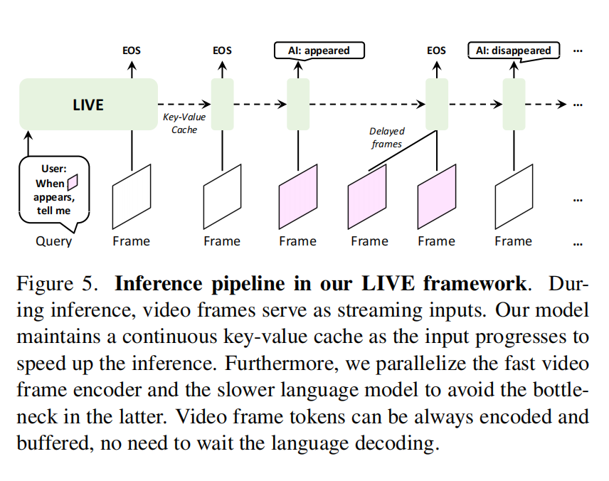
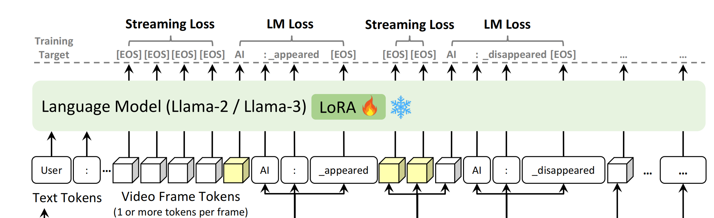

<font size=8>Videollm-online-main代码笔记</font>


模型有什么组成？

`LlamaForCausalLM` 以及`LiveMixin` 构成。前者是从transformers掉的类


<font size=5, color=red>**LiveMixin**</font>

这一层干的是什么事？对LIVE算测评



**stream_evaluate**

除开self，有五个形参：

`input_ids` 多模态编码后的tokens

`labels` GT

`frames`

`ignore_token_id` 处理时忽略的token

`frame_token_interval_threshhold` $\theta$ 高于这个阀值时EOS才算


*第一步*

```
turn_stops = ((input_id == self.config.eos_token_id).nonzero() + 1)[:,0].tolist()
turn_starts = [0] + turn_stops[:-1]
num_turns = len(turn_starts)
```

多轮对话，获取每一轮的开始与结束的位置

获取EOS的位置并+1，成为结束的位置

每一轮结束的位置也是下一轮开始的位置，所以要加上0这个没有包括进去的位置以及最后一轮的结尾


*第二步*

```
outputs = self.forward(input_ids=input_ids, frames=frames, return_dict=True, use_cache=True)
logit, past_key_values = outputs.logits[0], outputs.past_key_values
```

向前传播，从tokens过LIVE framework然后得到它的logins(未进行归一化得到的输出)以及kv


*第三步*

有四个指标metrics：

```
lm_ppls, frame_diffs, fluencies, lm_correctness = [], [], [], []
```

*LM-PPL* 越低越好（语言困惑度）

*TimeDiff* 事件对齐能力

后二者含义如其名


```
 for r, (turn_start, turn_stop) in enumerate(zip(turn_starts, turn_stops)):
            ## 3.1. we only have two losses: stream loss on frame tokens, and lm loss. prepare corresponding mask according two losses
            turn_label = label[turn_start:turn_stop]
            turn_learn_mask = turn_label != ignore_token_id
            if not turn_learn_mask.any():
                continue
            turn_logit = logit[turn_start:turn_stop]
            turn_input_id = input_id[turn_start:turn_stop]
            turn_v_mask = turn_input_id == v_placeholder_id
            turn_num_frames = turn_v_mask.sum() // frame_num_tokens
            turn_stream_mask = turn_v_mask & turn_learn_mask
            turn_lm_mask = turn_learn_mask & ~turn_stream_mask
```

对每一轮处理：

前缀加turn 都是指这一轮次的内容

`turn_learn_mask` 除开需要忽略token后的，待处理的label范围

`turn_v_mask` 取出输入的所有token中是视觉占位符的token

`turn_num_frames` 该轮次所有视觉占位符token的总和 / 每一帧的token数目

`turn_stream_mask` 在待处理的范围内的，属于视觉token的内容（是取交集）

`turn_lm_mask` 在待处理范围内的，但是不属于视觉token的都属于standard languagemodeling (LM) loss对应的mask位置


```
 ## 3.2 ppl, offline metric
            if turn_lm_mask.any():
                turn_lm_masked_logit, turn_lm_masked_label = turn_logit[turn_lm_mask], turn_label[turn_lm_mask]
                lm_ppl = torch.nn.functional.cross_entropy(turn_lm_masked_logit, turn_lm_masked_label).exp()
                lm_ppls.append(lm_ppl)
                turn_lm_masked_wrong_mask = turn_lm_masked_logit.argmax(dim=-1) != turn_lm_masked_label
                if turn_lm_masked_wrong_mask.any():
                    num_lm_correct_tokens = turn_lm_masked_wrong_mask.nonzero()[0,0]
                else:
                    num_lm_correct_tokens = (~turn_lm_masked_wrong_mask).sum()
                lm_correctness.append(num_lm_correct_tokens / turn_lm_masked_label.numel())
```

算语言困惑度和正确率

`num_lm_correct_tokens` 是取每个batch第一个预测错误的下标（由于下标从0开始），所以其实也是连续预测正确的token数目

（难道不能我连续预测错误后，由预测正确了不算吗？比如：GT：张三来到学校实验室上机，预测：张三来到网吧喊网管上机，那么只算前4个预测正确，最后两个不算）


```
 ## 3.3. frame_diff (will be casted to time_diff in compute_metrics)
            if turn_stream_mask.any():
                ## 3.3.1: reply before (at) turn_num_frames
                turn_score = turn_logit.softmax(dim=-1)
                turn_stream_masked_score = turn_score[turn_stream_mask]
                if frame_token_interval_threshold > 0:
                    lower_threshold_mask = turn_stream_masked_score[:, frame_token_interval_id] < frame_token_interval_threshold
                    turn_stream_masked_score[lower_threshold_mask] = 0
                turn_stream_masked_pred_mask = turn_stream_masked_score.argmax(dim=-1) != frame_token_interval_id
                if turn_stream_masked_pred_mask.any():
                    frame_diff = turn_stream_mask.sum() - turn_stream_masked_pred_mask.nonzero()[0,0] - 1
                else:
                ......
                ......
```


### **`frame_diff` 的含义**

- **定义**：模型预测响应的帧位置与理想时间点之间的差距（以帧数为单位）。也就是对于图中黄色的帧它是否被放倒了正确位置，如果图中的AI（training target那行)被放倒了前面（左边👈），那么就是提前响应，`frame_diff` 大于0，如果对齐了（下图中的位置），那就是0，如果放到后面（右边👉），跨轮次响应，那就是延迟响应 `frame_diff` 小于0

- **Anyway,summay:**

  **`frame_diff = 0`**：模型在理想时间点响应（完美对齐)

  **`frame_diff > 0`**：模型提前响应（可能漏掉后续事件）

  **`frame_diff < 0`**：模型延迟响应（可能错过当前事件）

- 最后对`frame_diff`取绝对值，训练目标当然就是让`frame_diff` 越小越好

**注释中补充了：其实这个frame_diff就是paper里面计算的Time Difference (TimeDiff) metric**


<font color=blue>先看 `frame_diff>=0` 的情况：</font>

`turn_stream_mask` 是每一轮输入的视频帧的掩码

再来看 `turn_stream_masked_pred_mask` 

```
turn_score = turn_logit.softmax(dim=-1)
turn_stream_masked_score = turn_score[turn_stream_mask]
lower_threshold_mask = turn_stream_masked_score[:, frame_token_interval_id] < frame_token_interval_threshold
turn_stream_masked_score[lower_threshold_mask] = 0
turn_stream_masked_pred_mask = turn_stream_masked_score.argmax(dim=-1) != frame_token_interval_id
```

它是对经过LIVE framework后得到的输出logits，softmax，计算出概率分布，然后选取应该预测EOS的位置并滤去低于阀值 $P^{[EOS]}<\theta$ 

的部分（置0），然后再得到应该响应的掩码的位置(不是EOS的，且在视觉上的即是模型应该生成相应的位置)：

`turn_stream_masked_pred_mask = turn_stream_masked_score.argmax(dim=-1) != frame_token_interval_id`

也就是图中的黄色的部分：




若模型在某个帧的最后一个 token 处预测了 **非 EOS 标记**（即决定响应）：`frame_diff` = 当前轮次的总帧数 - 预测响应的帧位置 - 1
（例如，总帧数为 5，在第 2 帧响应，则 `frame_diff = 5 - 2 - 1 = 2`，表示延迟了 2 帧）。


若模型未在当前轮次响应：

模拟添加后续帧的输入，检查模型是否在后续帧中响应。

若在后续第 `k` 帧响应，则 `frame_diff = -k`（负值表示延迟到后续帧）。


<font color=red>再看`frame_diff<0`的情况</font>

作者钦定的最复杂的部分：（115-149）

即是没有在当前轮次响应，而是后面的轮次响应，延迟响应

```
                else:
                    ## 3.3.2: the most complex part,reply after turn_num_frames. we assume the 'assistant: ...' not exists
                    turn_last_stream_idx = turn_stream_mask.nonzero()[-1,0]
                    past_key_values_before_assistant = self.trim_past_key_values(past_key_values, 0, turn_start + turn_last_stream_idx + 1)
                    if r == num_turns - 1: # no future frame. we assume the model should receive a signal when streaming ends (e.g. close button).
                        frame_diff = zero
                    else:
                        next_turn_num_frames = (input_id[turn_starts[r+1]:turn_stops[r+1]] == v_placeholder_id).sum() // frame_num_tokens
                        to_append_num_frames = min(next_turn_num_frames, turn_num_frames - 1) # avoid bias. current as center, two equal left/right side
                        if to_append_num_frames == 0:
                            frame_diff = zero
                        else:
                            to_append_frames = frames[past_num_frames+turn_num_frames:past_num_frames+turn_num_frames+to_append_num_frames]
                            frame_placeholder = [v_placeholder_id] * frame_num_tokens
                            if use_interval:
                                frame_placeholder = [frame_token_interval_id] + frame_placeholder
                            to_append_input_id = torch.tensor(frame_placeholder * to_append_num_frames, dtype=torch.long, device=device)
                            to_append_logit = self.forward(
                                input_ids=to_append_input_id[None],
                                past_key_values=past_key_values_before_assistant,
                                frames=to_append_frames,
                                return_dict=True, use_cache=True
                            ).logits[0]
                            # we only use the last idx of each frame
                            idxs = torch.arange(len(frame_placeholder)-1, len(to_append_input_id), len(frame_placeholder), device=device)
                            to_append_score = to_append_logit[idxs].softmax(dim=-1)
                            if frame_token_interval_threshold > 0:
                                lower_threshold_mask = to_append_score[:, frame_token_interval_id] < frame_token_interval_threshold
                                to_append_score[lower_threshold_mask] = 0
                            to_append_score_pred_mask = to_append_score.argmax(dim=-1) != frame_token_interval_id
                            if to_append_score_pred_mask.any():
                                frame_diff = -(to_append_score_pred_mask.nonzero()[0,0] + 1)
                            else:
                                frame_diff = -to_append_num_frames
frame_diffs.append(frame_diff.abs())
```

从不是最后一轮的else的代码开始分析：

`next_turn_num_frames = (input_id[turn_starts[r+1]:turn_stops[r+1]] == v_placeholder_id).sum() // frame_num_tokens`

`input_id` 是包含了文本和视觉的tokens，然后取出下一轮开始与结束的中是视觉的所有token总和，然后除以每一帧对应的token数目，得到 `next_turn_num_frames` 下一轮对话的帧数


下一步取min得到下一轮添加的帧数

为了保证当前的帧为中心，它的左与右尽可能平衡，也就是说左边的当前轮（去除当前的帧，-1）的数目要和右边，要未来添加的数目相接近（但是为什么要保持平衡？展示还没明白）

首先 `turn_num_frames` 怎么得来的：

```
turn_input_id = input_id[turn_start:turn_stop]
turn_v_mask = turn_input_id == v_placeholder_id
turn_num_frames = turn_v_mask.sum() // frame_num_tokens
```

合并成：

`turn_num_frames = (input_id[turn_start:turn_stop]==v_placeholder_id).sum()//frame_num_tokens`

再看 `next_turn_num_frames`

`next_turn_num_frames = (input_id[turn_starts[r+1]:turn_stops[r+1]] == v_placeholder_id).sum() // frame_num_tokens`

二者比大小，取其min，就是看索引所涵盖的大小，`turn_num_frames` 看的是当前轮次的大小，`next_turn_num_frames` 看的是下一次轮次的大小


然后就是添加：

```
                 if to_append_num_frames == 0:
                            frame_diff = zero
                        else:
                            to_append_frames = frames[past_num_frames+turn_num_frames:past_num_frames+turn_num_frames+to_append_num_frames]
                            frame_placeholder = [v_placeholder_id] * frame_num_tokens
                            if use_interval:
                                frame_placeholder = [frame_token_interval_id] + frame_placeholder
                            to_append_input_id = torch.tensor(frame_placeholder * to_append_num_frames, dtype=torch.long, device=device)
                            to_append_logit = self.forward(
                                input_ids=to_append_input_id[None],
                                past_key_values=past_key_values_before_assistant,
                                frames=to_append_frames,
                                return_dict=True, use_cache=True
                            ).logits[0]
```


然后作者这里默认，每一帧以所有帧最后一帧为索引

这一通操作就是扩展帧，然后再向前传播一次，然后再像上面 (`frame_diff>=0` 的情况一样)依葫芦画瓢

```
                            idxs = torch.arange(len(frame_placeholder)-1, len(to_append_input_id), len(frame_placeholder), device=device)
                            to_append_score = to_append_logit[idxs].softmax(dim=-1)
                            if frame_token_interval_threshold > 0:
                                lower_threshold_mask = to_append_score[:, frame_token_interval_id] < frame_token_interval_threshold
                                to_append_score[lower_threshold_mask] = 0
                            to_append_score_pred_mask = to_append_score.argmax(dim=-1) != frame_token_interval_id
                            if to_append_score_pred_mask.any():
                                frame_diff = -(to_append_score_pred_mask.nonzero()[0,0] + 1)
                            else:
                                frame_diff = -to_append_num_frames
```

最后取绝对值，算出`frame_diff`


<font color=blue>*fast_greedy_generate*</font>

```
def fast_greedy_generate(*, model: LiveMixin, inputs_embeds: torch.Tensor, past_key_values: Cache, eos_token_id: int, inplace_output_ids: torch.Tensor):
    for i in range(inplace_output_ids.size(1)):
        outputs = model(inputs_embeds=inputs_embeds, past_key_values=past_key_values, use_cache=True)
        past_key_values = outputs.past_key_values
        new_token_id = outputs.logits[:, -1:].argmax(dim=-1)
        inplace_output_ids[:, i] = new_token_id
        if new_token_id == eos_token_id:
            break
        inputs_embeds = model.get_input_embeddings()(new_token_id)
    return inplace_output_ids[:, :i+1], past_key_values
```

`inplace_output_ids` 收集生成的token（LIVE framework的生成）


<font size=5, color=blue>**LiveInfer**</font>


<font color=red>*_call_for_response* 函数：</font>

```
def _call_for_response(self, video_time, query):
        if query is not None:
            self.last_ids = self.tokenizer.apply_chat_template([{'role': 'user', 'content': query}], add_stream_query_prompt=True, add_generation_prompt=True, return_tensors='pt').to('cuda')
        else:
            assert self.last_ids == 933, f'{self.last_ids} != 933' # HACK, 933 = ]\n
            self.last_ids = self._added_stream_generation_ids
        inputs_embeds = self.model.get_input_embeddings()(self.last_ids)
        output_ids, self.past_key_values = fast_greedy_generate(model=self.model, inputs_embeds=inputs_embeds, past_key_values=self.past_key_values, eos_token_id=self.eos_token_id, inplace_output_ids=self.inplace_output_ids)
        self.last_ids = output_ids[:, -1:]
        if query:
            query = f'(Video Time = {video_time}s) User: {query}'
        response = f'(Video Time = {video_time}s) Assistant:{self.tokenizer.decode(output_ids[0], skip_special_tokens=True, clean_up_tokenization_spaces=True)}'
        return query, response
```

先看查询是否有，有的话将`last_ids`使用对话模版，形成即将查询的上下问， 没有的话看最近的token是否为特殊标记的token，933 是 ]\n 的标记ID，用于确保上一个对话已正确结束，如果检查通过，则将 last_ids 重置为新的生成提示标记，为下一轮对话做准备,用于确保对话流的正确转换。（代码中的 `last_ids` 是存储最近生成的一次tokens)


```
inputs_embeds = self.model.get_input_embeddings()(self.last_ids)
output_ids, self.past_key_values = fast_greedy_generate(model=self.model, inputs_embeds=inputs_embeds, past_key_values=self.past_key_values, eos_token_id=self.eos_token_id,inplace_output_ids=self.inplace_output_ids)
self.last_ids = output_ids[:, -1:]
```

生成新一轮准备回答的token后，将最后一个token全存到 `last_ids` 中

```
if query:
         query = f'(Video Time = {video_time}s) User: {query}'
         response = f'(Video Time = {video_time}s) Assistant {self.tokenizer.decode(output_ids[0],skip_special_tokens=True, clean_up_tokenization_spaces=True)}'
        return query, response
```

解码输出相关内容


<font color=red>*_call_for_streaming函数*</font>

处理frame_embedding的队列以及query队列二者的队头，查询的队头在视频帧embedding之前，直接先返回query对应的时间戳及其内容：

```
 if self.query_queue and self.frame_embeds_queue[0][0] > self.query_queue[0][0]:
                video_time, query = self.query_queue.popleft()
                return video_time, query
```


反之则需要先pop视频帧embedding，然后编码向前传播frame_embedding：

```
video_time, frame_embeds = self.frame_embeds_queue.popleft()
            if not self.past_key_values:
                self.last_ids = self._start_ids
            elif self.last_ids == self.eos_token_id:
                self.last_ids = torch.cat([self.last_ids, self._added_stream_prompt_ids], dim=1)
            inputs_embeds = torch.cat([
                self.model.get_input_embeddings()(self.last_ids).view(1, -1, self.hidden_size),
                frame_embeds.view(1, -1, self.hidden_size),
            ], dim=1)
            outpus = self.model(inputs_embeds=inputs_embeds, use_cache=True, past_key_values=self.past_key_values)
            self.past_key_values = outputs.past_key_values
```

其中：如果没有past_kv没有，即没有历史，就是开头，即start_ids


然后再查看刚刚出队(frame_embeds)的时间戳，然后出队的时间戳如果早于查询队列的队尾，那么返回这个查询时间戳和问题（即先处理时间戳，再回答）


```
 next_score = outputs.logits[:,-1:].softmax(dim=-1)
            if next_score[:,:,self.frame_token_interval_id] < self.frame_token_interval_threshold:
                next_score[:,:,self.frame_token_interval_id].zero_()
            self.last_ids = next_score.argmax(dim=-1)
            if self.last_ids != self.frame_token_interval_id: 
                return video_time, None
        return None, None
```

如果最近的token需要响应，那么什么都不返回，否则只返回视频的时间戳

如果队尾多个查询时间戳都早于视频流队头的时间戳，仍然返回


**总结**：只有视频流时间戳晚于查询时间戳(队头)，那么返回问题以及对应时间戳以此响应。否则，先向前传播frame_embedding

如果视频流时间戳刚好等于查询时间戳，那么仍然返回问题以及对应时间戳（和前者的区别就是多一个对视频编码，更新kv的过程）

剩下的情况就是队尾中最早的问题是晚于最早的frame_embedding的时间，那么除开这个时间戳是需要响应的时间节点（这个时间节点不是查询问题队列中已有的，而是先前某个问题LIVE framework预测的）需要沉默，啥都不返回，否则就返回该frame_embedding对应的时间戳


<font color=red>*input_video_stream*</font>

` frame_idx = int(video_time * self.frame_fps)`计算当前帧的索引（时间戳乘上帧率）


```
ranger = range(self.last_frame_idx + 1, frame_idx + 1)
frames_embeds = self.model.visual_embed(self.video_tensor[ranger]).split(self.frame_num_tokens)
```

计算索引范围，split是对token分割

` self.frame_embeds_queue.extend([(r / self.frame_fps, frame_embeds) for r, frame_embeds in zip(ranger, frames_embeds)])`

第一项是时间戳,将二元组：时间戳，帧embedding加入队列

