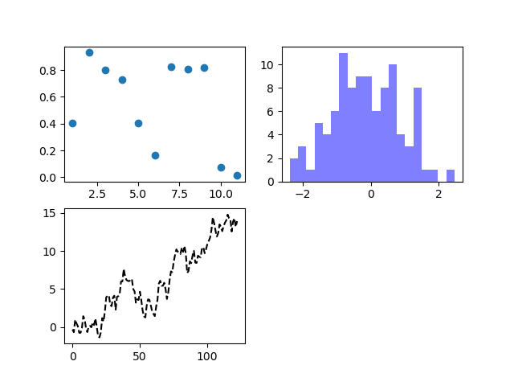
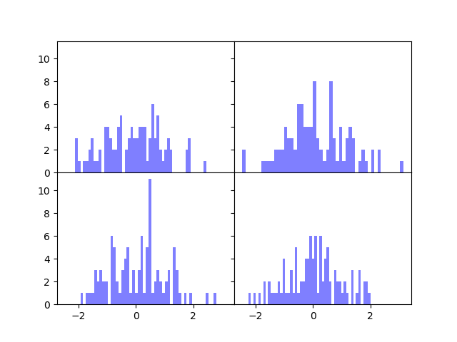
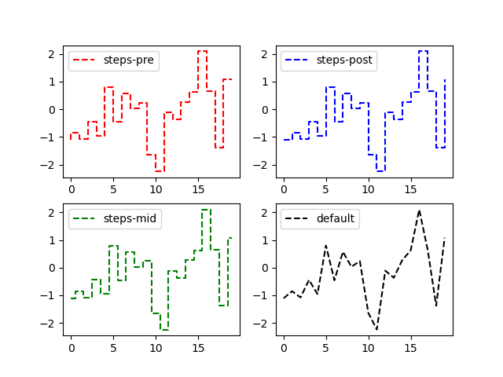
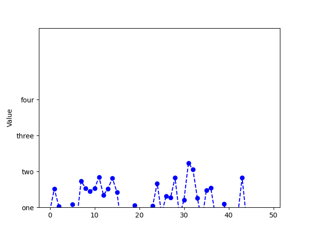
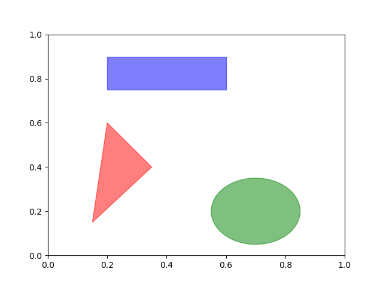
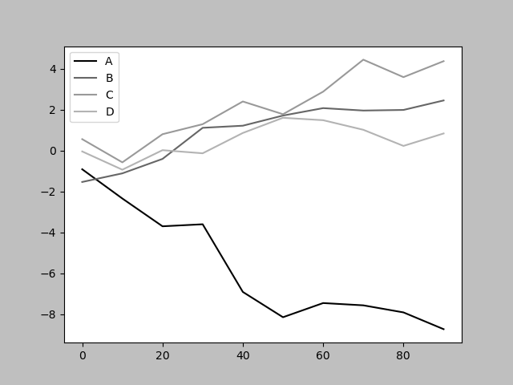
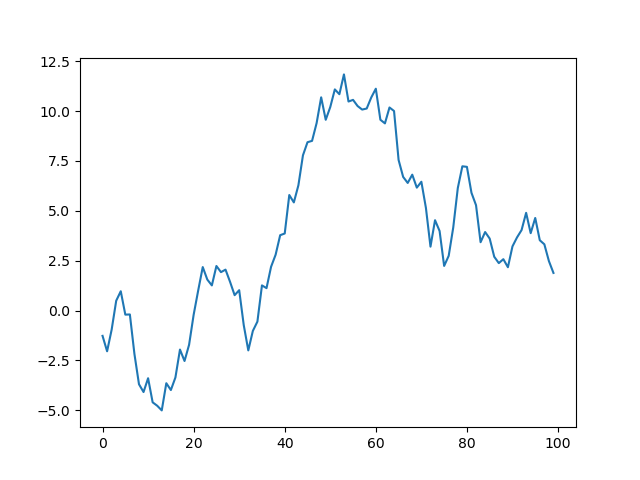
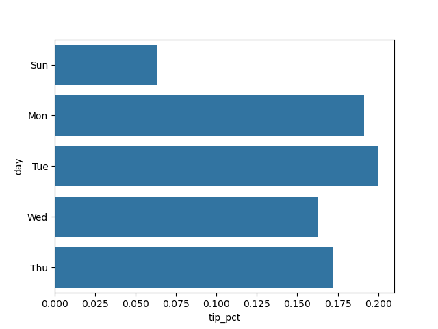
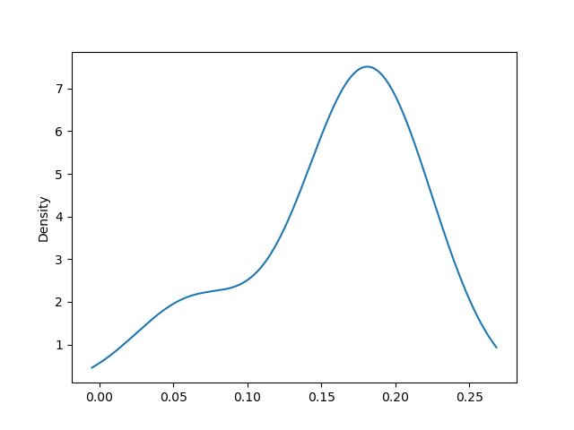

<font size=8, color=red>第九章</font>


```
fig=plt.figure()
pic1=fig.add_subplot(2,2,1)
pic2=fig.add_subplot(2,2,2)
fig.show()
```

最基础的设置

创建2*2个画布，然后可以对每个画布进行操作


```
ig=plt.figure()
pic1=fig.add_subplot(2,2,1)
pic1.scatter(np.arange(1,12), np.random.rand(11))

pic2=fig.add_subplot(2,2,2)
pic2.hist(np.random.standard_normal(100),bins=20,color='blue', alpha=0.5)
#alpha是图像透视度

pic3=fig.add_subplot(2,2,3)
pic3.plot(np.random.standard_normal(123).cumsum(), color='black', linestyle='dashed')

fig.show()
```


<font color=red>1.</font>对于`scatter`第一个参数指定x，第二个参数指定y，而且x的size必须和y的size相同（x,y均是列表）

<font color=red>2.</font>对于`hist`，绘制条形统计图，`bins`指定的是条形的个数

<font color=red>3.</font>对于`plot`，则是绘制条形统计图





```
fig,axes=plt.subplots(2,2,sharex=True,sharey=True)

for i in range(2):
    for j in range(2):
        axes[i,j].hist(np.random.standard_normal(100),bins=50,color="blue",alpha=0.5)

fig.subplots_adjust(hspace=0,wspace=0)
fig.show()
```

还可以通过这种方法来实现图形对象

<font size=5, color=red>**Attention:**</font>

**`fig`（Figure 对象）**：这是一个 `matplotlib` 中的图形对象，它代表整个图形或绘图窗口。可以把它看作绘图的容器，所有的子图（subplot）都会放置在这个容器中。`fig.subplots_adjust(hspace=0, wspace=0)` 用来调整子图之间的间隔，其中 `hspace` 和 `wspace` 分别控制水平和垂直方向的间隔。

**`axes`（Axes 对象数组）**：`axes` 是一个包含子图的二维数组。这里 `plt.subplots(2,2,sharex=True,sharey=True)` 创建了一个 2x2 的子图网格，因此 `axes` 是一个形状为 `(2, 2)` 的数组。`axes[i, j]` 代表第 `i` 行、第 `j` 列的子图。





```
fig=plt.figure()
ax=fig.add_subplot()
ax.plot(np.random.standard_normal(100), color='black', linestyle='dashed',drawstyle="default", label="default")
ax.legend()
```


`legend()`可以显示`lablel`， 而`drawstyle`可以指定**点与点之间的连接方式**

`'default'`：普通的线性连接（点之间的直线连接）。

`'steps-post'`：阶梯图，水平线段从当前点延伸到下一个点，然后垂直跳到下一个点。适合用来表示某个值在变化后生效的情况。

`'steps-pre'`：阶梯图，水平线段从前一个点延伸到当前点，然后垂直跳到当前点。

`'steps-mid'`：阶梯图，水平线段从前一个点和当前点的中间延伸，垂直跳到当前点。




对于`axes`对象的`set`方法可以设置`xlime` `xlabele` `xticklabels` `xticks` 相关属性，（对应范围，标签，刻度对应的标签，刻度），同理也可以设置y


例子：

```
fig=plt.figure()
ax=fig.add_subplot()
data=np.random.standard_normal(50)
ax.plot(data, color='blue', linestyle='dashed', marker='o', label="test")
ax.set(ylabel="Value", yticks=[0,2,4,6], ylim=[0,10],
       yticklabels=["one","two","three","four"])

fig.show()
```



同样也可以在`axes`的方法里里面去逐个修改


```
fig,ax=plt.subplots()

rec=plt.Rectangle((0.2,0.75),0.4,0.15, color='blue', alpha=0.5)
pgon=plt.Polygon([[0.15,0.15], [0.35, 0.4], [0.2, 0.6]],color="red", alpha=0.5)
circ=plt.Circle((0.7,0.2),0.15,color='green', alpha=0.5)
ax.add_patch(pgon)
ax.add_patch(circ)
ax.add_patch(rec)
fig.show()
```




三角形传入一个列表，列表中多个列表指定各个定点的xy坐标(polygon)


**线性图**


```
plt.style.use("grayscale")
fig,ax=plt.subplots()
df=pd.DataFrame(np.random.standard_normal((10,4)).cumsum(0),
                columns=['A','B','C','D'],
                index=np.arange(0,100,10))
df.plot(ax=ax)
fig.show()
```



`plt.style.use("grayscale")`在布置画布前设置可以使图线黑白灰度显示，适用于打印黑白文档的情景。如果在之后设置则依然是彩色


**DataFrama和Series**都有plot属性，其中在指定它的ax才能在对应的画布中show出来


```
fig,ax=plt.subplots()

s=pd.Series(np.random.randn(100).cumsum())
s.plot(ax=ax)
fig.show()
```




同时`kind`参数可以指定（bar,barh(横着),hist, pie）默认是line


**柱状图**

```
fig,ax=plt.subplots()
tips=pd.DataFrame({"total_bill":[16.99,10.34,21.01,23.68,24.59],"tip":[1.01,1.66,3.50,3.31,3.61],"smoker":'No',
                   'day':"Sun",
                   'time':'Dinner',
                  "size":[2,3,3,2,4]})

tips["tip_pct"]=tips["tip"]/(tips["total_bill"]-tips["tip"])
tips['day']=['Sun','Mon','Tue','Wed','Thu']
print(tips)

sns.barplot(x="tip_pct",y="day",data=tips,orient="h",ax=ax)
fig.show()
```



`orient`如果指定'h'那么则是水平的，如果不指定或者指定为'v'那么则为垂直的


```
tips['tip_pct'].plot.density(ax=ax)
fig.show()
```

`density`方法生成密度图




