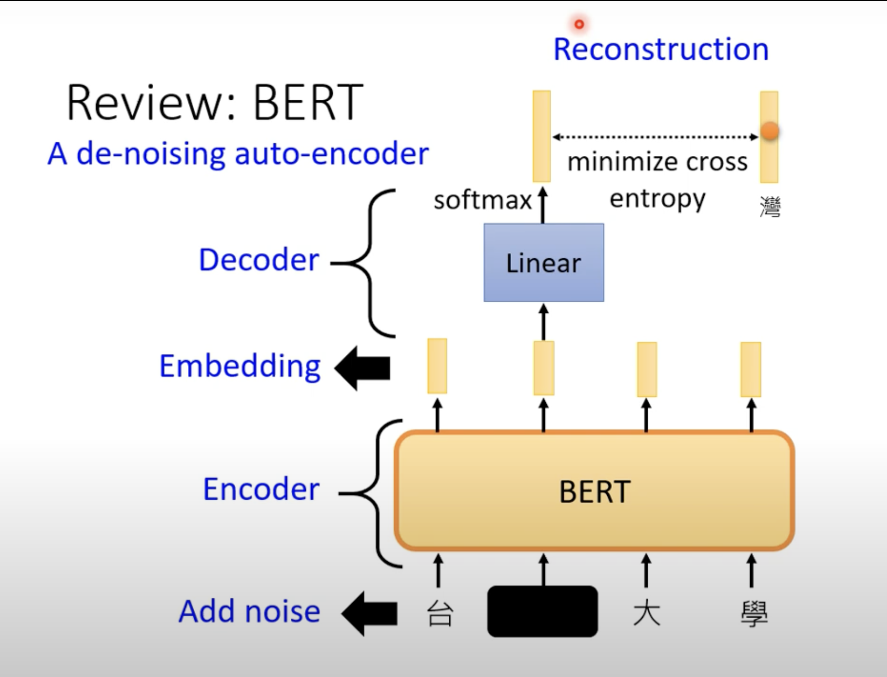

Auto-Encoder

Tips:

Self-supervised learning  pre-trained，它不需要标注资料。

（生成下一个token，填空......）

Encoder:可以将高维度的向量转化为低维度的向量，这也称之为：

**Dimension reduction**

**De-noise Auto-encoder**:

在原有的图片基础上加入noise,然后传入auto-encoder，但是目标是与未被加入noise的原始输入对比

BERT也可以视为 de-noise auto-encoder

**feature disentangle**

将输出的内容经过encoding后，知道embedding中各个部分属于什么内容，（物体，姿势； 语句，语法......）

可以通过将多个提取的内容，然后进行“融合”以达到目的的应用

（声音转换）

