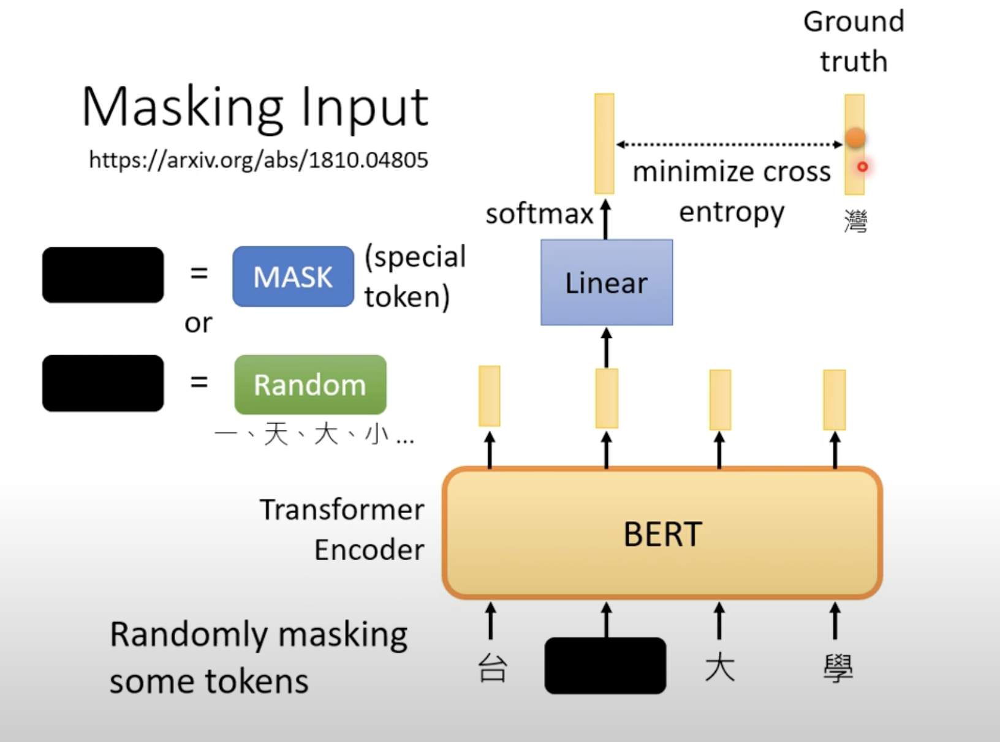
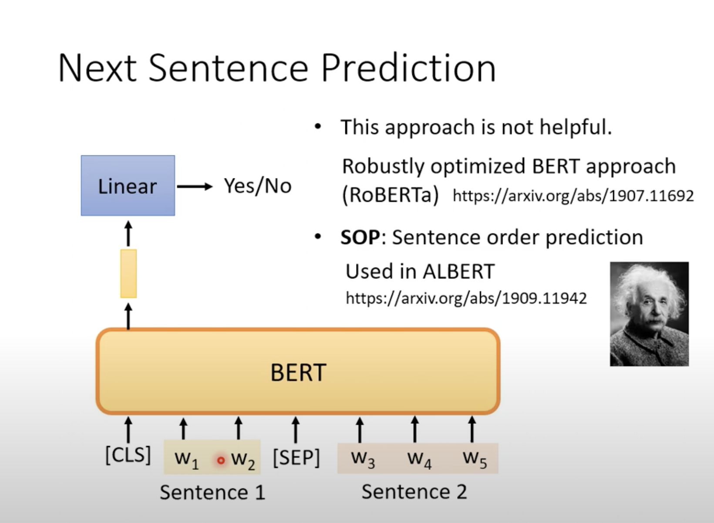
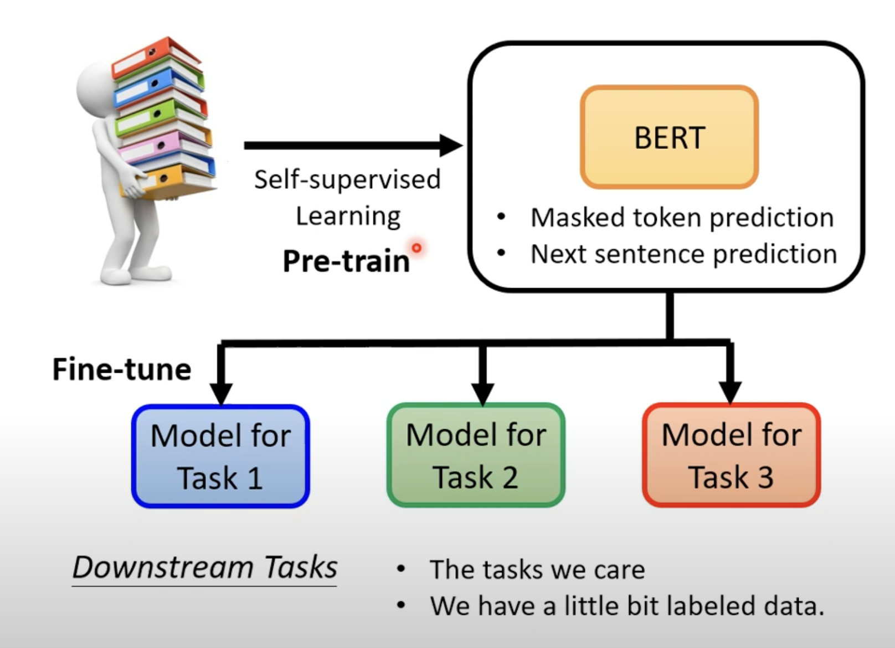
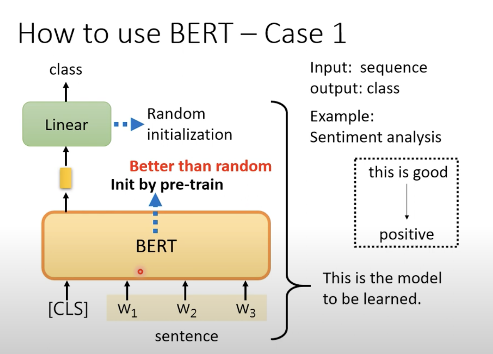
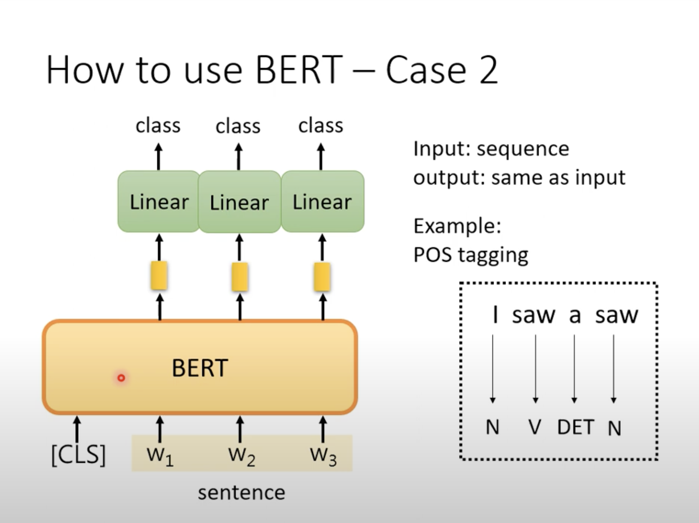
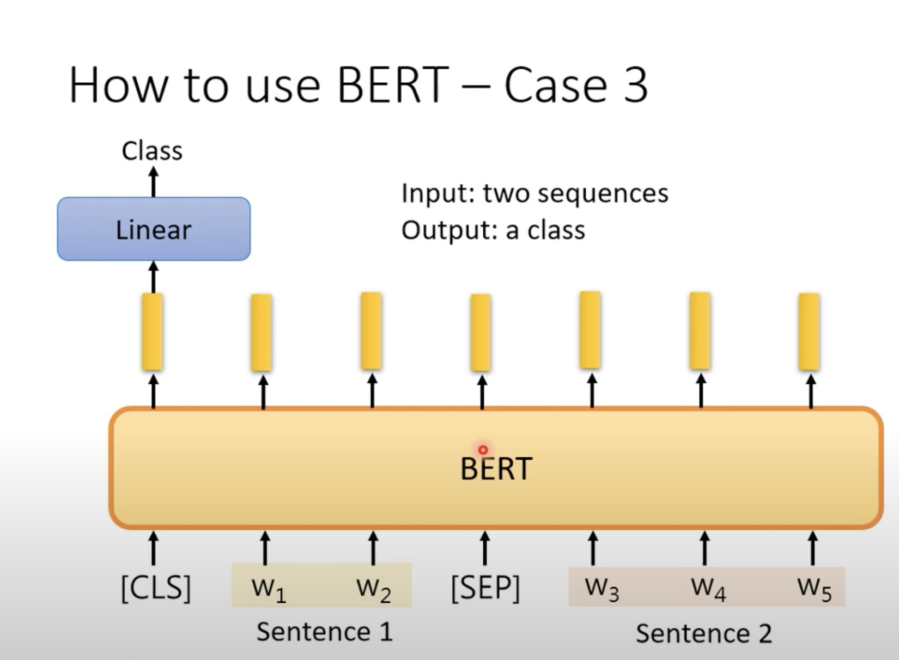

BERT(1)

**self-supervised learning**

没有label去纠正输出的y与实际的y

将输入x分为两部分，一部分作为模型的输入，另一部分作为它的label，将模型输出的结果y尽可能的使之与label接近

**BERT**

BERT可用于NLP，音频处理，影像处理

1.Masking input

随机masking 某个tokens

(可以用某个特殊的token作为mask，也可以将需要masking的token换为随机的某个token)

Tips:

token:处理单位文字的单位

2.Next Sentence Prediction

(CLS，特殊符号，SEP：分割符号)

取出两个句子，将CLS放置在句子的头部，将SEP放置在句子间的间隔

，然后将结果输入进BERT

再取出CLS输出的内容放入Linear，Linear输出二元分类，Yes,No分别代指两个句子是否为前后的关系

由于输入的分布不均匀（sentence1,sentence2很可能不是next，最终对于'predict'的任务效果较差）

**Not helpful**

**Fine-tune(微调)**

**GLUE**

利用一个任务集，去测它的准确率，取平均值来权衡参考这个self-supervised model的能力

Glue:General Language Understanding Evaluation

How to use BERT -Case1

利用gradient descend去调整Linear model

**semi-supervised**:大量未标注的资料，少量标注的资料

How to use BERT -Case2

How to use BERT -Case3

解决NLI问题，给定前提以及假设，输出contradiction/entailment/neutral

