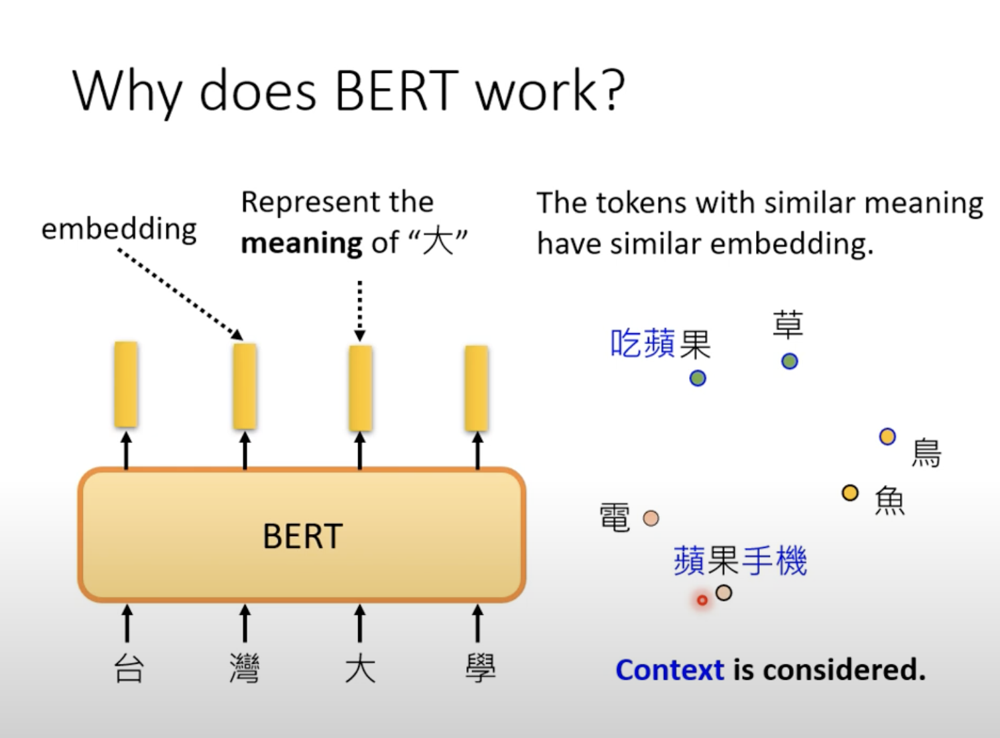
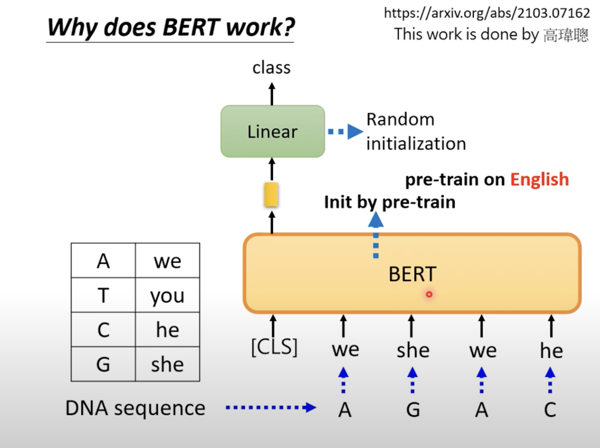
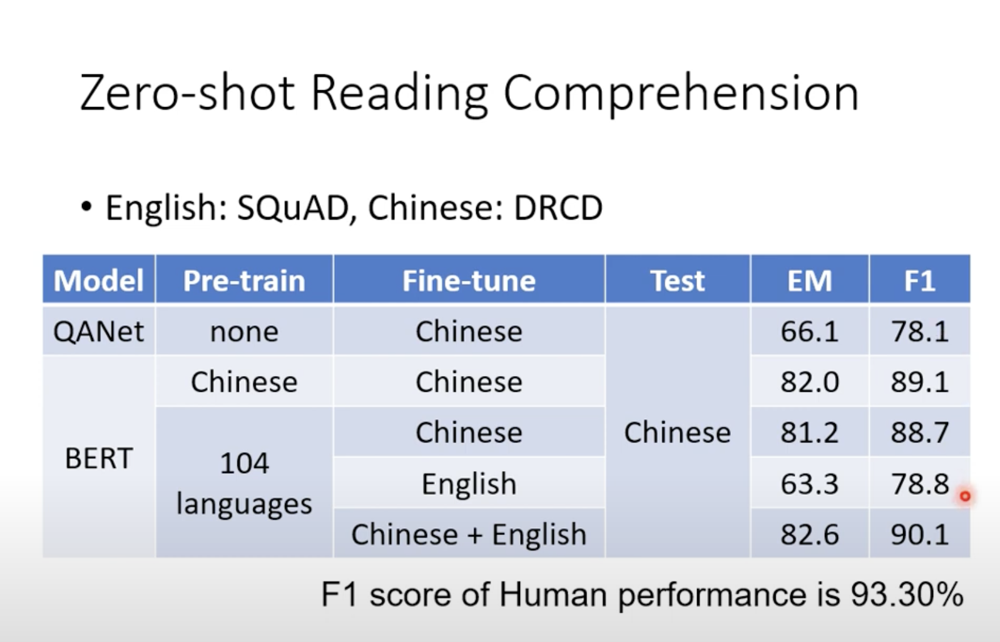
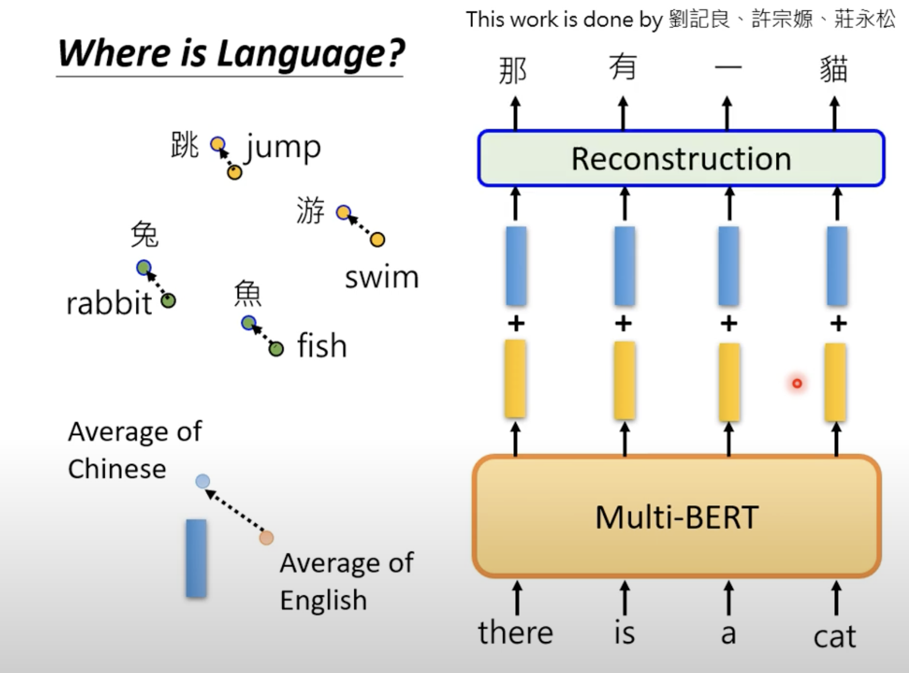

BERT(2)

**Why dose BERT work?**

具有embedding layer的作用，语言相近的向量他们的”距离“也更近。同时输出的向量是有考虑上下文的。

**word embedding**：取出某一个token，让后让机器根据这个token的上下文去预测出正确的token (CBOW模型)

BERT也因此可以视之为deep版的CBOW

悬而未决的

但是当用BERT用于DNA,蛋白质还有音乐的分类时，它们与语言语言无关，但是却可以产生较好的效果。（语言完全是乱的，不知所云）

也许BERT效果如此好的缘由在于：纯粹它的初始化参数很好，很适合大型模型的训练，而不拘泥于文本

**Multi-lingual BERT**

**多语言的BERT**

一个BERT模型让它去同时“应酬”多种语言

Then:

可以实现train英文的QA，完成中文的QA

语言之间embedding后取平均，发现二者的“距离”不大。那么A语言输出后对它进行针对的“纠正”转化为B语言输出效果也不差

（但不单单归功于与这个“纠正”，还有很大部分的语言资讯是在模型内的）

