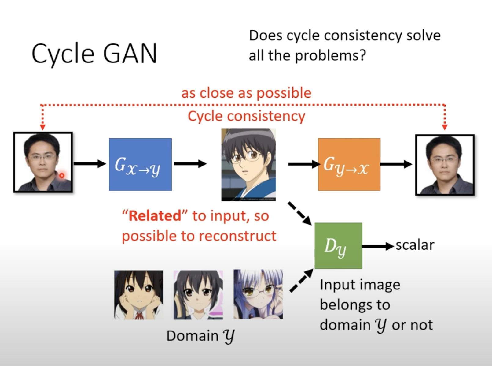
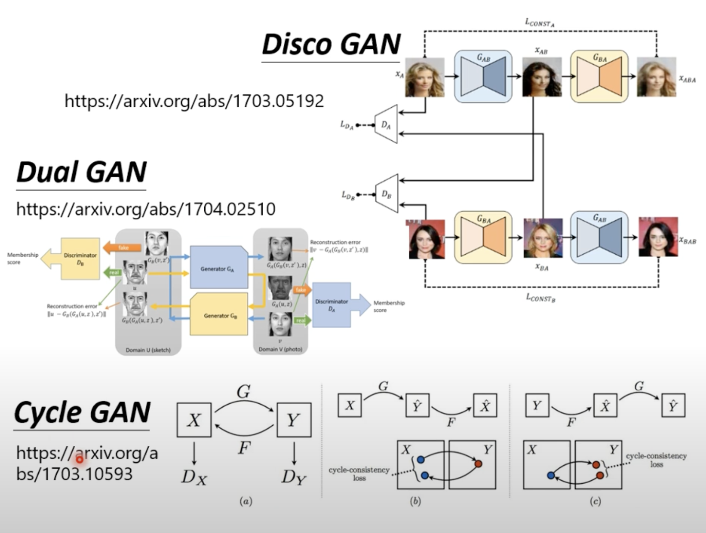

CycleGAN

Learning from Unpaired Data

当我们无从预先得知y的标准答案时，数据不匹配时，我们通过创建两个转化的架构，从输入到目标生成，并且又将目标生成转化为类原始输出，通过比较原始的输出与两次转化后的类原始输出，我们可以以两个图片的相近程度来训练这种转化，去约束目标输出与原始输出的相关性

见图：

Dual GAN,Disco GAN原理上与Cycle GAN一样

