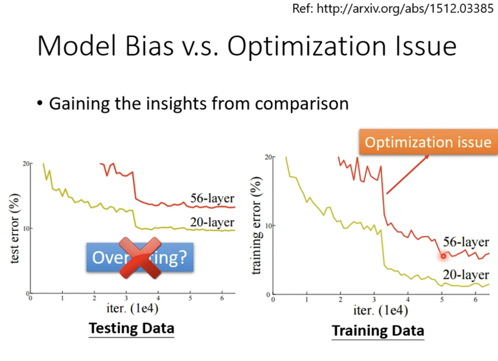
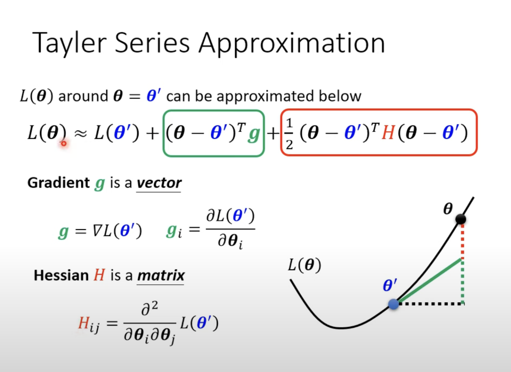
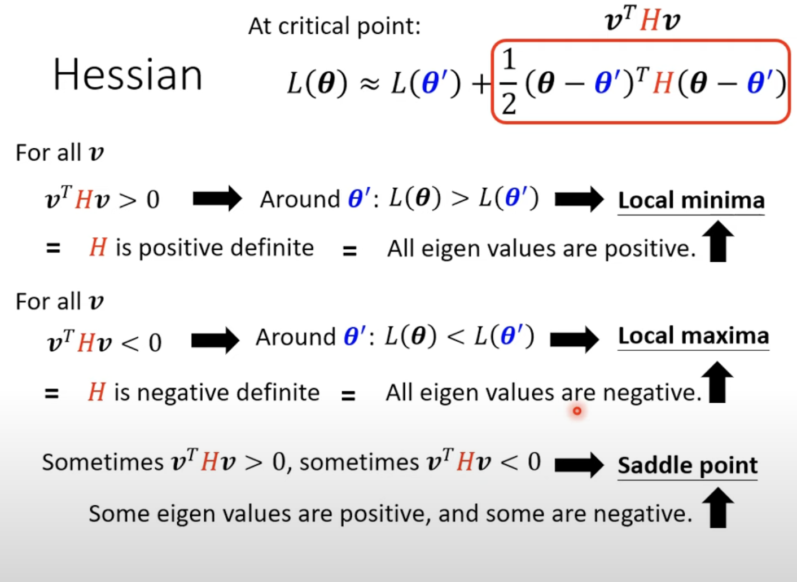
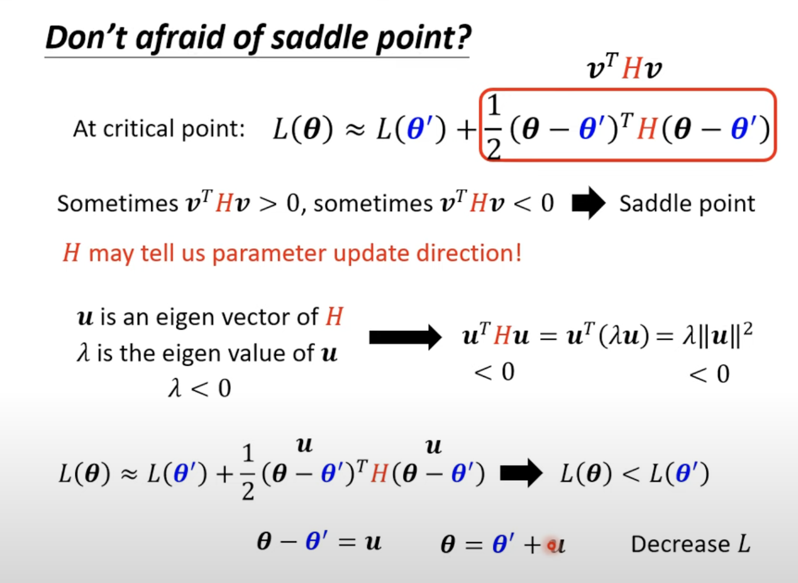
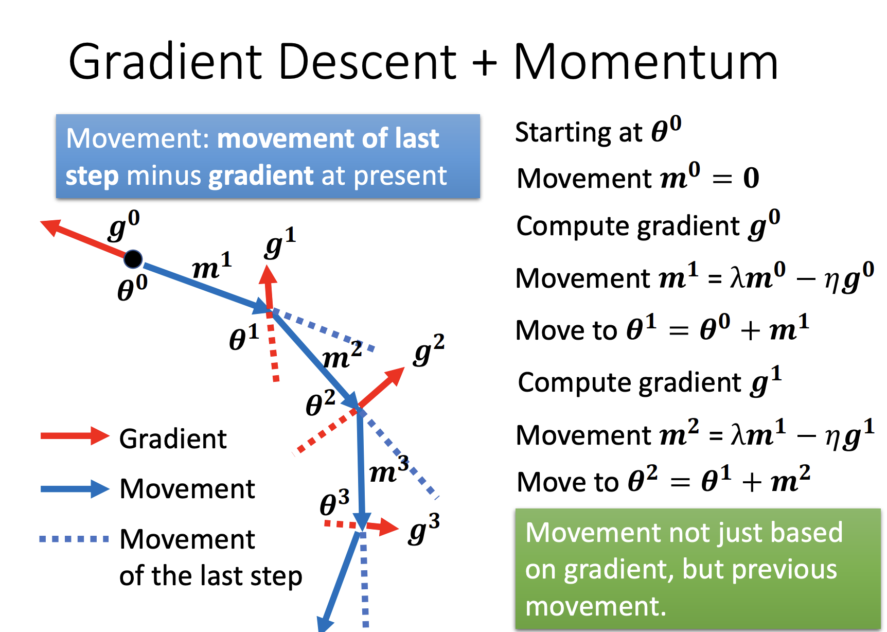
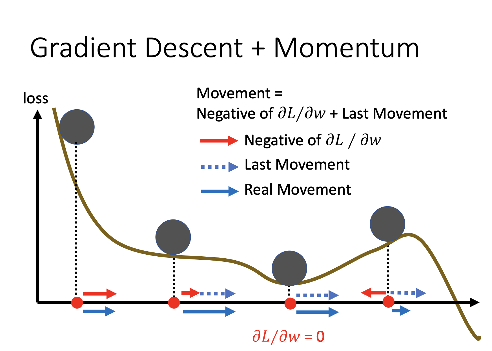

Deep Learning(1)

General Guidance

训练数据的Loss大，那么可能为model bias与optimization issue，如果层数大时loss反而更大，则是optimization issue

训练数据的Loss小，测试数据的Loss大，可能为overfitting和mismatch

(mismatch:training and testing data have different distributions)

对于overfitting

可以1.增加训练数据

​        2.data augmentation(在现有资料的基础上增加资料，基于原有资料理解的基础上)

​        3.constrained model：

​             减少神经元/让model共用参数/less features/regularization/early stopping/dropout

**一般流程：**

1.将training set 分成training set 与 validation set,训练过后，以validation set的loss为标准去上传

2.根据public testing set进行微调（不推荐）

3.ddl，private testing set跑分

**N-fold Cross Validation**

1.将训练资料切成N等分， 将其中之一作为validation set

2.重复N次

3.各个模型跑每组跑一下，统计loss，最后算出每个模型的平均loss，以此评估

​       

When gradient is small

training loss无法下降

可能gradient descend为0 (local minima, saddle point(马鞍形)......)(gradient descend为0 的点称为critical point)

我们可以这样逼近Loss Function

        

当遇到critical point时，可以通过Hessian部分来判断Loss function是什么型

判断方法：

（eigen value就是特征值）

当遇到saddle point时，我们可以向Hessian的eigen vector方向去更新，来使L变小

（然鹅实际中，不会用这种方法逃离saddle point，计算量太大了）

当参数变多，维度变高，有可能local minima可以变成saddle point

$$
Minimum ratio = \frac{Number\ of\ Positive\ Eigen\ values }{Number\ of\ Eigen\ values}
$$

Minimum ratio越大，越可能为local minima

那么如何逃出local minima呢？

加入参数m，每一次移动都会不不止参考gradient,而且会参考先前的m(movement)

相当于有了一个惯性

这样在gradient为0时，仍然有m使得继续更新

