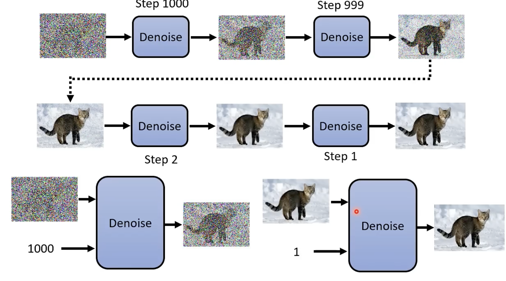
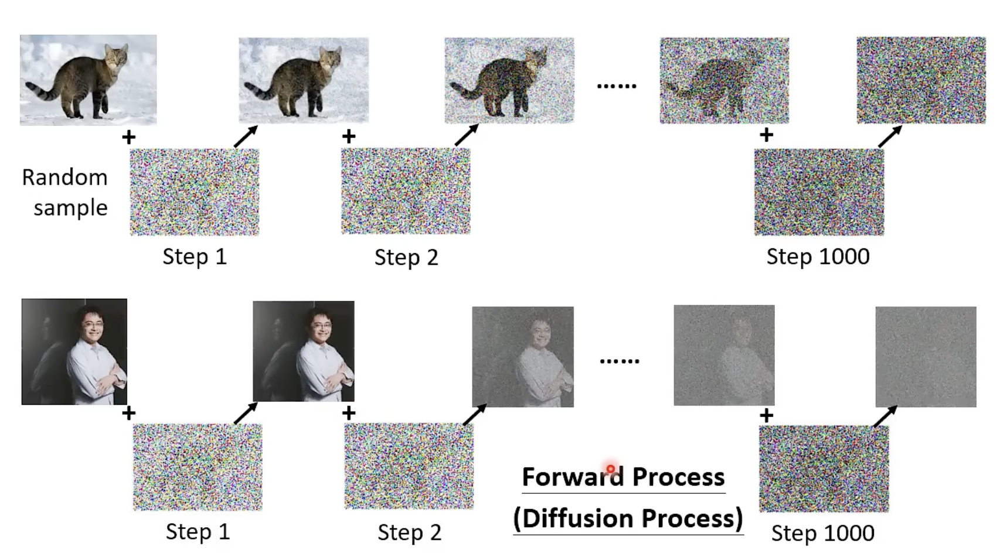
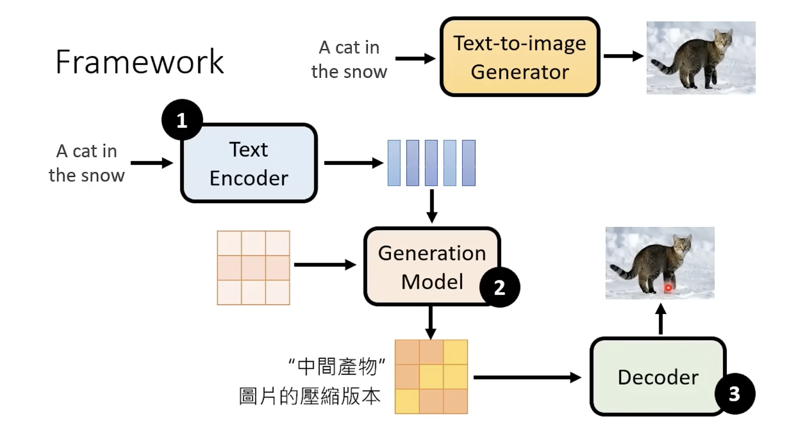
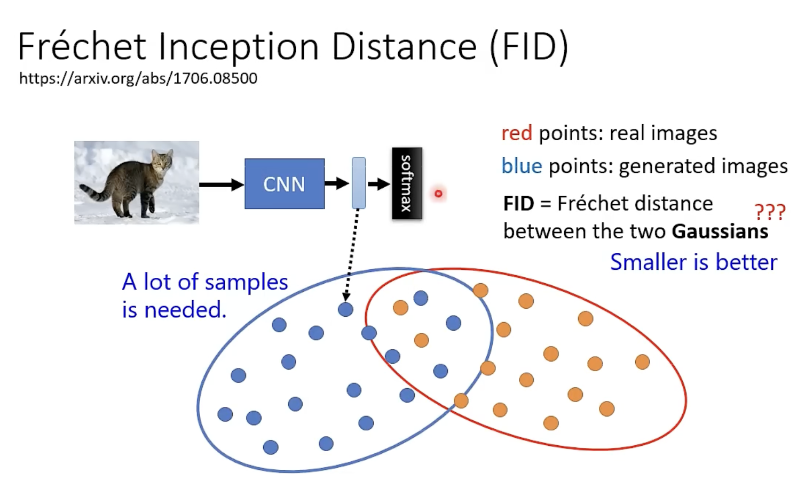
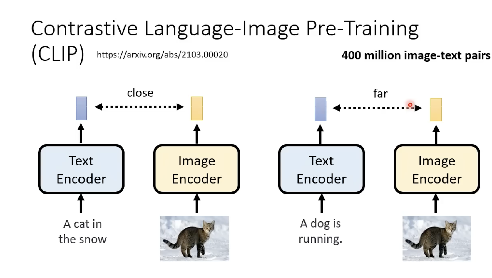

Diffusion Model

概念引入

生成过程：逐步去除噪声。

接受两个输入，一个图片，一个step，来根据step来推算noise的程度

**Noise Predictor**:生成杂讯，再将图片扣除这个杂讯(直接生成noise比直接生成target简单)

问题来了，如何train这个noise predtcior呢？（让生成的答案与正确答案想接近，那么这个正确答案何来？）

THEN!:

图片人为生成，杂讯随机加入,这个过程称为：forward process(diffusion process)

所以在经过diffusion process后就有ground truth(标准答案)

如果是text2image，那么在noise predicator加入text这个输入项

Stable Diffusion

三个部件分开训练

给generation model分别杂讯图片和text embedding vector

FID:

数值越好，生成的质量越好

在train时，喂给模型的noise是由一个真实图像生成的，这个图像作为FID的“标准答案”，而inception的输入即使生成的图片

CLIP:

一个train好的模型，用来评估文字和图像是否足够匹配

decoder帮助generation model进一步生成。

因为generation model的train需要成对的image-text资料，但是decoder不需要，只需要image资料来train，成本更低

这个decoder的训练方法用**auto-encoder**方法来train

**Generation Model**

相较于之前将讲的diffusion model生成图片，这里的generation model生成的是latent representation，而非最终答案。

那末！

将正确答案的图片先经过encoder后再逐步加入noise,以此生成noise predictor需要的data

