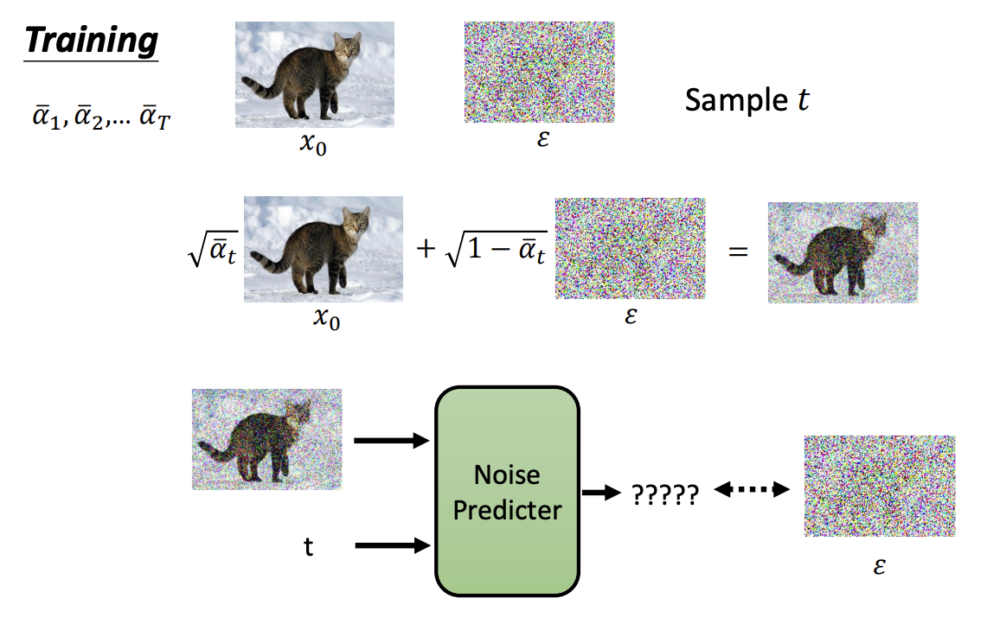
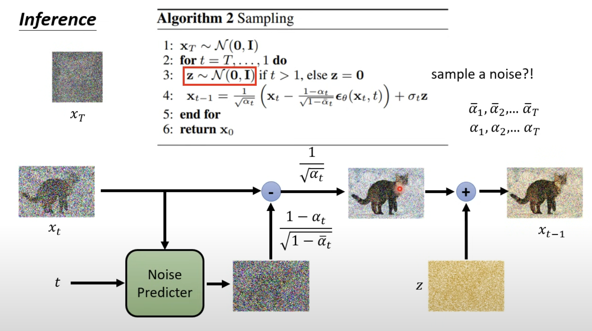
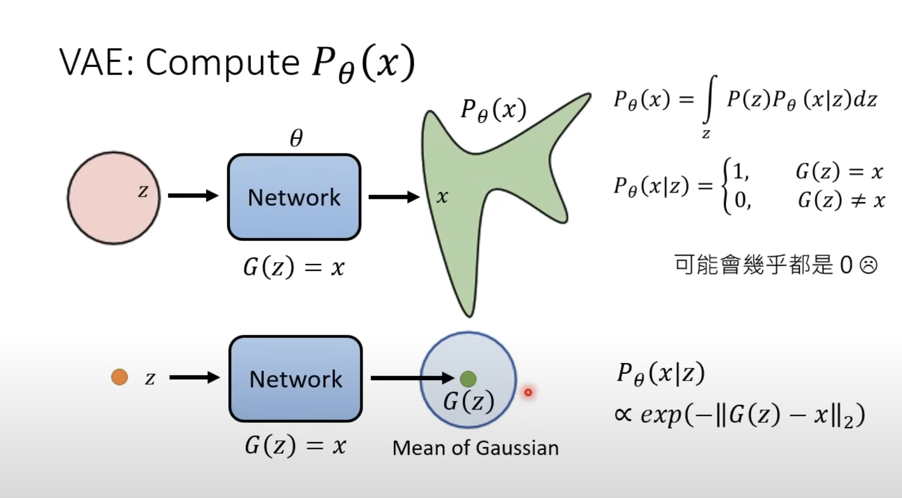
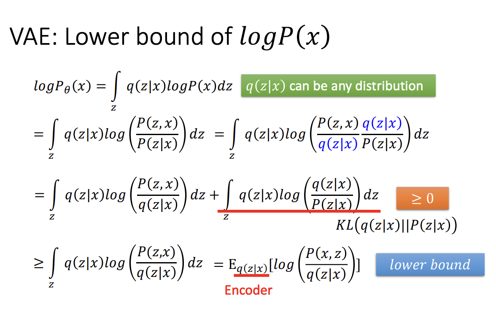
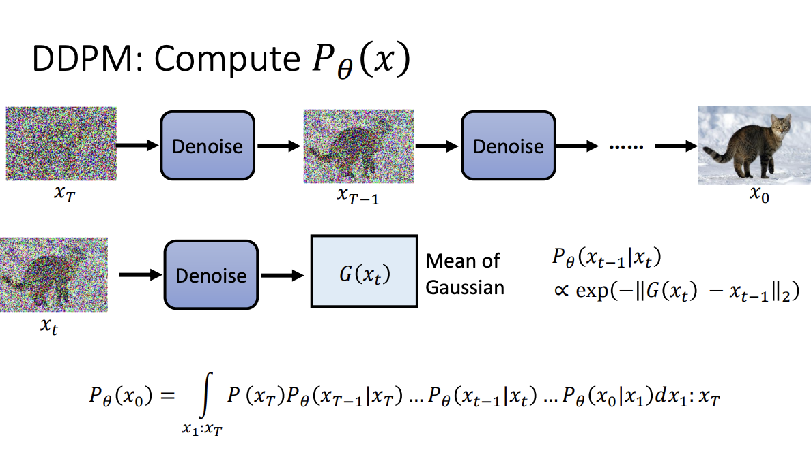
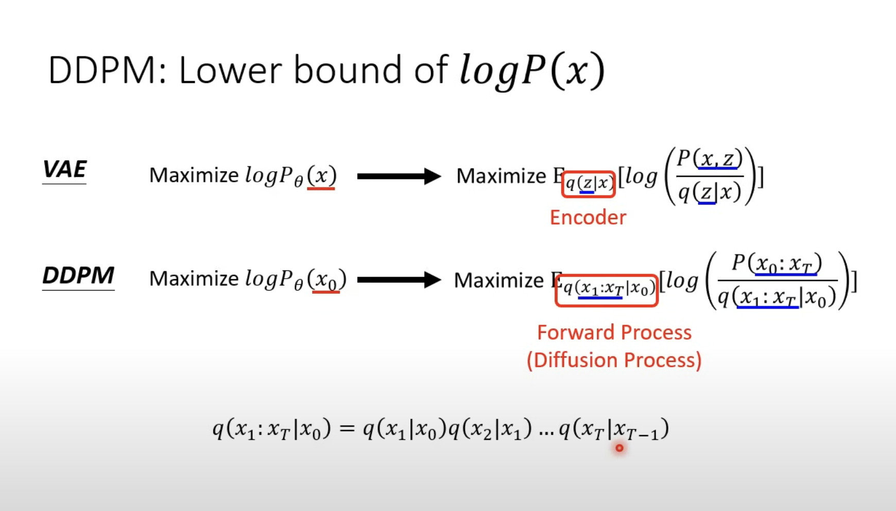
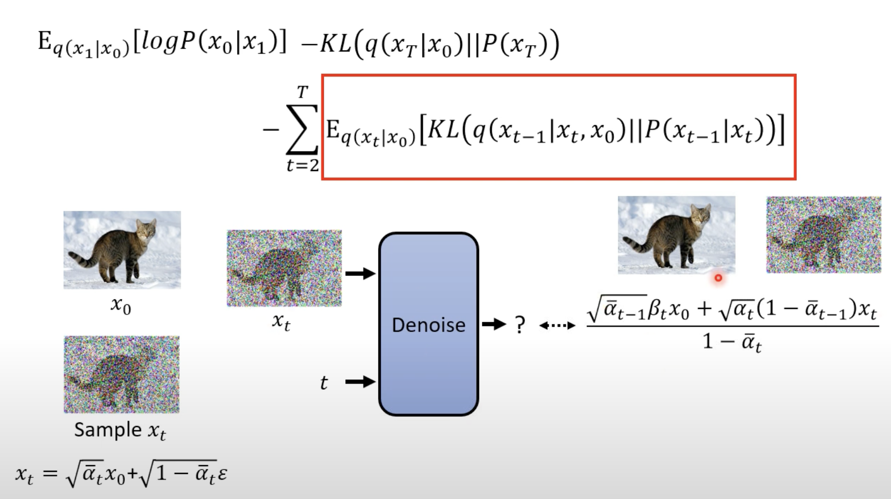

Diffusion Model原理

引言：

（VAE是一种auto-encoder)

Diffusion颇似VAE，不过不同于encoder与decoder直接让它去学，Diffusion中很多操作已经固定好了，加noise，去noise....

**Train**

$$\alpha_{t}$$​ 决定保留原图的比例

（ $$\alpha$$ 是hyperparameter）

简洁说就是：train出一个可以预测加了多少noise的机器，输入的是加入了noise的图和step，输出是加入的noise

至于如何生成的noise与step，就是在一个上升数组中取一个，作为保留原始图片程度的参数，然后加入。这是train需要的两个参数

**Inference**

用之前train出来的noise predictor，将input的图片减去经过缩放后的噪音，然后再加入噪音

**如何衡量两个分布越接近越好?**

通过数学推导可以证明：

$$\theta^{*}=arg(max \prod_{i=1}^{m}P_{\theta}(x^{i}))=arg min(KL(P_{data}||P_{\theta}))$$

**Maximum Likelihood = Minimize KL Divergence**

我们很难算出 $$P_{\theta}(x^{i})$$

VAE:算P(x)

视高斯分布的均值为输出的“标答”

在VAE中常常是对logP(x)操作而非直接对P(x)

同时在maximum P(x)的过层中，往往maximum的logP(x)的下界：

DDPM:计算P(x)

其实和VAE的处理大差不差

DDPM的logP(x)的lower bound的计算推导过于变态，略

**Optimize**

同时可以通过数学大法将 $$x_{0}$$ 化成 $$x_{t}$$ ，最后的只需要去收敛于一个只带有 $$x_{t}$$ 与 noise的（还有一堆常数）的项

（就是需要预测那个noise)