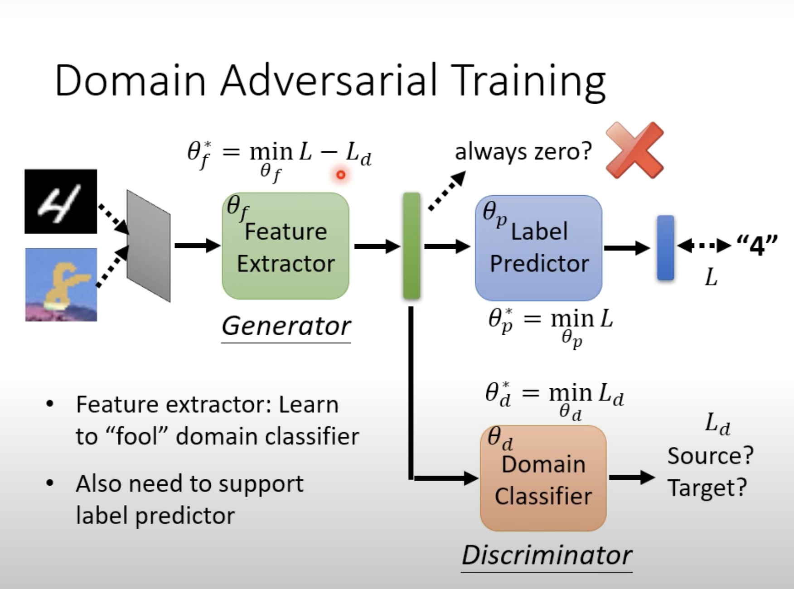
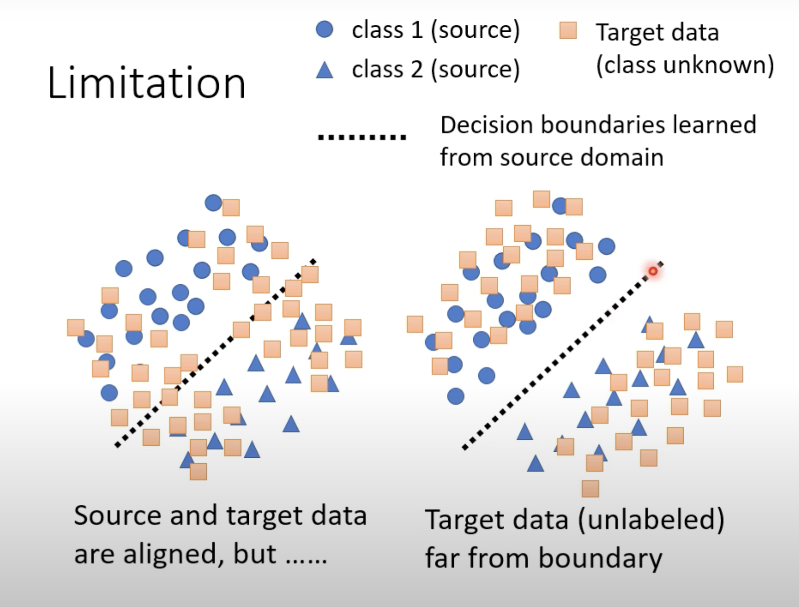

Domain Adaptation

Domain shift:测试数据集和训练数据集的分布不同

新分布的数据量较少，而且没有对应的label

Domain Adversarial Training

为了train出一个能够忽视domain target与domain source差距的feature extractor，那么尽可能地将二者经过featutre extractor后得到的分布尽可能接近。

考虑引入一个domain classifier，最终的目标是能够降低domain classifier的准确度（GAN）

为了防止feature extractor一直输出0（这样子不就domain classifier完全给出一样的结果了吗？（忽视了label predictor）),

我们可以定义feature extractor的Loss function是：
$$L_{lable}-L_{classifier}$$

局限性：

我们想要的是“欺骗”过domain classifier，但是直接对他的loss function取负号有可能没有真正意义上的混淆它，比如：

让原本的domain target输出为domain source, domain source输出为domain target，这种情况下确实是让loss function很大，貌似蒙骗过去了，但还是将二者分离开了——我们的目的是让domain classifier正确辨识source的情况下，无法辨识target

**Then！**

对于原由的数据，我们能够很简单的去学习出一个classifier，对于各个类的数据，“划”出一条能够区分两个类别数据的线，而对于target data，我们只保证了它的分布和source data的分布想接近，但是可能出现部分target数据卡在之前所学习出来的line那里——含糊不清。

我们这时需要尽可能地将target数据变成像source那样。

让它输出的概率分布某一个结果数值很高，很集中

Anyway,不好train

