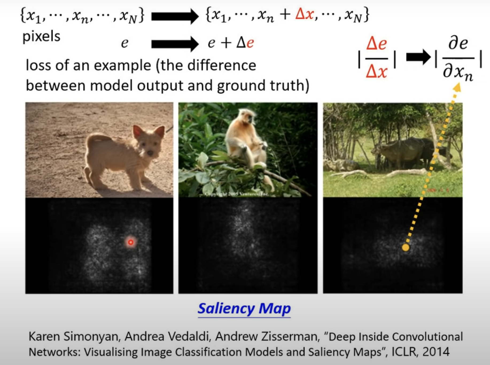
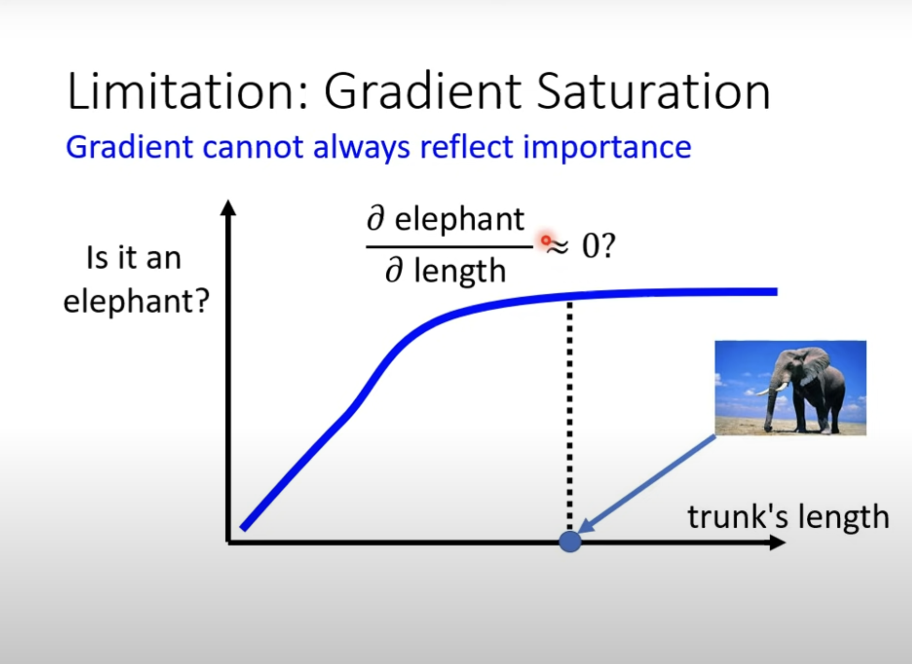
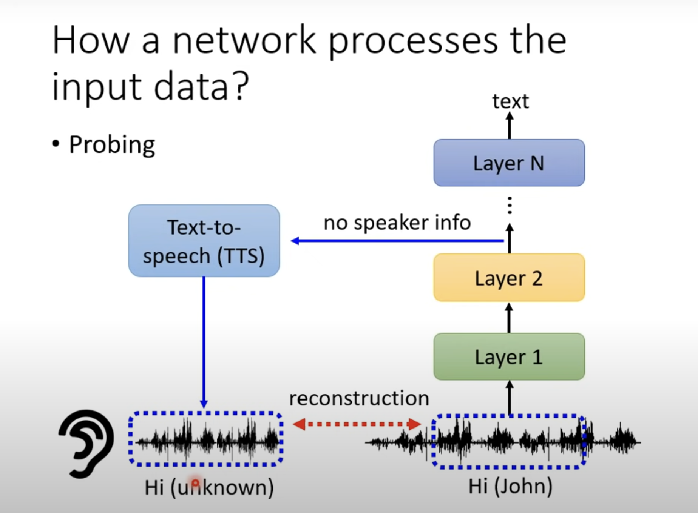
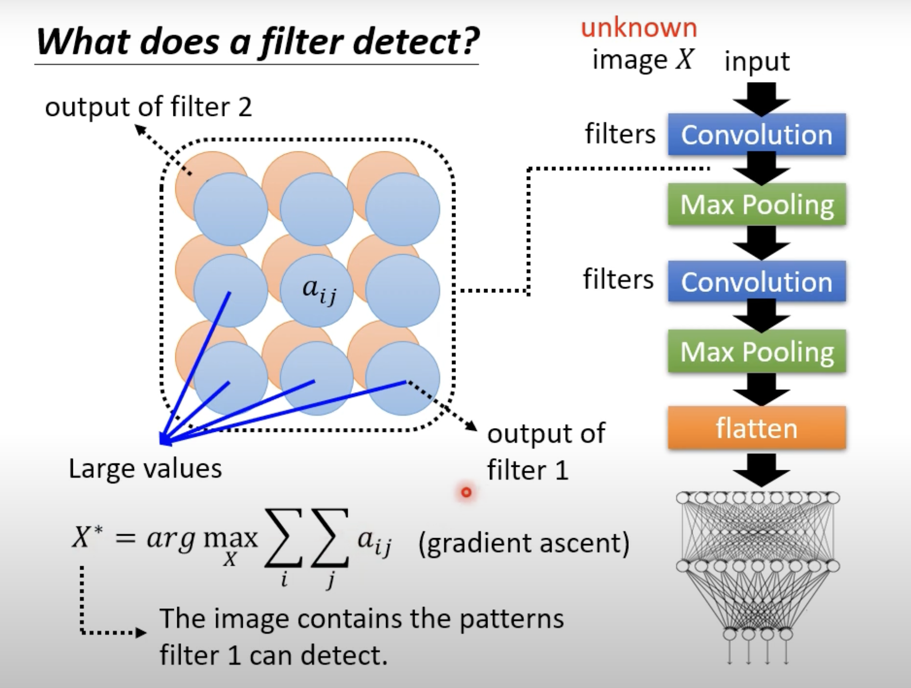
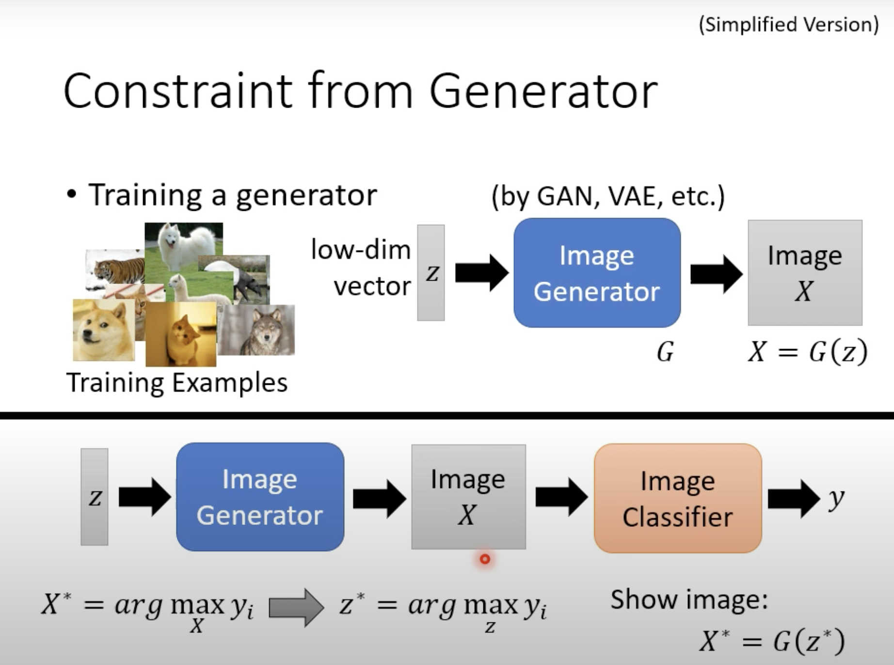

Explainable Machine Learning

**Local Explanation**

Concept:我理解为在给定具体输入的情况下，去找到机器是由输入的某一个特定的点而主要做出了这个output。

方法：

遮蔽或者改变输入的某些部分，看它对于输出的影响，影响大，那就说明机器主要是由这一部分的输入而做判断

对于每个像素作偏导，数值越大其对于输出决定的贡献越大，在Saliency Map中越白

但是通过这种偏导的方式也有局限性。

比如：

按照这种情况下画出saliency map，大象的鼻子部分反倒不怎么亮，但不能由此认为它不是很大程度上由鼻子这个部分做的判断

还可以

**Visualize**:人眼观察net 部分输出后的分布(先将高纬度的vector降低成2，3维，然后根据情况图上的分布)

**Probe**:直接对net中的embedding layer的输出作分类，看它是否真的提取到特征了（但这种方法不太好控制）

Probe不止classifier:

train一个vector2source的net，如果原本的net真的提取到关键的信息，那么应该能够还原应有的内容（其他无关的特征可能发生变化，消失）

**Global explanation**

不是针对某个模型，而是更加universal地，更加系统性的，去看模型中的参数去分析

去train出一个图片，能够使得经过某一层layer后的输出最大，去看这个layer到底提取些什么，它的轻重

这个 $$X^{*}$$  就是layer的一种“代表”

但是通过直接从input一端开始train出整个net的$$X^{*}$$ 最终可能得到的结果我们很难人眼分析（无济于事）

所以尝试引入一个函数，这个函数刻画这个结果与实际输入的相似程度

$$X^{*}=arg max_{X} y_{i}+R(X)$$

但这种方式得到图片的难度较高

所以又尝试去获取一个低纬的向量来分析。

（将向量丢入Generator中，然后将生成的图片给目标net，再

实质上还是去问，什么时候output输出的“信心分数”最大？如果最大那么就是这种对应的输入就是模型“做题时最喜欢，最模版”的输入，然后我们再去观察输入来反推出这个模型的提取特征模式

