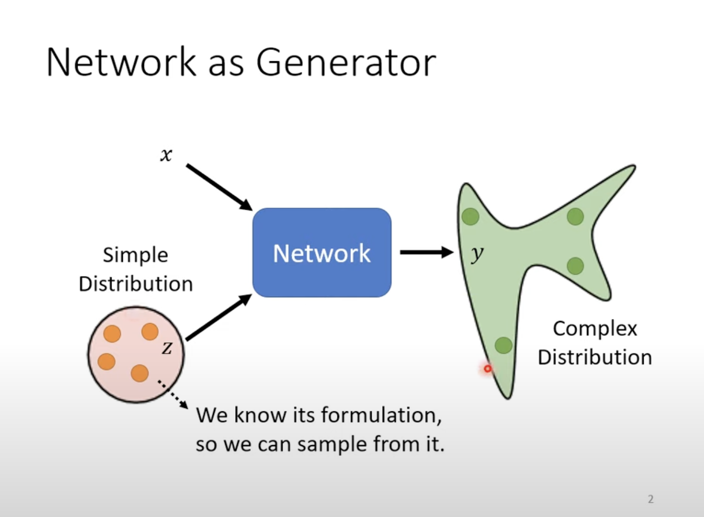
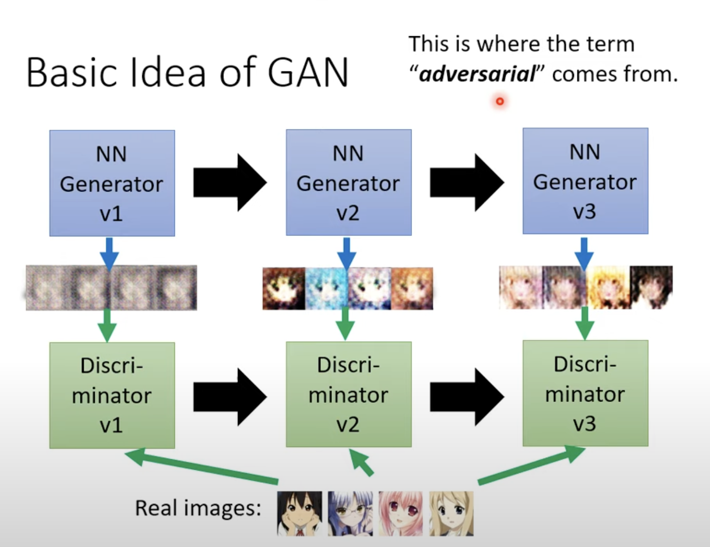
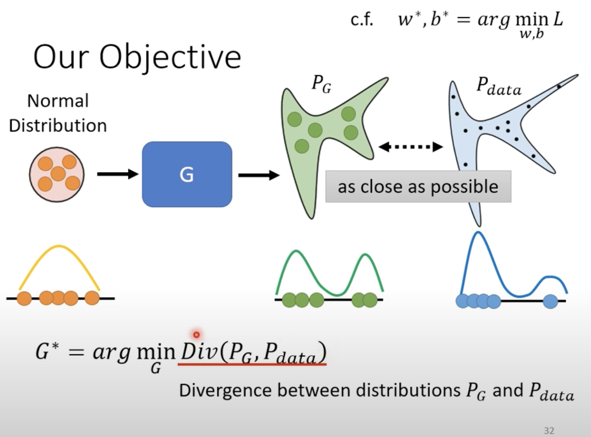
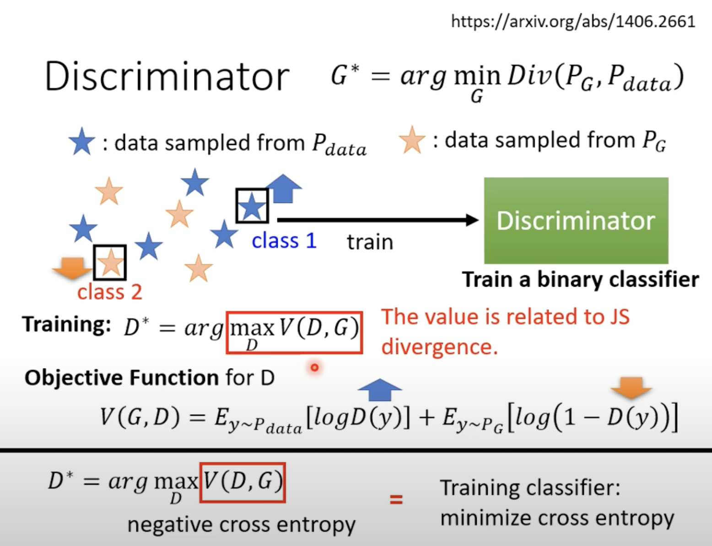
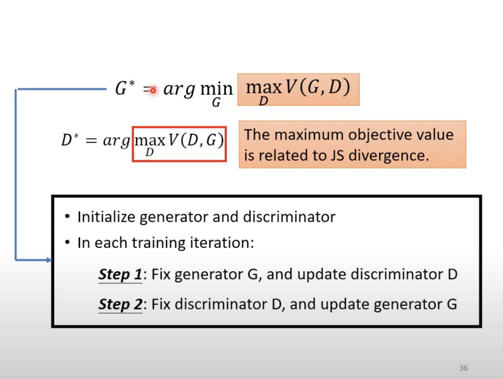

GAN

GAN:Generative Adversarial Network

(生成式对抗网络)

**Network as Generator**

Tips(什么是generator):

在深度学习中，`generator` 通常指的是一个用于生成数据的对象或函数，特别是在处理大型数据集或需要动态生成数据的情况下。生成器的主要作用是逐步生成数据，而不是一次性加载所有数据，从而节省内存。生成器在深度学习中的使用主要有以下几种情况：

1. **数据预处理与增强**：在训练神经网络时，经常需要对输入数据进行预处理和增强（如图像翻转、旋转、缩放等）。生成器可以动态地进行这些操作，并在每次迭代时提供不同的增强数据，从而增加模型的泛化能力。
2. **大数据集处理**：当数据集非常大，无法全部加载到内存中时，生成器可以分批次（batch）地从硬盘中读取数据并提供给模型进行训练，节省内存资源。
3. **生成对抗网络（GANs）**：在生成对抗网络中，生成器（Generator）是一个神经网络，它的任务是从随机噪声中生成类似真实数据的样本。生成器网络通过与判别器网络（Discriminator）对抗训练，不断改进其生成的样本质量。

而这个也称之为**Generator**

随着z每次随机的不同，y的输出也不同

为什么我们需要Generator:

对于同一个输入，有多种可能的输出，这些输出都是正确的，加入随机性让它具有创造力

（chatbot,drawing......）

Discriminator:也是一种架构，输入一张图片，输出一个数值，数值越大，真实的value fake越小

算法:

反复训练discriminator与generator，每次训练一方时，将另一方的参数定住

**Train**

尽可能的减小Pdata与Pg的divergence(分歧，分岔)

但是divergence难以去描述

Objective function和discriminator的分辨能力相关，训练时尽可能的去找到一个Discriminator可以使得这个分类更清晰，差距更明显。而这个也和JS divergence相关，所以整体上需要train的是让这个式子尽可能的小：
$$
G^{*}=arg min_{G}max_{D} V(G,D)
$$

**Tips for train GAN**

JS divergence的局限性：

两个分布如果没有重叠JS divergence值恒为log2

也因为在样本数量不够大的时候discriminator的100%正确率导致我们无法观测到generator是否在进步，也因此无从优化

当我们使用Wassertain distanc去表示divergence时的GAN,叫做WGAN

$$
max  \{ E_{y~P_{data}}[D(y)]-E_{y~P_{G}}[D(y)] \}
$$
同时对于D也有要求，必须足够平滑

（不然不收敛，会导致数值趋向于∞）

