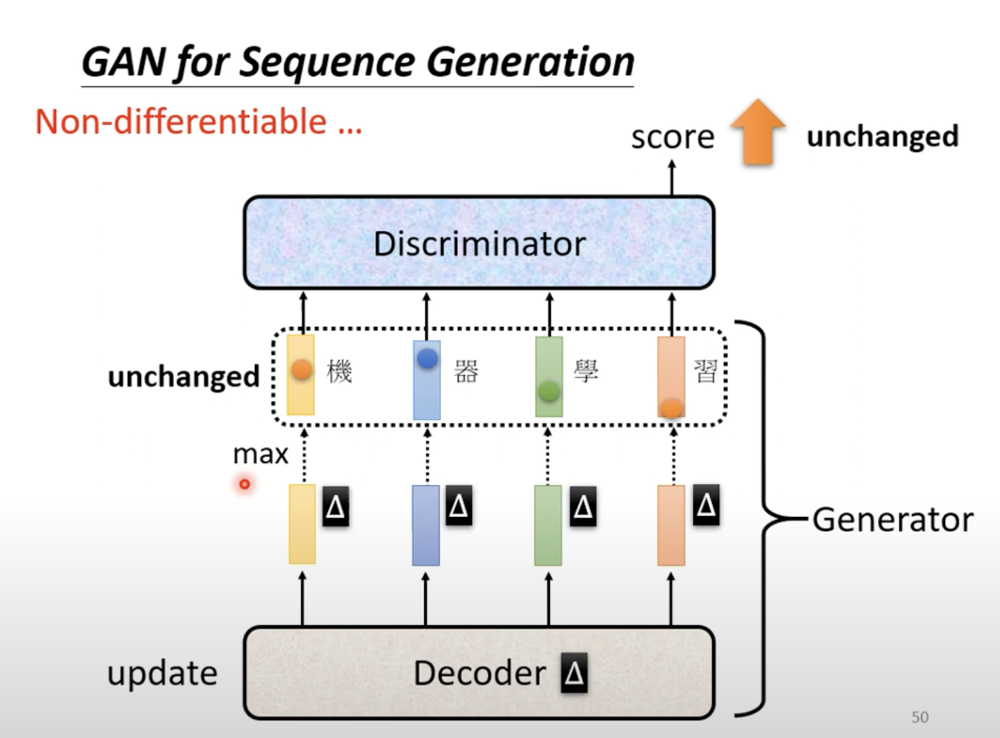
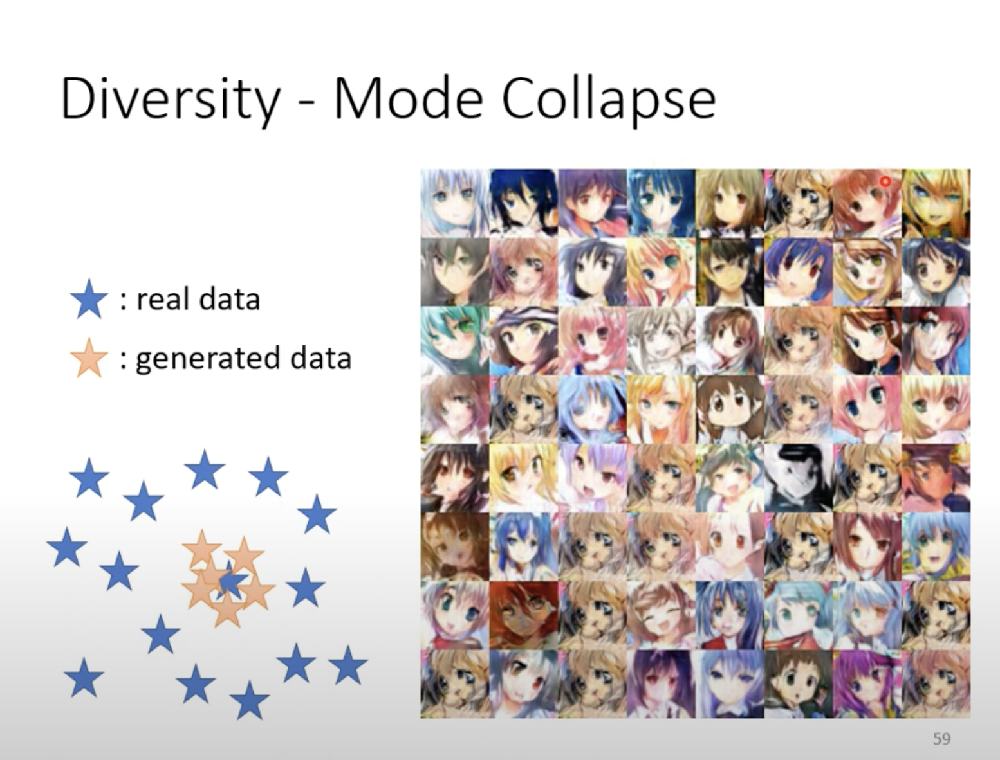
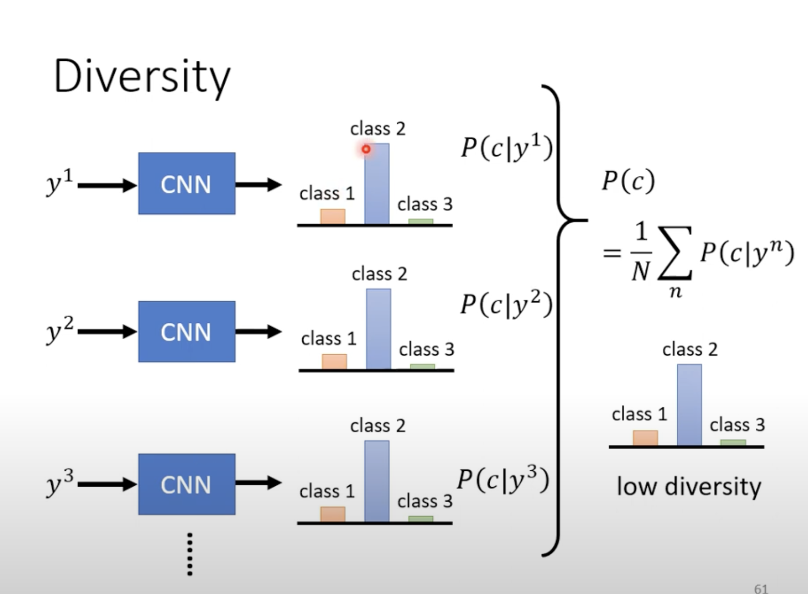
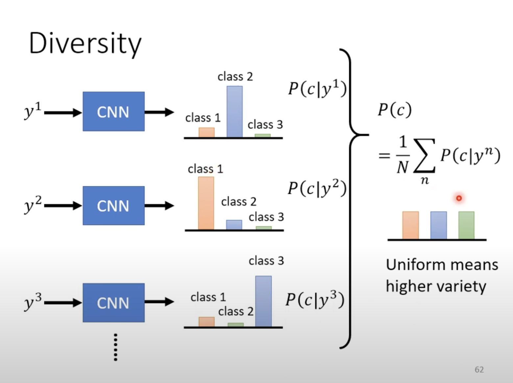
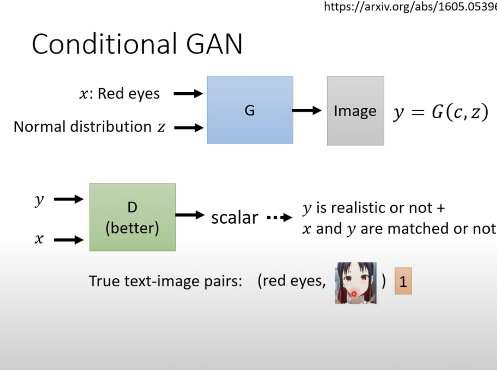

GAN(2)

**GAN for Sequence Generation**

当我们用gradient descent我们难以用以降低loss

因为：

gradient descent改变是很小的，在取max后，输出的内容不变，score也依然不变，不法建立起正向调整的反馈

为什么架构中存在maxpooling 时仍然可以用gradient descent?

尽管最大池化操作本身并不具备显式的可导性（因为它是基于取值的离散选择），但梯度下降仍然可以在包含最大池化的网络中有效工作。原因如下：

### 1. **梯度的传递**

在使用最大池化时，池化层会在每个池化窗口内选择最大的值，并将这个最大值传递给下一层。对于反向传播，梯度仅仅通过这个最大值位置传递。也就是说，池化窗口中只有最大值所在的位置会接收梯度，其它位置的梯度为零。这种选择性传递的过程称为**梯度的稀疏传播**。

### 2. **梯度的计算**

尽管最大池化本身不是可微的，但在反向传播中，它的梯度可以通过以下方式计算：

- **前向传播**：记录池化窗口中最大值的位置。
- **反向传播**：当计算损失的梯度时，梯度只会被传递给这个记录下来的最大值的位置，其他位置的梯度为零。

这种方式使得尽管最大池化操作是非连续和非可微的，但梯度仍然能够沿着网络传播，并且能够应用梯度下降法来优化参数。

### 3. **非线性操作中的梯度下降**

事实上，深度学习网络中存在许多非线性、甚至不可导的操作（例如ReLU激活函数在零点处的不可导性），但这些操作通常在几乎所有地方都是线性或分段线性的。因此，即使这些操作局部不可导，通过合理设计梯度传播机制，仍然可以使用梯度下降方法有效优化网络。

### 总结

尽管最大池化本身不是连续可导的，但梯度在反向传播过程中能够正确地传递至参数。这得益于最大池化只选择了池化窗口中的一个位置进行梯度传递，因此仍然可以使用梯度下降来更新网络中的可训练参数。

**Evaluation of Generation**

通常我们将输出的图片的概率分布作为图像质量的评判标准

某一个概率越集中，质量越高。然而这样存在着以下的问题：

Mode Collapse:在深度学习特别是生成对抗网络（GANs）中，**Mode Collapse**（模式崩塌）是一个常见的问题。它指的是生成器网络在训练过程中，开始生成相对有限的、重复的输出模式，而忽略了数据集的多样性。具体来说，生成器会集中于生成某几个特定的输出，而不再学习其他可能的模式，这就导致生成的样本缺乏多样性。

### 举个例子

假设你在训练一个GAN生成手写数字图片。理论上，生成器应该能够生成不同风格和形态的所有数字（0-9）。但是，如果发生Mode Collapse，生成器可能只会生成某一个或几个特定的数字，比如一直生成“3”，而忽略了其他数字。

### 原因分析

Mode Collapse 发生的原因通常和生成器和判别器之间的训练动态有关。当生成器发现一个或几个模式能够很好地欺骗判别器时，它可能会集中于生成这些模式，而忽略其他模式。这种不平衡会导致判别器也变得偏向于只关注这些模式，从而进一步加剧Mode Collapse。

Mode Dropping:没有完全涵盖所有的种类，而是集中在某一部分的类别

Solve

通过平均来衡量丰富度

Conditional Generation

**text-img例子**

给定文字输入，作为限制，通过generator产生img

对图片符合程度以及文字匹配图片程度两个方面进行打分

