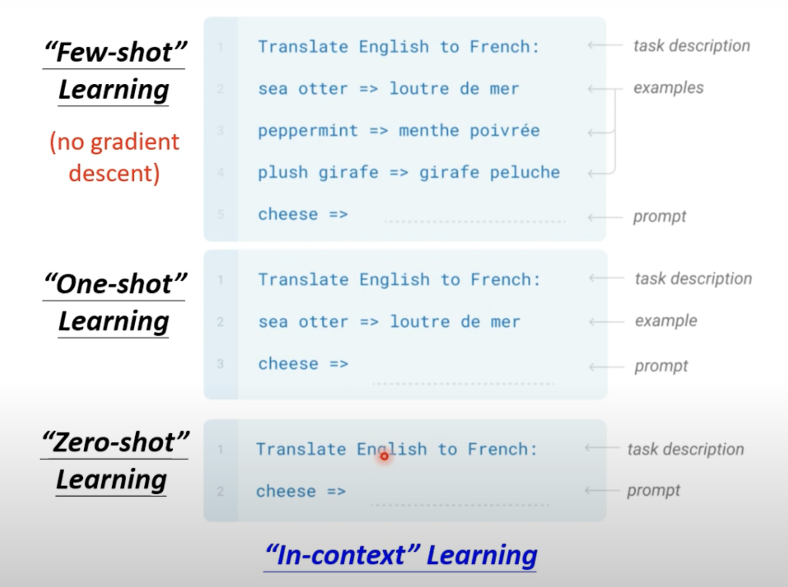
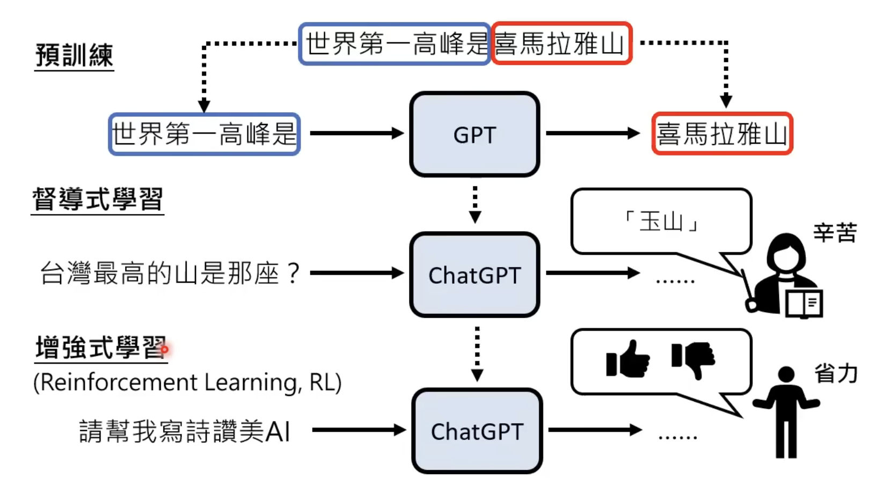

GPT

开门见山的简述：

BERT：完形填空

GPT：主要用于后续内容的预测

详细解释：

### **Few-shot learning 的关键特点**

1. **无需重新训练模型**：
   Few-shot learning依赖于预训练模型的强大通用知识和推理能力，直接通过输入的示例引导模型理解任务，而不是修改模型权重。
2. **上下文重要性**：
   示例的选择和顺序会影响模型的输出效果。提供清晰、准确的 few-shots 示例可以显著提升模型在特定任务上的表现。
3. **任务灵活性**：
   Few-shot learning适用于各种任务，包括分类、翻译、生成、排序等。

 

### **Few-shot learning 的优势**

1. **减少数据依赖**：无需大量标注数据即可完成任务。
2. **快速适应新任务**：通过几行提示语，就能解决许多不同类型的问题。
3. **适配动态需求**：用户可以即时定义任务，无需花时间训练模型。

### **In-context learning 的局限性**

1. **输入长度限制**：
   模型的上下文窗口有限，复杂任务可能需要的提示超过了模型的输入容量。
2. **对提示设计的敏感性**：
   提示的格式、语言和示例顺序对模型表现有很大影响。
3. **无法持久记忆**：
   模型的学习是临时的，仅针对当前输入，上下文结束后无法保留这些信息。
4. **泛化能力依赖预训练数据**：
   如果某些任务类型在预训练数据中较少或不存在，模型的表现可能不足。

但是GPT在第三代时正确率还是比较低的

ChatGPT

**pre-train**

提供老师资料并让他学习，机器的能力是有限的，它非常依赖资料量，而且资料也是有限的

**THEN**

从网络上爬去资料，只管讲资料前部分作为输入，后部分作为资料的输出的预测内容,再进行supervised-learning，成为今天的chatgpt,同时还加上RL。三步走

