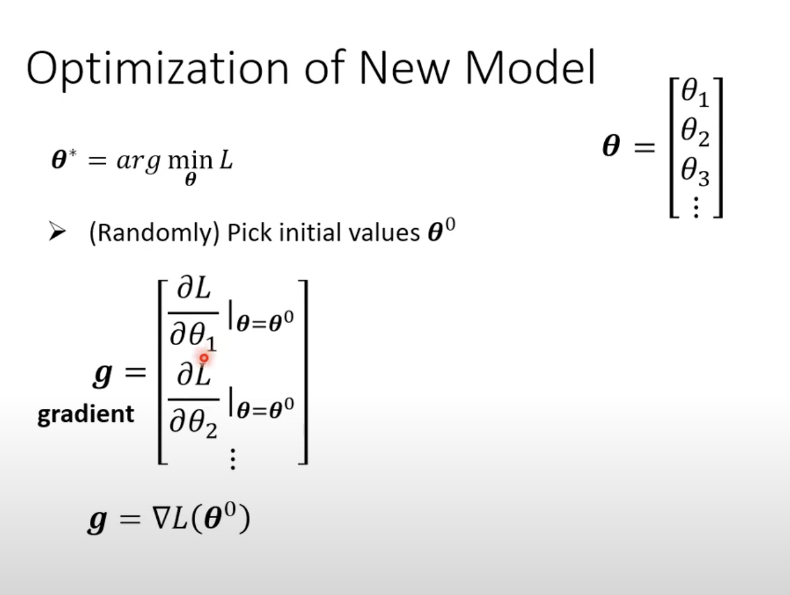

Introduction

video1

Different types of functions:

Regression: The function outputs a scalar

Classification:Given options,the function outputs the correct one

Structed Learning:create sth with structure(img,doc)

​	

How to ML:

1.write models(like: y=b+wx1)

  b:bias

  w:weight

X1,x2,x3......叫做  feature

2.Define Loss from training data

Loss : L(b,w)

用于评价参数（b,w)的好坏（how good）的函数

Label：正确的值

MAE： 取绝对值

MSE： 算差的平方

Error Surface:以bias和weight为x,y轴，以其对应的Loss组成的等高线图

3.Optimization

找最佳的参数

Gradient descend:

(a).先在Loss与某一参数建立的一维曲线上，取一随机点为初始点

(b).计算初始点L关于其的偏导

结果为+，减小参数大小

​       为-,增加参数大小

具体变化的大小与偏导相关，也与设定的learning rate相关

（机器学习自己设定的参数叫做hyperparameters）
$$
w_1 =w_0 - \eta * \frac{\partial a}{\partial c}
$$
局限：理论上：存在local minima的问题

​            在实际中是假命题

Attention:

以上三步为training

$$
y=b+\sum_{j=1}^{n} w_j*x_j
\\
y=b+wx_i
$$

叫做Linear models

Sigmoid function:

(S型函数)
$$
y=c*\frac{1}{1+e^{-(b+wx_1)}}
\\
y=c*sigmoid(b+wx_1)
$$

通过sigmoid function来表示反Z型的曲线（Hard Sigmoid）

又通过常数与sigmoid function来代表所需曲线

我们因此也可以进一步：
$$
y=b+\sum_{i}c_i*sigmoid(b_i+\sum_{j}w_{ij}x_j)
$$

(Tips: sigmoid的数目为hyperparameters)

同样也用gradient descend去更新参数

通常将参数分为多份(batch)，然后对每份batch算出其L，最后用所各个batch更新出来的L来更新L

(batch-size也是hyperparameter)

而把所有的batch都看过一次，叫做：1 epoch   (see all the batches once)

而每一次更新参数叫做一次update

所以在一次epoch中，共有(N/B 次 updates) (N 例子总数量)（B 每个batch中的例子数）

ReLU:

(Rectified Linear Unit)
$$
 c*max(0,b+wx_1)
$$

Sigmoid -> ReLU

$$
y=b+\sum_{i}{c_i}*sigmoid(b_i+\sum_{j}{w_{ij}x_j})
\\
y=b+\sum_{2i}{c_i}*max(0,b_i+\sum_{j}{w_{ij}x_j})
$$
在机器学习中，sigmoid与relu被称为：Activation Funcion

像Sigmoid与ReLU这样的被称为Neuron（神经元），而整个过程被称为

Neural Network

 Better on training data, worse on unseen data 

Called:  Overfitting

