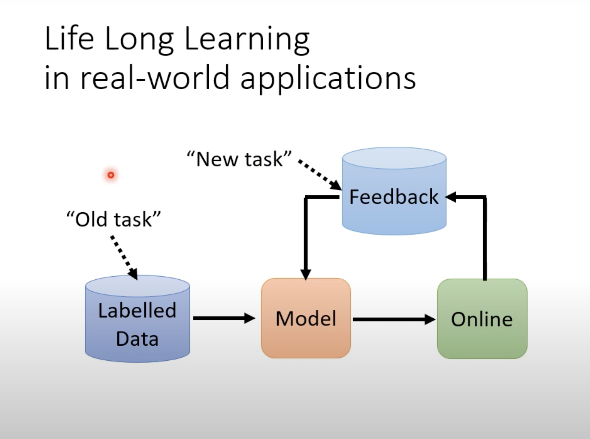
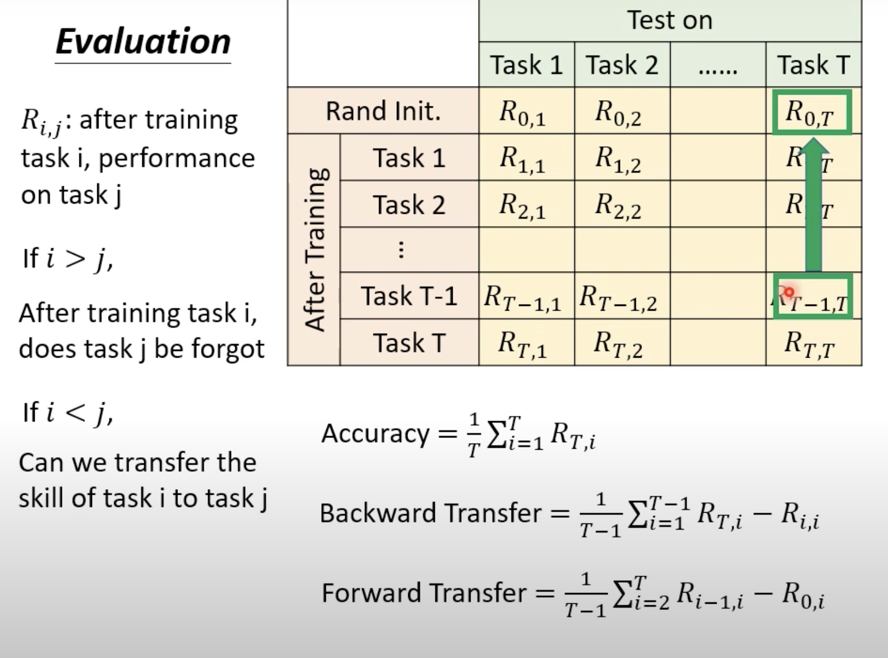
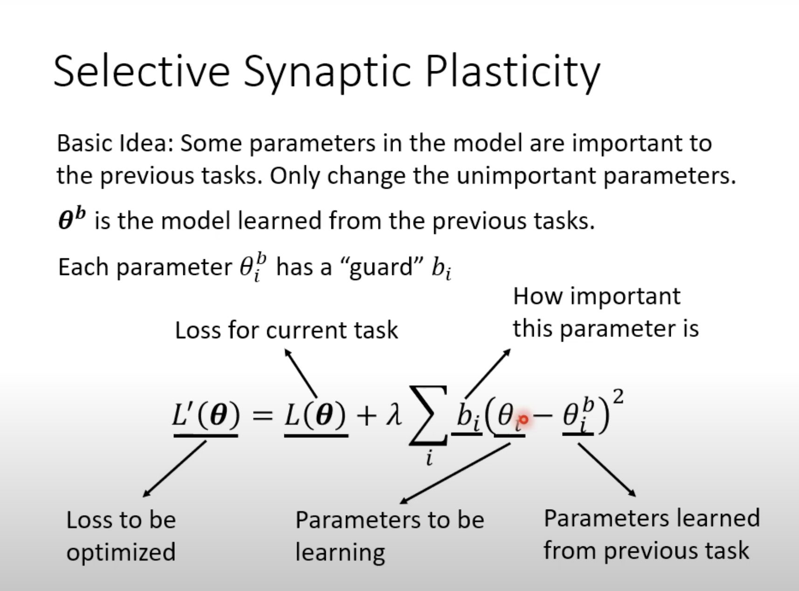

LLL

应用情景：

窘境：

如果一步一步地加入新资料，学习新东西。实际上会出现“遗忘”的情况。而且遗忘并非模型的能力不足以去学习这些，当train data全部合并后实际上也还是能有不错的效果

如何评估:

正确率在所有任务都train完后对每个任务进行测试，取正确率平均

backward transfer:在train完所有任务后看它在第i个任务上的正确率和刚开始train第i个任务时的正确率的差值，反映了遗忘程度

Forward transfer:在train第i个任务前作第i个任务的正确率，反映迁移学习

**解决**

三种解决方案,分别是：

Selective Synaptic Plasticity(Regularization-based Approach)

Additional Neural Resource Allocation

Memory Reply

（Synaptic：突触的; 与突触有关的; （染色体）接合的）

（Plasticity：粘性; 成形性; 柔软性; <生>可塑性（指生物体对环境的适应性）

**Selective Synaptic Plasticity**(Regularization-based Approach)

在train每个任务时都会给它分配一个参数guard来表示这个参数，对于这个任务而言的重要性

然后对于下一个任务，loss function变为在原有的基础上加上约束条件的loss function

约束条件即为尽可能地减少重要参数的变动，改变最好只改变那些无足轻重的参数

Intransigence:(不妥协的，不让步的) guard设大了，以至于新的任务很能去学习

怎么搞出guard参数？

异曲同工于explainable ML那边的方法，不过是改变权重参数，看loss的大小。全过程是人为手工的。（真让机器train出来那可就太explainable ML了)

方法很多，guard参数是可以算出来的

这些方法要么需要存储原来的data(GEM方法，通过原来的梯度做限制)，要么需要存原来的模型，guard参数。这些都是需要额外的空间去完成的

**Additional Neural Resource Allocation**

额外开辟新的参数，不改变就参数

显然：模型越来越大，空间要求越来越大

PackNet:反其道而行之，先给一个很大的空间，每个任务只给它限定的空间使用。

**Memory Reply**

类似于Multi-task Learning,不过不是存下原来的data,而是训练出一个模型，可以产生原先的data的generator(个人理解：感觉难度较高，因为一个generator同时产生多种类别的data，而且还有评估generator的大小，大了还不如前面的multi-task learning，然鹅，实际上“非常有效的！”)

**尾音**

任务的顺序不同，产生的效果有所不同，不同的顺序则有好坏之分

Curriculum Learning就是针对这种问题

