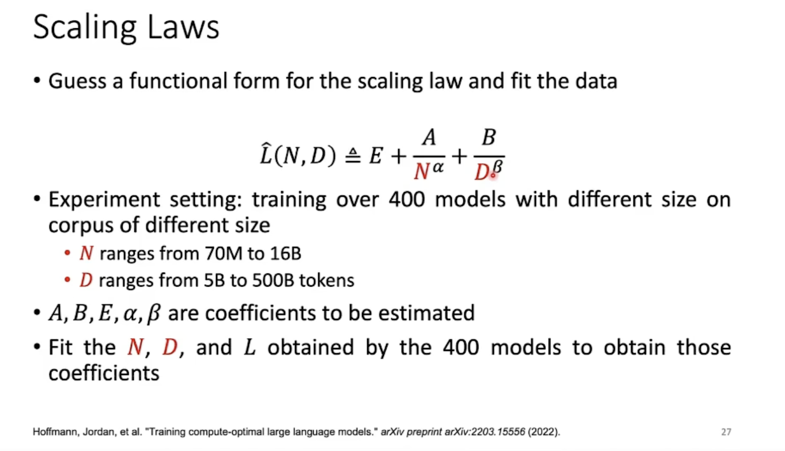
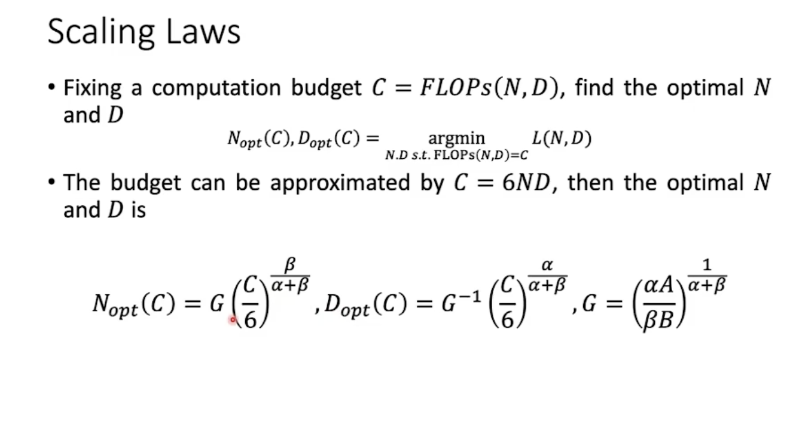
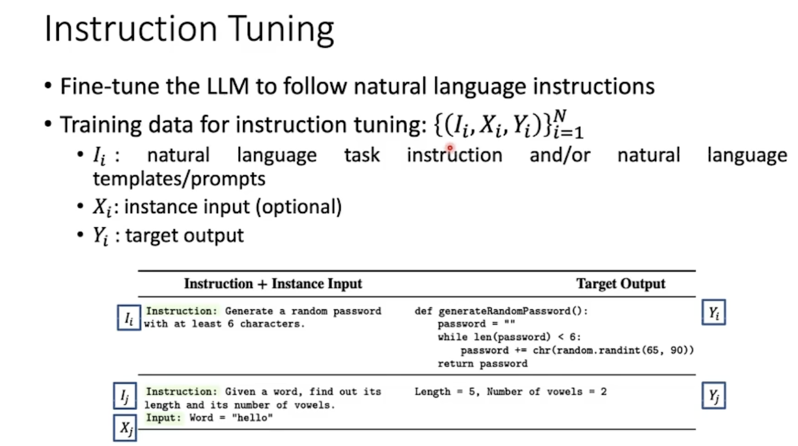
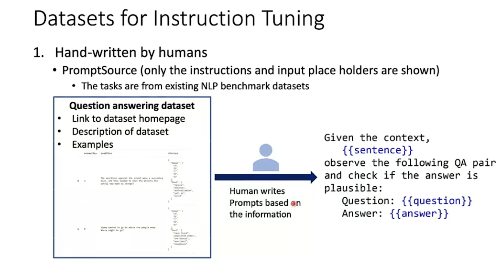
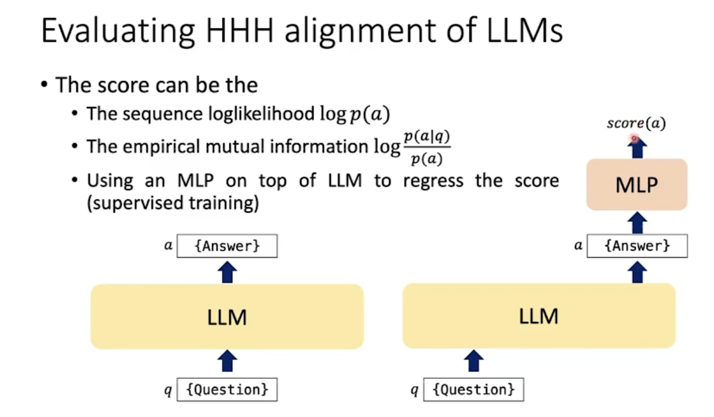

LLM

**Evaluating LLM**

**Dataset:**

GLUE:NLP

SuperGLUE：句子更长（token更多）

CommonsenseQA:正如其名，测试语言模型有没有常识

MMLU:处理多种大型任务的能力（高考数学，大学物理....)

Ethics:正如其名，测其道德

(Ethics:道德准则，行为准则; 伦理（学）（ ethic的名词复数 ）)

......还有很多......

Anyway,用这些丰富，庞大的dataset去测其各式各样的能力

**Train**

**Scaling laws**:LLM性能与参数数量，dataset大小与计算资源的定量关系

计算资源：诸如训练步数，FLOPs(每秒浮点运算次数)的指标

用以预测模型性能随着这些变量变化的变化

性能(P)与参数数量(N)，数据集大小(D)满足幂律关系

性能(P)与计算量大致上呈正相关关系

那末！如何去找到最合适的N与D呢？

（在固定计算预算时）

当我们希望将模型缩小时尽可能表现得和原来差不多:

$$k_{D}=(1-(k^{-\alpha}_{N}-1)\frac{AN_{opt}^{-\alpha}}{BD^{-\beta}_{opt}})$$

$$C_{overhead}=\frac{C_{new}-C}{C} *100$$

($$C_{new}$$​ 套上面6ND公式)

**Use**

**Prompting**

CoT(Chain-of-Thought):一种生成答案的过程，将推理分成几个过程。CoT 的效果在很大程度上依赖于提示的设计。如果提示不够合理或者示例不够多样化，模型可能无法很好地学习到有效的推理策略。

**Instruction Tuning**

在预训练的大型语言模型基础上，使用特定的指令数据对模型进行进一步的微调

数据人工造，但是任务更多样化，不局限于之前的那些NLP的任务

**Alignment**

Concept:3H：helpful, honest,harmless。

Honest:提供正确的资讯，清楚表明自己所知与不知

在pre-train阶段，有诸如big-bench这样的dataset使模型向3H方向learn

