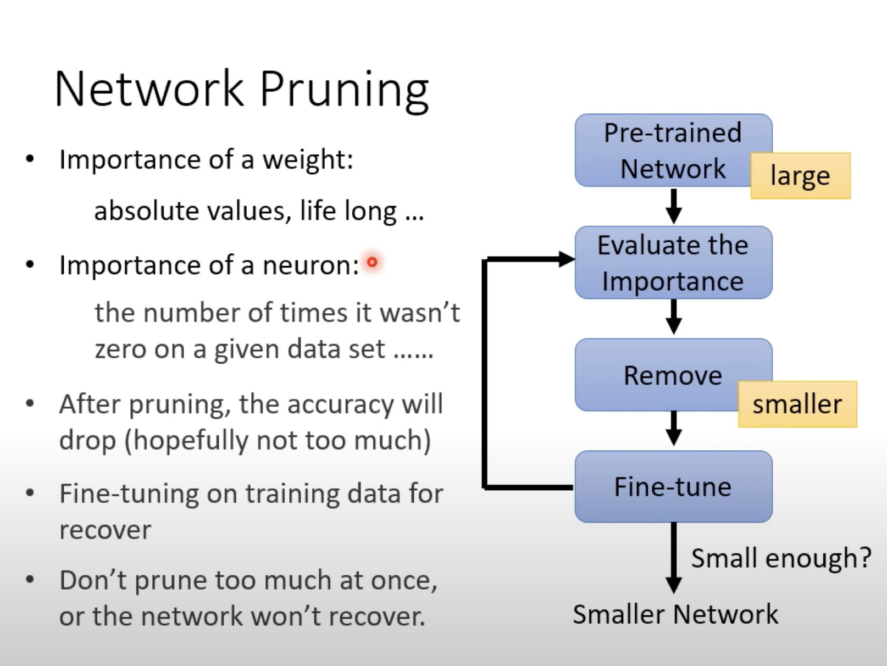
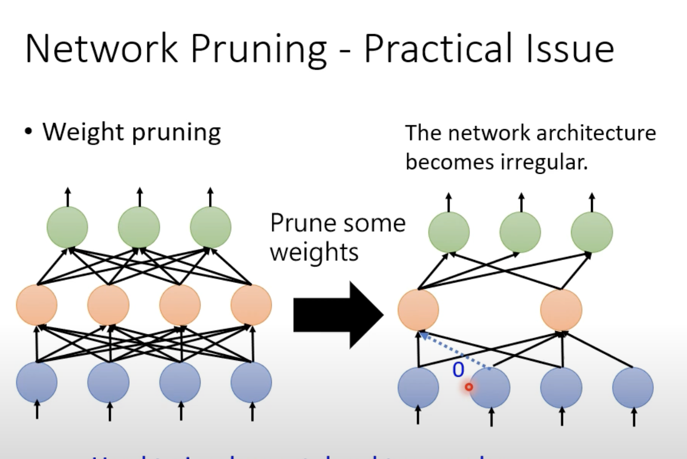
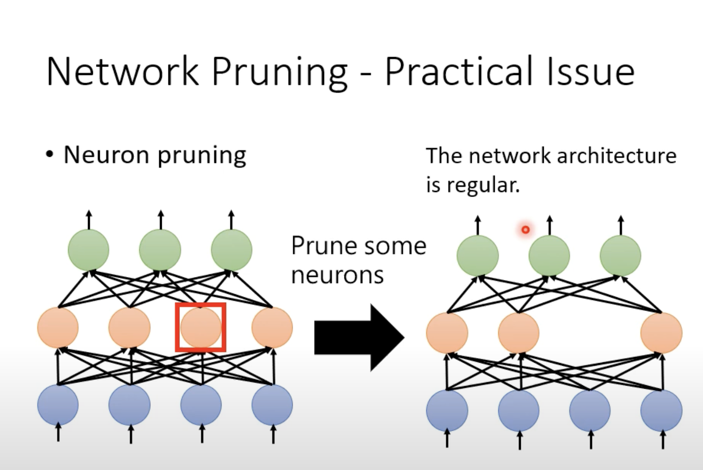
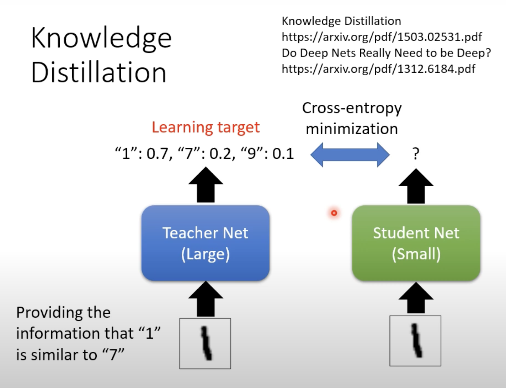
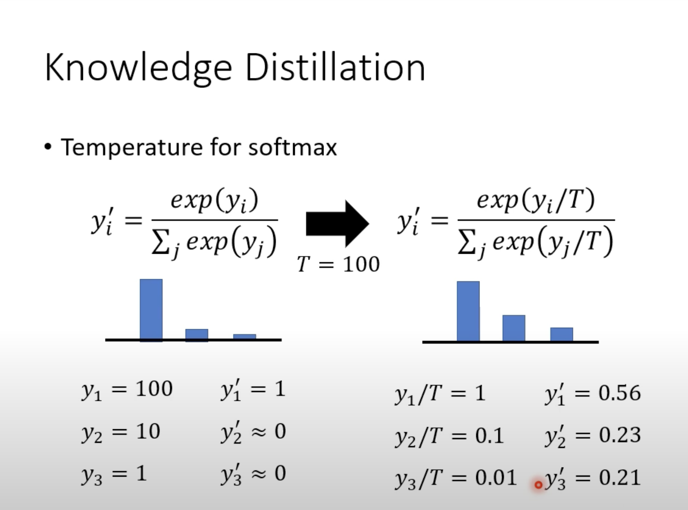
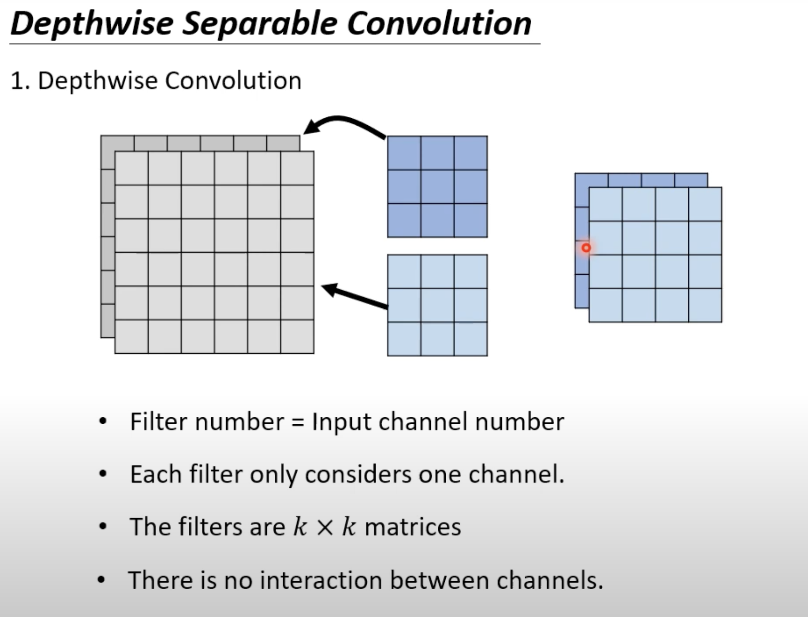
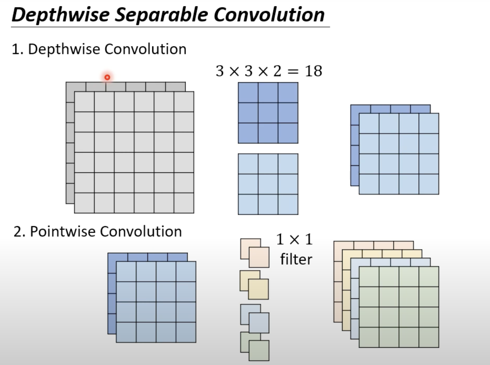

Network Compression

**Network Pruning**

(prune:删除，减少，修剪)

感觉像是具有针对性的drop-out(暂退法)

**weight pruning**

每次remove一小部分，不剪掉太多，再反过来微调时来促使net能够深挖，高效利用已有的neuron。

(仔细看就发现重点在：neuron对应不统一，有些neuron被2，3个neuron对应，有些是被1个对应——矩阵运算很不方便)

然而如果将有些weight给删减掉，我们不仅很难以去实施这个策略，由于layer变得不规则，我们也很难以用GPU去加速。

同时通过实际的数据也发现：在删减掉一部分的weight后，运算速度也是变慢了

Anyway，weight pruning这个方法不算很有效

**neuron pruning**

这个就容易实现一些。就是输入输出的size改一下

然后我们是**很难**通过直接先train一个小的network,再根据需要将它扩大

**Knowledge Distillation**

(distillation:（各种释义的）蒸馏（过程）; 蒸馏物; 蒸流; 升华)

Tips:Ensemble:(整体)，是指多个模型的输出取平均作为最终output

不是去优化label与小模型的输出，而是去优化大的模型的输出和小型模型的输出，即使大型的模型的输出并非完美。

而且这样的操作甚至可以达到：小型模型对于某些没有看过数据都有良好的预测结果

（原因也许是：老师给出的输出其实提供了更多“学习”的信息）

同时我们还会加入一个操作：

让teacher output更加平滑（往往加入更多的限制，效果更好）（比如说：小模型的第3层的输出学习大的模型的第12层，对中间的输出也进行学习....)

**Parameter Quantization**

(quantization:量子化; 数字化; 量化)

1.用更少的比特去存储一个值，相当于是编码了

2.weight clustering

将权重矩阵分区，不同区域只用一个值来代表（在train的时候同区域的数据要求想接近,以此达到群聚的效果）

3.huffman编码

4.binary weight，所有的weight只用01表示（事实上效果其实还行：减少模型的自由度，减轻overfitting的程度所带来的结果，maybe）

**总的来说就是想办法把压缩参数**

**Architecture Design**

**Depthwise Separable Convolution**

(separable:可分离的)

每个filter只看一个channel，不同于CNN，filter和channel两个完全独立的数字特征，depthwise convolution要求filter数目等于channel数目（注意！在标准的convolution中，一个filter卷完是得到channel个map的，再把他们合成一个，但是在这里没有——使得`num_filter==num_channel`）

局限：无法看到channel和channel之间的关系，只能看到单个channel局部间的关系

故考虑引入Pointwise Convolution

唯一的要求就是每个filter kernel的高宽为1，它只需考虑通道与通道之间的关系

只需略微作数学推导即可知道，从单纯的卷积换成depthwise convolution结合pointwise convolution，是减少了参数量的。

**Dynamic Computation**：自由调整需要的运算量，从深度（layer层数）和宽度（neuron个数）上调整

