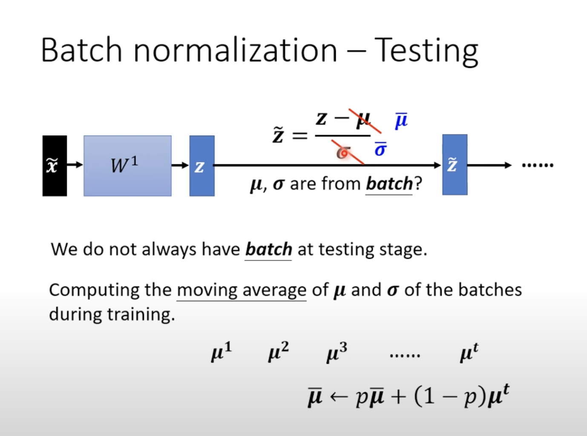

Normalization

**training tips**

Changing Landscape

由于learning rating是个定值，在遇到不同的dimensions时可能对于loss的变化相差较大（有的方向陡峭些，有的平缓些，但是我们移动的值是定的，导致traing时带来困难）

此时，我们需要让不同的dimension拥有同样的数值范围

Feature Normalization:
$$
\hat{x^{r}}=\frac{x_{i}^{r}-m_{i}}{\sigma}
$$

normalization后，gradient descent的loss会更收敛一点训练会更快一点

而将dataset分为多组batch，对每组batch进行feature normalization也称之为：batch normalization

Batch normalization -Testing

在testing中，可能数据量是慢慢增加的，我们不能等到batch到达一定数量后再进行更新，所以我们必须动态的更新mean与standard

