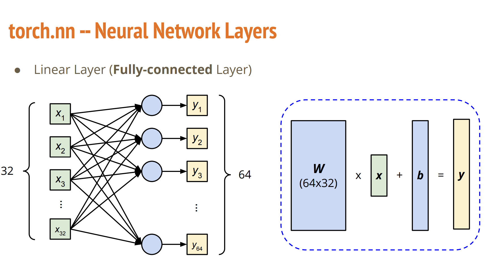
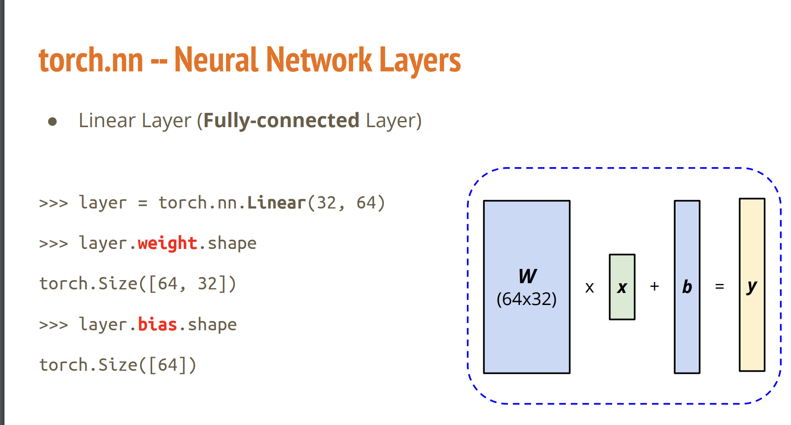

<font size=8>PyTorch Tutorial</font>


<font size=5>1.</font>Pytorch Documentation Explanation with torch.max


1.

`import torch `

`x=torch.randn(a,b)`

a与b分别为矩阵的H与W，具体数据则是随机

2.

`m,idx=torch.max(x,0)`  m为张量各个列（竖）的最大值组成的（1，W）张量，idx则是m在各个列最大值所取的下标，同样也是（1，W）张量

`m,idx=torch.max(x,1)`. m为张量各个行（横）的最大值组成的（1,H）张量，idx则是m在各个行最大值所取的下标，同样也是 (1,H) 张量

3.

`x=torch.ones([batch-size,channels,height,width])`  则是将该矩阵全是设置为1，值得注意的是：如果设置了batch-size或channels外面的方括号与不设置数量是不一样的，如果写-1，则是在已设置参数基础上进行调整性设置

同理的：

`x=torch.zeros([batch-size,channels,height,width]).` 全设置为0


4.

（openai,香！！！）

在 PyTorch 中，`squeeze` 函数用于移除张量中的大小为1的维度。具体来说，`x.squeeze(dim)` 会移除张量 `x` 在指定维度 `dim` 上的所有大小为1的维度。

```
import torch
x = torch.ones([1, 1, 3, 4], dtype=torch.float32)
x = x.squeeze(0)
```

#### 初始张量 `x`

初始张量 `x` 的形状是 `[1, 1, 3, 4]`，表示它是一个四维张量，其中：

- 第一维的大小是1
- 第二维的大小是1
- 第三维的大小是3
- 第四维的大小是4

#### `x = x.squeeze(0)`

当我们使用 `x.squeeze(0)` 时，它会移除第0维（第一维）上的大小为1的维度。因此，`x` 的形状会从 `[1, 1, 3, 4]` 变为 `[1, 3, 4]`。

### 如果换成其他数字

如果我们将 `squeeze` 函数的参数换成其他数字，例如 `squeeze(1)` 或 `squeeze(2)`，效果如下：

1. `x.squeeze(1)`：
   - 这会移除第1维（第二维）上的大小为1的维度。
   - 结果：形状从 `[1, 1, 3, 4]` 变为 `[1, 3, 4]`。
2. `x.squeeze(2)`：
   - 第2维（第三维）的大小为3，不是1，所以不会移除任何维度。
   - 结果：形状保持 `[1, 1, 3, 4]` 不变。
3. `x.squeeze(3)`：
   - 第3维（第四维）的大小为4，不是1，所以不会移除任何维度。
   - 结果：形状保持 `[1, 1, 3, 4]` 不变。

### 总结

- `squeeze(0)`：移除第0维（第一维）上的大小为1的维度，结果形状变为 `[1, 3, 4]`。
- `squeeze(1)`：移除第1维（第二维）上的大小为1的维度，结果形状变为 `[1, 3, 4]`。
- `squeeze(2)` 和 `squeeze(3)`：因为这两维的大小不是1，所以形状不变，仍为 `[1, 1, 3, 4]`。

`squeeze` 函数对于简化张量形状很有用，特别是在需要将多余的单个维度移除的情况下。


5.

**unsqueeze:**

x.unsqueezed(y):在x的第（y+1)维拓一个纬度，且该数值为1

`x=torch.zeros([2,3])`

`x=unsqueeze(1)`

`x.shape==torch.Size([2,1,3])`


6.

**transpose:**

`x=x.transpose(dimension1,dimension2)`

将dimension1和dimension2转置


7.

**cat**

`x=torch.ones([2,1,3])`

`y=torch.ones([2,3,3])`

`z=torch.ones([2,2,3])`

`w=torch.cat([x,y,z], dim=1)`

此时w的shape为：

[2,6,3]

cat可以达到张量之间拼接的作用，第一个参数为列表，将需要拼接的张量放进去，第二个参数dim指定某个维度进行拼接(该维度发生改变，其他不变)


8.**Gradinet**

先看代码：

```
import torch
x=torch.tensor([[1,0],
                    [-1,1]],dtype=torch.float,requires_grad=True)
y=x
print(y.grad_fn)
z=x.pow(2).sum()
z.backward()
print(x.grad)
```

输出为

`None
tensor([[ 2.,  0.],
        [-2.,  2.]])`

首先每个张量中有一个属性，叫做grad_fn,也就是一种记录该张量来源的属性。（具体看openai解释）


在 PyTorch 中，`grad_fn` 是一个张量的属性，表示生成这个张量的函数。如果一个张量是通过对其他张量进行操作得到的，那么这个属性会记录用于生成该张量的函数。这是 PyTorch 的自动求导机制的一部分。

### 详细解释

1. **自动求导机制**： PyTorch 通过记录操作的计算图来实现自动求导。每个张量都会记录它是通过哪个操作（函数）生成的，并且可以追溯到其父张量。这个计算图可以用来进行反向传播（backpropagation），以计算梯度。
2. **grad_fn 属性**：
   - 对于通过某些操作（比如加法、乘法等）生成的张量，`grad_fn` 会是一个指向表示该操作的函数对象。
   - 如果一个张量是直接创建的，比如通过 `torch.tensor()`，且没有依赖于其他张量，那么 `grad_fn` 将是 `None`。

### 示例

以下是一个简单的例子来说明 `grad_fn` 的作用：

```
python
复制代码
import torch

# 创建一个张量 x，并设置 requires_grad=True，以便追踪其计算历史
x = torch.tensor([1.0, 2.0, 3.0], requires_grad=True)

# 对 x 进行操作生成新的张量 y
y = x + 2

# 对 y 进行进一步操作生成新的张量 z
z = y * y * 3

# 计算 z 的均值
out = z.mean()

# 查看每个张量的 grad_fn
print("x.grad_fn:", x.grad_fn)  # x 是直接创建的张量，grad_fn 为 None
print("y.grad_fn:", y.grad_fn)  # y 是通过加法操作生成的，grad_fn 为 <AddBackward0>
print("z.grad_fn:", z.grad_fn)  # z 是通过乘法操作生成的，grad_fn 为 <MulBackward0>
print("out.grad_fn:", out.grad_fn)  # out 是通过均值操作生成的，grad_fn 为 <MeanBackward0>
```

输出：

```
plaintext
复制代码
x.grad_fn: None
y.grad_fn: <AddBackward0>
z.grad_fn: <MulBackward0>
out.grad_fn: <MeanBackward0>
```

### 解读

- `x.grad_fn` 是 `None`，因为 `x` 是直接创建的张量，没有依赖于其他张量。
- `y.grad_fn` 是 `<AddBackward0>`，表示 `y` 是通过对 `x` 进行加法操作生成的。
- `z.grad_fn` 是 `<MulBackward0>`，表示 `z` 是通过对 `y` 进行乘法操作生成的。
- `out.grad_fn` 是 `<MeanBackward0>`，表示 `out` 是通过对 `z` 进行均值操作生成的。

### 作用

- `grad_fn` 属性帮助构建计算图，这对于实现自动求导非常重要。
- 在进行反向传播时，PyTorch 会使用这个计算图，从 `out` 开始，通过 `grad_fn` 追溯到所有的父节点（例如 `z`、`y`、`x`），并计算每个张量的梯度。

通过 `grad_fn`，PyTorch 能够记录张量之间的计算关系，从而在反向传播时有效地计算梯度。这是深度学习模型训练过程中必不可少的一部分。


而y是直接由x赋值的，x与y都属于直接生成，为grad_fn为None

而backward方法可以通过grad_fn来得知该张量是从哪里得来，如何得来，以此来求偏导并更新源头的grad

**值得注意的是**

如果对于同一个tensor，有不同的变量进行反向传播，那么其实则是各个偏导后的叠加

**example**

```
import torch
x=torch.tensor([[1,0],
                    [-1,1]],dtype=torch.float,requires_grad=True)

z=x.pow(2).sum()
z.backward()
y=(2*x).sum()
y.backward()
w=x.pow(2).sum()
w.backward()
print(x.grad)
```

z,w反向传播后得到的是[[2,0],

[-2,2]]

y反向传播得到的是[[2,2],

[2,2]]

可以打断点发现其实是单独是以上的叠加：

tensor([[ 6.,  2.],
        [-2.,  6.]])


9.
线性层的in_features需要与输入的tensor的最后一维相等





值得注意的是！weight的权重矩阵形状是：(out_features,in_features)

​                           bias的权重矩阵的形状是:(out_features)

