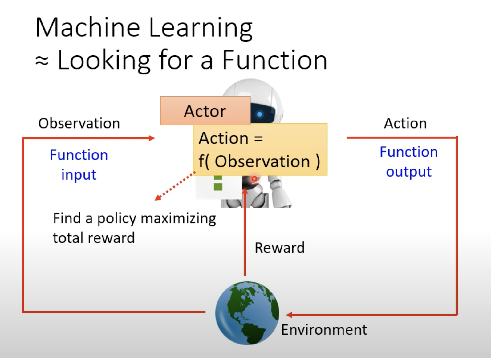
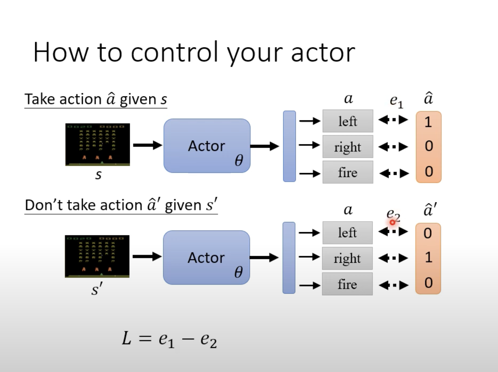
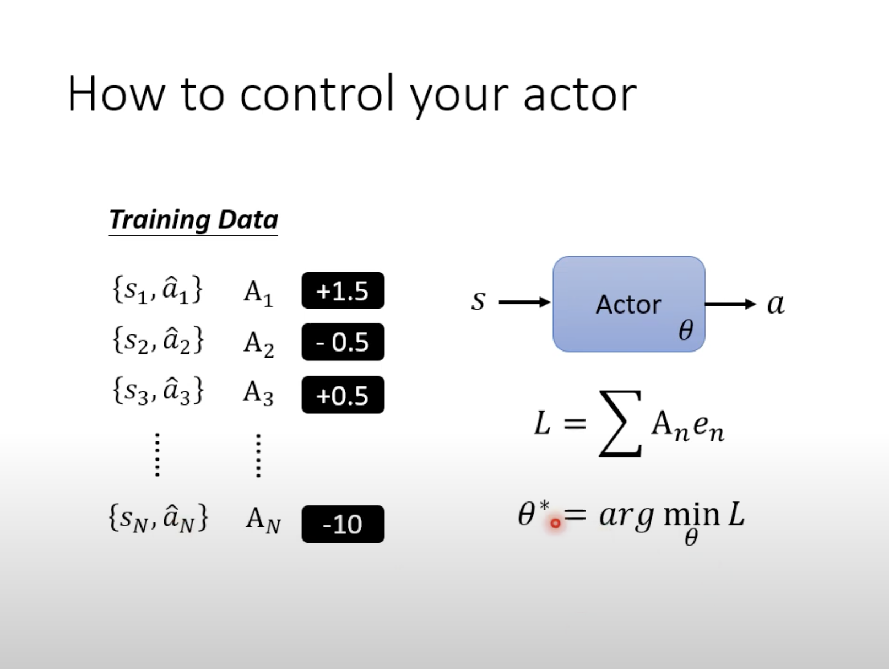
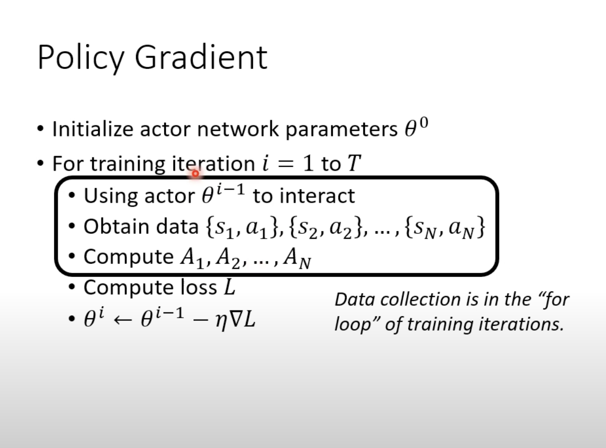
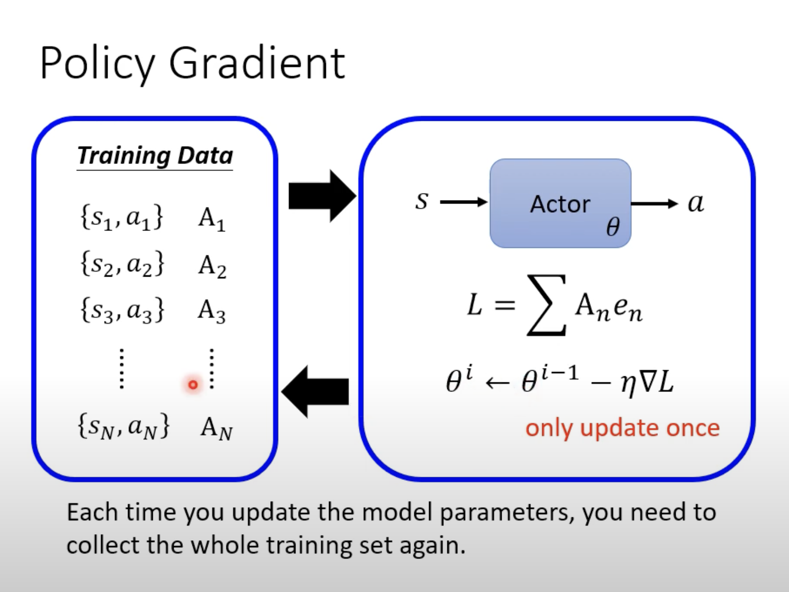

RL(1)

Reinforcement Learning

**需要场景：**

标注困难，甚至我们自身也无法给出一个精确的答案

What is RL?

**Function:**

有点像算法中dp

**define loss function:**

reward:做出反馈后立即给的奖励

return：整场所有reward的总和

将负的total reward作为loss

**Optimization:**

难点：

environment不是network,更像一个我们无法对之访问的黑盒。而且给出的观测值具有一定的随机性

同时做出的action也是随机取样的。

大致上可以将优化方法归结为：

**基于值的优化**：优化价值函数以指导智能体决策。

**基于策略的优化**：直接优化智能体的策略。（直接优化智能体的策略 $$\pi(a|s)$$，即智能体在每个状态下选择动作的概率分布。）

**基于模型的优化**：利用环境模型进行规划和决策。（假设环境的状态转移和奖励函数是已知或可以学习的，智能体可以通过环境模型进行预测，从而优化策略。）

**Policy gradient:**

然后取更新$$\theta$$来使L最小,近似于训练一个classifier

给定每个pair:情景，以及行为，同时对应对这个行为执行的期望。正值越大越期望执行，越小越期望避免

困惑，奇怪点:

$$e_{n}$$如果要算出来，按照他的定义，是需要一个label和实际action之间作cross-entrophy得到的，但是我们的train-data就是在与环境交互的过程中得到的，没有对于某个观测值预设好的一个label的概率分布（标准答案）

通过ai,发现ai对于L的定义是：

$$L=-\sum_{i=1}^{T}log \pi(a_{t}|s_{t})G_{t}$$  而这个$$\pi(a_{t}|s_{t})$$是$$s_{t}$$状态下采取$$a_{t}$$的概率

这样来看，这个定义貌似合理很多

**如何整出这个pair与A:**

复习后的Brain CPU Output:不同于那种train data是输入，和标准答案，给输入，那输出和标准答案算loss，然后调整net的权重的过程。这里面没有预先的train data，有的就是环境，让机器到环境去自己探索。拿到观察值，做出action，然后一个episode跑完，对每个pair给出A（打昏数），然后以此算出loss，然后再调整net中的权重，渐渐地行为逼近最优解。

version1:

$$A_{i}=G_{i}$$

$$G_{i}=\sum_{n=t}^{N}r_{n}$$

即从执行action开始往后的所有reward的总和来评价action的好坏

缺点：后面有些reward不是单纯由该action所主要决定的，出现强加因果的嫌疑

version2:

在后面所有的reward都乘以一个系数$$\gamma$$,到后面$$\gamma$$的幂越来越大，也在削减后面的影响

version3:

好坏是相对的，如果reward全是正数则会无脑鼓励，所以需要normaliztion这个G

(减去一个baseline使得G有正有负)

**流程：**

初始化一个参数后，然后开始跑T个episode，每个episode都根据reward给单个action打分，将根据所有的A计算出总的L，然后更新$$\theta$$

值得注意的是每个episode只能更新一次$$\theta$$​

也就是说不依赖历史数据，只是用当前轮次的交互数据，它可以避免数据分布于当前策略不匹配的问题（在环境快速变化的场景，过时的数据对当前的优化有害）

这种方法属于**On-policy**方法，同时也存在着**off-policy**方法，可以利用到历史数据(**Proximal Policy Optimization:PPO**-更常用)

（proximal：最接近的）

（能够辨识到actot to train与actor to interact之间的不同)

