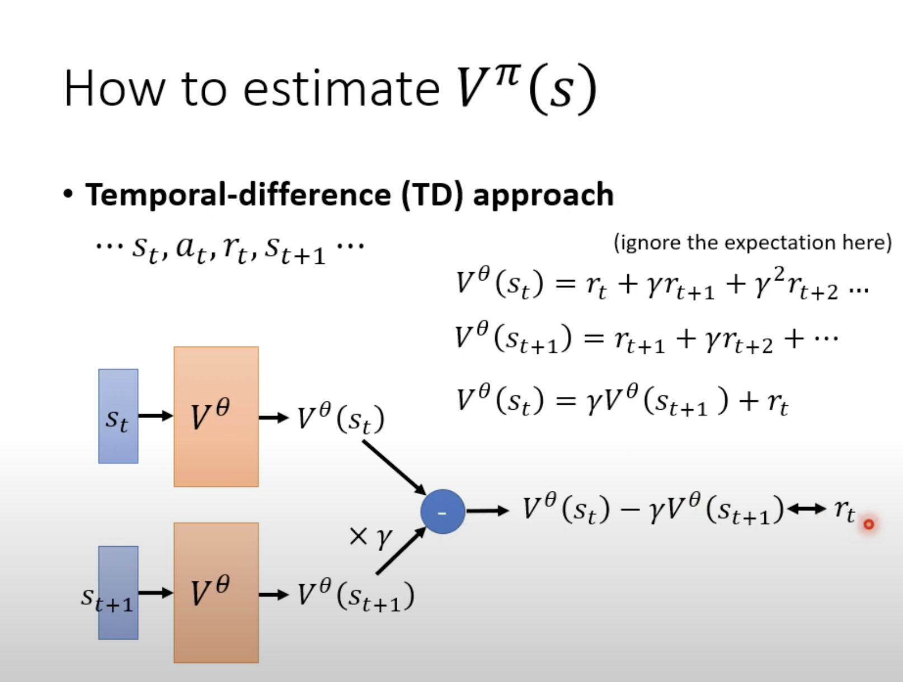
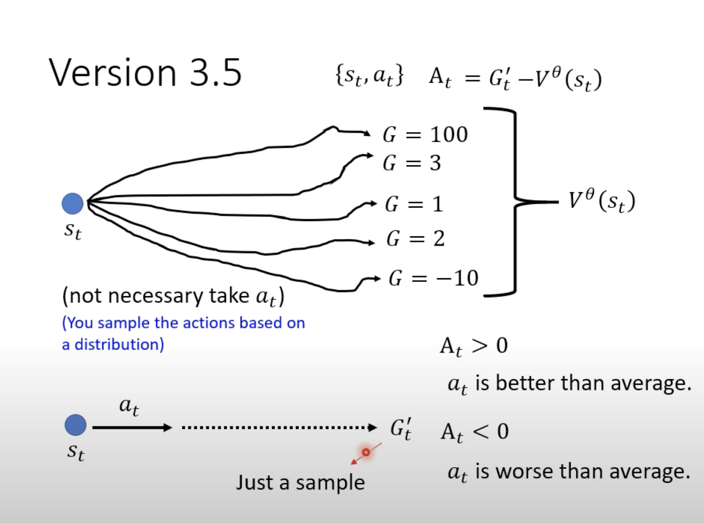
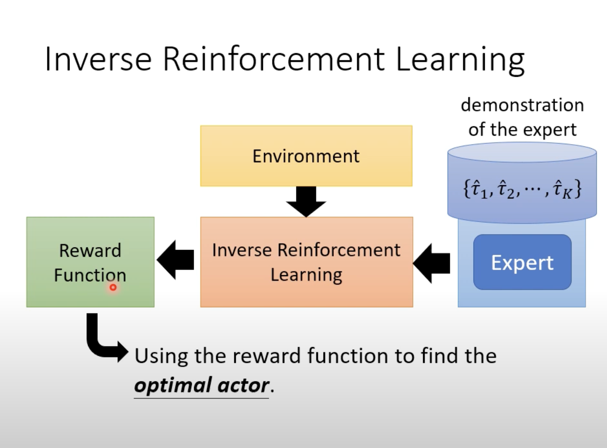
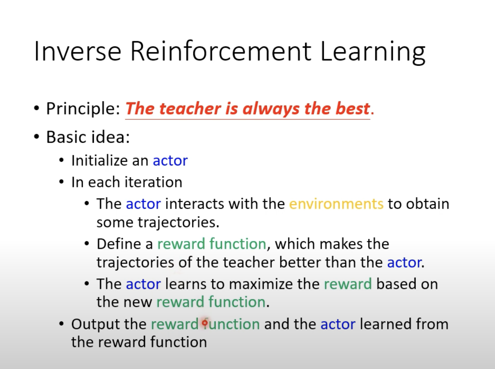

RL(2)

**Actor-Critic**

critic:给定一个actor的 $$\theta$$，去衡量在观测到s后的行为好坏情况

用value function来衡量：

$$V^{\theta}(s)$$在给定s后的 $$G_{i}=r_{i}+\gamma*r_{i+1}+......$$ 的期望值.

如何获得这个value function:

蒙特卡罗(Monte-Carlo-MC)

输入观测值，然它预测，然后优化：$$loss(V^{\theta}(s_{a}),G^{'}_{a})$$

反复如此

Temporal-different(TD)

有时候获取所有的reward代价太大，所以我们一下的关系，只利用眼前的reward来进行优化

**书接上文的normalization**

将cumulate reward减去的bias？用$$V^{\theta} (s)$$​

回想一下概念：我们在看到观测值时采取的action是随机的。也就是说对一个s它有可能有多个action后所对应的G

我们之前做的value function又是在观测到观测值，没有得到action下的，做的期望值。不正是可以拟合上面各种情况下的G的期望吗？

我们将实际最终产生的G减去这个value funtion,就是在考虑到随机取样下种种可能时的与平均水平的差距

最后为了让数值更稳定（$$G^{'}_{t}-V^{\theta} (s_{t})$$),前者是单个值减去平均，将单个值换成：

$$A_{t}=r_{t}+V^{\theta}(s_{t+1})-V^{\theta} (s_{t})$$

这也称为Advantage Actor-Critic

**Reward shaping**

当reward较为稀疏，可能最后给一个reward，其他情况下全是0

使用reward shaping,在一些情况下给定额外的reward来引导

同时还引入curiosity，对于有意义的内容给予reward

**No reward**

即使我们加入一部分reward，但是我们手动加入的reward是具有局限性的，很肯能会带来符合规则的奇怪操作。

Imitation Learning?

虽然通过人类的部分数据给定机器，类似于监督学习，但是会有一些问题：

有些学的多余，有些没学到

多余：有些只是个人的习惯，一些无意义的行为

没学到：面对人类的自身收集的数据集，很可能情况较为局限。

​		比如将大象装进冰箱，如果实际情境中大象在冰箱上面

​		比如开车，汽车没过拐弯

这些可能数据中未出现的情况，那么机器则不知道如何去应对

Inverse RL

通过操作反推reward，再去learn

步骤：

