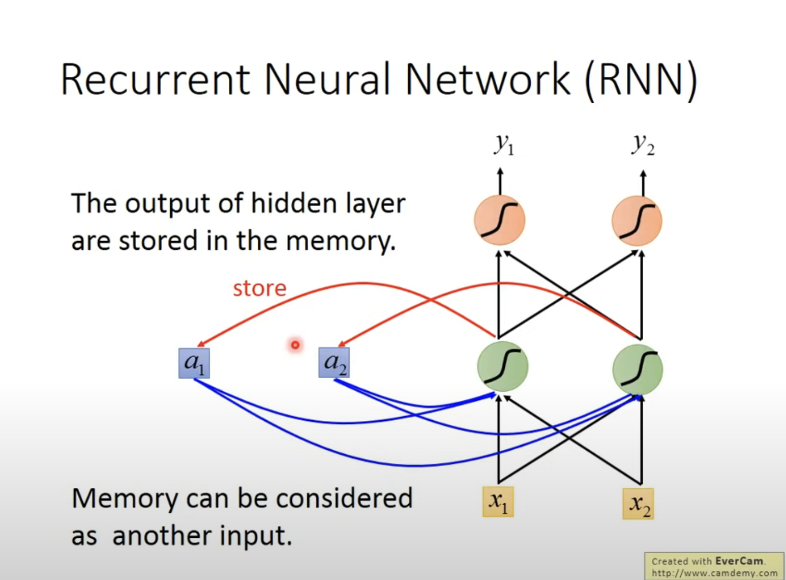
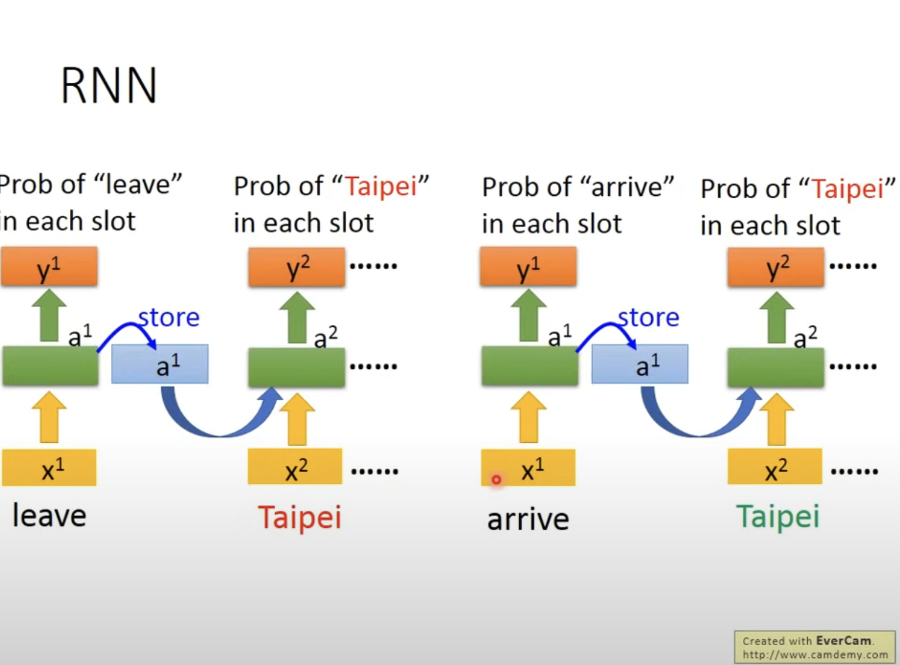
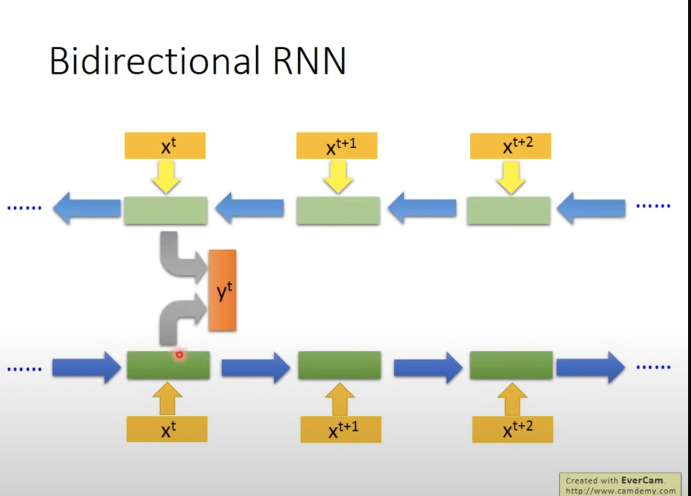
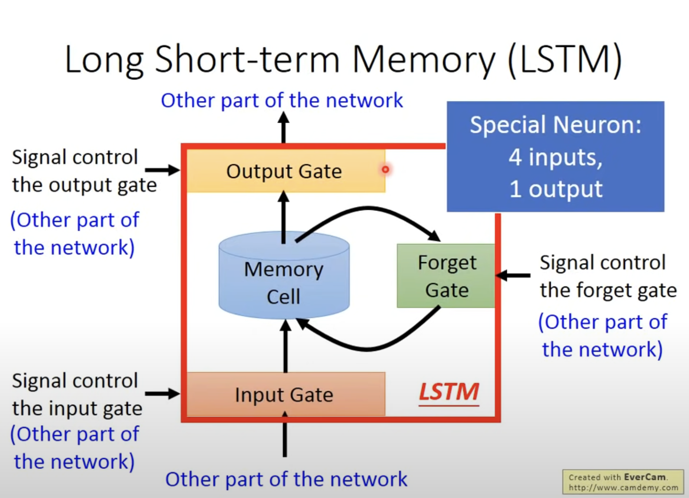
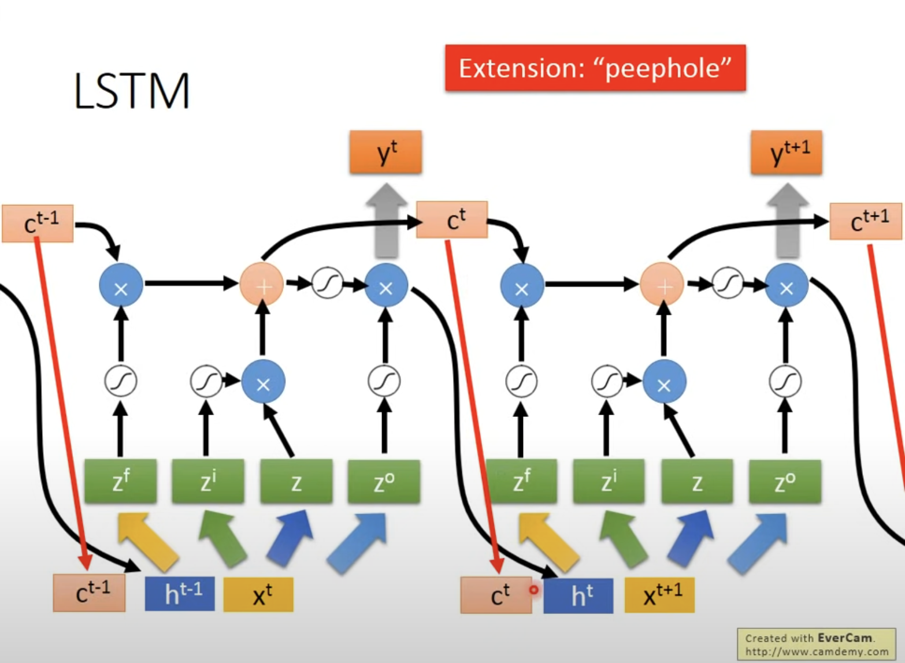
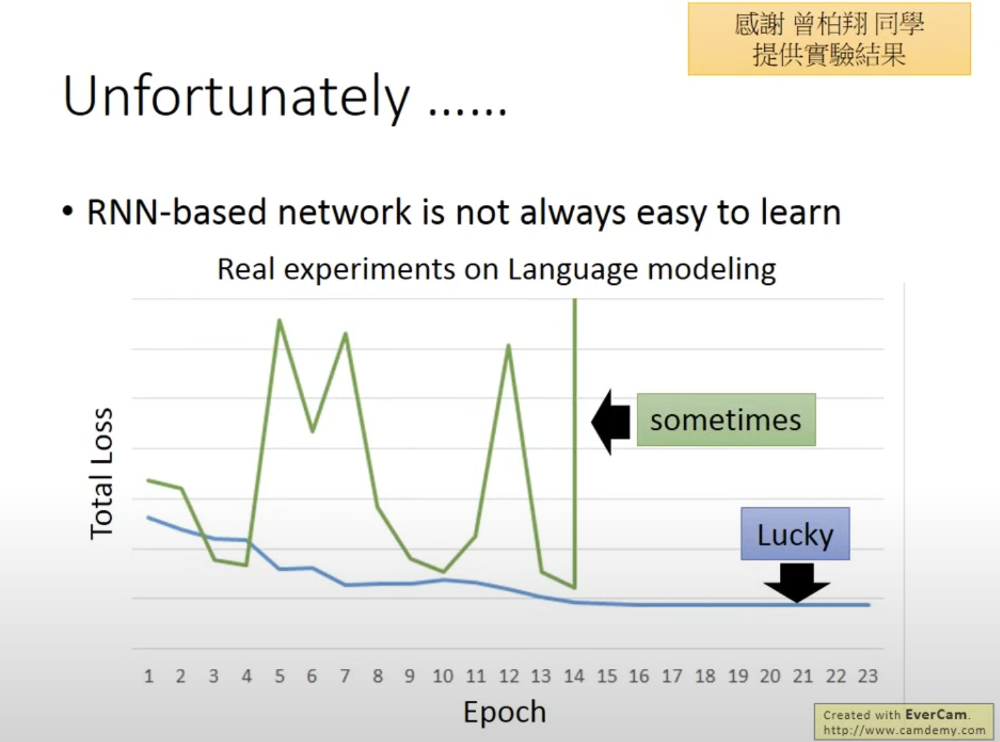
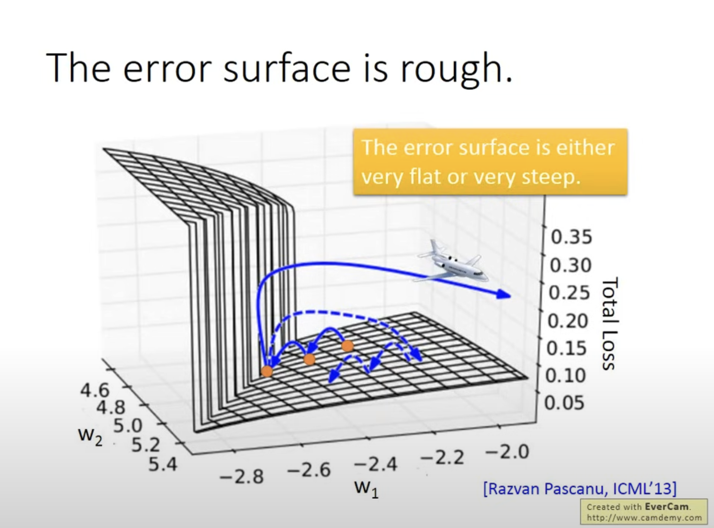
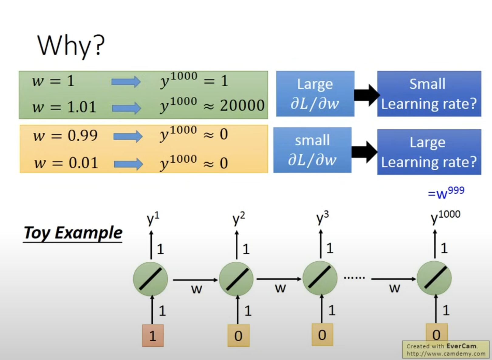

RNN

**RNN**：Recurrent Neural Network

同时也不一定就是
$$
y_i=P(x_i|h_i)
$$
隐藏层可以多层

同时也可以不一定通过隐藏值h来作为前提，通常将上一次的输出作为前提，因为这样更好收敛，更好train

同时RNN也可以是双向的（两条单方向的RNN），这样其实就考虑到了前后

**LSTM**

**LSTM:Long Short -Term Memory**

但是RNN很难train

可能如绿色的曲线那样，在某点剧烈抖动，然后某点NaN,segmentation fault

由于error surface 非常陡峭崎岖且不一致，有的局部grad较大，那么此时lr调至较大没问题，可以使之移动，但是如果局部平坦，那么可能直接回超过相关范围（飞出去）

但是如果lr不够大，那么面对grad较大的“峭壁“时，我们无法使点移动

解决方法：Clipping

梯度剪裁是一种控制梯度幅度的技术。具体操作是**在计算梯度后，将其限制在预设的阈值之内**，避免梯度过大。常见的剪裁方法包括：

- **全局梯度范数剪裁（Global Norm Clipping）：** 如果梯度的范数超过设定的阈值，就将梯度缩放到该阈值。这可以统一控制不同参数的梯度。
- **按元素剪裁（Element-wise Clipping）：** 针对每个梯度元素，逐个检查并将超出阈值的部分截断。

**缘故**

**"由于有time sequence, 同样的weight,在不同的时间点会被反复使用"**

由于不断使用之前的w，当w发生较小的变化时，会带来巨大的偏差，然而我们无法通过调整lr来改善，应为可能在局部，由极大变到极小

同时还可以利用LSTM来减缓问题（只能解决gradient vanish,不能解决gradient explode）

为什么可以避免gradient vanish?

由于RNN每次输入都会将原来的输入覆盖掉，但是LSTM会在原来memory的基础上进行运算，除非打开forget gate,不然memory中的信息会得以一直保存

AI Answer:

传统RNN的隐藏状态（hidden state）在每个时间步中会逐步更新，将前一个时间步的信息传递到下一个时间步。然而，由于RNN结构中梯度在时间步之间的链式传播，在长序列中，梯度值很容易在层与层之间逐渐减小，导致**梯度消失**。这种情况会使得较早时间步的信息对后期预测几乎没有影响。

