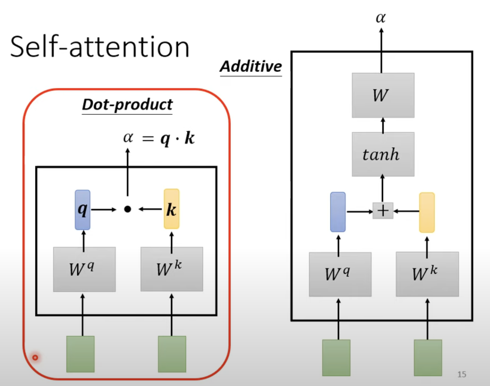
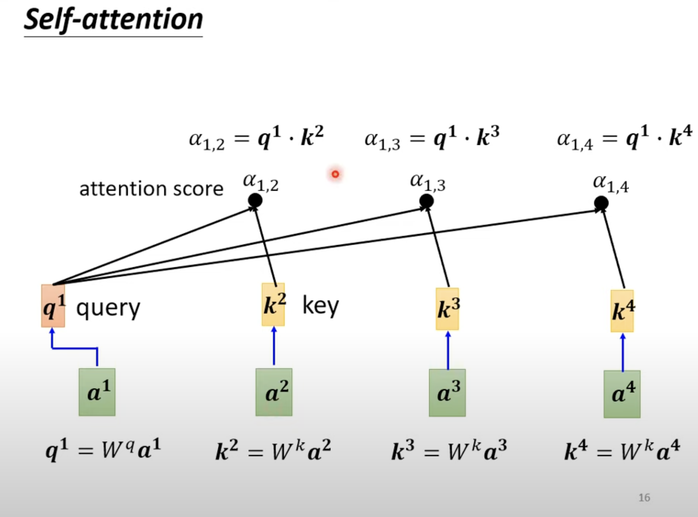
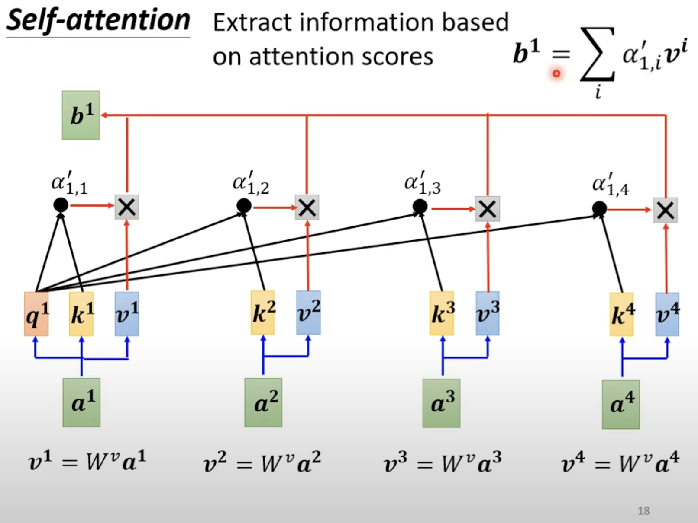

Self Attention

**导入：**

对于先前的问题，我们都是预先设定好input的大小是一样的,而且input就是一个向量，输出则是一个scalar或者class

然后有些时候，我们的输出的length是无法确定的

**Sequence Labeling**

通过self attention来实现“灵活的window"

Self attention：

1). 先对于每个输入的向量，找这些所有输出中和他相关的，并计算其相关联的程度

(具体方法有dot-product,additive,后面主要介绍dot-product）:

计算完关联性后，我们会对每个alpha进行一个soft-max，或者ReLU

然后，我们会进行抽取信息的操作：

如果a1和某个对象关联程度很大，比如a2，那么b1的结果和v2将比较接近

**Multi-head Self-attention**

Different types of relevance

有不同种的相关性，我们需要更多的Wquery，也因此有不止一个的k

所以加入更多的head以满足多种类的相关性

**Positional Encoding**

但是以上的操作存在一个问题，就是没有将各个输入之间的位置信息参杂进去

(No position information in self-attention)

因此采用positional encoding的方式：

每个位置都有它所对应的向量e，然后加在a中

但是e具体加在哪里，一般：

Hand-crafted

Learned from data

CNN可以看成简化版的self-attention，self-attention就如同自动学出receptive-field

(CNN是self-attention的特例)

Self-attention在graph上的应用叫做GNN

