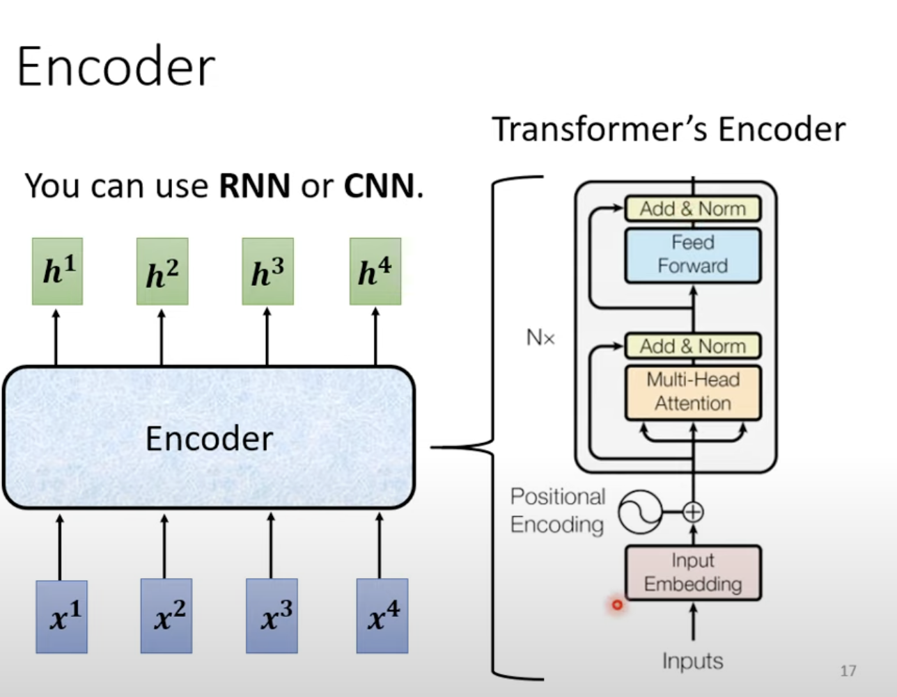
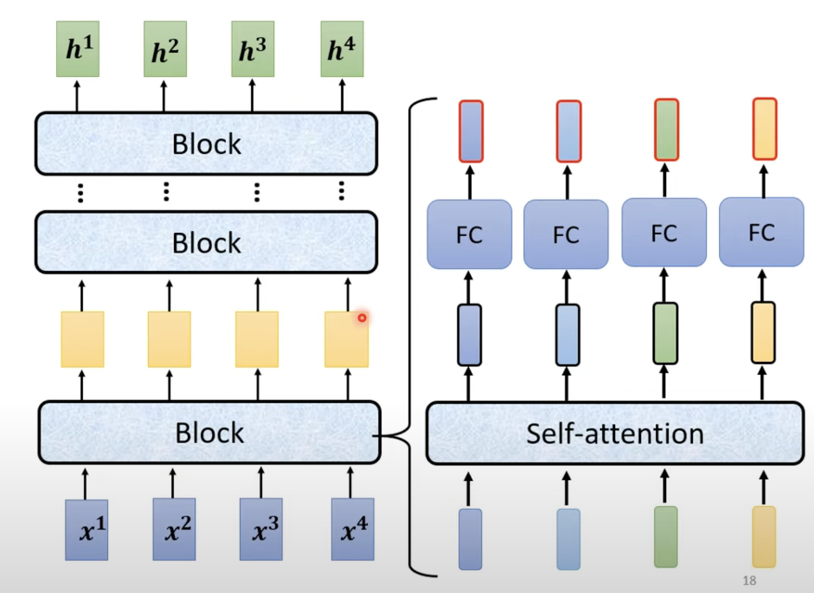
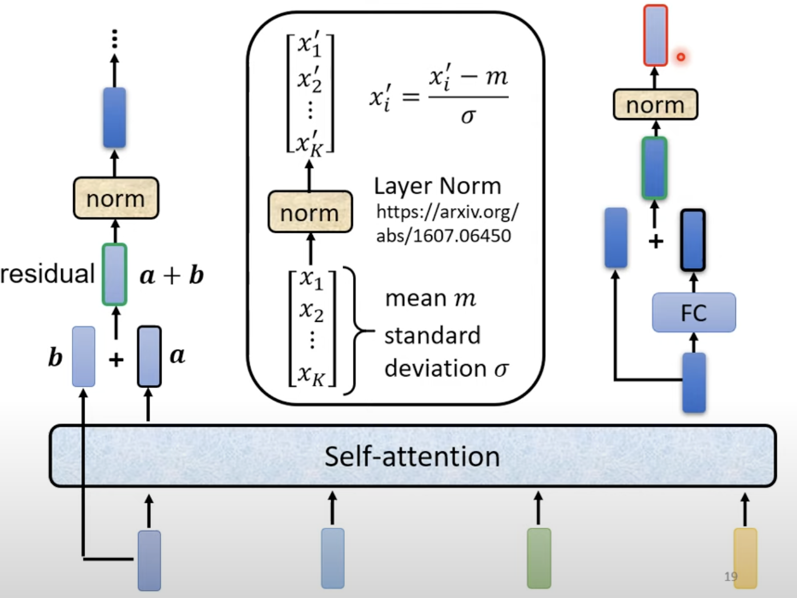
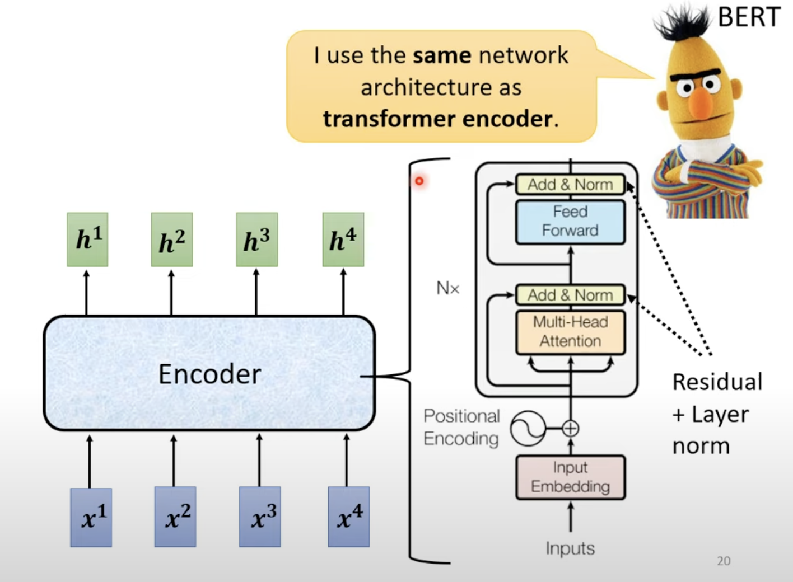
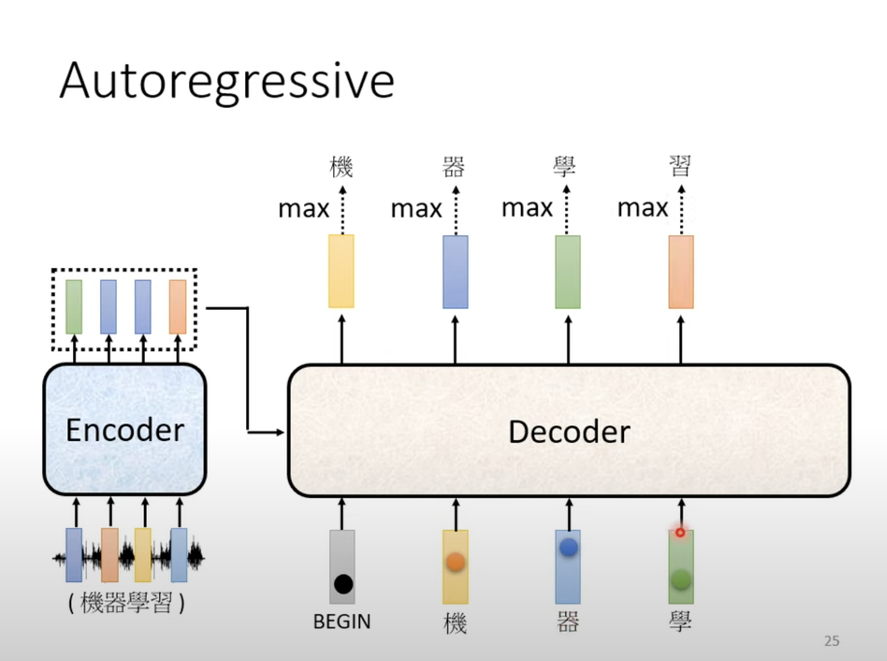
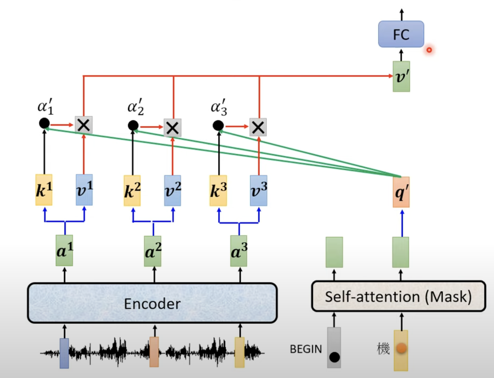

Transformer

**INTRO**

什么是transformer?一种sequence to sequence的model

输入sequence，输出的长度由model决定

**Seq2Seq**

流程：

Input sequence---encoder---decoder---output sequence

Encoder:

(原始架构也非最优解)

**Autoregressive**

(自回归)

先给decoder一段begin的特殊输入，然后生成words，然后再将生成的words加入输入中，再次生成又一段words，反复进行......

自回归模型最常用于处理时间序列数据和自然语言处理中的生成任务，比如文本生成、语音生成等。它们的主要特点是：

1. **依赖关系**：在每一个时间步（或序列中的位置），模型的输出依赖于前面时间步（或前面位置）的输出。这种依赖关系使得自回归模型可以捕捉数据中的时间或序列依赖性。
2. **逐步生成**：自回归模型通常是逐步生成序列的。例如，在文本生成中，模型先生成第一个词，然后基于第一个词生成第二个词，依此类推，直到生成整个序列。
3. **训练与预测**：在训练过程中，模型会学习如何预测当前时间步的输出，给定前面的输出。在预测或生成时，模型会使用前一步生成的结果作为当前步的输入，逐步生成整个序列。

Masked Self-attention

相较于self-attention，每个输入只能考虑它相对位置某一个方向的输入

Why：在autoregressive中，输入是逐步的，所以我们只能根据生成顺序进行self-attention

**Non autoregressive(NAT)**

一次性加入多个begin，并不逐步

如何决定NAT输出的长度？

1.另外训练一个classifier,决定长度，然后让decoder读取对应数量的begin

2.输入大量的begin，找到输出end的地方，截取有效输出

Why:输出平行化，只进行1次decoder，比AT快；输出长度更可控（在语音合成中，NAT很常见）

但效果不如AT

**Cross Attention**

encoder的输出至decoder的部分

流程：

**Training**

Teacher forcing:using the ground truth as input

在decoder中，将正确答案作为input(存在exposure bias)

由于在训练中给的完全是正确答案，但是由于AT是逐步的，那么存在可能一步错步步错的问题，所以我们在decoder的input时，也会给一些错的内容

这种方法也称之为:Scheduled Sampling

Copy Mechanism:输出不一定非要去生成，还有很多可以去复制原有的输入

Guided Attention:input有的时候是没有看完的，为了强制机器看完input

**BLEU score**

在深度学习，特别是在自然语言处理（NLP）领域，BLEU（Bilingual Evaluation Understudy）分数是一种用于评估机器翻译或文本生成模型输出质量的度量方法。BLEU分数通过比较机器生成的文本与一个或多个参考文本来评估其准确性和流畅性。以下是关于BLEU分数的一些关键点：

1. **N-gram匹配**：BLEU分数基于n-gram匹配来评估生成文本的质量。它计算机器生成的文本和参考文本之间共有的n-gram的数量。n-gram可以是单词序列，通常从1-gram（单个单词）到4-gram（四个单词的序列）。

2. **精确度（Precision）**：精确度是BLEU的核心，它计算生成文本中有多少n-gram出现在参考文本中。具体来说，BLEU分数是生成文本的n-gram与参考文本的n-gram匹配的比率。

3. **惩罚因子（Brevity Penalty）**：为了避免生成过短的文本（因为短文本容易匹配参考文本），BLEU分数引入了一个惩罚因子。如果生成文本比参考文本短得多，这个惩罚因子会降低BLEU分数。

4. **加权几何平均**：BLEU分数通常是1-gram、2-gram、3-gram和4-gram精确度的加权几何平均。通过这种方式，它可以平衡短n-gram和长n-gram的重要性。

5. **范围**：BLEU分数的范围从0到1，分数越高表示生成文本与参考文本越接近。一般来说，0表示没有匹配，1表示完全匹配。

6. **公式**：BLEU分数的计算公式可以表示为：
   
   
   $$
   \text{BLEU} = BP \cdot \exp \left( \sum_{n=1}^{N} w_n \log p_n \right)
   $$
   其中：
   
   - \(BP\) 是惩罚因子。
   - \(w_n\) 是n-gram的权重。
   - \(p_n\) 是n-gram的精确度。

BLEU分数被广泛用于机器翻译、文本摘要、对话系统和其他生成任务的评估中，尽管它也有一些局限性，例如对语义和上下文的理解不够敏感。

在训练中，我们minimize cross entrophy,在validation中BLEU score

(由于BLEU score在optimization时很难去gradient descent,无法微分，所以还是cross entropy)（但是面对这种优化问题，也有"When you don't know how to optimize,just use reinforcement learning(RL)"的说法