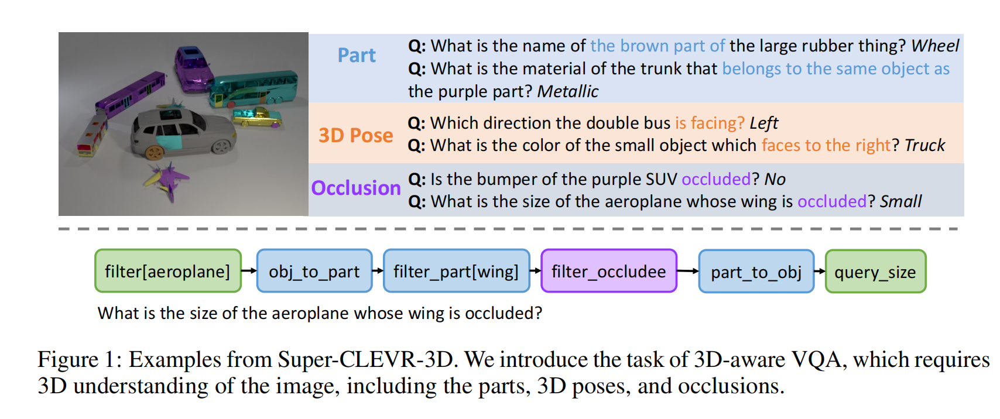
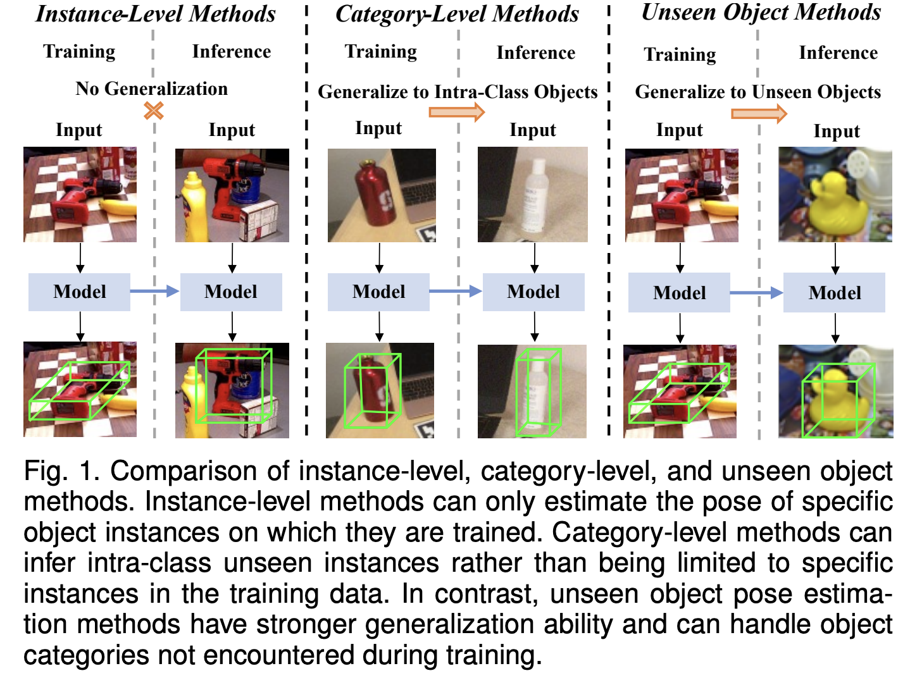
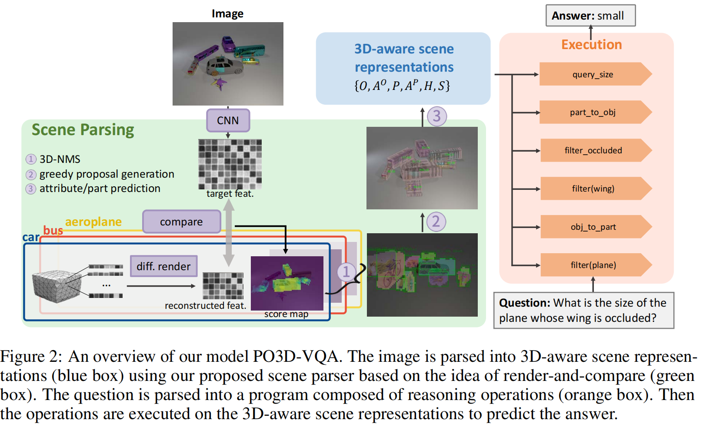
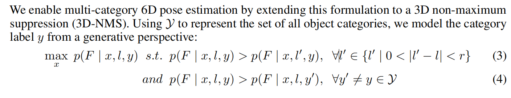
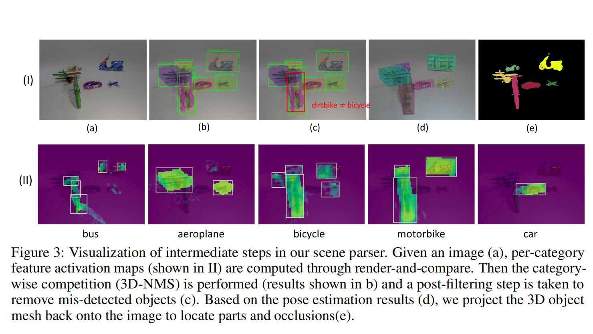

3D-Aware-VQA笔记

[3D-Aware-VQA](https://arxiv.org/pdf/2310.17914)

结合了两个强大的思想：用于推理的概率神经符号程序执行(probabilistic neural symbolic program execution

for reasoning)和用于鲁棒视觉识别的具有三维生成物体表示的深度神经网络(deep neural networks with 3D generative representations of nobjects for robust visual recognition)。

1 Introduction

局限性：
2023VQA模型依赖于bounding box来编码视觉场景

并认为缺少对于3D结构图片的理解

**PO3D-VQA**: Parts,Pose,Occulsions 

**VQA in 3D.**

诸如SimVQA, SQA3D, 3DMV-VQA, CLEVR-3D, ScanQA, 3DQA , EmbodiedQA都是基于3D视觉场景，像3D扫描一样，模拟3D环境

或者多视角图片

这篇paper主要聚焦于问题上的3D而非视觉场景上的3D

**3D scene understanding**

如果采用CLIP会缺少对于3D场景的理解

采用 category-level 6D pose

从一篇综述上薅的图（[综述](https://arxiv.org/pdf/2405.07801v3)）

4 Method

**4.1 3D-aware scene representation**

给定一个图片，将其解析为3D感知的场景表征 R

R包含：
$O$ 物体 是一个矩阵 $O\in R^{n\times N_{obj}}$包含了每个物体属于某个实例的概率得分,n是给定物体在图像中的数量， $N_{obj}$ 是数据中可能的物体数量

$A^O$ 物体的属性

$P$ 部件

$A^P$ 部件属性0/

$H$ 物体与部件的分层关系 01矩阵，$H_{ij}$ =1表示在物体i有部件j

$S$ 阻挡关系

属性就包括了3D姿势，位置，颜色，材质，大小

**Multi-object competition with 3D-NMS.**

3D-NMS:3D-Non-Maximum-Suppression

6D pose标注为：

$\gamma=\{x,l\},x=\{\alpha,\beta\}$

$\alpha$ 是3D物体姿态，$\beta$ 是物体到相机的距离 ，$l$ 是2D物体在特征图上的位置

首先独立地去判别每个物体的种类，然后使用2D-NMS对每个$l^{'}$ ,确定一个半径r,取最大的

（补充下：“s.t.” 是 “such that” 的缩写，常见释义为 “使得；满足” ，用于引入约束条件，限定公式中变量的取值范围或变量需满足的条件。）

$max_{x} p(F|x,l)\quad s.t. \quad p(F|x,l)>p(F|x,l^{'}),\forall l^{'}\in \{0<|l^{'}-l|<r\} $

将之扩展到3D-NMS，实现多类别6D姿态估计

**Part and attribute prediction.**

直接将图片相关区域切割出来然后用一个需要训练的CNN分类器来预测它的属性（材质，颜色，大小以及细致类别）

**Post-filtering.**

比较 6D 姿态估计器预测的类别标签和 CNN 分类器预测的类别标签，并删除这两个预测不一致的物体。这个后处理步骤有助于处理 3D-NMS 无法完全解决的重复检测问题。

**Dense scene parsing with greedy proposal generation.**

给定一组proposals $\{o_i=(O_y,\alpha_y,i)\}_{i=1}^{k}$

计算每一个的似然得分后按照得分，从高到低排序

然后贪心算法，按顺序更新6D姿态  $\alpha_j$ 以及对应的似然，更新前要掩盖掉顺序在前的前景区域

先计算出每个可能的物体类别的激活图(activation map)

然后采用3D-NMS竞争，取推断出各个物体的种类

再执行post-filtering,即删除CNN与6D姿态预测器矛盾的内容

接着，为了预测部件，将物体的3D网格投影到图片上来定位部件

*得看代码去了，概念有些抽象，汗流浃背了*