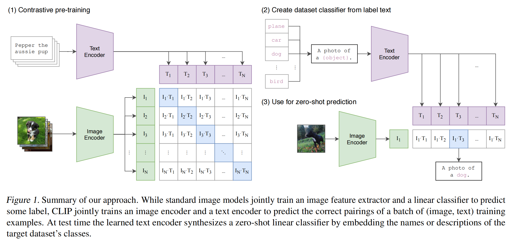
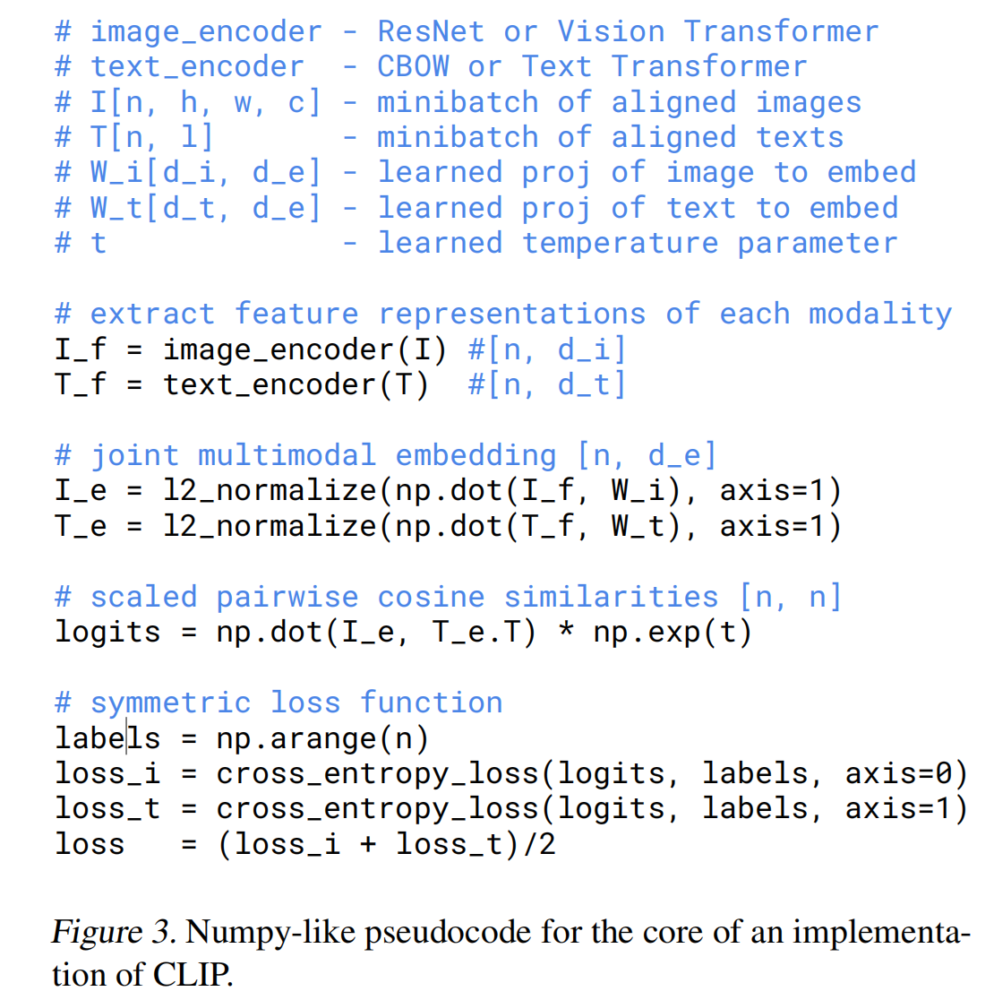

CLIP笔记

**原先的局限性**

在固定好的物体类别上进行训练，如果类别中没有三轮车，只有车，当然最多只能预测出车这个结果

但泛化性不行

**1. Introduction and Motivating Work**

在NLP上没有针对下游任务的去做train，更多是masking-preditc,autogressive的方法，以大量的数据训练出它的强大泛化性，并达到迁移到下游任务时能够无添加output head的zero-shot的优良表现。而CV上则更多是在更精心设计好的数据上train，泛化能力相对不足。

**2. Approach**

预测性目标函数不合适，对于一个图片，可以有多种合适的描述方式，采用对比学习，使用对比性目标函数(contrastive objective)，效率也大大提高

后续内容使用的皆为在使用ViT-L/14的基础上使用更大的图片（336像素）作过1个epoch微调后的模型

**3. Experiments**

面对以往模型迁移学习需要额外的数据集，面对着数据不好收集，distribution shift等问题，能够zero-shot迁移便是进一步的动机

在zero-shot时，如果直接给定单词，由于预训练text是句子，会面临一个distribution gap的问题，那么通过prompt模版变为一个句子再进行预测，准确率也可以得到一定程度上的提升。

prompt enginering

`A photo of a <label>.`

同时对于下游任务，特定任务，还可以在prompt加入更多的已知的信息

`A photo of a <label>,a type of pet.`

prompt ensemble:同时提供多种模版，进行多次推理，并将多种推理结果综合起来可得到更好的结果

**6. Limitations**

虽然不逊色于Resnet50,但是在某个特定的任务上，是达不到SOTA的水平，同时在有些特定的任务上，效果很差，瞎猜级别

同时面对预训练时out of distriubution的任务，效果很差

而且必须我们去添加文本的类别