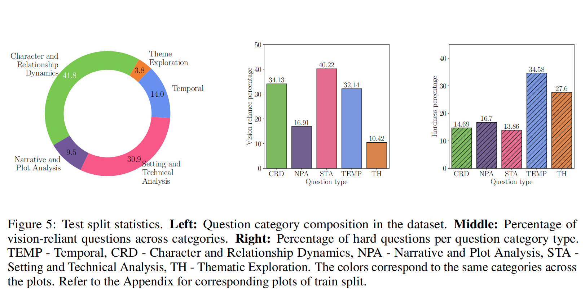
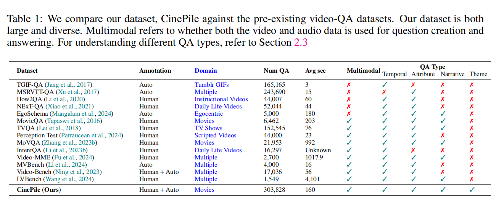

CinePILE笔记

[原文](https://arxiv.org/pdf/2405.08813)

*动机*：当前的长期视频理解数据集往往无法提供真正的长期理解挑战，因为从这些数据集派生的许多任务可以通过分析视频中的一帧或几帧随机帧来成功解决

1 INTRODUCTION

特点：

1）数据集强调问题的多样性，主题涵盖时间理解、感知分析、复杂推理等

2）庞大规模使其既可以用作指令调优数据集，也可以用作评估基准。

3）CinePile不过分强调纯视觉问题，CinePile涵盖了关于视觉、时间和叙事推理的多样化问题，并提供了问题类型的细分，以帮助开发者识别模型中的盲点

2 CREATING A LONG VIDEO UNDERSTANDING BENCHMARK

视频切片是从油管的MovieClips上拿的，每个片段都有一个主要的情节节点，并且收集了配对的音频描述

并且还对音频处理，哪些是对话，哪些是视觉描述

问题分为五种类型：

`Character and Relationship Dynamics`

`Narrative and Plot Analysis`

`Thematic Exploration`

`Temporal`

`Setting and Technical Analysis`

对难度进行了一定程度的调整，如果给定完整的上下文的情况下仍然无法回答，那么进行一定程度的人工调整

对视觉依赖也进行了实验，如果不看视频就可以正确答出来就是视觉依赖0，答不出来就是视觉依赖1

修复那些仅通过问题和答案选项就能够答出来的情况

3 A LOOK AT THE DATASET

4 MODEL EVALUATION

[dataset](https://huggingface.co/blog/cinepile2)