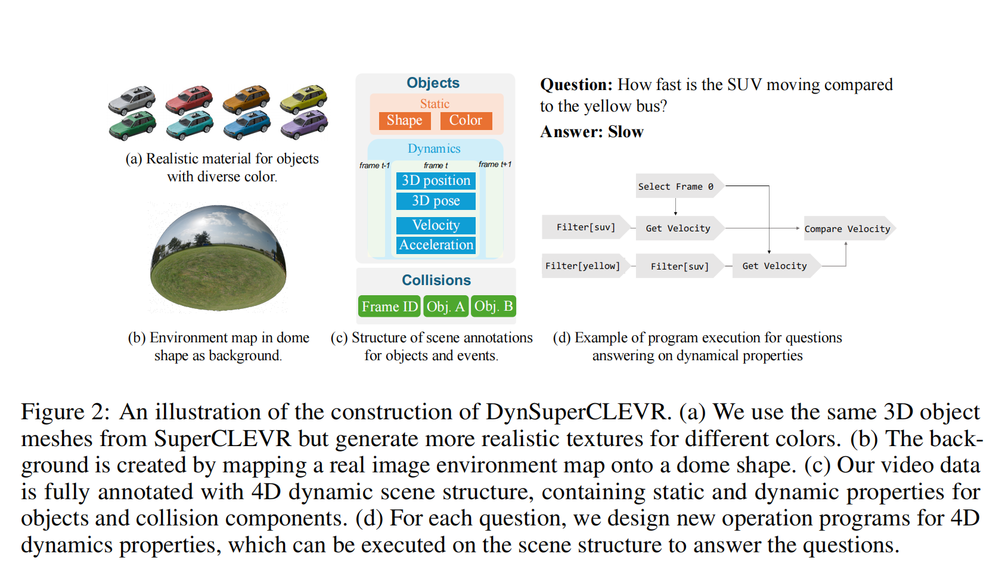
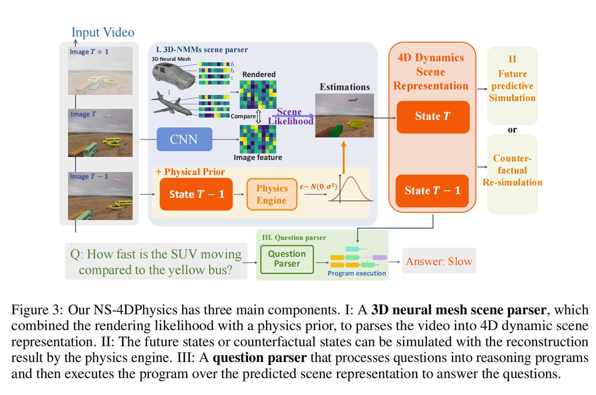
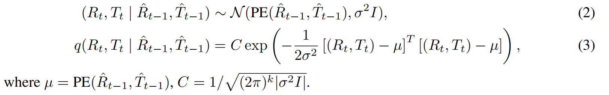
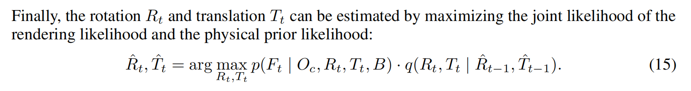

<font size=8>DynSuperCLEVR笔记</font>


[DynSuperCLEVR原文](https://arxiv.org/pdf/2406.00622)


**解决了什么？（局限性）**

当前的VLMs在提取动态语音仍然存在困难

缺乏对3D/4D场景的底层知识的情况下进行跨帧推理。


**DynSuperCLEVR干了什么**

专注于3D物体动态属性语言理解的视频问答数据集。集中研究4D场景中的三个物理概念——速度、加速度和碰撞。

进一步生成了三种类型的问题，包括事实查询、未来预测和反事实推理


**NS-4DPhysics**

a Neural-Symbolic VideoQA 融合了物理先验物理先验的动态属性 以及 视频中场景的显示表征


<font size=5>**1 INTRODUCTION**</font>

*现有的videoQA数据集上的不足：*

1.缺少3D/4D标注，容易受偏差与自然视频的捷径效应影响

2.或者通过合成环境，给定模拟器的ground truth

但是，这些数据集通常只考虑简化的设置，在模拟中缺乏多样化的物理属性，缺乏语言集成

再加上，这些数据集采用了简单的渲染，背景清晰，3D资源像玩具，导致合成视频与真实世界的自然视频之间存在domain gap


**NS-4DPhysics**

由 4D场景分析模块 和 符号推理模块 组成

而且有了3D场景泛化表征，我们的场景分析模块面对遮挡的内容仍然有较强的鲁棒性，对于训练期间没见过的3D姿态以及物体外形也有良好的泛化性


<font size=5>**3 DATASET**</font>

*4D动态属性：*

3D中的速度，加速度，相对速度，碰撞事件


*三个层次的问题*

事实性问题`factual questions`  事件以及属性从帧中查询得到

预测性问题`predictive questions` 基于现有的4D动态以及场景预测未来的碰撞

反事实性问题 `counterfactual questions`  让模型想象4D场景改变后产生的结果




*3.1 3D SCENE CONSTRUCTION*

<font color=blue>3D Object</font>：在原有的SuperCLEVR的基础上（包含五个交通工具类别以及21个字类别），为每个网格模型重新生成了纹理，以提高真实感。

对于每个颜色标签（灰色、红色、棕色、黄色、绿色、青色、蓝色和紫色），创建了 6 种变体，并更改了物体网格的面颜色。

<font color=blue>Backgrounds</font>:将背景更改为高度逼真的图像和灯光。

使用真实的 HDRI 图像，这些图像包含在 509 个不同场景中捕获的真实环境地图图像。将该图像作为材质映射到圆顶形状上作为背景


*3.2 4D DYNAMICS SCENE ANNOTATIONS*

**3D Position and pose**:(x,y,z)记录物体每个时间戳坐标位置

$(\alpha,\beta,\gamma)$ 描述物体的方向(orientation)以及旋转(rotation)

**Velocity**： $(v_x,v_y,v_z)$ 3D位置物体随时间变化，由于很难精确速度，以及给定是那种速度状态：
`static , slow (≤ 3m/s) and fast (≥ 3m/s)`

**Acceleration**: 加速度$ (a_{x}, a_{y}, a_{z}) $表示 3D 空间中速度随时间的变化率

在我们的数据集中，将其简化为二进制标签：是否加速，以及是否漂浮。(高中物理那套)

**Collision Events**记录碰撞发生时的帧 ID,不仅捕获给定帧中的碰撞事件，还通过模拟捕获未来的碰撞以及反事实场景


*3.4 QUESTIONS GENERATION FOR 4D DYNAMICS PROPERTIES*

**Factual Questions**：引入程序：对于速度：*query_velocity*, *compare_velocity* 和*query_moving_direction*

对于加速度：*query_accelerating*, *query*_*floating*

**Predictive Questions**：要求模型预测视频中尚未出现的未来碰撞事件，从视频中理解 3D 空间中物体的位置、速度和加速度，然后运用推理来预测物体未来的轨迹

**Counterfactual Questions**：要求模型通过改变物体的初始 4D 动态属性来对假设情景进行推理 （说直白点，counterfactual questions 就是假设性predictive questions)


*3.5 DATASET STATISTICS*

1000个视频切片作训练集

100作验证集

100作测试集

每个视频2000ms，帧率60，所以每个场景120帧

共 7850 个factual questions、2750个predictive questions、 989 个counterfactual questions。

factual questions开放式，可以几句话作答，后两者为判断题


<font size=5>**4 MODEL**</font>



对于输入视频，时间步 \(t\) 处的每个图像帧表示为 $I_{t}$。4D 符号场景表示 \(s\) 被定义为随时间变化的物体状态序列 

$S_{t}=\{O_{t}^{1}, O_{t}^{2}, ..., O_{t}^{N}\}$，其中N是场景中物体的数量。


**3D-NMMs scene parser**

去学习一个生成模型来以生成物体的 3D 特征表示，并通过分析合成来解析场景。

每一个物体的网格：

$M_s=\{v_i\in R^3\}^N_{i=1}$

s是物体的类别（形状）

N是顶点数目


神经纹理：

$T_s=\{f_i \in R^c\}^N_{i=1}$

c是特征维


3D-NMMs可以生成 3D感知的场景的表征

其中 \(s\) 是物体类别（形状），\(N\) 是顶点数量，\(c\) 是特征维度。一个 3D-NMMs 可以通过在给定的 6D 姿态 $\alpha$ 下渲染神经网格模型 $O_{s} = (M_{s}, T_{s})$ 来生成 3D 感知场景表示：

$F_{s}(\alpha)=\Re(O_{s}, \alpha) \in \mathbb{R}^{H×W×\bar{c}}$

使用软光栅化。通过比较 3D 特征的光栅化结果和 2D 图像特征，可以学习具有真实类别 \(s\) 和 6D 姿态 $\alpha$ 的神经纹理，或者在推理过程中估计 $\alpha$ 和 \(s\)。

将这个渲染和比较（render-and -compare）过程表示为似然模型的优化：

$p\left(F | O_{s}, \alpha_{s}, B\right)=\prod_{i \in \mathcal{F} \mathcal{G}} p\left(f_{i} | O_{s}, \alpha_{s}\right) \prod_{i \in \mathcal{B} G} p\left(f_{i}' | B\right)$

FG 为2D特征图前景（foreground) 

BG为2D特征图背景（background）

$f_i$ 是在i处F的特征向量

前景与背景的似然由高斯分布建模

```
前景指的是感兴趣的物体和区域
背景则是不感兴趣的物体和环境
在这里：前景通常是指图像中与3D物体相关的部分，而背景则是指图像中与物体无关的部分。
```


**Physical prior**

目标是预测每一个时间步的$s_t$ 

*局限性与挑战*：

如果用随机梯度下降是行不通的，因为物体必须是连续不被干扰的。显然不符合情境要求

而且对物理函数建模很难，计算物理引擎不可微，在推理过程中难以集成到反渲染过程中


所以提出：

将一个判别式物理引擎 PE(·) 修改为一个概率模型

然后：

$(R_t,T_t)=PE(\hat{R_{t-1}},\hat{T_{t-1}})+\varepsilon$

$\varepsilon\sim N(0,\sigma^2I)$

$R_t$ 旋转  $T_t$ 3D位置

把 $(R_t,T_t)$ 的物理先验融入到似然函数中




**动力学属性**：在估计世界状态 $(R_{t}, T_{t})$ 之后，我们通过计算连续时间步的位移和速度之间的差异来计算速度和加速度。为了减少噪声，应用了窗口大小为 5 的移动平均滤波器。

**静态属性**：形状通过选择具有最高似然的网格模型类别来确定。对于颜色预测，从 RGB 图像中裁剪出物体区域，并训练一个额外的 CNN 分类器用于颜色识别。

**碰撞**：碰撞信息是在估计物理先验时从物理引擎 \(PE(·)\) 中获取的。对于每次碰撞，记录时间和涉及的物体。

·

<font size=5>**Appendix**</font>

**D DETAILS OF 3D NNMS SCENE PARSER WITH PHYSICS PRIOR**

从物体区域提取到对应的网格以及纹理，然后通过soft rasterization将这个3D的模型渲染为2D特征图，然后与一开始CNN提取出来的2D特征图作比较，越像越好

将前后背景分离，通过最大化这二者乘积的概率来推断物体的6D姿态（3D旋转 + 3D平移）

- 每个前景像素的特征 $f_i$ 服从以渲染特征为中心的高斯分布：
- 渲染过程需计算网格顶点特征在图像平面上的投影，并通过插值生成像素级特征。

物体与背景的特征生成机制不同。物体特征由3D模型动态渲染，而背景特征相对静态。

（前后景是在2D特征图的集合）


**Training**:

用对比学习，将前景中的物体之间区分开，以及将前景物体与背景区分开

$L_{contrastive}=-(\sum\limits_{i\in FG}\sum\limits_{j\in FG\backslash\{i\}}||f_i-f_j||^2+\sum\limits_{i\in FG}\sum\limits_{j\in BG}||f_i-f_j||^2)$

​	 

*D.2 PHYSICAL PRIOR*




<font color=blue>*最汗流浃背的一集*</font>