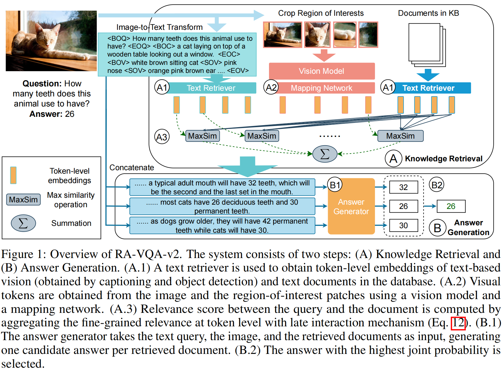
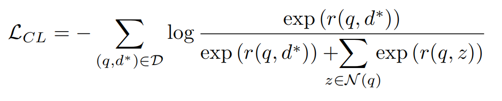
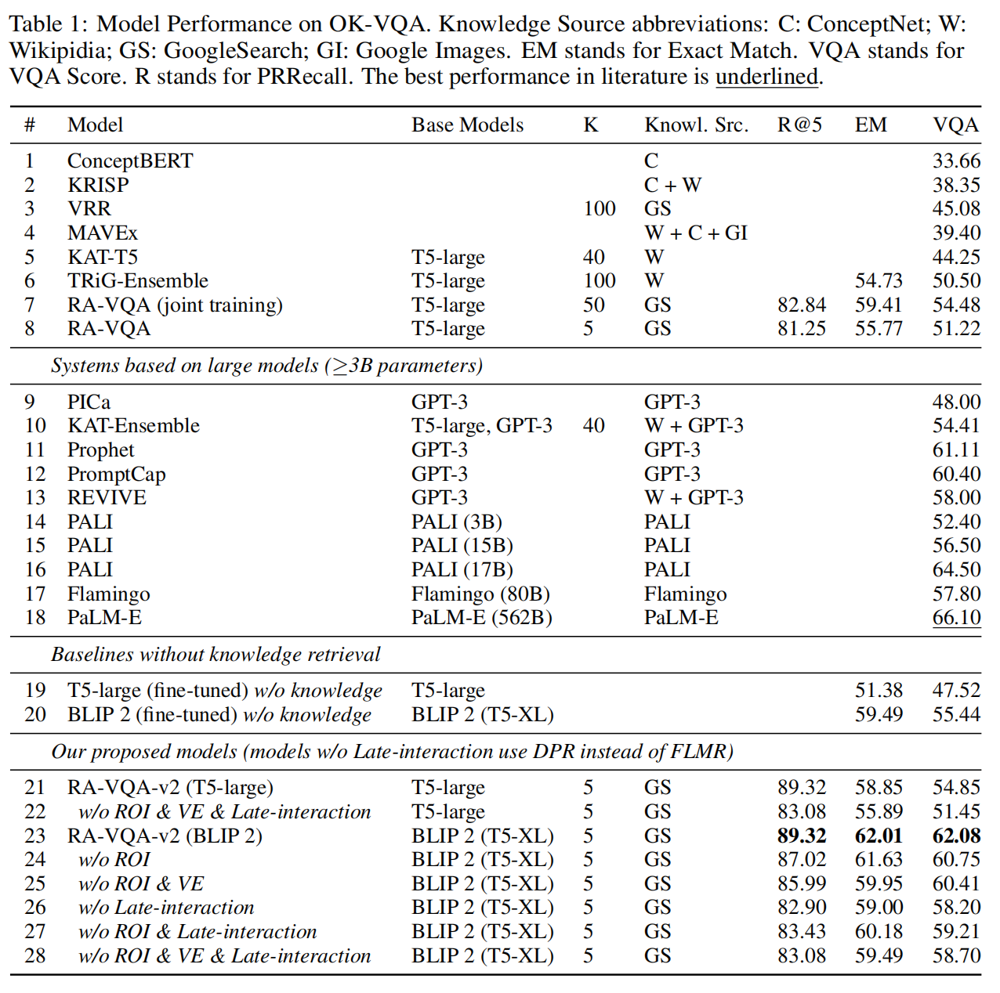

<font size=8>FLMR笔记</font>


[Fine-grained Late-interaction Multi-modal Retrieval for Retrieval Augmented Visual Question Answering](https://proceedings.neurips.cc/paper_files/paper/2023/file/47393e8594c82ce8fd83adc672cf9872-Paper-Conference.pdf)


解决了什么：
(1)由image2text获得的图片表征不完整，不准确

(2)文档与问题之间的相关分数由一维embedding得到，对于细致的内容不敏感


<font size=5>**2 Related Work**</font>

此文中，作者总结道：

VQA可以被粗略地划分为四种：
(1)视觉和文本特征可以通过跨模态融合

(2)从头开始训练多模态模型以此一起理解视觉与语言，然后再VQA任务上微调

(3)视觉与语言模型是在单模态的语料库上训练并且可以对齐

(4)利用image2text transformer，变成纯文本推理


<font size=5>**3 Method**</font>

在RA-VQA的框架上加伤late-interaction细致多模态检索器



使用VinVL来获得ROI bouding box，筛选出在问题文本中提到过的 每个bounding box对应的类别（注意文章里特别提到question是加入了注释的文本序列，不止原始的问题）

然后通过视觉模型获得ROI的区域表征以及整张图的全局表征

$Q=[F_L(q),F_M([g,r_1,r_2,...,r_{N_{ROI}}])]\in R^{l_Q \times d_L}$

$l_Q=l_q+(N_{ROI}+1)\times N_{vt}$

Knowledge base:

$D=F_L(d)\in R^{l_D \times d_L}$

**Multi-Modal Late Interaction.**

$r(\bar{q},d)=r((q,I),d)=\sum_{i=1}^{l_Q} max_{j=1}^{l_D} Q_i D_j^T$

对于每一对query token，查询所有文档中相似度最高的那个

MEAN操作和SUM操作对于文档的长度敏感不适合

**Training and Inference.**

*in-batch negative sampling* 

```
批次构建：每个训练批次包含一组（问题，正相关段落）对。

负样本选择：对于批次中的每个问题，将其他问题的正相关段落作为负样本。

损失计算：通过对比学习目标（如交叉熵损失）区分正样本和负样本，优化模型。
```

训练批次外的所有文档都被视为负样本： $N(q)$ （对于q而言）



想法idea：

```
对于CinePile这类任务，非常强调长时间video task以及transition的问题。
尤其对于transition的VideoQA的问题，可以尝试去将转变的那几帧编码后embedding，concat，然后去作对比学习，兴许可以train出一个对于动态变化能力较强的模型
```


**Evaluation.**

*VQA Score*

$VQAScore(y,S)=min(\frac{\#s(y)}{3},1)$

#s(y)是y在人类回答中的出现频次


*Exact Match(EM)*

$EM(y,S)=min(\#s(y),1)$


*Pseudo Relevance Recall (PRRecall@K)*:

$K=min(\sum_{k=1}^K H(d_k,S),1)$

评估retriever，如果一个文档包含任何人工标注的答案，则该文档被视为伪相关文档（由于每个查询没有标准答案的知识文档）


<font size=5>**5 Results and Key Findings**</font>

