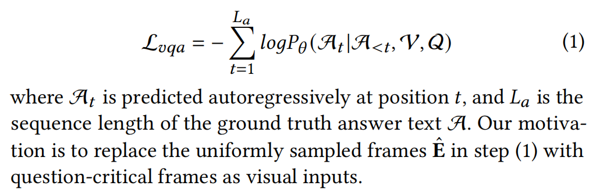
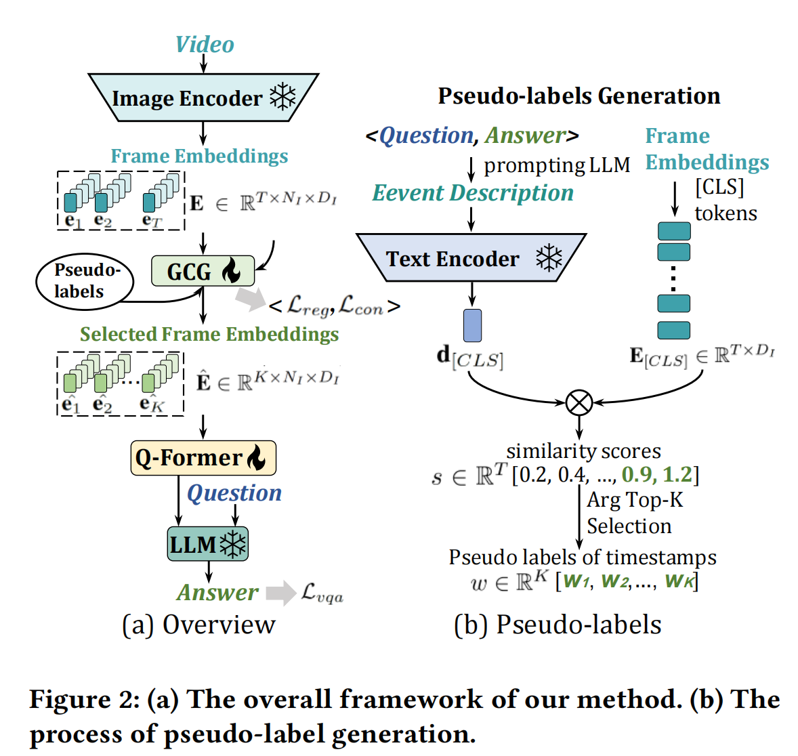
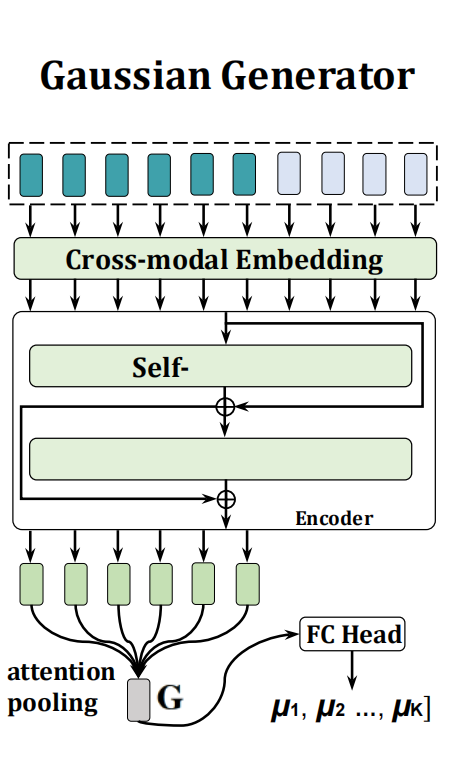
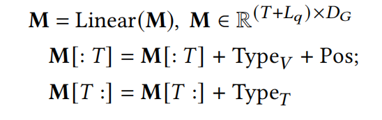
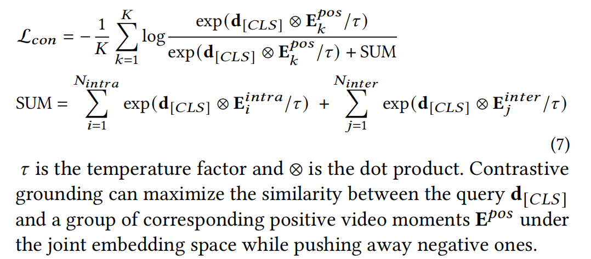
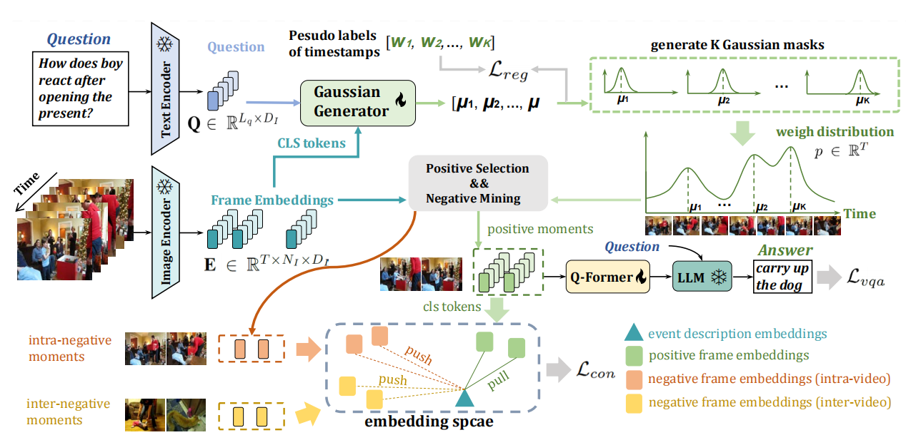
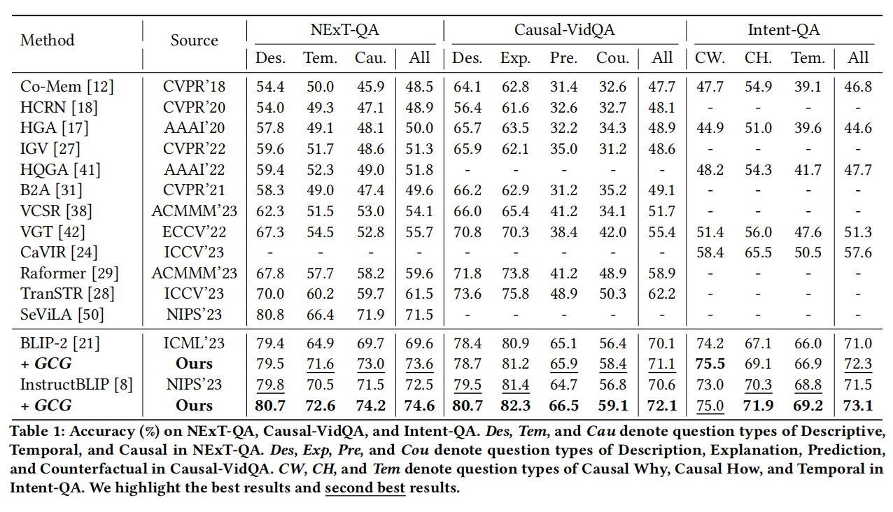
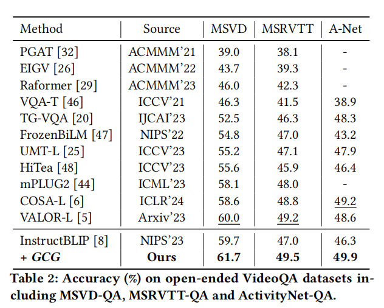
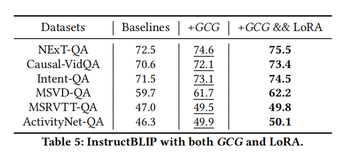

<font size=8>GCG阅读笔记</font>

[原文](https://arxiv.org/pdf/2401.10711)


<font size=5>**1 Introduction**</font>

LMM是作为LLM的进一步发展，对于各式image-language任务的能力表现优良

LMM：

使用图像编码器提取视觉特征，然后将编码后的特征发送到连接模块中，以获得一组与LLM处于相同特征空间的视觉标记。接着，视觉标记与输入文本嵌入连接在一起，输入到LLM中解码目标文本序列。

但是应用到videoQA时，受制于长序列视频帧，计算开销，LMM表现就比较落后了

而且视频帧均匀采样，信息上会冗余，平等地对待每一帧


**GCG**

训练的时候，将问题和答案一起生成一个陈述句，作为这个事件的陈述

然后将这个陈述文本和视频的每一帧用CLIP作相似比对，得到高得分则作为关键帧，目标时刻


为了能让LMM能够自动去学到哪些是关键时刻，利用Gaussian mask learning，多个高斯掩码来表征固有的时间结构

(原文：motivated by more recent research which has highlighted the superiority of end-to-end Gaussian mask learning in video grounding tasks, we use multiple Gaussian masks to characterize the inherent temporal structure of the video)


**Temporal Grounding in VideoQA**

当任务开始复杂，对时间，原因推理做要求，就有这些尝试：
ATP:在没有时间信息的情况下利用时间探针去选择某一帧

TranSTR,MIST:采用adaptive temporal rationalization机制以及iterative spatial-temporal attention

 SeViLA:利用LMM，使用了两个LMM，一个用来生成伪标签，一个用来回答问题


<font size=5>**3.Preliminary:LMM for VideoQA**</font>

（1）ViT作为frozen image encoder来独立提取每一帧的embedding，获得：

$$E=\{e_{1},e_{2},...,e_{T}\},E\in R^{T\times N_{I}\times D_{I}},e_{t}\in R^{N_{I}\times D_{I}}$$

$t$ 代表第t帧，$N_{I}$ 代表每一帧的 `patch` 数目(包括 `class token`)

$D_{I}$ 是 `embedding` 维度

为了减少token数量，往往不会把所有帧都取来，取 $K<<T$  K帧

（2）用一个可train的 `Q-former` 来做模型的连接模块

将原先的E作为输入，并输出一个固定长度的frame tokens $$F=\{f_{1},f_{2},..,f_{K}\},F\in R^{K\times N_{C}\times D_{C}},f_{t}\in R^{N_{C}\times D_{C}}$$

此时 $N_{C}$ 作为每一帧的token数目， $$N_{C}<<N_{I}$$

$$D_{C}$$ 则作为连接模块的维度

（3）将 $f_{t}$ 全部连接在一起并获得展平的 $F\in R^{(K\cdot N_{C})\times D_{L}}$

然后再经多一个全连阶层，将维度 $D_{C}$ 投射到 $D_{L}$ ，然后将输出和问题(word embeddings)一起喂给LLM,作为soft prompts


Objective:




<font size=5>**4.Method**</font>

**Framework:**




**Gaussian Generator:**


由一个cross-modal embedding layer和transformer encoder组成

cross-modal embedding layer是降采样线性层（down-sampling linear layer)



现将多模态的M embedding作为输入，再经过注意力池化获得全局表达G，G融合了视频以及问题的信息，再将G来预测K个可学习的高斯函数均值，并对之加权,再生成对应高斯函数

$\mu=Sigmoid(Linear(G)), \mu\in R^{K}$

$g_{k}=\frac{1}{\sqrt{2\pi \sigma}}exp(-\frac{(t/T-\mu_{k})^{2}}{2\sigma^{2}}), g_{k}\in R^{T}$

$k={1,2,...,K},t={1,2,...,T}$

$p=Norm(\sum_{k=1}^{K}g_{k}),p\in R^{T}$

将weight distribution缩放到0，1之间，然后由于其中K个峰值更倾向于是 ${\mu_{1},...,\mu_{K}}$ ,为了优化高斯生成器，引入regression objective，测量预测中心 $\mu$ 与伪标签时间戳之间的差异，以此优化，使得高斯生成器生成的peak更接近在已知答案下应该重要晓得的时间戳

$L_{reg}=\sum_{k=1}^{K}Smooth||\mu-w_{k}/T||$

（妙啊！！！）


**Contrastive Grounding**

$d_{[CLS]}$ 从text encoder来获取，它是结合了答案与问题的事件代表

*Positive Moments Selection.*

从weight distribution中选取top-k来作为positive moments，同时由于这些时间戳都是离散的，采用<font color=blue>*perturbed maximum method*</font> 来进行优化

*什么是 perturbed maximum method？AI的回答：*

```
Perturbed Maximum Method（扰动最大值方法）是一种用于处理离散优化问题的技术，特别是在深度学习中，它允许对分段常数函数进行微分，从而支持反向传播。这种方法的核心思想是通过引入随机扰动来平滑离散优化问题的解，使其变得可微，从而能够在神经网络中嵌入离散决策层（如排序、选择top-k等）
```

*Negative Moments Mining.*

为了将不相关的时刻推远，不仅是在weight distribution中取 $N_{intra}$ 个数值最低的帧，同时还从同batch的其他视频里面，取其他视频的 $N_{inter}$ 帧，以此来解决这个infoNCE loss:




最后总的LOSS即：

$$L=L_{vqa}+\alpha_{1} L_{reg}+\alpha_{2} L_{con}$$


pipline总览：




<font size=5>**5. Experiments**</font>






