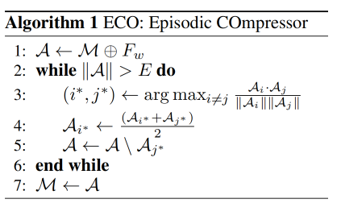

HERMES笔记

[原文](https://arxiv.org/pdf/2408.17443)

introduction和related work轻车熟路了，直接skip

<h2>3 Proposed Framework:HERMES</h2>

核心idea:**ECO**(episodic memory compression)  具有相似情景的帧

**SeTR**(semantic knowledge retrieval) 对应语义的

模型采用*window encoder*

给定一个随机长度的视频，先固定一个抽帧的数目，然后将这些帧分块不叠加的编码

设窗口的大小为w，那么每个窗口提取到的特征为：

$F_{w,i}\in R^{B\times w\times T\times C}$

$F_{w,i}$ 是在第i个窗口提取到的特征，T是viusal tokens，C是通道数

 

ECO

算法：

.png)

在大于max_length之下，取相似度最高的两帧，然后原有的一帧作融合，另一帧删除

Episodic Q-former

一眼丁真，鉴定为直接用的MA-LMM的Q-former方法，不过是再复述了一遍

SETR

设计的目的是为了合并分散在视频中的高层次信息

先对视觉特征归一化（有一说一，MA-LMM就没有做归一化，不过实践表明：可有可无）

每隔k帧放进X组，剩下的全部放到Y组

点积计算X与Y之间的相似度

对于每一个Y中的帧，根据计算的相似度，与X中的帧合并

这样子将N帧减少到了N/K帧

（有点意思，不过I have a new plan!）

Hierarchical Qformer

将经过SETR后的帧frame Q-Former，然后经过线性层，最后在经过一个video Q-Former，得到：

$Q_{sem}=vQFormer(Linear(fQformer(F^{'})))$

即语义表征

最后合并：

$\hat{Y}=LLM(W[Q;Q_{sem}]+b,I)$

总览图：

.png)

总结：

亮点在于SETR操作：我只取k帧作为压缩后的内容，然后将k帧其余的帧取相似度然后作压缩

