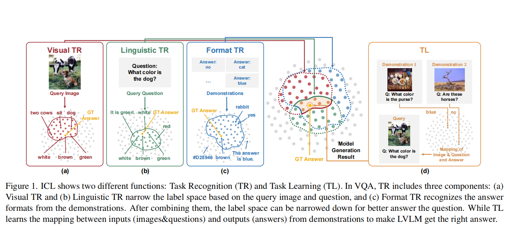
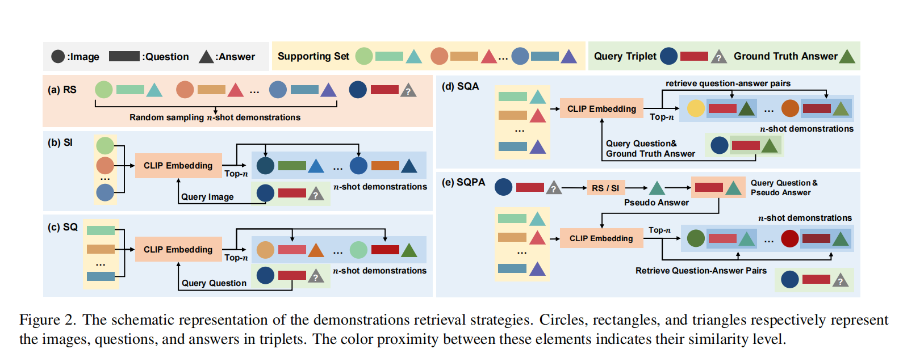

<font size=8>ICL-VQA笔记</font>


<font size=5>**1. Introduction**</font>

ICL通过few-shot演示构建了包含所需知识以及输入所对应的标签

但是ICL的表现很大程度上受到演示的配置(configuration)的影响

ICL能力两方面体现：<font color=red>TR</font>(task recognition)

​				     <font color=red>TL</font>(task learning)


**配置策略(demonstration configuration strategies)**

图像或文本（问题和答案）的相似性检索演示

不同方式操纵由检索到的演示构建的上下文序列(错配三元组，加入指令，重新排序演示)


**contributions:**

1).ICL能力在LVLM的阐释与应用



2).LVLM在ICL三个特性：TL能力有限

​					   存在short-cut effect（捷径效应）

​					   视觉和语言模型上的partial兼容性


<font size=5>**3. In-Context Learning (ICL) for VQA**</font>


**3.1. TR and TL in the VL domain**

视觉和语意的TR对应于LVLM预训练的保留的相应知识回忆

visual TR用visual encoder识别图片相关标签信息

Linguistic TR则用相关语言组件去识别query的内容

三种TR各个会将输入映射到一个空间中，将标签空间缩小，通过映射标签的重合使答案的范围更小，回答更精准

而TL则在这个重叠的范围去学习最后的映射关系。

TR缩小范围，TL挑答案


**3.2. Retrieving Demonstrations**

对于一个supporting set
$$
D={(I_{1},Q_{1},A_{1}),...,(I_{N},Q_{N},A_{N})}
$$
这样我们可以去构建一个n-shot三元组，in-context 序列S

<font color=blue>RS</font>(random sampling)

<font color=red>SI</font>(retrieving via similar image)仍然是采样，但是针对查询的

$$(\hat{I},\hat{Q})$$ ,采样的每个三元组的图片与查询的图片尽可能相似

用CLIP计算图片相似度

(Retrieving via Similar Texts)：以文本的相似度为准去取样

<font color=purple>SQ</font>(Retrieving via Similar Questions)以问题的相似度为准去采样

<font color=green>SQPA</font>:通过RS和SI方法去生成一个伪标准答案（对应查询）$\hat{A^{P}_{i}}$ ，然后根据组成

一对 $(\hat{Q},\hat{A^{P}_{i}})$ ，然后根据它去在D中采样Q,A最接近的


（个人观点：首先单独采取SI,ST,SQ恐怕效果不如三者结合起来作加权采样，即

$S=\alpha*SI+\beta*ST+\theta*SQ$

然后系数是可学习的参数，或者去作超参，SQFA本质上是这个做法的一个子集）




**3.3. Manipulating Demonstrations**

1.为了探索演示的正确性是否影响结果，对每个演示中的图像、答案和问题-答案对实施错配配置。

2.根据一种特性采样后再根据另一种特性去重新排序(比如根据SI采样，然后根据Q的相似性重拍)

3.加入特殊指令


<font size=5>**4. Experiments**</font>


**4.2.1 The Properties of Open-Flamingo**

1.*Task Recognition (TR) is More Crucial than Task Learning (TL).* 

2.*shot-cut inference*（当提示的问题过于相似时，就倾向于直接照抄答案问题对应的答案）

3.*Image and Language Decoders are not totally Compatible.*

语言编码器比视觉编码器强大的多


**4.2.2 Effective Configuration Strategies**

Open-Flamingo的局限性：

*TL能较弱*

*捷径效应*

*视觉语言模块不完全兼容*


**解决策略：**

<font color=red>*1.相似的图像和文本可以带来更好的表现*</font>

原文的解释：

```
Despite we previously show that using demonstrations with
similar questions leads to short-cut inference, we now
present evidence that using demonstrations that simultaneously contain similar images and questions can enhance
performance. Although the improvements vary depending
on the dataset, such strategy is still a powerful way to improve the performance.
```

（个人观点：其实这样的结果更表明时上面的采样策略缺陷导致的（类似于押题，猛刷圆锥曲线的题，如果考题圆锥曲线多，那么表现好，如果考题中没有之前准备的题，那么表现当然较差）


<font color=red>*指令提升了语言能力较强的模型的性能*</font>

对于有语言编码器优良的模型，使用指令提供指令通过增加演示中的信息密度来增强 LVLM 的格式 TR 和 TL 能力，并减少了 LVLM 视觉编码器的处理负担，使其更简单和方便


<font color=red>*伪答案有潜力快速提升性能*</font>

灰常有意思，值得关注的现象

原文：

```
Therefore, the accuracy of the second-round model using SQPA is
expected to surpass that of the first round. However, as the
number of shots increases, only on OK-VQA does SQPA
still show improvement. This may be because too many incorrect QA pairs interfere with the reasoning process of the
model, while OK-VQA requires additional knowledge.
```

