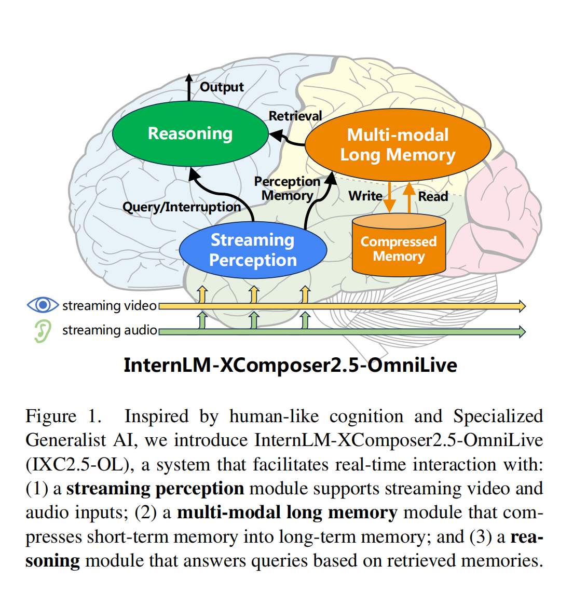
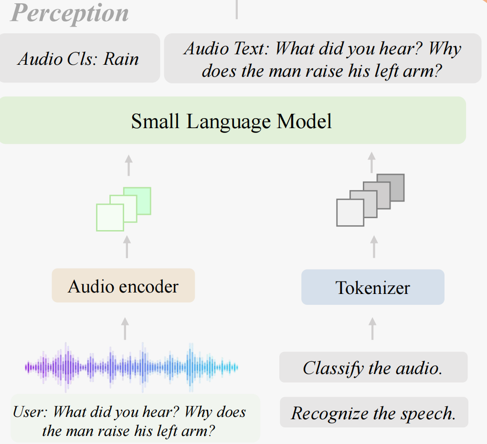
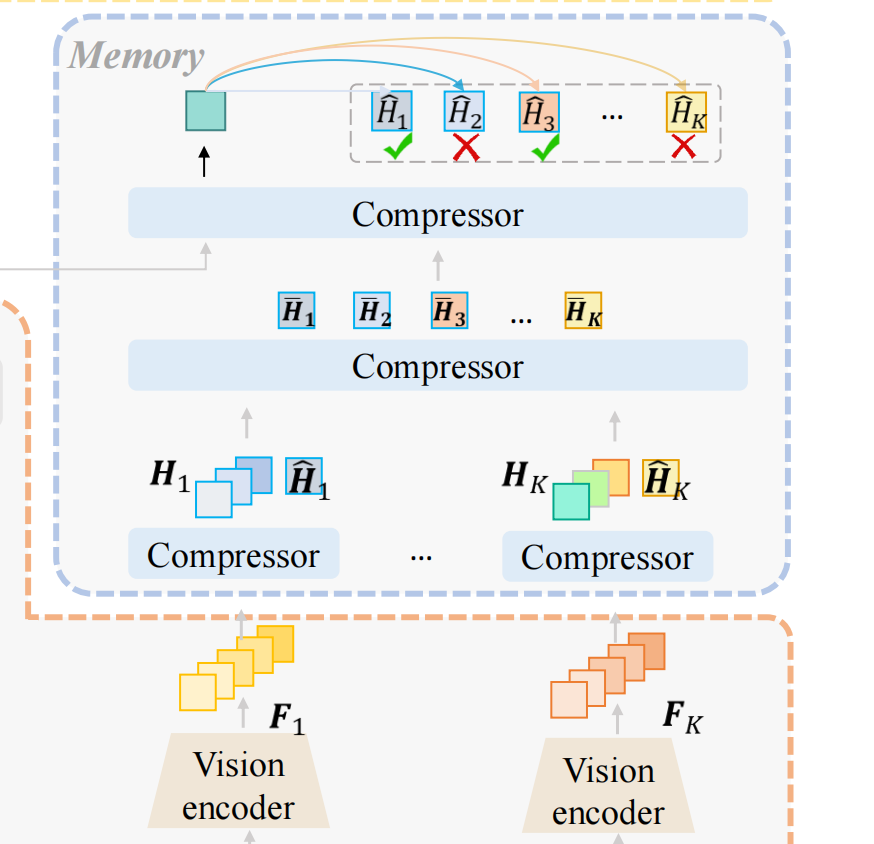
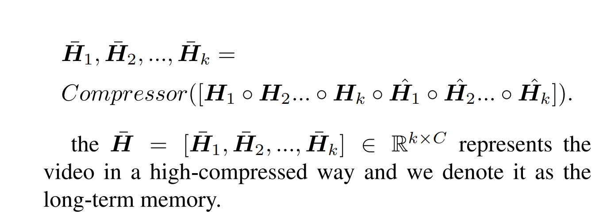
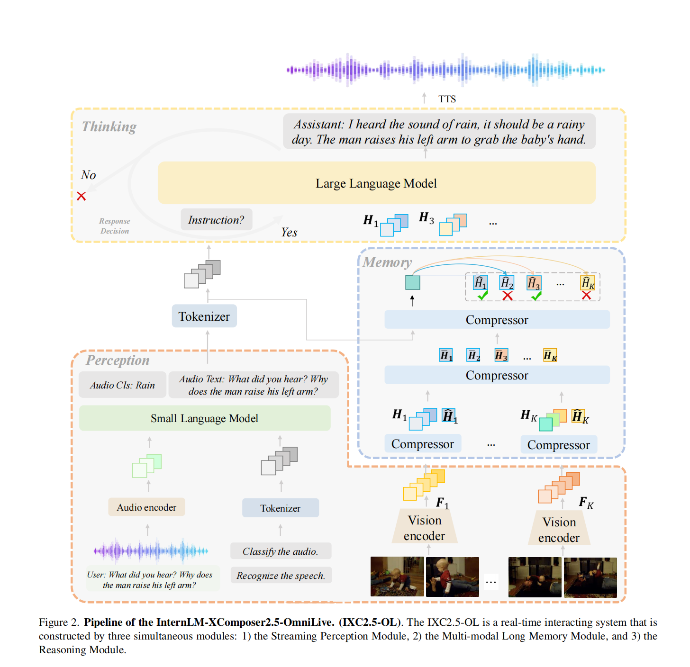
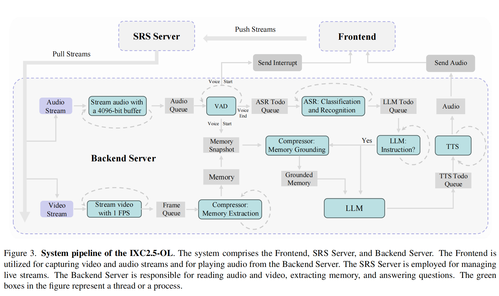
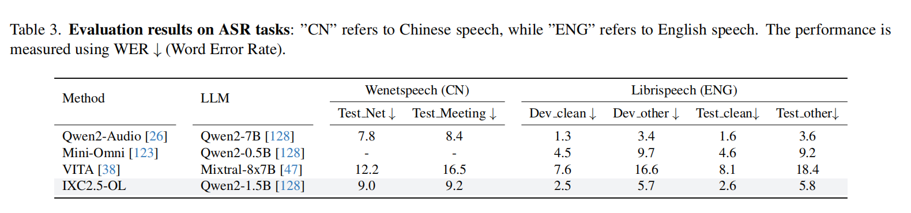

<font size=8>InternLM-XComposer笔记</font>


[arxiv](https://arxiv.org/pdf/2412.09596)

<font size=5>Abstract</font>

1.MLLMS被seq2seq的结构所限制

无法同时处理输入，生成回答（一边思考一边接受信息）

2.依赖long contexts来存储历史数据对于长期互动行不通


所以不去依赖单一的model去完成所有任务。

从**Specialized Generalist AI** 这个概念出发来引入

将问题拆解，组成一个包含多个模型的整合


**InternLM-XComposer2.5-OmniLive (IXC2.5-OL)** 

组成：

**Streaming Perception Module**:audio,video信息的即时处理

**Multi modal Long Memory Module**:记忆的储存和检索

**Reasoning Module**：集合来自感官和记忆的信息，处理查询，进行推理





<font size=5>1.Introduction</font>


由于LLM单decoder的构造限制，无法做到连续交互

很依赖context windows去整合多个模型的记忆，一旦时间跨度拉长，信息量变大，依旧去维护context就不现实


**Streaming Perception**:包含了多个model，对于video有处理video的模型，对于audio，也有对应处理audio的模型。分开处理以保障正确率和并行度


**Multi-modal Long Memory Module**：包含长短期记忆，

同时也会不断将短期记忆转化为长期记忆


**Reasoning Module**:由perception module所激活，处理提出的问题并执行推理


表现：多项任务上的SOTA


<font size=5>2.Related Works</font>


**MLLMs for Video Understanding.**


```
temporal pooling，sparse sampling

compressed video tokens

memory banks
```

上述办法来降低输入视频的复杂程度


目前online video understanding越来越受人关注，

让AI实时理解视频流

但也无法做到同时感知，记忆与推理


**MLLMs for Audio Understanding.** 

和文本的处理异曲同工，tokenize用audio tokenizer，然后有audio对应的encoder，其他交由LLM处理

不过现在有了可以双重发言人的model，以及audio-visual,以及audio,visual,text一体化的model


**MLLMs for Omni-Modal Understanding.** 

（omni：全方位）

将多个模型融合为一个全方面的模型，使得输入和输出都有多种形式

目前的IXC2.5-OL则是将多种模型分开train


<font size=5>3. Method</font>


**3.1. Streaming Perception Module**

<font color=blue>NLP,  audio translation module,   video perception module</font>


<font color=blue>**Audio Translation Module**</font>

总共由三个部分组成，audio encoder, audio projector以及SLM(small language model)

Audio encoder输出高纬features，audio projector将其投影到SLM，使其输出声音类别以及语言内容




<font color=blue>**Video Perception Module**</font>

给Multi-modal Long Memory Module提供相对粗糙的视觉信息（实时处理视频输入流，每一帧被编码成semantic features）


**3.2. Multi-modal Long Memory Module**

```
The Multi-modal Long Memory Module is the core design to handle extremely long video input and helps the Reasoning Module to get rid of millions of tokens from its context window.
```


将视频的小片段处理为短记忆，再将短记忆融合为长记忆，对于每一个查询，去检索最符合的小记忆，再给Reasoning Module(与VideoStreaming核心方法一致)



对于Multi-modal Long Memory Module所需要训练的三项任务：

**Video Clip Compression**：压缩视屏片段

初始化并空间降采样得到Short-term memory

对于每个传入的video features，都会得到一组shot-term memory(每个通道都有一个short-term memory)，同时又会有一个global memory对应这一组features的memory。

$$H_{k}\in R^{TP\times C}$$

$$\hat{H_{k}}\in R^{1\times C}$$


长期记忆：





**Video Clip Retrieval.**

将tokenize后的问题和long term memory连接(concate)，然后作为compressor的输入，然后拿出输出的最后一个token，然后将这个token与global memory作相似度对比，拿出最相关的输入给Reasoning Module


**Implementation Detail.** 

对于上述的三个任务：

video clip compression:使用短视屏等相关现成的data

Memory integration task

video clip:

除开现成的数据，还有设置了两个任务来train上述两个能力：

**Semantics Implicit Question**

问题不是直接给出，需要自己拆解相关query

**Reference Implicit Question**

知道语句中的代词到底指代的是什么东西


**3.3. Reasoning Module**

Reasoning Module最开始是用的IXC2.5的改良版

memory projector将memory，question以及视觉信息联合，

Memory Module中的memory projector整成这样子：

```
Question: < |Que| >,
Here is the question related video clip < |Img| >;
Here is the question related memory < |Mem| >
```


再输入给Reasoning Module

同时还有一个<font color=green>Instruction Prediction</font>,来对于是否回答问题(emmm，OK，这些都不需要回答)


<font color=red>整个overview:</font>




**3.4. System Pipeline**


**SRS Server.** SRS (Simple Realtime Server)处理实时数据流

(资料补充：轻量级的、专注于实时流媒体传输的开源服务器，常用于视频直播、视频点播、音频流等多种流媒体场景)


**VAD**:连续地从audio queue读入数据，并识别audio的起始和结束

一旦检测到开始信号，后端就立即向前端传入audio终端信号

并且保存memory state


一旦探测到video的结束信号，就将video的信息入队*ASR Todo Queue*，同时*ASR Todo Queue*的信息传给*ASR*,它不断读入audio segments，并进行*背景声分类*以及*内容的识别*，并将结果送给LLM

(ASR:automatic speech recognition)


Compressor不断进行着将特征信息转化为短期记忆，然后将记忆合成长期记忆，直到接收到VAD的视频结束信号


（TTS：text-to-speech文本到语音）





<font size=5>4. Experiments</font>


**Audio Benchmarks**



Dev-clean以及Test-clean音频清晰，质量高，相反的Dev_other与Test_other噪音多。


