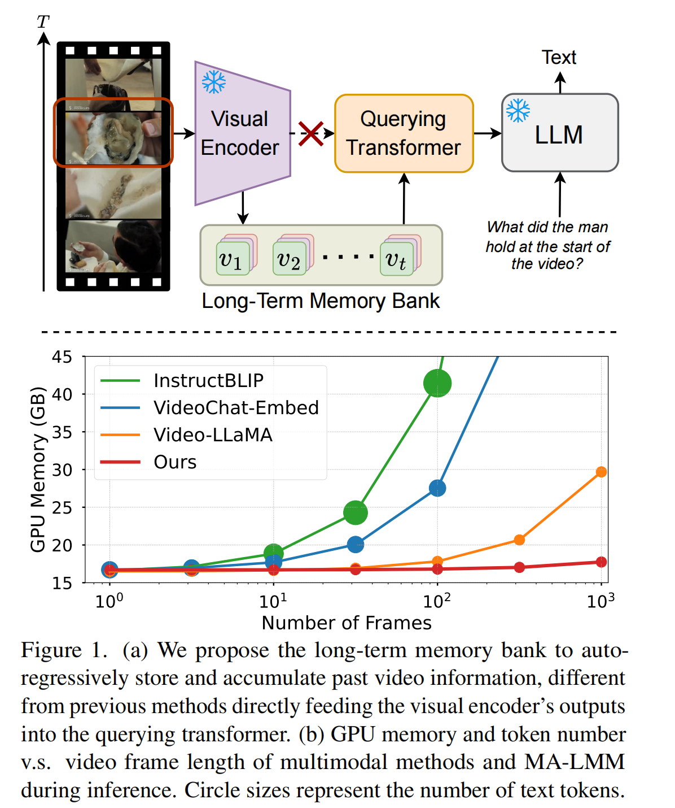
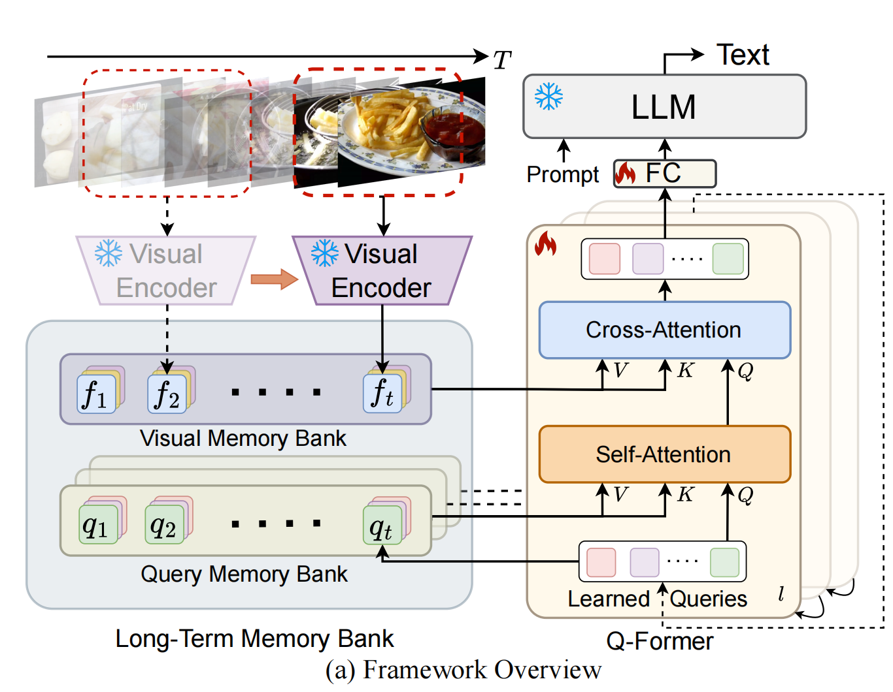
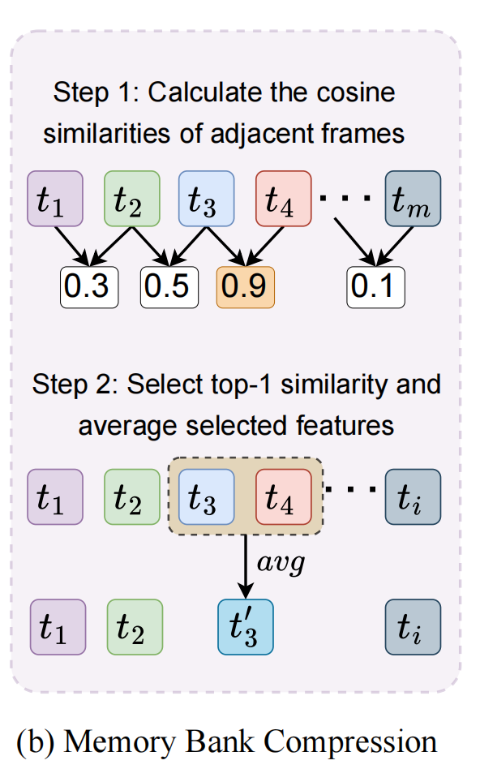
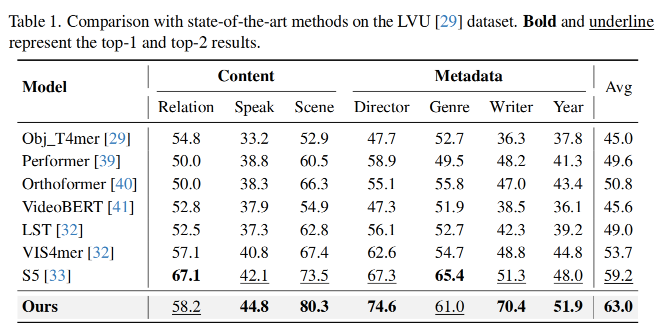
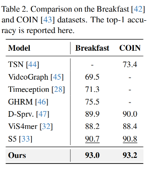
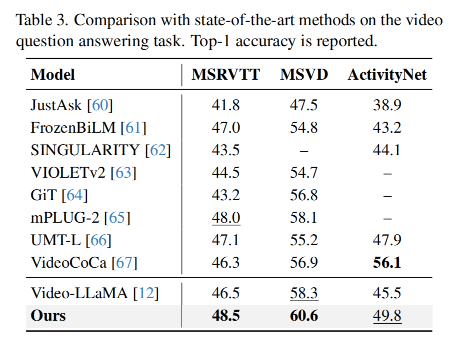

MA-LMM笔记

[原文](https://openaccess.thecvf.com//content/CVPR2024/papers/He_MA-LMM_Memory-Augmented_Large_Multimodal_Model_for_Long-Term_Video_Understanding_CVPR_2024_paper.pdf)

引入memory-bank来解决长视频以及在线视频的局限：

3 Method

*视觉提取*

$f_t=v_t+PE(t),f_t\in R^{P\times C}$  

$v_i$ 是视觉编码器得到的视觉特征

$v_t\in R^{P\times C}$ P是每一帧的patch，C是维度

PE是位置嵌入层(position embedding layer)

$V=[v_1,v_2,...,v_T]$ 是T帧视频经过视觉编码器得到的视觉特征

*大规模时间建模*

采用Q-Former，引入可学的query $z\in R^{N\times C}$

N是可学的query数目

*视觉内存库(visual memory bank)*

存储从视觉编码器得来的视觉特征

$F_t=Concat[f_1,f_2,...,f_t], F_t\in R^{tP\times C}$

在给定输入查询query $z_t$ 之下，qkv:

$Q=z_tW_Q,\quad K=F_tW_K\quad V=F_tW_V$

然后cross-attention:

$O=Attn(Q,K,V)=Softmax(\frac{QK^T}{\sqrt{C}}V)$

*查询记忆库(query memory bank)*

将输入的每个时间戳的查询存起来

$Z_t=Concat[z_1,z_2,...,z_t],Z_t\in R^{tN\times C}$

qkv和上面一葫芦画瓢

每一层的self-attention都有一个独立的查询记忆库

**MBC**(memory bank compression)

在时间维度上，根据相邻的特征相似度来聚合，压缩

当记忆量达到一定程度，则进行压缩操作

$s_t^i=cos(f_t^i,f_{t+1}^i),t\in [1,M],i\in [1,P]$

然后选取计算的最高点相似度，然后对相似度最高的两相邻feature作平均

4 Experiments

**Long-term Video Understanding**

LVU,Breakfast,COIN

**Video Question Answering**

MSRVTT-QA, MSVD-QA(前两者10-15秒), ActivityNet-QA(平均2分钟)

**Video Captioning**

MSRVTT,MSVD,Youcook2

**Online Action Prediction**

EpicKitchens-100数据集（700个长视频，内容是做饭，长达100小时）

**表现**：

长视频理解：

视频问答：

