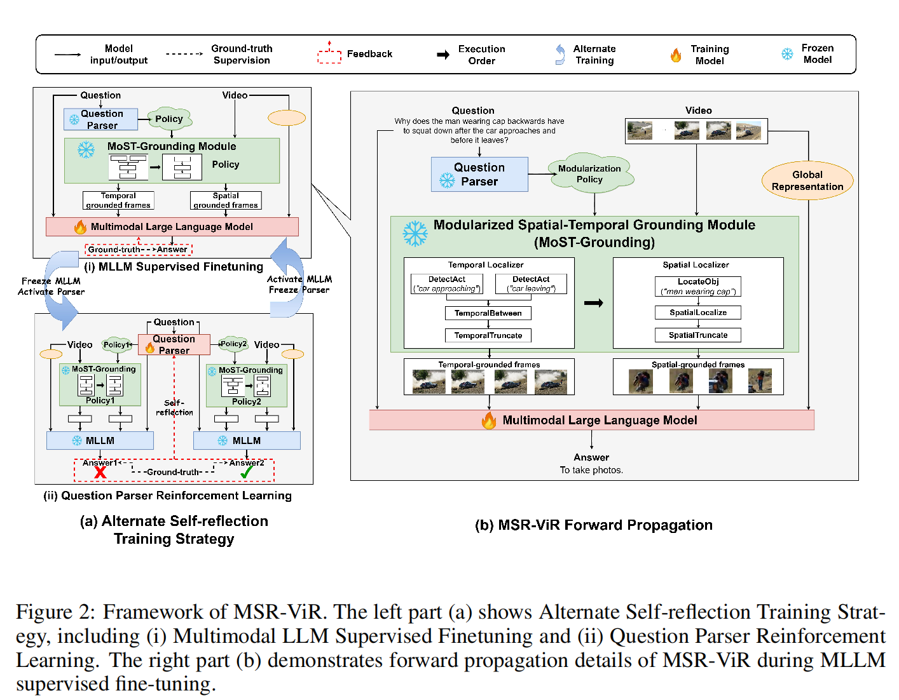

MSR-ViR笔记

[原文](https://openreview.net/forum?id=4Sv5MQ931E)

**需求：**

缺乏理解路径的展示：用MLLM做videoQA更像是黑箱，不能展示推理路径，也无法指出答案是从哪个视频中得来

所以推出 *Modularized Self Reflected Video Reasoner*

**MSP-ViR**

**干了什么：**
在MLLM中引入MoST-Grounding模块

(MoST-Grounding全称：Modularized Spatial-Temporal Grounding)

执行生成策略上：提供问题到答案的解释路径

同时MoST-Grounding会调用各种小模块来实现时间和空间的定位

以及为了避免生成不合理的策略，还进行了reinforcement learning-based Alternate Self-reflection training strategy

来优化MLLM

**1.Introduction**

（个人总结：

三种方式都做了question文本的residual

关键处理方向是1.对于video如何作拆解工作？ 2.如何和文本对齐？

作者在moudalr method基础上将image caption砍掉改为image residual，用RL爆train question parser

这个图的MSR-ViR和后面的图不一致，这个图里面的MSR-ViR没有做video的residual）

两个LLM交替训练的方式

parseLLM和MLLM

MLLM根据question parser LLM生成的策略结果进行微调

同时question parser LLM根据MLLM的预测结果进行RL(MoST-Grounding不可微)

（这也太难train了吧！！）

**2.Related Works**

**Grounded VideoQA with LLMs.** 

Grounded VideoQA 回答问题的同时还指出视频的来源

缺点：没有清晰的推理路径，依赖黑盒模型

**Modular VideoQA with LLMs.**

通过有关的LLM将问题拆解成各个子问题，然后将子问题交给各个小模块来生成对应答案，并再由另一个LLM将这些子答案合称为最终答案

缺点是：要么是从单模态中获取信息，要么缺乏解释性，缺乏自我反思能力

**3.Method**

这个MoST-Grounding module有两个模块组成：

**temporal localizer**

**spatial localizer**

每个模型也包含了多个小模块去做时间或空间上的定位工作

question parser prompt engineer:

流程：

现将question parser的文本以及video输入给MoST-Grounding module

先进行temporal localizer，将video和关于时间相关的文本输入，得到 $$v_{s}$$ ，即时间上符合要求的video片段

temporal localizer的函数也可以表示为：

$$v_{s}=F_{t}(v,c_{t})$$

然后，我们再将 $$v_{s}$$ 的与关于空间相关的文本输入给spatial localizer，得到最终时间空间上符合query的视频片段以及bounding box

MoST-Grounding的函数表达为：

$$M(v,c_{t},c_{s})=F_{s}(c_{s},F_{t}(v,c_{t}))$$

值得补充的是：

论文介绍了，为了处理复杂的语言情景，localizer是可以根据policy动态组装的

除开给MLLM视觉信息和文本信息以外，还会给出引导来去解释特定组件的含义

MLLM总体的数学表达：

**self reflection training strategy**

采用DPO来实现RLHF（其他模型参数都冻住，只train question parser）

（DPO没有明确的reward models，训练过程还直接，稳定）

数学表示：

让parser LLM对于同一个问题多个角度去看，生成不同的模块化策略，然后根据后面跑出来的MLLM的loss大小，来形成preference

**4.Experiments**

4.1 EXPERIMENTS SETUPS

**Datasets.**

NExT-QA是选择题视频QA数据集，专注于三方面：时间(temporal)，因果(casual)，描述(descriptive)

STAR也是选择题QA数据集，用于现实世界情景推理，专注于四个方面：

交互(Interaction)，序列(Sequence)，预测(Prediction)，可行性(Feasibility)

这个实验将预测和可行性问题给删掉，因为视频缺乏时间和空间定位

NExT-GQA源自NExT-QA，保留了时间和因果问题，但删除了描述问题，并为验证集和测试集提供了真实的时间片段，以评估时间定位的准确性。

Table2第一部分中的模型使用了NG+方法进行训练的视觉语言模型和多模态LLMs

