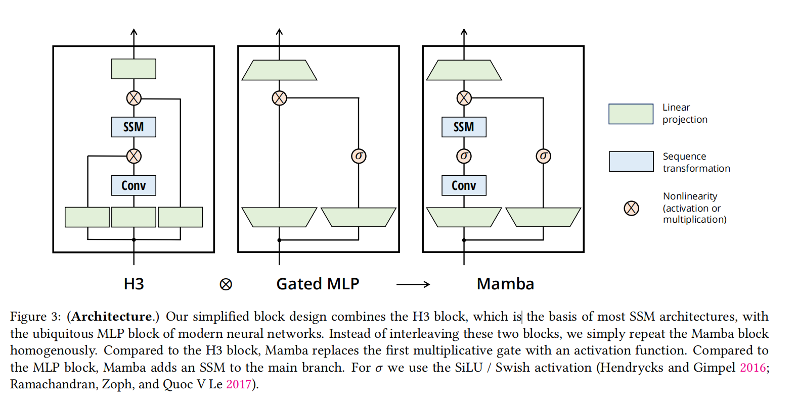

<h1>Mamba笔记</h1>

[原文](https://arxiv.org/pdf/2312.00752)

<h2>State Space Models</h2>

.png)

$A,B,\Delta$ 都是固定的参数

所以新的隐藏状态由图左边得来：

$h^{'}(t)=Ah(t)+Bx(t)$

A,B都是固定的张量

输出又由一个张量C得来：

$y(t)=Ch(t)$

但是不止于此，还有一个离散化 **Discretization** 的操作

给定 $(\Delta,A,B)$, 原本 连续的参数，将它离散化

原话：The first stage transforms the “continuous parameters” (Δ, 𝑨, 𝑩) to “discrete parameters” (𝑨, 𝑩) through fixed formulas

$\bar{A}=f_A(\Delta,A),\bar{B}=f_B(\Delta,A,B)$

上面的两个函数被称为离散法则 discretization rule

<h3>有必要的题外话</h3>

**为什么要离散化？**

因为数据是离散的

而时间模型是连续的，所以要让模型转化为离散的对接

离散化将连续系统映射到离散时间，使得模型接口与 Transformer 等常见序列模型保持一致，能够直接处理数字化后的序列数据。

视频是一帧一帧输入的，严格的数学定义上来讲：它是离散

t=0,t=1,t=2的视频帧

但是高数上对于连续的定义不是：处处极限存在且等于极限处的值

所以要将连续的转化为离散的跳步（时间帧）

离散化讲得具体点，就好比泰勒展开式：

$f(x)=\sum_{i=1}^{n} \frac{f^{(i)}(a)}{i!}(x-a)^{i}$

其中a是函数曲线上某一点

慢慢感受吧，就是类似这种把连续的函数用离散的量去逼近替代

至于如何离散化？用一个叫做*zero-order hold* （ZOH） 的方式来

$\bar{A}=exp(\Delta A)\quad \bar{B}=(\Delta)^{-1}(exp(\Delta A)-I)\cdot \Delta B$

然后论文提出：离散化可以赋予额外的属性：如自动保障模型得当标准化

OK!k看完**蓝色高端论坛逼乎大神**的讲解，[知乎](https://zhuanlan.zhihu.com/p/680846351) ，以及AI逐步解释，这下真懂了：

A矩阵可以理解为dp中的状态转移方程，不过他是evolution matirx，它是一个可学习的矩阵

$h^{'}(t)=Ah(t)+Bx(t)$

只知道初始化的隐状态 $h_0$，以及整段时间内输入x，那么它就像dp一样优雅

$h^{'}(t)$  是指导数，可以用这个去估测曲线的趋势，走向，这意味着：

计算出它后又可以用来更新下一步的 $h(t)$ 

这样子就可以迭代出整个时间序列的所有隐状态

然后输出是根据该点的隐状态，状态转移出

$y_t=Ch_t$

然后回到离散化：

**这个 $\Delta$ 是什么意思呢？**

首先它的作用是：

取值直接决定每一步状态更新的幅度和方向，从而控制模型在各个时间步之间的记忆保持（slow dynamics）与新信息辨别（rapid transitions）之间的平衡

较大的 Δ 会使得 $\bar A = \exp(A\Delta)$ 更接近单位矩阵，从而在多个时间步之间保留更多历史信息；较小的 Δ 则加速信息衰减，帮助模型舍弃过时信息

（不像大多数的dp,直接按照固定的时间步，严格的状态转移方程，不断更新推进新状态，没有更新尺度大小这么一个抽象概念）

<h3>这么一通操作为什么能去拟合?</h3>

还是逼乎大神的那个例子：

给定弹簧-质量-阻尼的模型

（阻尼大小f=bv和速度成正比)

那么在光滑水平面上，弹簧一端如果接着墙壁，另一段连接着质量为m的小木块，给定一个外力F，水平外拉

且指导外力F随时间变化的函数为 F(t)

.png)

那么显然有：

$F-kx-bv=ma$

（x是拉伸或压缩后质点位置相较与弹簧自然无形变时质点的偏移量）

然后有：

$ma+kx+bv=F$

现在我们关心的，需要的输出如果是：x，位移量，输入的是F的大小

那么：
$$
\begin{bmatrix}
  x \\
  v 
\end{bmatrix}^{'}=\begin{bmatrix}
  v \\
  a 
\end{bmatrix}=
\begin{bmatrix}
	0 & 1\\
	-\frac{k}{M} & \frac{b}{M}
\end{bmatrix}
\begin{bmatrix}
	x \\
	v
\end{bmatrix}+
\begin{bmatrix}
	0\\
	\frac{1}{M}
\end{bmatrix}F
$$
x,v是这个系统本身所带的一种属性，一种状态，它所乘的矩阵中全是常数

上面是针对某一时刻的，如果放宽，而且令x,v为h(t)，那么

$$
h^{'}(t)=
\begin{bmatrix}
	0 & 1\\
	-\frac{k}{M} & \frac{b}{M}
\end{bmatrix}
h(t)+
\begin{bmatrix}
	0\\
	\frac{1}{M}
\end{bmatrix}F
$$
再来比较：

$h^{'}(t)=Ah(t)=Bx(t)$

隐藏状态的运算这下理解了

再来看输出的运算：

$$
x
=
\begin{bmatrix}
	1 & 0
\end{bmatrix}
\begin{bmatrix}
 	x\\
 	v
\end{bmatrix}
+[0]F(t)
$$
再来比较输出

$y(t)=Ch(t)$

<h2>Selective State Space Models</h2>

在原本的SSM基础上加入选择性：

原来的SSM:同一套参数在任意位置都“怎么看都一样”原本的SSM

而这中随着时间不变的，固定的参数：

$(A,B,\Delta)$ 也称为 **LTI(Linear Time Invariance)**(同样 $(\bar{A},\bar{B})$)

但现在：不同位置、不同输入对应不同参数

$s_B(x),s_C(x)$ 决定 $x_t$ 如何输入到隐藏状态， $s_C(x)$ 决定隐藏状态如何输出到输出y

.png)

<h3>选择性机制的可解释性</h3>

**总的来说：**

1.选择机制允许模型**过滤掉**那些在关注序列要素之间出现的“噪声”标记。

2.选择性模型可**随时重置**其内部状态，除去多余历史，从而使得性能可以随着上下文长度单调提升

3.Transformer 可通过特殊的 attention mask 来保持序列边界，而 LTI 模型会**跨序列泄露**信息。选择性 SSM 可在边界处将状态重置，消除序列间的“信息串联”

**Mamba模型的核心创新在于引入了选择性机制，这一机制通过使SSM参数依赖于输入，使得模型可以根据不同的输入动态调整其行为。**
