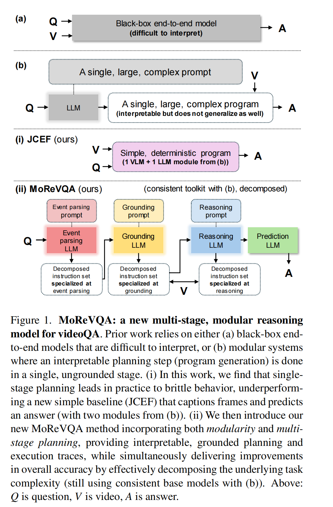
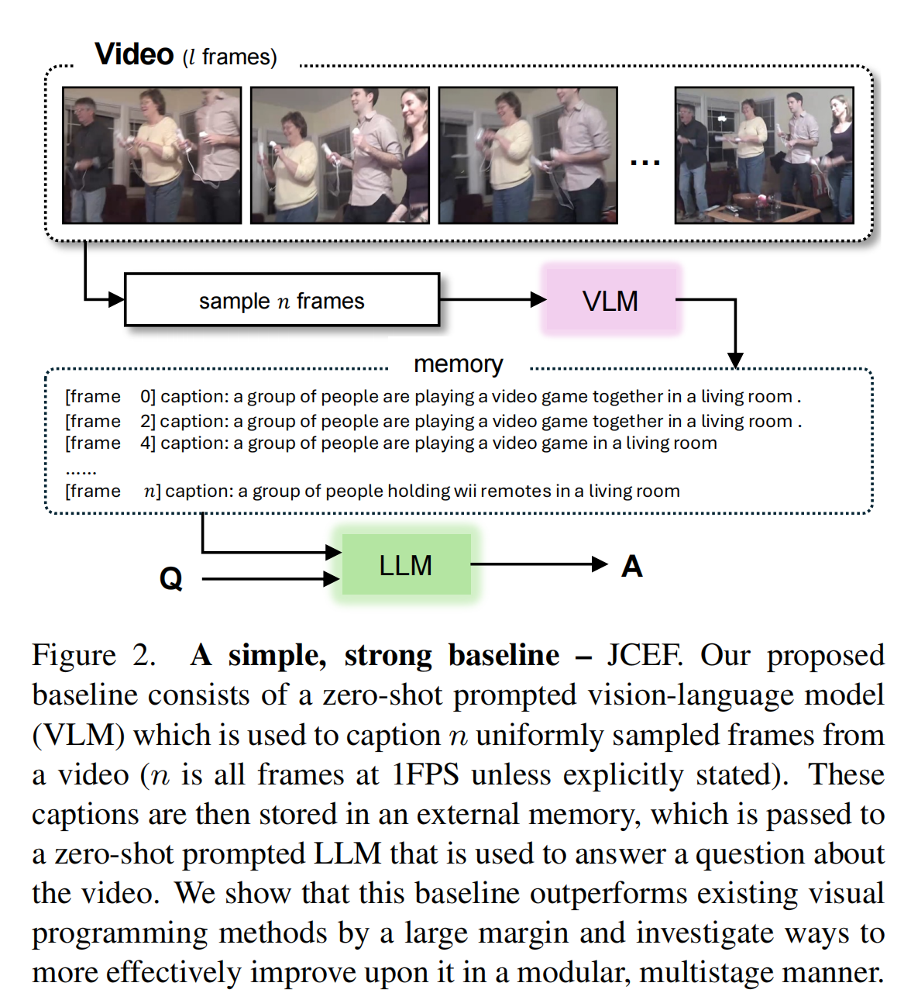
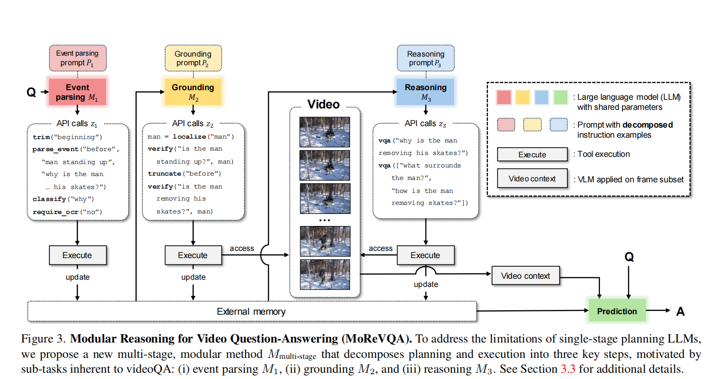
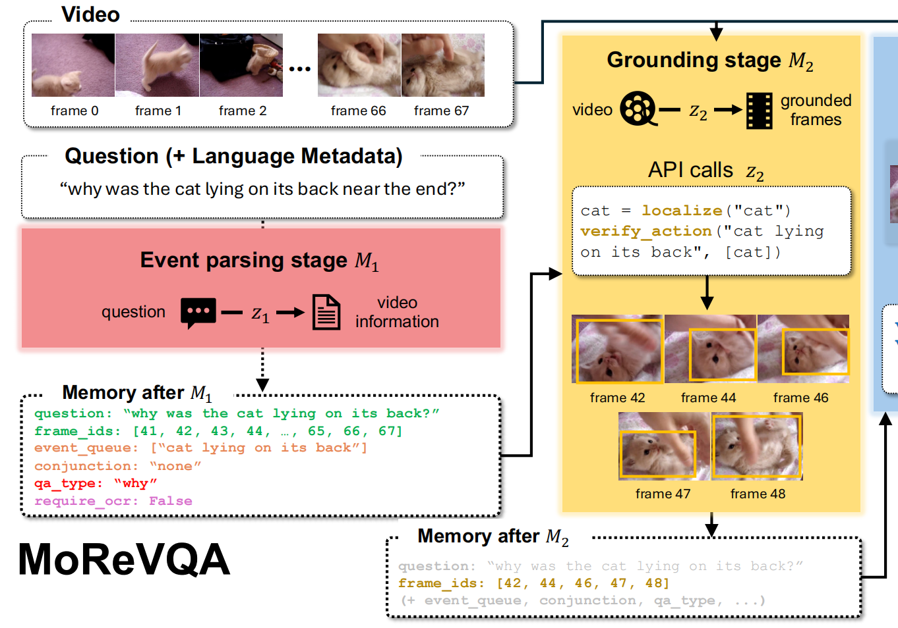
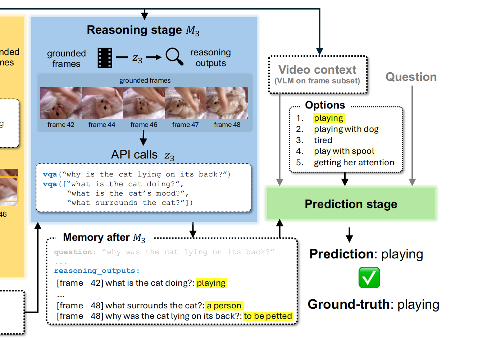
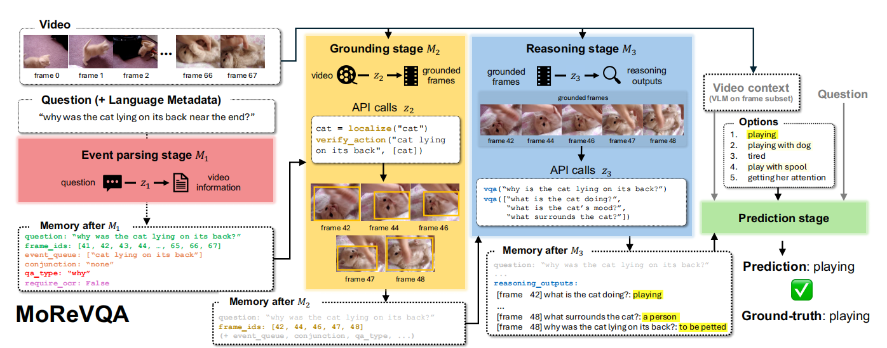
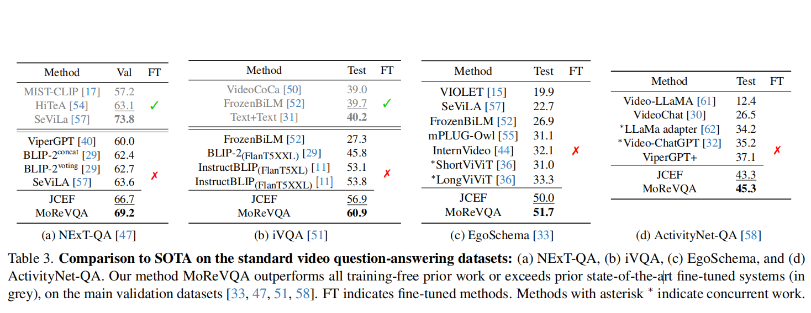

<font size=8>MoReVQA笔记</font>


<font size=5>**1. Introduction**</font>

需求:理解各种时间规模下的事件能力，以及对以往端到端，缺乏解释性的缺陷



虽然JCEF的表现优良，但是相较于modular method的模型，可解释性较差




对于MoReVQA,主要三步走：
1）事件分析(event parsing)，问题拆解

2）落地(grounding)，辨识视频中相应的时间内容并为之调用工具

3）推理(reasoning)， 结合其他模块或API的输出以及共享记忆，给出最终答案


<font size=5>**3. Technical Approach**</font>

**ViperGPT**

$$M_{single-stage}:\pi(Q,P)->z(V,Q,[A_{cands}];L)->A$$

$\pi$ 则是单阶段生成程序，程序生成器 $\pi$ 被实例化为一个代码微调的LLM，用来将Q:query和P:prompt 生成可执行程序z

z可以是python也可以是自然语言

L是API模块库


**MoReVQA**



Video context经过推理后生成的答案并结合了从视频中均匀采样生成n帧的注释文字的纯文本内容


如果问题简单，那么可以给组件“不操作”的指令

如果问题复杂，那么有对应更复杂的指令集去操作


```
个人观点：

（如果确实有效）那么，应该得益于：

1.以问题为引导地先去拆解问题所关注的信息，避免上来就对video提取而信息冗余，或者说是一些关注到的信息没抓到，抓到了的很重要的信息又淹没在平平无奇的特征中

2.根据上上篇论文（ICL-VQA）的研究，视觉与语言的编码能力并不对等，语言模型参数更大，能力更强，将视频帧采取均匀抽样然后用其caption内容来代替其视觉信息特征的方法，恐怕比作video encode后直接给最终prediction更好。将LLM的优势很好的利用起来。

3.流程上它是非常讲逻辑的，这种一步一步的方式，机器较难去shot-cut effect（捷径效应），缺点也很明显，计算量大，而且如果要train组件的话，难度也不小

4.与其说是external memory的设计带来灵活性，不如说这种方式是一种针对VideoQA的巨型prompt engineer，external memory是prompt
```


详细：








<font size=5>**比较结果**</font>




Training free,表现优良。可惜，代码没公开