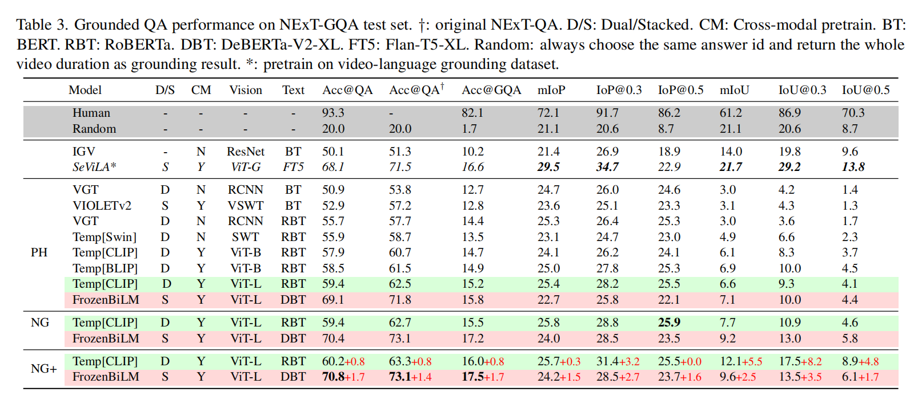

NExT-GQA笔记

[Can I Trust Your Answer? Visually Grounded Video Question Answering](https://openaccess.thecvf.com/content/CVPR2024/papers/Xiao_Can_I_Trust_Your_Answer_Visually_Grounded_Video_Question_Answering_CVPR_2024_paper.pdf)

局限性：

问答任务上表现出色，但在为答案提供有力支撑方面却极为薄弱。

没有真正学习到因果的视觉内容，反而聚焦在语言的捷径中与不相关的视觉上下文

1 Introduction

BlinQA：纯语言模型

与SOTA VLM中，BlindQA模型在正确答案共享62.5%，错误答案共享79%

如果添加单帧粗视觉信号，重合率会变大

当前SOTA的问答准确率达到 69%，但其中只有 16% 的正确预测答案是基于视频内容的。相比之下，人类在正确回答的问题中，有 82% 能够找到对应的视觉依据，且正确回答率为 93%。

提出方法：

在不需要额外的时间标签下，通过VQA与QA的监督下优化轻量级transformer层，以此在视频时间维度上去学习可微高斯掩码

3.NExT-GQA Dataset

**Label Analysis**.

大多数片段少于15秒，平均7秒

分布：

**4. Weakly-Supervised Grounding in VideoQA**

*VideoQA*:

*Weakly Grounded VideoQA*

三种方法：
Post-hoc(PH):通过时间注意力机制，获取最大的注意力值的片段，然后对齐周围进行阀值处理，以此获得时间间隔片段

对于dual architecture，使用attention-pooling从时间transformer来总结输出

对于stacked architecture，直接返回预测的token对应的多头注意力值

Naive Gaussian(NG):

$a^*, t^*=argmax_{a\in A} \Phi(a|v_t,q,A)\Phi(t|v,q)$

t是整个视频序列的可微高斯权重

$\mu$ 和 $\sigma$ 是两个可学的高斯参数

推理阶段的定位：

$t=(\mu-\gamma\sigma,\mu+\gamma\sigma)*d$

$\gamma$ 是超参数控制置信区间的宽度

$d$ 是视频的长度

NG+

设计了一个辅助的目标，在跨模态自监督下调整VQA目标向更视觉具视觉依据的定位的QA发展

负样本：

1）在同样的视频中定义的其他问题被视为hard negatives

**因为大部分的问题对应的视频片段是独立的**

2）从其他视频采样的问题

*以及注意：*

作者通过使用 GPT-4对每个问题进行改写，最多生成 5 个额外问题，从而对 10% 的正样本问题进行扩充

$a^*,t^*=argmax_{a\in A} \Phi(a|v_t,q^+,A)\Phi(t|v,q^+)+\alpha argmax_{a\in A} \Phi(q^+|v_t,q^+,A)\Phi(t|v,q^+)$

前部分是GroundQA,后部分是Grounding

前部分预测答案，并且通过答案优化视频节点

后部分去确定和问题相关的视频时间节点

5. Experiments

**5.2. Result and Analysis**

Q1：回答都有基于视觉定位吗？

省流：大部分没有

具体：在QA达到超过50%正确率的情况下，基于定位的问答准确率却都无法超过 12%-16%

并且：人工检测了（原文：我们对 10% 的测试数据进行了人工评估，以估计性能上限。研究表明，参与者正确回答了 93% 的问题，其中 82% 在视觉上有定位。）

所以：认为这些模型的大多数答案并非基于相关视频内容，而更可能来自语言捷径或与不相关视觉上下文的虚假关联。

*而且有趣的是：*

让VLM直接从PosQA和NegQA取样，相较于一般的均匀采样，表现基本没啥影响

Q2:QA好就意味着定位好吗？

省流：非也

Q3:高斯掩码有用？

省流：有

