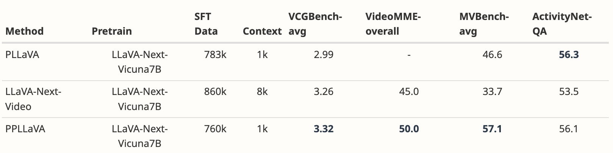

<font size=8>PPLAVA笔记</font>


[原文](https://arxiv.org/abs/2404.16994)


<font size=5>1 Introduction</font>

<font color=blue>对于时间维度建模</font>

1.对于记忆力机制(memory mechanisms)的锐评：

虽然能够应付小时级别的视频，但在短视频上功效有限

2.使用额外的token池化和聚集


*引入：*

如何减少token的数目同时保留时间上的建模能力？

很多研究表明：

视频包含着很多冗余的信息，关键信息就在那么关键几帧上


*表现*


Image llm两个流派：

BLIP

LLaVA

虽然研究证明：线性映射能够少训练，高效果

BLIP的优点：

显著减少转化为query token后的视觉token

更精准的与使用者指令相关的视频特征


<font size=5>2 Related Works</font>

**Video LLMs**

ChatUniVi:采取token聚群的方式

LLaMA-VID:压缩相邻两帧的token,获取global information以及local information


在长短视频上都达到SOTA的表现


<font size=5>3 Methodology</font>


**整体流程：**

将文本（问题以及prompt）一起给文本编码器，得到文本特征 $c$ 

将视频经过视觉编码器，然后经过CLIP Visual projection，与文本作对比学习

得到注意力分数 $s$ (令牌与文本)

在用这个注意力分数和原始得到的视觉特征作卷积，以此知道视觉特征，压缩90%视觉信息


视觉特征 $V\in R^{T\times W\times H\times D}$

D是特征维度


video token和文本特征之间注意力分数计算：


$v_{(t,w,h)}$ 是CLIP的倒数第二层来的，而非最后一层的CLS token


*CLIP Context Extension*

（不太理解的part)

比Qformer参数要小，但局限性是：

上下文大小太小，默认为77

大多数情况：随机初始化新的embedding加在位置embedding的末尾

更偏理论的做法是：在原有的位置embedding上以速率r进行线性插值，但是针对这个的实际效果不大行


**Training**

采用现成的模型（CLIP,MLP,LLM），作微调

采用*inerleaving training approach*

每个批次不是单一的数据类型，而是在同批次混合了各种其他的数据类型


<font size=5>4 Experiments</font>


Training:24 小时 16张A100

（打扰了）


快进到rebuttal环节：

为什么被拒了


<font size=5>**Rebuttal**</font>

结果：reject


<font color=green>审稿人1Y1n</font>

```
Soundness: 3: good
Presentation: 3: good
Contribution: 3: good
Rating: 6: marginally above the acceptance threshold
优点：
1.出发点很有趣：将池化用到text-frame的相似度上也有迹可循
2.还提出了应对使用者长输入的方法
3.最终的结果也不错
缺点：
CLIP的 能力是如何影响到模型的表现没有谈到。这个东西的能力对于你模型的影响表现很重要
问题：
参考缺点那部分，是否更强的文本图片匹配编码器会进一步提升模型的表现？
```

<font color=green>回复1Y1n:</font>

```
你说的对，确实文本图片的表现极大程度影响模型上界
我们尝试对这个关键技术作尝试：比如CLIP context extension，所以我们额外提出CLIP context extension 模型

另一方面：text-image匹配编码器实际上依赖于视觉编码器，但是如果我们用新的视觉编码器，得从头训一个新的文本编码器来对齐
并且给上了实验数据
```

结果：保持不变


<font color=blue>审稿人tF5Y</font>

```
Soundness: 3: good
Presentation: 3: good
Contribution: 4: excellent
Rating: 6: marginally above the acceptance threshold
优点：
1.强调了目前video LLMs的局限性，有效地提出解决策略
2.所提出的方法包含三个部分，技术上合理且有迹可循
3.实验强有力
4.分析详细，细节到位
5.写得好，好懂
缺点：
1.图画的有待提升：
图2需要额外添加上下文信息表明视觉编码内容[TOK]和CLIP之间的关系
2.对比貌似不公平，先前的工作都不用DPO的
问题：
所提出的方法是基于图像域的LLaVA，是否可以用到视频域的LLM？
```

<font color=blue>回复tF5Y</font>

```
1.画图我会改
2.其实结果中标记了DPO，同时保留了PPLLaVA未在所有数据集上使用DPO的结果，以确保公平比较，对于不依赖于GPT评估的视频问答任务，DPO的影响不大。
补充实验数据
3.好问题！很多顶级表现的MLMM倾向于直接输入所有视频tokens到LLM中。PPLLAVA可以无缝衔接这些模型，减少视觉上下文,补充实验数据
```


<font color=red>审稿人hDF1</font>

谁家小孩？skip

（作者脾气真可以）


<font color=purple>审稿人vFqm</font>

```
Soundness: 3: good
Presentation: 2: fair
Contribution: 2: fair
Rating: 6: marginally above the acceptance threshold
优点：
1.大量的实验证明其方法的有效性
2.通过池化很有效
3.设计的CLIP内容窗口扩展很聪明
缺点：
2.补充实验，加上两个baseline模型
3.相较于一些零样本推理baseline模型，最大的提升可能源自于微调时候的130万多模态数据带来的效果，你提出的prompt-guided pooling提升可能不明显,换成其他有着长上下文窗口的LLM骨干模型，效果也不会差
```

<font color=purple>回复vFqm</font>



```
2.补充实验
3.也许考虑到训练的时间成本，没有按着审稿人说得来：其他LLM在多模态数据上也训练一番，然后比较
而是：对PPLLAVA不采用多模态数据训练，其他LLM也一样，只给一定数量的instruction tuning data，然后比较：
发现PPLLAVA还是不错,以此自证提升不是完全来自于多模态的数据

回应采用上下文窗口更长的LLM可以提升：
1.这本身就可以，但是过长窗口上下文处理时间太慢，实际中无可能无脑堆上下文窗口。我们的优点，创新性就出来了。
2.一个萝卜一个坑，所以上下文处理视频的数量是有限的，但是我们可以在同样的上下文窗口下，输入更多的视频帧
3.我们把LLM骨干换了之后照样不错，说明我的方法是通用性是有的
```

<font color=purple>审稿人vFqm追评</font>

```
Q1.你的这句话的没有支撑：
“We speculate that when encountering holistic captioning prompts, our method might sample the entire video more uniformly and even adaptively extract video features that are helpful for summarizing the video.”
Q2.为什么相同的LLM骨干上下文长度不同（补充的实验数据的表）
```

<font color=purple>回复vFqm</font>

```
Q1.这个很难定量验证，所以我们采用一些定性的证据，根据一些实例来做出判定
Q2.原本的LLaVA-OneVision已近达到上下文窗口的最大限制，而我们上下文窗口进行了扩展，其中：上下文窗口越大，效率越高，而我们由于计算资源有限，只能列出以上不同上下文窗口的实验内容
```


<font color=orange>审稿人Qkbp</font>

```
Soundness: 3: good
Presentation: 3: good
Contribution: 2: fair
Rating: 3: reject, not good enough
缺点：
1.相比无需训练的SLOWFAST-LLAVA，在benchmark上表现没有多少领先
2.你用的DPO,PPO没创新。别人用这个就提升很大
提问：
1.你来说说你和和involution kernel的区别
2.消融实验上：你有试过将3D卷积池化来替代你的方法吗？
3.PPLLAVA可以扩展到多模态生成模型上去吗？
```

(怎么感觉这厮的strengths是要AI写的，自己随便搞点weakness和questions,感觉有点来挑刺的)

<font color=orange>回复Qkbp</font>

```
暴力回复：
Thank you for the comments. We are shocked and disheartened by the reviewer's reasons for rejecting our paper. We believe there exist some misunderstandings. We have addressed all of your concerns point by point below. 
```

后续作者一通教小孩，审稿人装疯卖傻

Skip
