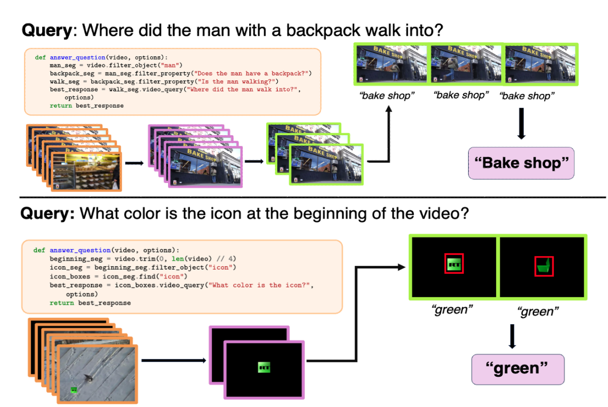
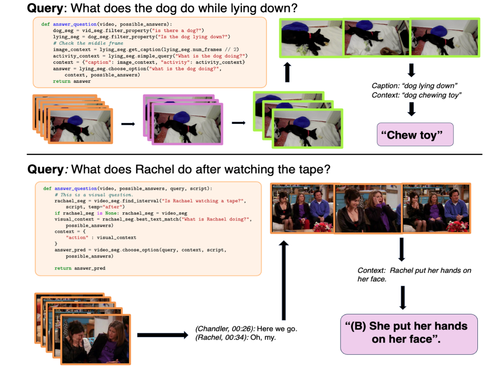
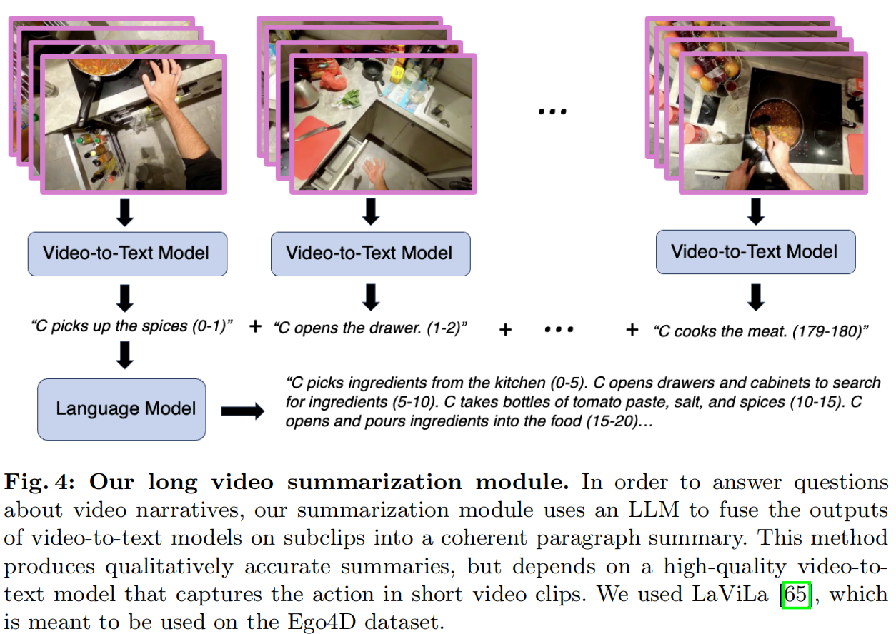
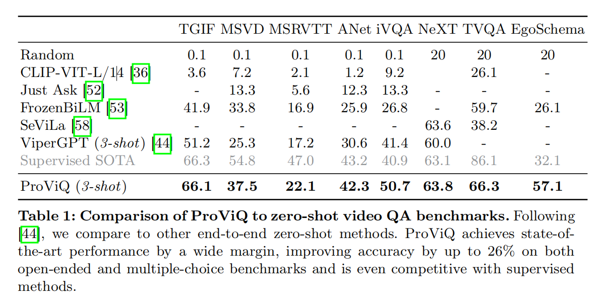

Proviq笔记

[原文](https://www.ecva.net/papers/eccv_2024/papers_ECCV/papers/05543.pdf)

**1 Introduction**

引入视觉中心的API模块，并给LLM输入的查询，上下文实例

LLM就以此生成一个python程序来使用那些video模块并执行，获得最终答案

（还是经典的问题拆解的老一套）

模块包括能够：视频检索，注释，总结以及多物体跟踪，以及基于图像的任务（如目标检测、分割和字幕生成）模块

**2 Related Work**

相比于其他video的任务，VideoQA多为在一个大数据集上预训练后再在小的标注QA数据集上作微调

诸如InternVideo,InternVid以及mPLUG-Owl将训练量增大，但是在zero-shot下泛化能力依然存在不足

于是有诸如BLIP，现在三元组(image,question,answer)上训练后再在videoQA作迁移学习

**3 Method**

视频以及问题输入进来后，构建一个包含video module，输入查询，任务的列表以及部分实例程序的prompt，然后将其输入给LLM

`filter_property` 给定bool型判断，找到所有满足要求的（布尔为1）的视频帧

`filter_object` 返回所有需要查找问题的视频帧，相比上一个，用这个函数去查找物体更好

`find` 也称为:`text-conditioned object detector` 返回查找到的视频帧中剪切下来的物体

`track_query` 给定一组连续帧上的检测结果，返回场景中每个跟踪对象。

`video_query` 计算每一帧的答案，然后整合在一起，给出最突出的答案

`get_summary` 使用video captioning model生成视频事件的总体段落摘要。对于高层次叙述结构的视频效果好,尤其是长切片

`get_script` 计算出音频的转录或返回已存在的转录

`get_caption` 给出输入图片或视频帧集的注解

`best_text_match` 在给定视频片段和选项时，返回最匹配的选项

`choose_option` 和上一个区别是：输入上下文可以是视觉的，也可以是文本的，使用get_script和get_summary后用来作推理

图片示例：

**Long Video Summarization**

`get_summary()`利用预训练的video-to-text的模型来理解

可以做到总结5分钟的视频

但是！除开在有着密集注释量的Ego4D数据集上效果好，对于其他数据集，由于极大程度上受到video captioning model的影响，在没有那么多标注的数据集上效果则不行

**Prompting and In-Context Examples**

采用VISPROG和CodeVQA的做法，为每个benchmark标注五个实例程序

在推理阶段，选取最合适的三个

**Open-Ended and Multiple-Choice Benchmarks**

对于选择题，直接采用 `choose_option()` 而对于open-ender benchmark

则是制定为K路分类题，K范围在几千，从语义表中选取最相近的来生成字符串

**4 Experiments**

总结：各项benchmark全SOTA

而且相比于ViperGPT,它生成的代码更简洁且鲁棒性更高

Just Ask和FrozenBiLM对每一帧进行处理但是对于更细致的片段处理则不到位

泛化性好，无需额外训练，还可以执行不止QA的任务：

内容跟踪，视频编辑

**Limitations：**

在缺少有用的上下文示范时效果会差些

虽然比其他类似做法速度快，但是比端到端的模型要慢