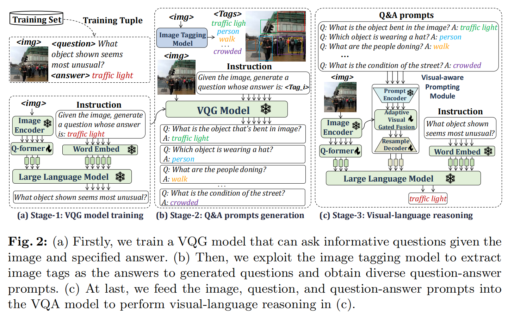
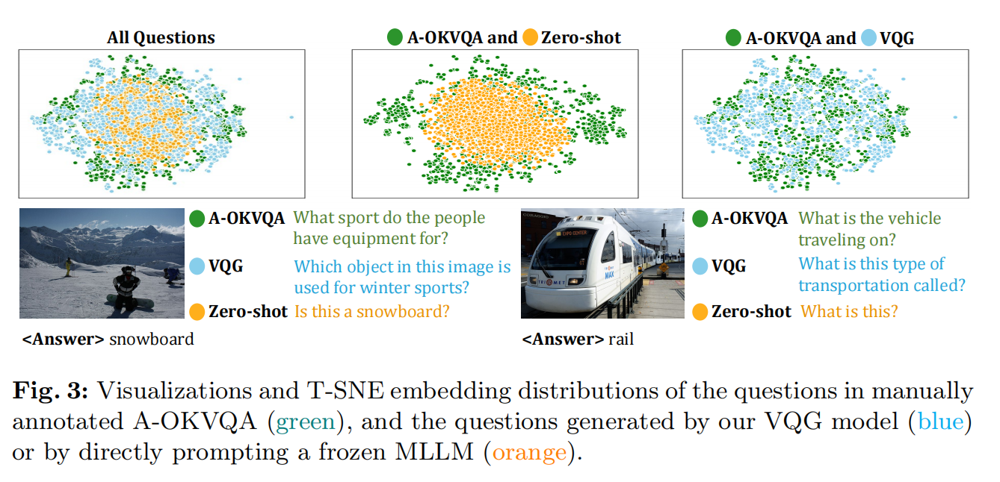
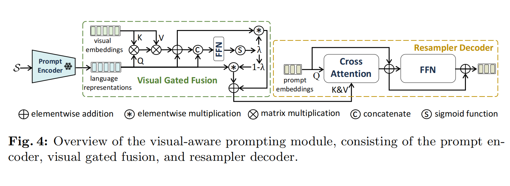
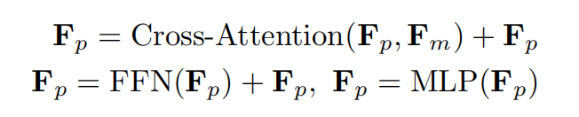
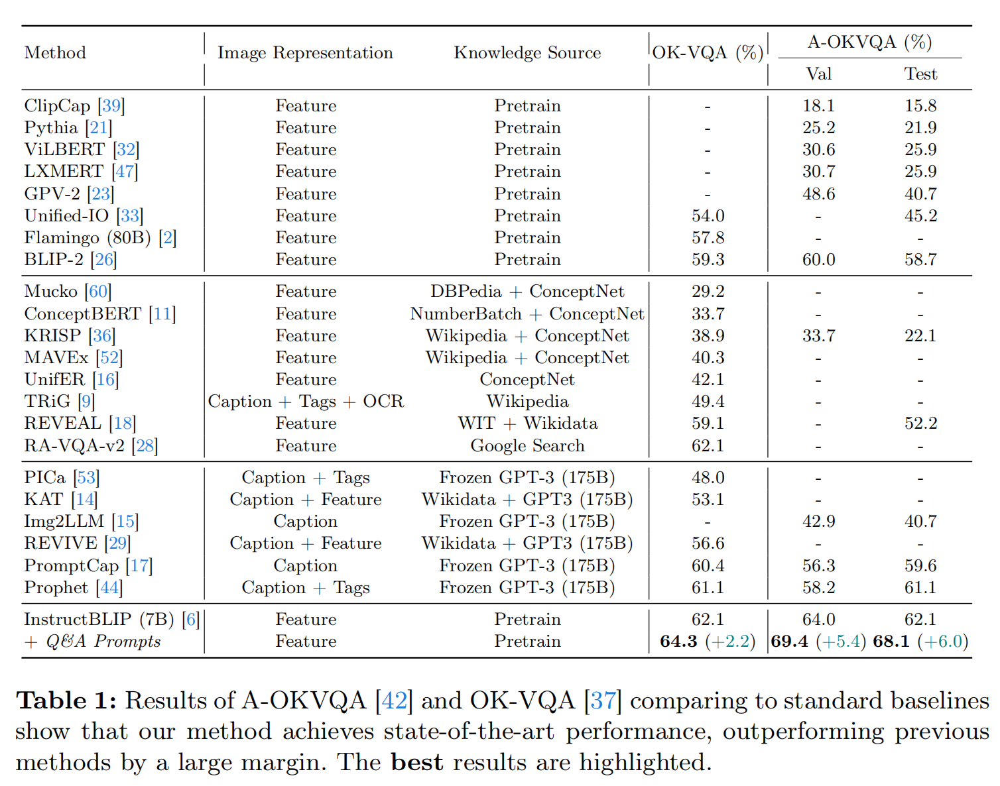

QA-Prompts笔记

[原文](https://arxiv.org/pdf/2401.10712)

提供更多的视觉线索让模型更有可能去推理出正确答案

所以通过先训练出一个能够根据图片以及答案生成问题的模型VQG，然后利用这个模型，在接收到图片以及图片中对应的一些tag时（其实这些tag指让他们作为答案），去生成问题，然后再将这些生成的QA作为prompt来生成答案

其实这种方法，本质是在去作更多的空间信息提取

**2 Related Work**

VQA Requiring Reasoning over Diverse World Knowledge.:

不同于传统VQA，需要推理世界知识的 VQA 涉及推断意图、目标、世界的物理规律以及个体的社会动态

1.将图像转换为自然语言并构建格式模版以提供给LLM作为上下文学习

2.直接编码问题并从外部知识库中检索相关知识，以训练端到端模型。

Visual Question Generation:

各种研究在 VQA 任务的背景下探索VQG。SQuINT和 SelTDA专注于数据集增强，以提高 VQA 模型的泛化能力

另一项研究使用 VQG 模型生成信息丰富的子问题。这些子问题随后与原始问题一起在推理过程中使用

**3 Method**

**3.1 Stage-1: Train the VQG Model**

如果不训练VQG，直接使用会面临生成的问题过于宽泛（`what is this?`

`Is this a snowboard` 这类宽泛提问），以及问题多样性不足，这两个问题

训练时采用autoregressively 

**3.2 Stage-2: Generate Question-Answer Prompts**

不同于object detector只能识别出有限的物体标签

采用的image tagging model旨在识别出图片中各式各样开放式词汇元素，属性，物体，行动，场景都可以做到。（好！好就对了）

采用RAM作为image tagging model

并且将target question与generated questions作相似度计算，只取前P个座位prompt

**3.3 Stage-3: Reasoning with Q&A Prompts**

将视觉信息编码后经过MLP得到K,V

Q则是文本编码

$F^{attn}_v=Q+Softmax(\frac{QK^T}{\sqrt{d_q}})V, F^{attn}_v\in R^{L_s \times d_q}$

$\lambda=Sigmoid(F_sW_s+F^{attn}_vW_v)$

$F_m=(1-\lambda)F_s+\lambda F^{attn}_v$

莫忘记 $F_s$ 就是promp编码后的输出，也就是Q

但是由于 $F_s$ 太长了，无法直接拿去用,计算负担太大以及对目标问题干扰

所以将 $F_m$ 投射到小规格的prompt embedding $F_s$

$F_P$ 是可学习的embeddings

**4 Experiments**

