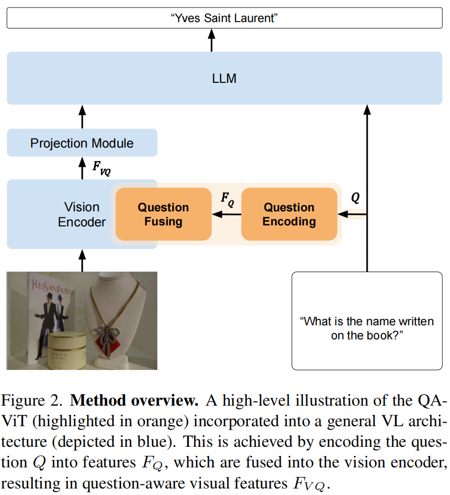
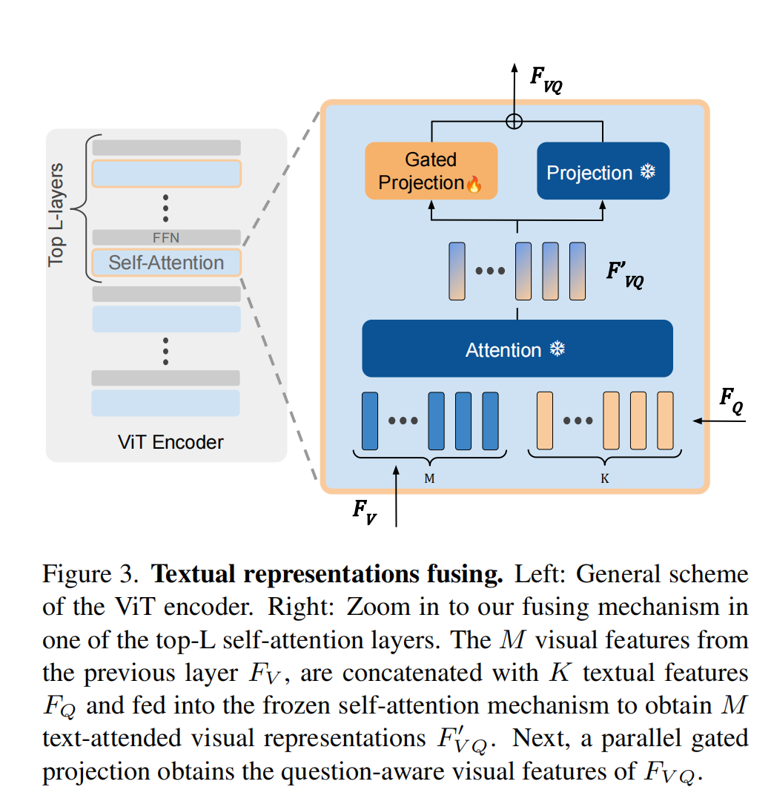
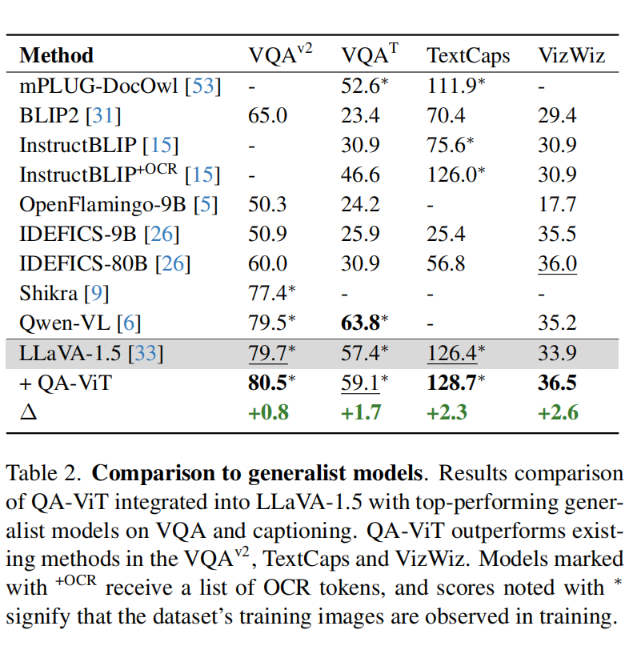

<font size=8>QA-ViT笔记</font>

[原文](https://openaccess.thecvf.com/content/CVPR2024/papers/Ganz_Question_Aware_Vision_Transformer_for_Multimodal_Reasoning_CVPR_2024_paper.pdf)

提出的方法：将问题感知嵌入到视觉编码器中


<font size=5>**1. Introduction**</font>

以往的局限性：
视觉编码器输出固定大小的特征序列，这些特征中编码的信息量是有限的。由于抽象级别相对较高，它可能会忽略图像中低级别细节。这种忽视在需要细致图像理解以准确回答查询的场景中尤为突出



虽然基线模型倾向于偏爱高级抽象特征，即使是在提示区域特定描述时，QA-ViT 则显著更多地关注图像的相关部分。


<font size=5>**3. Method**</font>

**Representation Projection.** 

为了更好的将文本表示与视觉模型的调整空间对齐，所以由视觉模型分层结构这一点出发，采取对文本空间每一层进行MLP映射

$F^{i}_Q$ 即是第i层的文本空间表示, $\xi$ 是文本编码器

$F^i_Q=MLP^i(\xi(Q))$

**Question Fusing**



在ViT的基础上，取最后的L层的self-attention层，直接将文本特征与视觉特征连接，在原有的投影层的基础上，并行加入一个可学习的门控机制


划重点：

```
这个模块补偿了在冻结的自注意力层中融入问题信息导致的分布偏移。这种门控的目的是实现残差投影信息与现有信息的逐渐融合，避免显著的特征修改和整体性能的下降
```

$F_{VQ}=P(F^{'}_{VQ})+P_{g}(F^{'}_{VQ})*tanh(\beta)$

$\beta$ 是可学参数


<font size=5>**4. Experiments**</font>

尽管 QA-ViT 是一种模型无关的方法，可以集成到任何 VL 模型中

