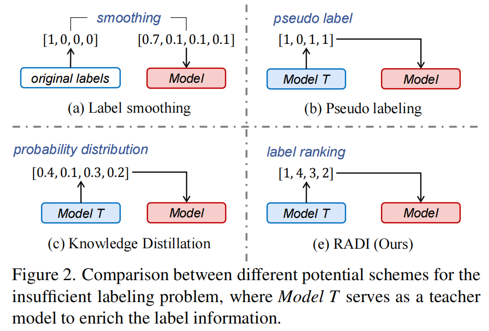
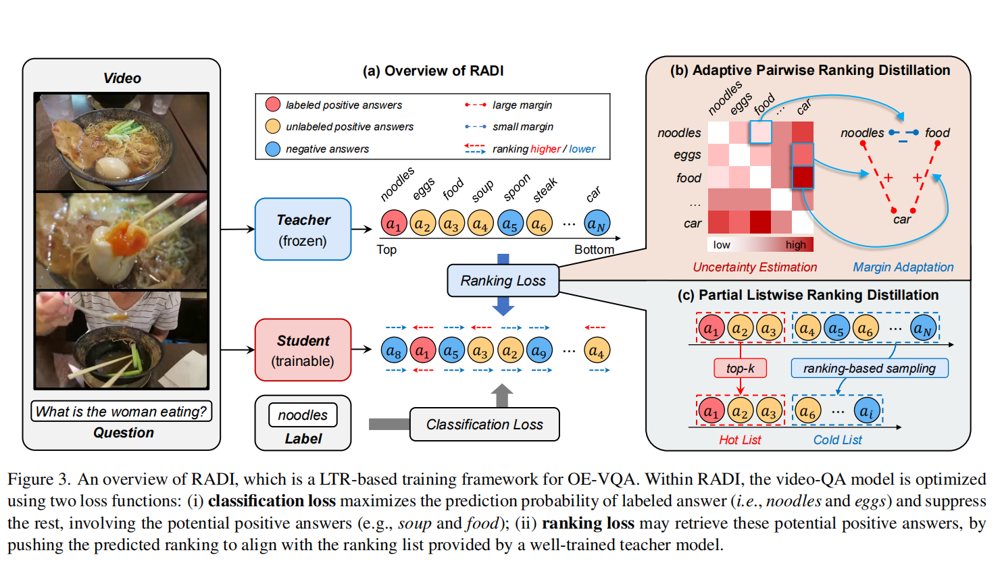
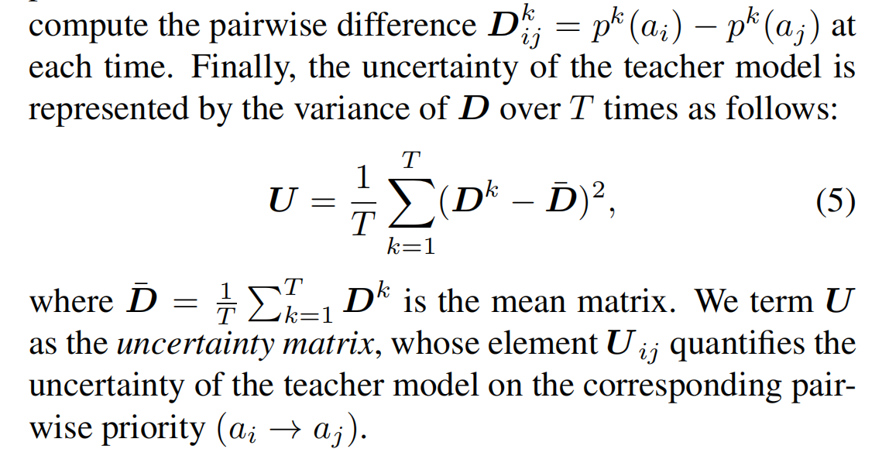
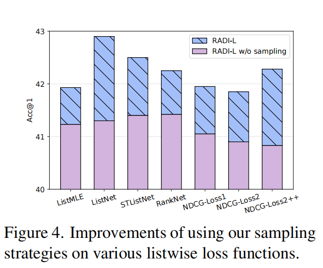
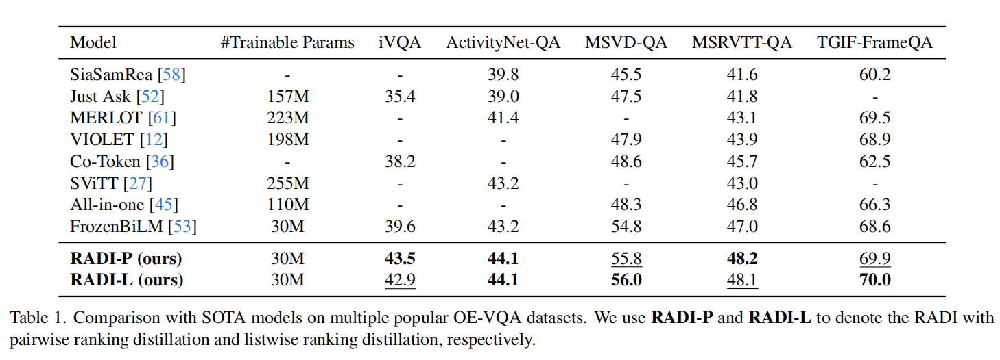

RADI笔记

[原文](https://openaccess.thecvf.com/content/CVPR2024/papers/Liang_Ranking_Distillation_for_Open-Ended_Video_Question_Answering_with_Insufficient_Labels_CVPR_2024_paper.pdf)

**解决了什么**

如果我们要给一个视频多个lable标注是很困难的，数据集上大多都是一个视频一个label,这使得其他未被标签的答案全部视为负标签(negative label)

对于开放式回答的videoQA,这是不合理的，还有很多未被标注的答案它也合理正确

**1. Introduction**

应将OE-VideoQA任务视作标签不充分的问题

四种方法：

**1.** *label smoothing* 缺点在于：负标签平等对待

**2.** *Pseudo labeling* 用一个训练好的模型来生成伪标签，但是问题在于如若错误的正标签逐渐堆积，会带来很大的噪音（也就是对生成伪标签生成质量的依赖）

**3.** *Distribution distillation* 使用教师模型的软标签来让学生学，但是教师模型毕竟不是ground truth,加上问题本身的标签不足更加难以使得教师模型能够给出高质量的指导。而且*distribution distillation* 对于噪声和偏差很敏感

但是用RADI，面对标签不充分，鲁棒性更强

引入 *pairwise ranking distillation* 与 *listwise ranking distillation* 

*pairwise approach* 通过pairwise比较去学习相对优先级

*listwise approach* 去学习绝对次序

**2. Related Work**

从任务分类上可以将videoQA分为：

*multiple-choice task* 与*open-ended task*

**Knowledge distillation** (KD):KD有三种形式

`distribution distillation` 蒸馏输出的概率分布

`feature distillation` 蒸馏中间层特征

`relation distillation` 蒸馏不同层以及数据样本间的特征关系

distribution distillation强调标签关系学习

后两者专注于特征学习

**Learning to rank**(LTR)

三种方式：`pointwise` `pairwise` `listwise`

pointwise:对每个个体单独做回归或分类,缺点在于忽视了个体之间的关系，效果次优，现在也不咋用了

pairwise:专注于个体之间的相对次序

listwise:整个序列的绝对次序

**3. Ranking Distillation for OE-VQA**

*framwork:*

**3.2. Adaptive Pairwise Ranking Distillation**

原本ranking loss写为：

$L_{p}=\frac{1}{|R_{p}|} \sum_{(a_{i},a_{j})\in R_{p}} max\{ 0,m-(p_{s}(a_{i})-p_{s}(a_{j}))\}$

$R_{p}=\{(a_{i},a_{j})|p_{T}(a_{i})>p_{T}(a_{j})\}$

其中m常被称为 `hard margin`， 控制排序关系的强度，通常为1

这其实也是就是 `Hinge loss(Margin Ranking Loss)`

也可写为：

$L(x_{i},x_{j})=max(0,m-(s(x_{i})-s(x_{j}))*y_{ij})$

$y_{ij}$ 是样本真实排序关系，这里是老师的排序关系

如果 $s_{i}$ 的次序大于 $s_{j}$ 那么即预测i的次序大于j

如果 $y_{ij}$ 为1，即i的次序大于j

此时对于 $L_{p}$ ，如果要尽可能地小，那么需要学生网络尽可能地趋近于教师网络，但是教师网络本身局限性很大，所以固定死m这个参数所带来的杂讯可定也很大

所以引入 *Uncertainty estimation* 以及 *Margin adaption*

**Uncertainty estimation.**

采用*Monte Carlo Dropout* 来描述教师网络的不确定性

首先 $p^{k}(a)$ 为在第k次预测分数a所对应的概率

那么：

用第k次的gap与前T次的平均gap来衡量这种不确定性

**Margin adaptation.**

通过最小化不确定性来实现自适应margin

然后利用Sinkhorn算法解决：给定不确定矩阵U和光滑系数，返回soft margins：

$M_{ij}=m*W_{ij}$

另一方面：

**3.3. Partial Listwise Ranking Distillation**

为了减少排序的偏差，采取只蒸馏一部分排序信息

选取top-k答案作为hot list

然后在剩余的答案中采样作为cold list

构建cold list时候有两种方式：

`Exp-sampling`  $p_{k}\propto e^{-\alpha k}$

`Zipf-sampling` $p_{k}\propto k^{-\alpha}$

对于列表损失函数有：**ListMLE**,**ListNet**,**STListNet**,**LambdaLoss**

再回到overall framework:

**3.1. Overall Framework of RADI**

先train教师模型，典型的分类：

$L_{cls} (T|A_{x})=-\frac{1}{|A_{x}|}\sum_{a\in A_{x}} log P_{T}(a|x)$

然后再train学生模型：

$L_{x}=L_{cls}(S|A_{x})+\alpha L_{rank}(S|R_{x})$

**4. Experiments**

除了iVQA为每个样本标注了五个真实答案外，其他数据集每个样本仅提供一个答案。

