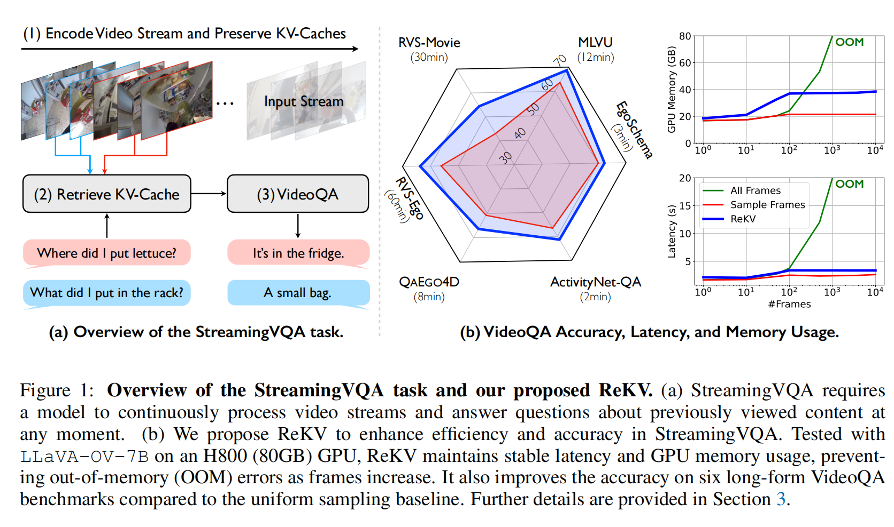
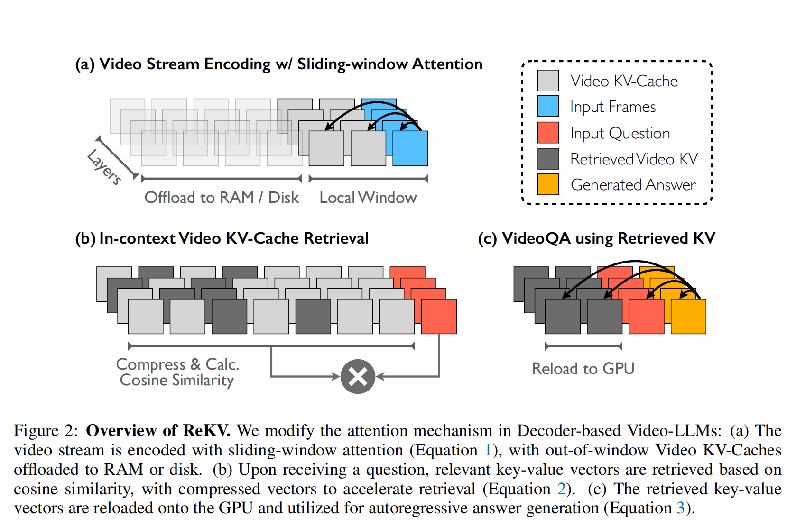
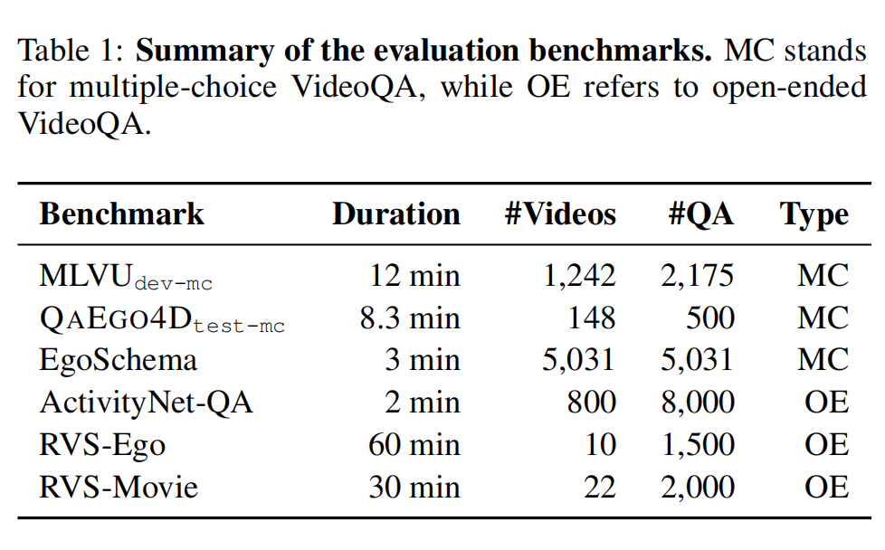
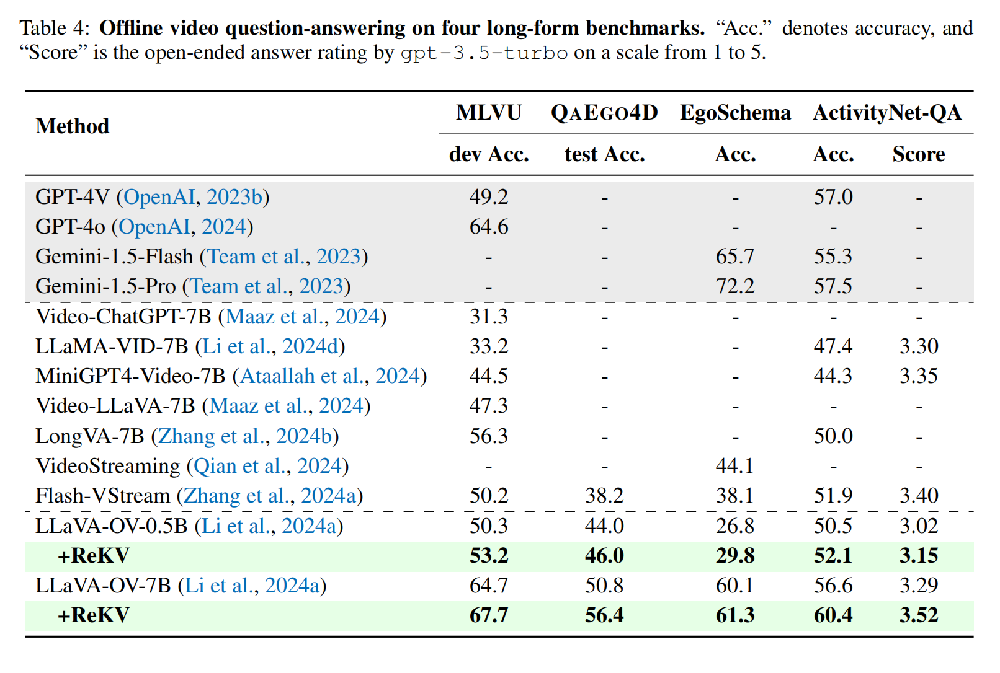

<font size=8>ReKV笔记</font>


需求：

1)高效编码，不同于离线VideoQA,无法完全获得视频片段，只能看到某个时间节点之前的所有clip

2)保存相关信息片段，并且需求时长时VideoQA

3)实时响应


**ReKV**

对于长短期记忆，短期记忆通过滑动窗口的causal attention机制来限制token的数量

对于长期记忆，动态检索，同时会把键值对存储在RAM以及cache中，一方面避免重复计算，一方面避免对于长视频损失部分细节信息

对于检索：

只检索一定数量的与当前问题相关的KV-Cache

检索方法分两种：
1)采用额外的CLIP-like 模型来语义配对(semantic matching)

2)采用额外的注意力权重(好处是更快，更端到端，潜力更大)




<font size=5>2 Method</font>

三步走：

1）*编码*：采用滑动窗口注意力编码，将编码的内容放到RAM或磁盘中

2）*检索*：从KV-Cache中检索因问题相关的键值对向量，以cosine相似度为准（计算前会对输入得到的向量作压缩）

3）*回答*：检索到的键值对向量加载到GPU，作为in-context，然后autoregressive生成答案



**Video Stream Encoding with Sliding-window Attention**

$l_p$ 是历史键值对的长度（图中透明的加灰色的长度）

$l_x$chunk大小，处理是chunk by chunk（一定的块，一块一块地处理）（图中蓝色的大小）

$l_L$ 即window的大小（图中灰色的大小）

则有：

$P=\{(k_i,v_j)\}_{j=1}^{l_P}$    过往键值对向量（灰色和透明的部分）

$X=\{t_{i+l_p}\}_{i=1}^{l_X}$ 当前的token（蓝色的部分）

$L=P_{[l_P-l_L+1:l_P]}$  local key-value vectors（灰色的部分）


$O=Attn(W_QX,[L_k,W_KX],[L_v,W_VX])$

W都是注意力层的参数（权重）

$L_k,L_v$ 都是由 $L$ 的对应key,value向量


**External Video KV-Cache Retrieval.**

采用CLIP-like模型来检索

$Sim(v_t,q_i)=\frac{v_t*q_i}{\tau ||v_t||\quad||q_i||}$

（v,q分别是视频和问题编码后得到的表征）

$\tau$ 是可学习的温度参数


不去token层面计算相似度，而是将一块连续的帧b取来，对其帧向量取平均然后去计算相似度分数

令r为检索到的最相似的视频帧，那么有[r/b]个视频块


**Internal Video KV-Cache Retrieval**

一帧的key vector的平均取一个代表来计算：

$v_t=\frac{1}{N_f}\sum_{j=1}^{N_f}k_j \in R^{D^{'}}$

$N_f$ 是每一帧的token数目，$k_j$ 是第j个key vector

为了减少计算负担，不去作注意力之间的微分，而是将他们直接连接

question vector也采用相似的方法：
$q_i=\frac{1}{N_q}\sum_{k=1}^{N_q}q_{i,k}\in R^{D^{'}}$

相似度的计算方式和上一个一样，不过温度是设置为1


*internal retrieval advantages*:

每一层的注意力独立操作使得不同层检索不同的视频块

（更宽泛地检索）

Internal retrieval再利用已有的隐藏表征(hidden representation)

不需要引入额外的参数，减少计算负担


**Question-answering using Retrieved KV**

将检索到的Video KV-caches作为VideoQA的上下文

$O=Attn(W_QX,[R_k,W_KX],[R_v,W_VX])$

R是上下文的key,value的向量


<font size=5>3 Experiments</font>



具体细节：

H800 GPU

BF16精度

0.5FPS

Window size:15K

external retrieval:SigLIP-SO400M作为retriever

Internal retrieval:b=1(块数) r=64(检索的帧数)





<font size=5>4 Related Work</font>

**Long Video Understanding**

1）尝试将视觉信息转化为密集的文本注释，在有些情况下有不错的结果，但有时会失去重要的视觉细节

2）将长视频压缩为memory bank。这个方法也被融化到Video-LLM来作视频理解（根据视频的处理动态更新记忆）

然而局限性在于：将不同的时长的视频压缩成固定的统一长度。

以及缺乏可解释性


**Retrieval-Augmented Generation**

RAG联合生成模型的检索机制并配合上外部知识，在各式NLP任务以及VL任务上有不错的提升

同时对于in-context检索，逐渐转变为由额外知识输入至文件输入

而in-context KV-Cache检索就进一步提升长文件的预编码的效率


<font size=8>Rebuttal</font>

1. ）

```
Soundness: 2: fair
Presentation: 3: good
Contribution: 1: poor
优点：
1.在long-form benchmarks上，超过了很多video-LLM
2.好follow
3.消融实验做得好
缺点
1.不novel：LLM系统也有用KV-Cache来减少上下文处理延迟
2.仅采用不同大小的LLaVA-OV证明其泛化性有限，用causal attention以及用cosine相似度retrieval system也不新
3.最近有许多方法可以减少KV缓存的内存，如自适应KV缓存（ICLR‘24）和Keyformer（Muhammad Adnan等人，arxiv’24），与这些方法相比，所提出的注意力机制与搜索方法不最假
```

*response*

```
Q1:
1.指出当前StreamingVQA的model的不足：
连续视觉信息的损失，重复计算带来的低效
2.虽然你提到的技术不是新的，但是在streamingVQA这个领域它是新的，而且其他两外reviewer也认可我的novel
3.在MLLM上的长上下文处理，以及跨模态检索，尤其是在Streaming VQA上都是新的
```

```
Q2:
我们的重点是：KV-Cache的裁剪，你的问题不在我们研究的范围奶
```

结果：涨了（rating:6 confidence:3）


2.）

```
Soundness: 4: excellent
Presentation: 4: excellent
Contribution: 4: excellent
优点：
1.又简单又novel
2.动机充分且可解释性强。对于Streaming VQA任务的阐释以及与传统离线VQA任务的区别阐释清晰，涉及到的问题也提了出来，所提出的解决方案详细且逻辑严密。
3.写的好，画图好
4.工作比较有意义
缺点：只在LLaVA上局限性太大，建议在其他模型上跑一跑
提问：
1.还是只有一个模型上测试的问题
2.你虽然说internal retrieval方式比external retrieval方式要快，但是internal要对注意力的每一层进行检索，然后external retrieval一次就可完成，速度上你怎么解释？
```

*response*

```
Q2:
internal retrieval利用了KV Cache高效计算，external retrievale 去编码帧与问题，后者计算开销更大
```

结果：涨了（rating:8 confidence:4）


3.）

```
Soundness: 3: good
Presentation: 2: fair
Contribution: 2: fair
优点：
1.测评的benchmark确实多
2.与videoLLM比，改进是实质的
缺点：
1.对比不公平，应在相同的VideoLLM下比较memory-based models
2.External Video KV-Cache Retrieval让我困惑，是基于CLIP-based模型利用询问信息来选择关键帧（就是跨模态匹配）？但这项工作已近很多人研究了
```

*responese*

```
Q2:
external retrieval并不是我们这项工作的核心，只是作为一个baseline
Q1:
补充实验数据
```

结果：涨了（rating:6  confidence:4）


4.）

```
Soundness: 4: excellent
Presentation: 2: fair
Contribution: 3: good
优点：
1.高效滑动窗口注意力机制以及KV-Cache检索显著减少了过量计算以及内存占用
2.实时处理：方法能够对于问题实时反馈，很有应用价值
3.实验广泛，严谨
4.好继承，好用
缺点：
1.写作质量：消融实验不要放在主实验前
	2.1节任务定义以及讨论不该是method中的一部分，而且讨论部分的内容与introduction有重复	冗余
2.缺少解释："oracle retrieval"的必要解释。以及"recall"metric怎么计算的？
```

*response*

```
Q2:
在QAEgo4D数据集上包括了视频的注解以及视频语义相关的每个问题。对于每个问题：数据集不仅提供答案，而且还有时间窗口(4-6s)
Oracle Retrieval:直接使用数据集配对的question-relevant video segments作为输入
Recall:检索到视频帧与oracle retrieval之比
```

结果：（rating:6 confidence:4）
